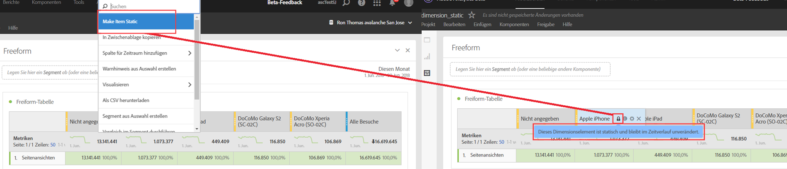

# Dimensionsvorschau

Bewegen Sie den Cursor über das Informations-Symbol neben einer Dimension, um die obersten fünf Werte für nicht zeitabhängige Dimensionen (und 15 für zeitabhängige Dimensionen) anzuzeigen. Bisher waren diese Werte statisch (d. h. die fünf ausgewählten Werte blieben unverändert).

Jetzt zeigen wir standardmäßig dynamische Werte anstelle von statischen an, mit der Option, diese in statische Werte umzuwandeln. Wissenswertes:

* Bei einer Aktualisierung Ihrer Daten werden die Spalten der dynamischen Dimension aktualisiert, um die aktuellen 5/15 Dimensionselemente anzuzeigen.
* Eine dynamische Dimensionsspalte, die kopiert oder bewegt wird, wird statisch.
* Wenn Sie mit dem Mauszeiger über eine statische Dimensionsspalte fahren, wird ein Schlosssymbol angezeigt, das angibt, dass es sich bei der Dimension um eine statische handelt.

## Anzeige von Dimensionselementen

Wenn Sie auf eine Dimension zeigen und auf den grauen, nach rechts zeigenden Pfeil daneben klicken, wird eine Liste der jeweiligen Dimensionselemente angezeigt. Dimensionselementlisten zeigen normalerweise die Top-Elemente der letzten 30 Tage an.

Wenn Sie nach unten zum unteren Rand der Liste scrollen, sehen Sie **[!UICONTROL Top-Elemente aus den letzten 18 Monaten anzeigen]**. Klicken Sie auf diese Option, um die Top-Dimensionselemente der letzten 547 Tage anzuzeigen.
