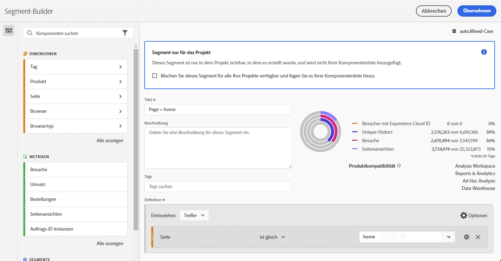
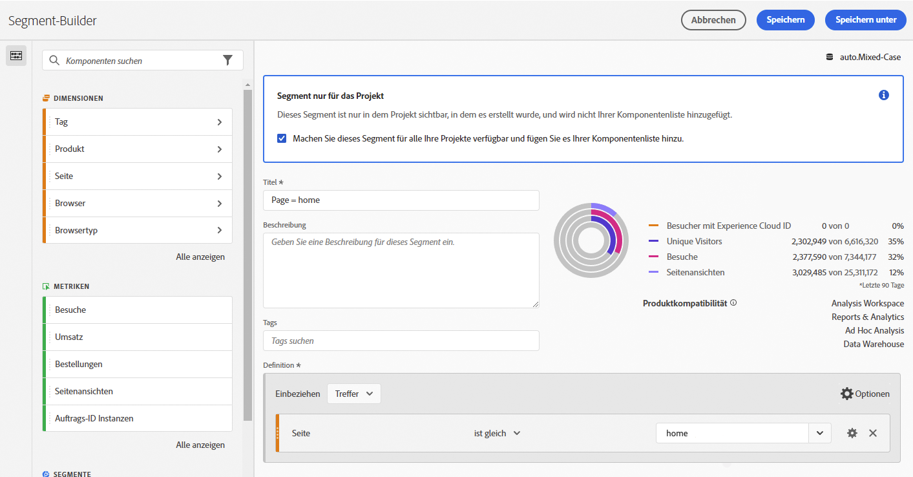

# Schnellsegmente

Sie können innerhalb eines Projekts Schnellsegmente erstellen, anstatt den komplexeren [Segment Builders](/help/components/segmentation/segmentation-workflow/seg-build.md) aufzurufen. Schnellsegmente

* Werden nur auf [Projektebene](https://experienceleague.adobe.com/docs/analytics/analyze/analysis-workspace/components/segments/quick-segments.html?lang=de#what-are-project-only-segments) angewendet.
* Mit bis zu drei Regeln.
* Verschachtelte Container oder sequenzielle Regeln werden nicht unterstützt.

Einen Vergleich zwischen Schnellsegmenten und vollständigen Segmenten in der Komponentenliste finden Sie [hier](/help/analyze/analysis-workspace/components/segments/t-freeform-project-segment.md).

Im Folgenden finden Sie eine Videoübersicht zu Schnellsegmenten:

>[!VIDEO](https://video.tv.adobe.com/v/341466/?quality=12&learn=on)

## Voraussetzungen

Jeder kann ein [!UICONTROL Schnellsegment] erstellen. Sie benötigen jedoch die Berechtigung [!UICONTROL Segmenterstellung] in [Adobe Admin Console](https://experienceleague.adobe.com/docs/analytics/admin/admin-console/permissions/summary-tables.html?lang=de#analytics-tools), um die Schnellsegmente speichern oder in [!UICONTROL Segment Builder] öffnen zu können.

## Schnellsegmente erstellen

Klicken Sie in einer Freiformtabelle in der Panel-Überschrift auf das Symbol „Filter +“:

Schnellsegment aus dieser leeren Liste konfigurieren:

| Einstellung | Beschreibung |
| --- | --- |
| Name | Der Standardname eines Segments besteht aus der Kombination der Regelnamen im Segment. Sie können das Segment umbenennen. |
| Ein-/Ausschließen | Sie können Komponenten in Ihrer Segmentdefinition entweder ein- oder ausschließen, aber nicht beides. |
| Treffer-/Besuchs-/Besucher-Container | Schnellsegmente enthalten nur einen [Segment-Container](https://experienceleague.adobe.com/docs/analytics/components/segmentation/seg-overview.html?lang=de#section_AF2A28BE92474DB386AE85743C71B2D6), mit dem Sie eine Dimension/eine Metrik/einen Datumsbereich in das Segment einbeziehen (oder daraus ausschließen) können. [!UICONTROL Besucher] enthält für den Besucher spezifische übergreifende Daten zu allen Besuchen und Seitenansichten. Mit dem Container [!UICONTROL Besuch] können Sie Regeln für die Aufschlüsselung der Besucherdaten auf der Grundlage der Besuche festlegen und mit dem Container [!UICONTROL Treffer] können Sie die Besucherinformationen anhand der einzelnen Seitenaufrufe aufschlüsseln. Der Standard-Container ist [!UICONTROL Treffer]. |
| Komponenten (Dimension/Metrik/Datumsbereich) | Definieren Sie bis zu 3 Regeln, indem Sie Komponenten (Dimensionen und/oder Metriken und/oder Datumsbereiche) und deren Werte hinzufügen. Es gibt drei Möglichkeiten, die richtige Komponente zu finden:<ul><li>Beginnen Sie mit der Eingabe und der [!UICONTROL Quick Segment] Builder findet automatisch die entsprechende Komponente.</li><li>Verwenden Sie die Dropdown-Liste, um die Komponente zu finden.</li><li>Per Drag-and-Drop aus der der linken Leiste ziehen.</li></ul> |
| Operator | Dropdown-Menü verwenden, um Standardoperatoren und Operatoren des Typs [!UICONTROL Distinct Count] zu finden. [Weitere Informationen](https://experienceleague.adobe.com/docs/analytics/components/segmentation/segment-reference/seg-operators.html?lang=de) |
| Plus (+)-Zeichen | Eine weitere Regel hinzufügen |
| AND/OR-Kennzeichung | Sie können den Regeln „AND“ oder „OR“ hinzufügen, aber Sie können „AND“ und „OR“ aber nicht in einer Segmentdefinition kombinieren. |
| Anwenden | Dieses Segment auf das Panel anwenden. Wenn das Segment keine Daten enthält, werden Sie gefragt, ob Sie fortfahren möchten. |
| Builder öffnen | Öffnet Segment Builder. Nachdem Sie das Segment in Segment Builder gespeichert oder übernommen haben, ist es kein „Schnellsegment“ mehr. Es wird Teil der Segmentbibliothek der Komponentenliste. |
| Abbrechen | Abbrechen dieses Schnellsegments. Es wird nicht angewendet. |
| Datumsbereich | Der Validator verwendet den Datumsbereich des Panels für die Datensuche. Doch jeder in einem Schnellsegment angewendete Datumsbereich überschreibt den Datumsbereich des Panels im oberen Bereich des Panels. |
| Vorschau (oben rechts) | Ermöglicht festzustellen, ob ein gültiges Segment vorhanden ist und wie groß es ist. Stellt eine Aufschlüsselung des Datensatzes dar, der bei der Anwendung dieses Segments zu erwarten ist. Möglicherweise erhalten Sie den Hinweis, dass dieses Segment über keine Daten verfügt. Wenn dies der Fall ist, können Sie entweder fortfahren oder die Segmentdefinition ändern. |

Hier ist ein Beispiel für ein Segment, in dem Dimensionen und Metriken kombiniert werden:

Das Segment wird oben angezeigt. Beachten Sie die blau gestreifte Seitenleiste des Segments im Gegensatz zu der auf der linken Seite befindlichen blauen Seitenleiste für Segmente auf Komponentenebene in der Segmentbibliothek.

## Schnellsegmente bearbeiten

1. Bewegen Sie den Mauszeiger über das Schnellsegment und wählen Sie das Stiftsymbol aus.
1. Bearbeiten Sie die Segmentdefinition und/oder den Segmentnamen.
1. Klicken Sie auf [!UICONTROL Anwenden].

## Schnellsegmente speichern

>[!IMPORTANT]
>Nachdem Sie das Segment gespeichert oder angewendet haben, können Sie es nicht mehr im Quick Segment Builder bearbeiten, sondern nur noch im regulären Segment Builder. Nur Produktadministrierende von Adobe Analytics und der Ersteller bzw. die Erstellerin des Schnellsegments können Änderungen an einem vorhandenen Schnellsegment speichern.

1. Nachdem Sie das Schnellsegment angewendet haben, halten Sie den Mauszeiger darüber und wählen Sie das Infosymbol („i“) aus.

   

1. Klicken Sie auf **[!UICONTROL Für alle Projekte verfügbar machen und der Komponentenliste hinzufügen]**.
1. Optional: Benennen Sie das Segment um.
1. Klicken Sie auf **[!UICONTROL Speichern]**.

Beachten Sie, wie sich die Seitenleiste des Segments von gestreiftem Blau zu einem helleren Blau ändert. Sie wird jetzt auch in der Komponentenliste in der linken Leiste angezeigt.

## Was sind Segmente auf Projektebene?

Segmente auf Projektebene sind Segmente, die nur auf das aktuelle Projekt angewendet werden, in dem sie erstellt wurden. Sie sind nicht in anderen Projekten verfügbar und können nicht für andere Benutzende freigegeben werden. Sie sind für die schnelle Untersuchung Ihrer Daten vorgesehen, ohne dass ein Segment in der linken Leiste erstellt und gespeichert werden muss. Segmente auf Projektebene können entweder mit Schnellsegmenten oder [Ad-hoc-Segmenten](https://experienceleague.adobe.com/docs/analytics/analyze/analysis-workspace/components/segments/ad-hoc-segments.html?lang=de) in der Ablagefläche des Bedienfelds erstellt werden.

Wenn ein Segment auf Projektebene im [!UICONTROL Segment Builder] geöffnet wird, wird in einer Mitteilung darauf hingewiesen, dass dieses Segment nur für das jeweilige Projekt verfügbar ist. Wenn Sie die Option „Dieses Segment verfügbar machen...“ nicht aktivieren und auf **[!UICONTROL ANWENDEN]** klicken, bleibt das Segment nur auf Projektebene verfügbar. Hinweis: Wenn Sie ein Schnellsegment über den Segment Builder anwenden, kann es nicht mehr im [!UICONTROL Quick Segment Builder] geöffnet werden.

Wenn Sie die Option „Dieses Segment verfügbar machen...“ aktivieren und auf **[!UICONTROL SPEICHERN]** klicken, wird das Segment in der Komponentenliste in der linken Leiste verfügbar und kann auch in anderen Projekten verwendet werden. Es kann im Segment Manager auch für andere Benutzende freigegeben werden.

## Bekanntes Problem

1. Erstellen Sie ein Schnellsegment mit zwei Einträgen und **[!UICONTROL speichern]** Sie es als „Test1“.
1. Klicken Sie auf **[!UICONTROL Speichern unter]** und speichern Sie dieses Schnellsegment als „Test2“.
1. Bearbeiten Sie das Schnellsegment „Test2“ und speichern Sie es erneut als „Test2“.
Beachten Sie, dass das Schnellsegment „Test1“ durch „Test2“ geändert wird.
