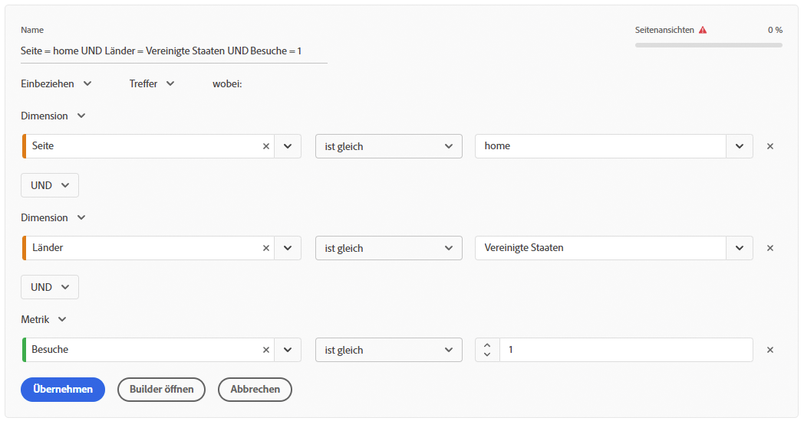

# Schnellsegmente

Sie können innerhalb eines Projekts schnelle Segmente erstellen, um die Komplexität des vollständigen [Segment Builders](/help/components/segmentation/segmentation-workflow/seg-build.md) zu umgehen. Einen Vergleich dessen, was Schnellsegmente im Vergleich zu vollständigen Komponentensegmenten tun können, finden Sie unter [hier](/help/analyze/analysis-workspace/components/segments/t-freeform-project-segment.md).

>[!IMPORTANT]
> Schnellsegmente werden derzeit nur eingeschränkt getestet und sind noch nicht allgemein verfügbar.

## Schnellsegmente erstellen

1. Klicken Sie in einer Freiformtabelle auf das Symbol filter+ in der Bedienfeldüberschrift:

   

   Beachten Sie, dass:

   - Es gibt nur einen Segmentbehälter, mit dem Sie eine Dimension/Metrik/einen Datumsbereich in das Segment einbeziehen (oder daraus ausschließen) können.
   - Sie können den Behälter auf Treffer-, Besuchs- oder Besucherebene festlegen. Der Standardwert ist &quot;Treffer&quot;.

1. Fügen Sie eine Dimension/Metrik/einen Datumsbereich auf 3 Arten hinzu:

   - Beginnen Sie mit der Eingabe und der [!UICONTROL Quick Segment Builder] findet automatisch die entsprechende Komponente.
   - Verwenden Sie die Dropdownliste, um die Komponente zu finden.
   - Ziehen Sie Komponenten per Drag-and-Drop aus der linken Leiste.

1. Geben Sie die erste Regel an, z. B. `Page equals workspace`. Sie können bis zu drei Regeln in einer Segmentdefinition haben. Klicken Sie einfach auf das &quot;+&quot;-Zeichen, um eine weitere Regel hinzuzufügen. Sie können den Regeln &quot;AND&quot;- oder &quot;OR&quot;-Kennungen hinzufügen, aber Sie können &quot;AND&quot;und &quot;OR&quot;nicht in einer Segmentdefinition kombinieren.

   Hier ist ein Beispiel für ein Segment, das Dimensionen und Metriken kombiniert:

   

1. Klicken Sie auf **[!UICONTROL Anwenden]** , um dieses Segment auf das Bedienfeld anzuwenden.
Das Segment wird oben angezeigt. Beachten Sie die graue Seitenleiste im Gegensatz zur blauen Seitenleiste für Segmente auf Komponentenebene in der Segmentbibliothek auf der linken Seite.

   

## Schnellsegmente bearbeiten

1. Bewegen Sie den Mauszeiger über das Schnellsegment und wählen Sie das Stiftsymbol aus.
1. Bearbeiten Sie die Segmentdefinition oder den Segmentnamen.

## Schnellsegmente speichern

Sie können schnelle Segmente speichern, indem Sie die folgenden Schritte ausführen.

>[!IMPORTANT]
>Nachdem Sie das Segment gespeichert haben, können Sie es nicht mehr im Schnellsegmentaufbau bearbeiten, sondern nur noch im regulären Segmentaufbau.

1. Bewegen Sie den Mauszeiger über das Schnellsegment und wählen Sie das Infosymbol (&quot;i&quot;) aus.
1. Wählen Sie **[!UICONTROL Segment speichern]**

   

1. Belassen Sie den Namen unverändert oder benennen Sie das Segment um.

1. Kehren Sie zu Workspace zurück und sehen Sie, wie das Segment jetzt eine blaue Seitenleiste aufweist, die anzeigt, dass es Teil der Komponentenbibliothek ist.

   

## Verfügbar machen von Segmenten für alle Ihre Projekte

Nachdem Sie das Segment gespeichert haben, können Sie es Ihrer Segmentkomponentenliste hinzufügen und für alle Ihre Projekte verfügbar machen.

1. Bewegen Sie den Mauszeiger über das gespeicherte Segment und wählen Sie das Stiftsymbol aus.

1. Beachten Sie dieses Dialogfeld oben im Segment Builder:

   

1. Aktivieren Sie das Kontrollkästchen neben **[!UICONTROL Stellen Sie dieses Segment für alle Projekte zur Verfügung und fügen Sie es zur Komponentenliste hinzu.]**
1. Klicken Sie auf **[!UICONTROL Speichern]**.
1. Das Segment wird jetzt in Ihrer Segmentkomponentenliste für alle Ihre Projekte angezeigt.
1. Sie können auch [das Segment](/help/components/segmentation/segmentation-workflow/t-seg-share.md) freigeben.

## Kurze Segmente in Ad-hoc-Segmente umwandeln

1. Bewegen Sie den Mauszeiger über das gespeicherte Segment und wählen Sie das Stiftsymbol aus.

1. Klicken Sie oben im Segment Builder auf **[!UICONTROL Anwenden]**.

Weitere Informationen zu Ad-hoc-Segmenten finden Sie [hier](/help/analyze/analysis-workspace/components/segments/ad-hoc-segments.md)
