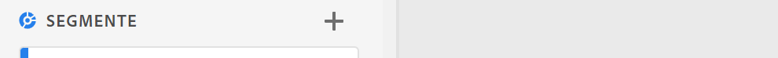

# Segmente {#topic_DC2917A2E8FD4B62816572F3F6EDA58A}

In Workspace können Sie verschiedene Arten von Segmenten erstellen, je nachdem, wie komplex sie sein müssen, ob sie nur für das vorliegende Projekt gelten sollen usw. Im Folgenden finden Sie eine Zusammenfassung der Segmenttypen:

| Segmenttyp | Wo erstellt? | Wird wo angewendet? | Verwendungsbereiche |
| --- | --- | --- | --- |
| Segment der Komponentenliste | Klicken Sie auf +, um zu [Segment Builder](/help/components/segmentation/segmentation-workflow/seg-build.md) zu gelangen. | Alle Workspace-Projekte | Für komplexere Segmente, sequenzielle Segmente |
| Schnellsegment | [Quick Segment Builder](/help/analyze/analysis-workspace/components/segments/quick-segments.md) | Nur Projekt, aber Speichern und Hinzufügen in Ihrer Segmentliste möglich. | Kann für Einzelregelsegmente (per Drag-and-Drop) oder zum Hinzufügen/Bearbeiten mehrerer Regeln (durch Klicken auf das Segmentsymbol) verwendet werden |
| Auf berechneten Metriken basierendes Segment | [Generator für berechnete Metriken](https://experienceleague.adobe.com/docs/analytics/components/calculated-metrics/calcmetric-workflow/metrics-with-segments.html?lang=de) | Einzeln berechnete Metriken | Anwenden von Segmenten in Ihrer Metrikdefinition |
| Auf Virtual Report Suite basierendes Segment | [Virtual Report Suite Builder](https://experienceleague.adobe.com/docs/analytics/components/virtual-report-suites/vrs-workflow/vrs-create.html?lang=de) | Einzelne Virtual Report Suite | Anwenden von Segmenten in Ihrer Virtual Report Suite-Definition |

## Videos

>[!BEGINSHADEBOX]

Unter  [Verwenden von Segmenten in Analysis Workspace](https://video.tv.adobe.com/v/23977?quality=12&learn=on){target="_blank"} finden Sie ein Demovideo dazu.

>[!ENDSHADEBOX]

>[!BEGINSHADEBOX]

Siehe  [Suchen und Erstellen von Segmenten](https://video.tv.adobe.com/v/334092?quality=12&learn=on){target="_blank"} für ein Demovideo.

>[!ENDSHADEBOX]

>[!BEGINSHADEBOX]

Siehe  [Rollierende Datumsbereiche in Segment](https://video.tv.adobe.com/v/25403?quality=12&learn=on){target="_blank"} für ein Demovideo.

>[!ENDSHADEBOX]

## Erstellen von Segmenten {#section_693CFADA668B4542B982446C2B4CF0F5}

In Analysis Workspace können Sie verschiedene Segmenttypen erstellen:

* [Schnellsegmente](/help/analyze/analysis-workspace/components/segments/quick-segments.md)
* Reguläre Komponentenlistensegmente, die Sie in Segment Builder erstellen und in der Segmentbibliothek gespeichert werden (siehe unten)

### Erstellen von Komponentenlistensegmenten {#section_3B07D458C43E42FDAF242BB3ACAF3E90}

Die Segmentleiste im Menü „Komponenten“ enthält

* Segmente, die Sie oder Ihr Unternehmen erstellt haben
* Segmentvorlagen, wie durch das Symbol Adobe  gekennzeichnet:

Sie haben zwei Möglichkeiten, ein Segment dieses Typs zu erstellen. Beide führen Sie zum [Segment Builder](/help/components/segmentation/segmentation-workflow/seg-build.md) in Adobe Analytics, wo Sie weitere Anweisungen finden.

* Klicken Sie in der linken Leiste auf das Pluszeichen (+) neben [!UICONTROL Segmente]:

oder

* Gehen Sie zu [!UICONTROL Komponenten] > [!UICONTROL Segmente] und klicken Sie dann auf [!UICONTROL + Hinzufügen].

### Andere Methoden für das Anwenden von Segmenten {#section_10FF2E309BA84618990EA5B473015894}

>[!BEGINSHADEBOX]

Siehe  [Weitere Methoden zum Anwenden von Segmenten](https://video.tv.adobe.com/v/30994?quality=12&learn=on){target="_blank"} für ein Demovideo.

>[!ENDSHADEBOX]

Es gibt verschiedene weitere Methoden für das Anwenden von Segmenten auf ein Freiformprojekt.

| Aktion | Beschreibung |
|--- |--- |
| Segment aus Auswahl erstellen | Erstellt ein Inline-Segment. Dieses Segment wird nur auf das geöffnete Projekt angewendet und nicht als Analytics-Segment gespeichert. 1. Zeilen auswählen.  2. Rechtsklick auf die Auswahl.  3. Klick auf *Segment aus Auswahl erstellen*. |
| Komponenten > Neues Segment | Zeigt den Segment Builder an Weitere Informationen zur Segmentierung finden Sie unter [Segmente erstellen](https://experienceleague.adobe.com/docs/analytics/components/segmentation/segmentation-workflow/seg-build.html?lang=de). |
| „Freigeben“ > „Projekt freigeben“ oder „Freigeben“ > „Projektdaten kuratieren“ | In [Kuratieren und freigeben](https://experienceleague.adobe.com/docs/analytics/analyze/analysis-workspace/curate-share/curate.html?lang=de#concept_4A9726927E7C44AFA260E2BB2721AFC6) werden Segmente, die Sie auf das Projekt anwenden, in freigegebenen Analysen für den Empfänger verfügbar. |
| Segmente als Dimensionen verwenden | Video: [Verwenden von Segmenten als Dimensionen in Analysis Workspace](https://experienceleague.adobe.com/docs/analytics-learn/tutorials/analysis-workspace/applying-segments/using-segments-as-dimensions-in-analysis-workspace.html?lang=de) |

## Segment IQ

Segment IQ (auch als Segmentvergleich bezeichnet) umfasst die folgenden Funktionen:

* [Bedienfeld „Segmentvergleich“:](/help/analyze/analysis-workspace/c-panels/c-segment-comparison/segment-comparison.md) Die Kernfunktion in Segment IQ. Ziehen Sie zwei Segmente in das Bedienfeld und zeigen Sie einen umfassenden Bericht an, der statistisch signifikante Unterschiede und Überschneidungen zwischen den beiden Zielgruppen zeigt.
* [Vergleich von Segmenten hinsichtlich Fallout:](/help/analyze/analysis-workspace/visualizations/fallout/compare-segments-fallout.md) Sehen Sie sich einen Vergleich verschiedener Zielgruppen im Kontext einer Fallout-Visualisierung an.

## Weitere Informationen

Eine ausführliche Erläuterung der Segmentierung in Adobe Analytics finden Sie [hier](/help/components/segmentation/seg-overview.md).
