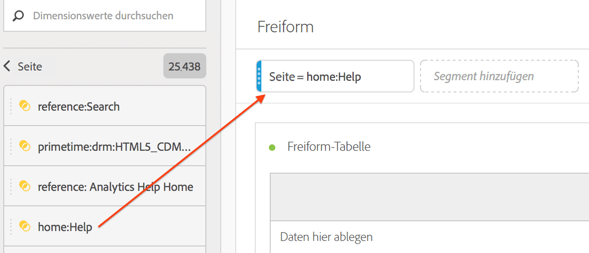

# Verwenden von Komponenten in einem Projekt

Komponenten bilden die eigentlichen Daten eines jeden Projekts in Analysis Workspace. Komponenten bestehen aus Dimensionen, Metriken, Segmenten und Datumsbereichen. Sie können Komponenten zu einem Projekt hinzufügen, indem Sie sie in Visualisierungen oder Panels ziehen.

Weitere Informationen zu den Typen von Komponenten, die Sie hinzufügen können, finden Sie unter [Komponentenübersicht](/help/analyze/analysis-workspace/components/analysis-workspace-components.md).

>[!TIP]
>
>Um Informationen zu den einzelnen Komponenten abzurufen, verwenden Sie . Weitere Informationen finden Sie unter [Informationen zu Komponenten](#component-info).

## Hinzufügen von Komponenten zu einem Projekt

1. [Erstellen Sie ein Projekt in Analysis Workspace](/help/analyze/analysis-workspace/build-workspace-project/create-projects.md).

1. Fügen Sie [ein Panel](/help/analyze/analysis-workspace/c-panels/panels.md#create-a-panel) oder [eine Visualisierung](/help/analyze/analysis-workspace/visualizations/freeform-analysis-visualizations.md#add-visualizations-to-a-panel) zum Projekt in Analysis Workspace hinzu. Wenn Sie einem leeren Projekt eine Komponente hinzufügen, wird bereits eine Visualisierung vom Typ „Freiformtabelle“ für Sie erstellt.

1. Wählen Sie  **[!UICONTROL Komponenten]** im Schaltflächen-Panel aus. Im linken Panel werden alle verfügbaren Komponenten angezeigt. Weitere Informationen finden Sie unter [Benutzeroberfläche](/help/analyze/analysis-workspace/home.md#interface).

1. Scrollen Sie zu oder suchen Sie nach der Komponente, die hinzugefügt werden soll, und ziehen Sie sie anschließend in ein Panel oder eine Visualisierung innerhalb Ihres Projekts.

1. Sie können eine Komponente auch in den Segment-Ablegebereich in der Kopfzeile eines Panels ziehen. Dieser Drag-and-Drop-Vorgang definiert die Komponente als Segment und wendet das Segment auf alle Inhalte im Panel an.
Informationen dazu, wie Sie den Segment-Ablagebereich in einem Bedienfeld verwenden können, um Ihr Bedienfeld zu segmentieren, finden Sie unter [Ablagebereich](/help/analyze/analysis-workspace/c-panels/panels.md#drop-zone) in [Bedienfelder - Übersicht](/help/analyze/analysis-workspace/c-panels/panels.md).

1. Weitere Informationen finden Sie in den folgenden Abschnitten:

   * [Hinzufügen von Dimensionen zu einem Projekt](#add-dimensions-to-a-project)

   * [Hinzufügen von Metriken zu einem Projekt](#add-metrics-to-a-project)

   * [Hinzufügen von Segmenten zu einem Projekt](#add-segments-to-a-project)

   * [Hinzufügen von Datumsbereichen zu einem Projekt](#add-date-ranges-to-a-project)

### Hinzufügen von Dimensionen zu einem Projekt

[Dimensionen](/help/components/dimensions/overview.md) sind Variablen in Adobe Analytics, die normalerweise Zeichenfolgenwerte enthalten. Im Gegensatz dazu enthalten [Metriken](/help/components/c-calcmetrics/cm-overview.md) numerische Werte, die mit einer Dimension verknüpft sind. Ein Basisbericht zeigt Zeilen mit Zeichenfolgenwerten (Dimension) gegen eine Spalte mit numerischen Werten (Metrik) an.

1. Fügen Sie zunächst eine Dimension zu Ihrem Projekt in Analysis Workspace hinzu, wie unter [Hinzufügen von Komponenten zu einem Projekt](#add-components-to-a-project) beschrieben. 

1. Wählen Sie eine der folgenden Methoden, um Dimensionen hinzuzufügen, und bestimmen Sie den Datentyp, der analysiert werden soll:

   

   * Ziehen Sie eine Dimension in eine Visualisierung (z. B. eine Freiformtabelle) in Analysis Workspace.

   * Ziehen Sie eine oder mehrere Dimensionen aus dem linken Panel in den Segment-Ablegebereich, um ein Schnellsegment zu erstellen, wie unter [Hinzufügen von Segmenten zu einem Projekt](#add-filters-to-a-project) beschrieben.

1. Sie können Dimensionen und Dimensionselemente in Analysis Workspace optional mit anderen Komponenten aufschlüsseln. Weitere Informationen finden Sie unter [Aufschlüsseln von Dimensionen in Workspace](/help/analyze/analysis-workspace/components/dimensions/t-breakdown-fa.md).

Weitere Informationen zum Verwenden von Dimensionen in Analysis Workspace finden Sie unter [Vorschau von Dimensionen](/help/analyze/analysis-workspace/components/dimensions/view-dimensions.md), [Aufschlüsseln von Dimensionen](/help/analyze/analysis-workspace/components/dimensions/t-breakdown-fa.md) und [Zeitteilungsdimensionen](/help/analyze/analysis-workspace/components/dimensions/time-parting-dimensions.md).

### Hinzufügen von Metriken zu einem Projekt

Mit Metriken können Sie Datenpunkte in Analysis Workspace quantifizieren. Sie werden meist als Spalten in einer Visualisierung verwendet und sind an Dimensionen gebunden.

So fügen Sie einem Projekt in Analysis Workspace eine Metrik hinzu:

1. Beginnen Sie mit dem Hinzufügen einer Metrik zu Ihrem Projekt in Analysis Workspace, wie unter [Hinzufügen von Komponenten zu einem Projekt](#add-components-to-a-project) beschrieben.

1. Wählen Sie eine der folgenden Methoden, um eine Metrik in Analysis Workspace hinzuzufügen:

   

   * Ziehen Sie eine Metrik in den Metrik-Ablegebereich einer leeren Freiformtabelle, um die Trend-Ansicht dieser Metrik über den Datumsbereich des Projekts anzuzeigen.

   * Ziehen Sie eine Metrik, wenn eine Dimension vorhanden ist, um diese Metrik für jedes Dimensionselement anzuzeigen.

   * Ziehen Sie eine Metrik auf eine vorhandene Metrik-Kopfzeile, um sie zu ersetzen.

   * Ziehen Sie eine Metrik neben die linke oder rechte Seite einer vorhandenen Metrik-Kopfzeile, um die neue Metrik hinzuzufügen.

   * Ziehen Sie eine Metrik über oder unter eine vorhandene Metrik-Kopfzeile, um eine Metrik-Überschneidung zu erstellen.

Weitere Informationen zu Metriken finden Sie unter [Metriken](/help/analyze/analysis-workspace/components/apply-create-metrics.md).

### Hinzufügen von Segmenten zu einem Projekt

Mit [Segmenten](/help/components/segmentation/seg-overview.md) können Sie Teilmengen von Personen, Sitzungen oder Ereignissen anhand von Merkmalen oder bestimmten Interaktionen identifizieren.

Sie können Segmente in Analysis Workspace auf eine der folgenden Arten verwenden:

* Segmente zu einem Panel hinzufügen
Wenn Sie Segmente zu einem Panel hinzufügen, gelten die Segmente für alle Inhalte im Panel.
Informationen dazu, wie Sie den Segment-Ablagebereich in einem Bedienfeld verwenden können, um Ihr Bedienfeld zu segmentieren, finden Sie unter [Ablagebereich](/help/analyze/analysis-workspace/c-panels/panels.md#drop-zone) in [Bedienfelder - Übersicht](/help/analyze/analysis-workspace/c-panels/panels.md).

* Segmente zu einer Visualisierung hinzufügen
Wenn Sie einer Spalte in einer Freiformtabelle Segmente hinzufügen, werden die Segmente auf alle Inhalte in der Tabellenspalte angewendet. Sie können Segmente auch als Teil einer Fallout-Visualisierung hinzufügen.

* Verwenden von Segmenten in Komponenten
Wenn Sie Komponenten wie [berechnete Metriken](/help/components/c-calcmetrics/c-workflow/cm-workflow/c-build-metrics/metrics-with-segments.md), [Anmerkungen](/help/analyze/analysis-workspace/components/annotations/create-annotations.md#annotation-builder) oder sogar [Segmente](/help/components/segmentation/segmentation-workflow/seg-build.md) definieren, können Sie Segmente als Teil der Definition verwenden.

### Hinzufügen von Datumsbereichen zu einem Projekt

[Datumsbereiche](/help/analyze/analysis-workspace/components/calendar-date-ranges/calendar.md) bestimmen den Zeitrahmen der Berichterstellung in Analysis Workspace. Außerdem kann ein Datenbereich auf Bereiche innerhalb eines Projekts und auch auf einige Visualisierungen (wie die Freiformtabelle) angewendet werden.

Jedes Panel enthält standardmäßig einen Datumsbereich. Es gibt mehrere Möglichkeiten, einen Datumsbereich für ein Panel zu aktualisieren. Eine Möglichkeit zum Aktualisieren eines Datumsbereichs für ein Panel in Analysis Workspace besteht darin, eine Datumsbereichskomponente aus dem linken Panel zu ziehen:

1. Fügen Sie optional Panels zu Ihrem Projekt in Analysis Workspace hinzu, wie unter [Hinzufügen von Komponenten zu einem Projekt](#add-components-to-a-project) beschrieben. 

1. Ziehen Sie per Drag-and-Drop einen Datumsbereich aus dem linken Panel auf:

   * Den aktuellen Datumsbereich, um den Datumsbereich für das Panel zu ändern.

     

   * Eine Metrik oder Dimension in einer Visualisierung vom Typ „Freiformtabelle“. Weitere Informationen finden Sie unter [Verwenden von Datumsbereichen](/help/analyze/analysis-workspace/components/calendar-date-ranges/calendar.md#use-date-ranges).

Weitere Informationen zum Verwenden und Verwalten von Datumsbereichen in Analysis Workspace finden Sie unter [Übersicht über Datumsbereiche](/help/analyze/analysis-workspace/components/calendar-date-ranges/calendar.md).

## Informationen zu Komponenten

Sie können den Mauszeiger über eine beliebige Komponente bewegen, um  anzuzeigen. Wenn Sie  auswählen, wird ein Popup mit zusätzlichen Informationen zur Komponente angezeigt.

Je nach Zugriffssteuerung haben Sie folgende Möglichkeiten:

* Aufrufen der  [!UICONTROL Datenwörterbuch]-Definition für die Komponente.
* Greifen Sie auf Builder zu, in dem die Komponente definiert ist.

<!--
# Use components in Analysis Workspace

Components make up the actual data of any project in Analysis Workspace. Components consist of dimensions, metrics, segments, and date ranges. You can add components to a project by dragging them into visualizations or panels.

For overview information about the types of components you can add, see [Components overview](/help/analyze/analysis-workspace/components/analysis-workspace-components.md).

>[!TIP]
>
>For information about each component, select the Info icon next to a component's name in the left rail of Analysis Workspace, or see the [Analytics Components Guide](/help/components/home.md).

## Begin adding components to a project

1. [Create a project in Analysis Workspace](/help/analyze/analysis-workspace/build-workspace-project/create-projects.md) if you haven't already.

1. [Add a panel](/help/analyze/analysis-workspace/c-panels/panels.md) or [add a visualization](/help/analyze/analysis-workspace/visualizations/freeform-analysis-visualizations.md#add-visualizations-to-a-panel) to the project in Analysis Workspace. 

   If you add a component to a blank project, a freeform table visualization is automatically created.

1. Select the **[!UICONTROL Components]** icon in the left rail.

   

1. Scroll to or search for the component you want to add, then drag it to a panel or visualization within your project. 

1. (Optional) Drag a component to the segment drop zone in a panel header. 

   Segments apply to all content within the panel.

   For information about how you can use the segment drop zone on a panel to filter your panel, see [Drop zone](/help/analyze/analysis-workspace/c-panels/panels.md#drop-zone) in [Panels overview](/help/analyze/analysis-workspace/c-panels/panels.md).

   

1. For more detailed information, continue with one of the following sections, depending on the component type you are adding:

   * [Add dimensions to a project](#add-dimensions-to-a-project)

   * [Add metrics to a project](#add-metrics-to-a-project)

   * [Add segments to a project](#add-segments-to-a-project)

   * [Add date ranges to a project](#add-date-ranges-to-a-project)

## Add dimensions to a project

[Dimensions](/help/components/dimensions/overview.md) are variables in Adobe Analytics that typically contain string values. Common dimensions include [Page](/help/components/dimensions/page.md), [Referring domain](/help/components/dimensions/referring-domain.md), or an [eVar](/help/components/dimensions/evar.md). In contrast, [metrics](/help/components/metrics/overview.md) contain numeric values that tie to a dimension. A basic report shows rows of string values (dimension), against a column of numeric values (metric).

1. Start adding a dimension to your project in Analysis Workspace, as described in [Begin adding components to a project](#begin-adding-components-to-a-project).

1. Choose one of the following methods to add dimensions and determine the type of data you want to analyze:

   * Drag a dimension to a visualization (such as a freeform table) in Analysis Workspace.

     
   
   * Drag one or more dimensions from the left rail onto the segment drop zone to create an ad hoc segment, as described in [Add segments to a project](#add-segments-to-a-project).

     

1. (Optional) You can break down dimensions and dimension items in Analysis Workspace with other components. 

   For more information, see [Break down dimensions](/help/analyze/analysis-workspace/components/dimensions/t-breakdown-fa.md).

For more information about how to use dimensions in Analysis Workspace, see [Preview dimensions](/help/analyze/analysis-workspace/components/dimensions/view-dimensions.md), [Break down dimensions](/help/analyze/analysis-workspace/components/dimensions/t-breakdown-fa.md), and [Time-parting dimensions](/help/analyze/analysis-workspace/components/dimensions/time-parting-dimensions.md).

## Add metrics to a project

[Metrics](/help/analyze/analysis-workspace/components/apply-create-metrics.md) allow you to quantify data points in Analysis Workspace. They are most commonly used as columns in a visualization and tied to dimensions.

To add a metric to a project in Analysis Workspace:

1. Start adding a metric to your project in Analysis Workspace, as described in [Begin adding components to a project](#begin-adding-components-to-a-project).

1. Choose one of the following methods to add a metric in Analysis Workspace:

   * Drag a metric to the metric drop zone in an empty Freeform table to see that metric trended over the project's date period. 

     

   * Drag a metric when a dimension is present to see that metric compared to each dimension item. 

   * Drag a metric on top of an existing metric header to replace it.

   * Drag a metric next to a header to see both metrics side-by-side.

For more information about how to use metrics in Analysis Workspace, see [Metrics](/help/analyze/analysis-workspace/components/apply-create-metrics.md).

## Add segments to a project

[Segments](/help/components/segmentation/seg-overview.md) allow you to identify subsets of visitors based on characteristics or specific interactions.

You can use segments in Analysis Workspace in any of the following ways:

### Add segments to a panel

When you add segments to a panel, the segments apply to all content within the panel.

For information about how you can use the segment drop zone on a panel to filter your panel, see [Drop zone](/help/analyze/analysis-workspace/c-panels/panels.md#drop-zone) in [Panels overview](/help/analyze/analysis-workspace/c-panels/panels.md).

### Add segments to a column in a freeform table

When you add segments to a column in a freeform table, the segments apply to all content within the table column.

### Use segments when creating calculated metrics

In the Calculated metric builder, you can apply segments within your metric definition. 

For more information, see [Segmented metrics](/help/components/c-calcmetrics/c-workflow/cm-workflow/c-build-metrics/metrics-with-segments.md).

## Add date ranges to a project

[Date ranges](/help/analyze/analysis-workspace/components/calendar-date-ranges/custom-date-ranges.md) determine the reporting time frame in Analysis Workspace, and can be applied to one or more panels within a project.

Each panel includes a date range by default. There are multiple ways to update a date range for a panel. One way to update a date range for a panel in Analysis Workspace is to drag a date range component from the left rail:

1. Start adding a date range to your project in Analysis Workspace, as described in [Begin adding components to a project](#begin-adding-components-to-a-project).

1. Drag a date range from the left rail onto the current date range in the upper-right portion of the panel.

     

For more information about how to use calendars and date ranges in Analysis Workspace, see [Calendar and date ranges overview](/help/analyze/analysis-workspace/components/calendar-date-ranges/calendar.md).

-->