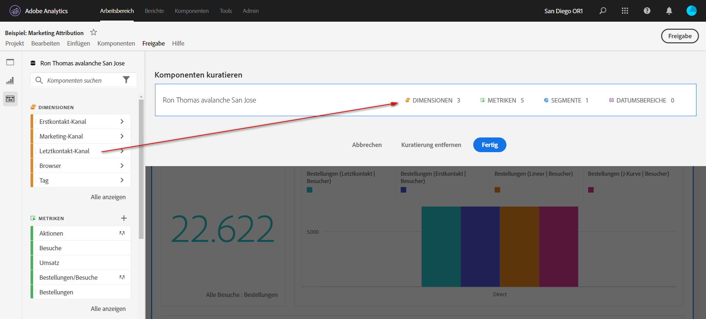

# Kuratieren von Projekten

Mit der Kuratierung können Sie die Komponenten (Dimensionen, Metriken, Segmente, Datumsbereiche) vor der Freigabe eines Projekts einschränken. Wenn Empfangende das Projekt öffnen, wird ihnen eine begrenzte Anzahl an Komponenten angezeigt, die Sie für sie kuratiert haben. Die Kuratierung ist ein optionaler, aber empfehlenswerter Schritt, bevor Sie ein Projekt freigeben.

>[!NOTE]
> Produktprofile bestimmen als Hauptmechanismen, welche Komponenten ein Anwender sehen kann. Sie werden über die Adobe Experience Cloud Admin Console verwaltet. Kuratierung ist ein Sekundärfilter.

>[!BEGINSHADEBOX]

Siehe  [Kuratieren von Projekten](https://video.tv.adobe.com/v/328056?captions=ger&quality=12&learn=on){target="_blank"} für ein Demovideo.

>[!ENDSHADEBOX]

## Anwenden der Projektkuratierung

1. Wählen Sie **[!UICONTROL Freigeben]** > **[!UICONTROL Projektdaten kuratieren]** aus.
Die im Projekt verwendeten Komponenten werden automatisch hinzugefügt.
Wenn ein Projekt über mehrere Report Suites verfügt, wird für jede Report Suite im Projekt ein kuratiertes Ablageziel angezeigt.
1. (Optional) Um weitere Komponenten hinzuzufügen, ziehen Sie die Komponenten, die Sie freigeben möchten, aus dem linken Bereich in den Ablagebereich **[!UICONTROL Komponenten kuratieren]** für die Report Suite.
1. Wählen Sie **[!UICONTROL Fertig]** aus. 

Wenn Empfangende ein kuratiertes Projekt öffnen, werden ihnen nur die von Ihnen definierten kuratierten Komponenten angezeigt:

## Entfernen der Projektkuratierung

So entfernen Sie die Projektkuratierung und stellen Sie den vollständigen Satz der Komponenten in der linken Leiste wieder her:

1. Wählen Sie **[!UICONTROL Freigeben]** > **[!UICONTROL Projektdaten kuratieren]** aus.
1. Wählen Sie **[!UICONTROL Kuratierung entfernen]** aus.
1. Wählen Sie **[!UICONTROL Fertig]** aus.

## Kuratierung einer Virtual Report Suite

Um die Kuratierung auf Report Suite-Ebene anzuwenden, sodass sie für viele Projekte gleichzeitig gilt, können Sie Komponenten in einer [Virtual Report Suite kuratieren](/help/components/vrs/vrs-components.md).

>[!NOTE]
>
> Die Kuratierung einer Virtual Report Suite wird immer vor der Projektkuratierung ausgeführt. Selbst wenn Ihr kuratiertes Projekt bestimmte Komponenten enthält, werden diese herausgefiltert, wenn die kuratierte Virtual Report Suite diese Komponenten nicht enthält.
> 

## Optionen zur Komponentenkuratierung

In einem kuratierten Projekt oder einer Virtual Report Suite wird dem Empfänger in der linken Leiste die Option **[!UICONTROL Alle anzeigen]** angezeigt. [!UICONTROL Alle anzeigen] zeigt verschiedene Komponentensätze an, je nach:

* Berechtigungsebene der Person (Admin oder Nicht-Admin)
* Projektrolle (Inhaber/Bearbeiter oder nicht)
* Art der angewendeten Kuratierung (Virtual Report Suite oder Projekt)
* Komponenten, die dem Benutzer gehören oder für ihn freigegeben wurden. Zu den eigenen/freigegebenen Komponenten gehören Segmente, berechnete Kennzahlen und Datumsbereiche. Sie enthalten keine implementierten Komponenten wie eVars, Props und benutzerdefinierte Ereignisse.

Hinweis: Rollen ohne Administratoransicht haben keinen Zugriff auf die linke Leiste in einem Projekt, daher wurden sie in der unten stehenden Tabelle weggelassen.

| Kuratierungstyp | Admins | Inhaber- oder Bearbeiterrolle, kein Admin | Duplizierte Rolle „Nicht-Administrator“ |
|---|---|---|---|
| **Kuratierte Virtual Report Suite** | Alle nicht kuratierten Komponenten der Virtual Report Suite | Nicht kuratierte Virtual Report Suite- und Projektkomponenten, die dieser Rolle gehören oder die für diese Rolle freigegeben wurden | Nicht kuratierte Virtual Report Suite- und Projektkomponenten, die dieser Rolle gehören oder die für diese Rolle freigegeben wurden |
| **Kuratiertes Projekt** | Alle nicht kuratierten Projektkomponenten | Alle nicht kuratierten Projektkomponenten | Nicht kuratierte Projektkomponenten, deren Eigentümer diese Rolle ist oder die für sie freigegeben wurden |
| **Kuratiertes Projekt in einer kuratierten Virtual Report Suite** | Alle nicht kuratierten Komponenten, aufgeführt unter **[!UICONTROL Nicht kuratierte Projektkomponenten]** und **[!UICONTROL Nicht kuratierte Virtual Report Suite-Komponenten]** | Alle nicht kuratierten Projektkomponenten UND nicht kuratierten Komponenten der Virtual Report Suite, die dieser Rolle gehören oder die für diese Rolle freigegeben wurden | Nicht kuratierte Virtual Report Suite- und Projektkomponenten, die dieser Rolle gehören oder die für diese Rolle freigegeben wurden |
