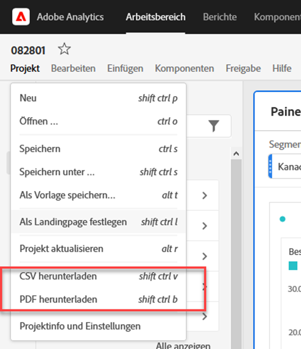
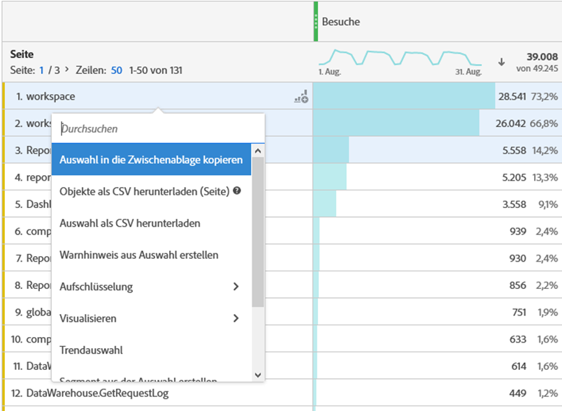
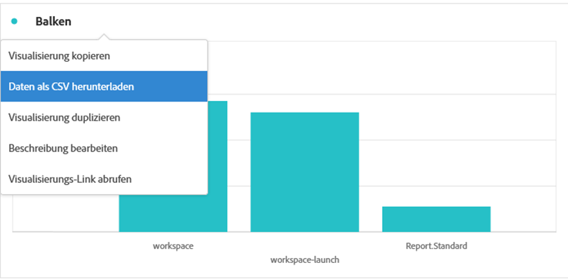
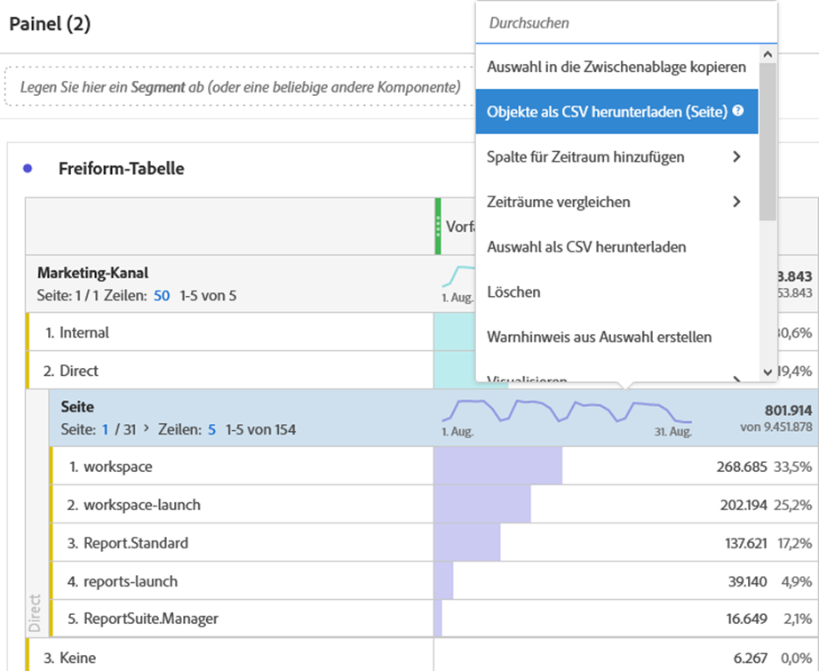
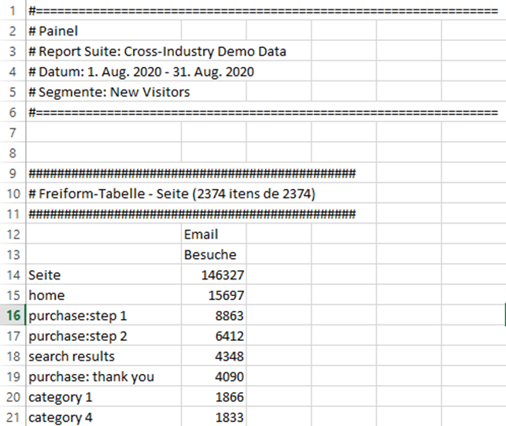

# Projekte und Daten herunterladen

Sie können Analysis Workspace-Projekte und -Daten auf Ihr lokales Gerät herunterladen. Dieser Download kann in eine CSV-Datei (CSV = Comma Separated Value Data) oder ein PDF-Dokument (Portable Document Format) kopiert werden.

* Wählen Sie die Option PDF aus, wenn Sie möchten, dass Visualisierungen in der heruntergeladenen Datei enthalten sind.
* Wählen Sie die Optionen CSV und Kopierte Daten aus, wenn Sie einfach Nur-Text-Daten benötigen.

Weitere Methoden zum Exportieren von Adobe Analytics-Daten finden Sie im [Export-Handbuch](/help/export/home.md).

## Herunterladen als CSV oder PDF {#download-project}

Beachten Sie beim Herunterladen eines Projekts als PDF Folgendes:

* Der Download kann einige Minuten dauern, da das Projekt erneut auf Adobe-Servern ausgeführt und im PDF-Format gerendert wird. Verlassen Sie das Projekt erst, wenn das Projekt in Ihren Browser heruntergeladen wurde.  Sie können weitere Änderungen am Projekt vornehmen, während der Download gerendert wird. Wenn das Rendern einer PDF länger als 5 Minuten dauert, werden Sie aufgefordert, stattdessen eine E[Mail an die PDF ](../curate-share/send-schedule-files.md) senden.
* Downloads werden als einzelne Seite ohne Seitenumbruch gerendert.
* Die PDF enthalten, was auf der Browser-Seite in Analysis Workspace sichtbar ist. Sie müssen Visualisierungen und Bedienfelder in benutzerdefinierter Größe automatisch skalieren, um abgeschnittene Inhalte zu vermeiden. Wählen Sie  aus, um die Größe einer Visualisierung oder eines Bedienfelds in benutzerdefinierter Größe automatisch anzupassen.
* [Hyperlinks](/help/analyze/analysis-workspace/visualizations/freeform-table/freeform-table-hyperlinks.md) innerhalb von Freiformtabellen als Hyperlinks in der heruntergeladenen PDF.

So laden Sie ein Projekt als PDF-Datei herunter:

1. Wählen Sie **[!UICONTROL Projekt]** > **[!UICONTROL PDF herunterladen]**.
Ein grüner Balken mit der Meldung  **[!UICONTROL Ihr Download wurde angefordert. Bitte warten.]** wird angezeigt.

1. Sobald Ihr Download fertig ist, ist ein grüner Balken mit der Meldung  **[!UICONTROL *Name des Projekts *PDF bereit.]**&#x200B;wird angezeigt.
Wählen Sie&#x200B;**[!UICONTROL Herunterladen]**&#x200B;aus, um die PDF herunterzuladen. Wie genau die PDF angezeigt oder heruntergeladen wird, hängt von der Browser-Konfiguration für die Verarbeitung von PDF-Dokumenten ab.

So laden Sie ein Projekt als CSV-Datei herunter:

* Wählen Sie **[!UICONTROL Projekt]** > **[!UICONTROL CSV herunterladen]** aus. Das Projekt wird direkt in den Download-Ordner heruntergeladen, der als Teil Ihrer Browser-Konfiguration konfiguriert ist. Der Dateiname besteht aus *Projektname* - *Name der Report Suite* - *Datum*, z. B. `Example Project - Omni-Channel - Luma - Jun 30, 2025.csv`.

## In Zwischenablage kopieren {#copy-data}

Mit **[!UICONTROL Option „In Zwischenablage]**&quot; im Kontextmenü können Sie Daten schnell aus Analysis Workspace kopieren und in ein Tool eines Drittanbieters einfügen.

* Wenn die angezeigten Tabellendaten kopiert werden sollen, wählen Sie die Tabellenkopfzeile aus und wählen **Daten in die Zwischenablage kopieren** aus dem Kontextmenü.
* Wenn Sie möchten, dass nur ein Teil der Daten kopiert wird, wählen Sie die Tabelle aus und dann **Auswahl in Zwischenablage kopieren** aus dem Kontextmenü.

>[!TIP]
>
>Sie können die Hotkeys **_cmd + c_** (macOS) oder **_Strg + c_** (Windows) verwenden, um Ihre Auswahl in die Zwischenablage zu kopieren. Verwenden Sie dann **_cmd + v_** (macOS) oder **_Strg + v_** (Windows), um die Daten einzufügen.

{zoomable="yes"}

## Als CSV herunterladen {#download-data}

Mit den Optionen Als CSV herunterladen aus dem Kontextmenü können Sie eine Datentabelle oder die Datenquelle einer beliebigen Visualisierung als CSV herunterladen.

Gehen Sie dazu wie folgt vor:

* Wählen Sie in der Kopfzeile einer Tabelle oder Visualisierung **[!UICONTROL Daten als CSV herunterladen]** aus dem Kontextmenü aus. Dadurch werden die in der Tabelle angezeigten Daten bzw. die zugrunde liegende Datenquelle für eine Visualisierung als CSV heruntergeladen.

<!-- Only relevant as soon as CJA supports Map visualization 
  >[!NOTE]
  >
  >  Note: the Map visualization does not support this option.
-->

* Wählen Sie in einer Tabelle **[!UICONTROL Auswahl als CSV herunterladen]** aus dem Kontextmenü aus. Mit dieser Option wird nur die Auswahl heruntergeladen, nicht die vollständige, angezeigte Tabelle.

## Objekte als CSV herunterladen {#download-items}

Wenn Sie mehr als die 400 sichtbaren Zeilen mit Daten in einer Tabelle analysieren möchten, wählen Sie **Elemente als CSV herunterladen (_Dimension-Name_)** aus dem Kontextmenü der Tabellenkopfzeile oder einer beliebigen Zeile. Diese Option exportiert bis zu 50.000 Dimensionselemente (basierend auf der Tabellensortierung) für die ausgewählte Dimension, wobei Sortieroptionen und Filter angewendet werden. Wenn Sie diese Option oben in der Tabelle auswählen, wird die erste Dimension in der Tabelle exportiert.

In der Freiformtabelle werden keine Einschränkungen erzwungen. Um eine optimale Leistung zu gewährleisten, wird empfohlen, diese Option in Tabellen mit weniger als 20 Spalten zu verwenden.

>[!TIP]
>
> Wenn Ihre Dimension 50.000 Elemente überschreitet, laden Sie die Datei mit unterschiedlichen Sortiermetriken herunter oder wenden Sie ein Segment an. Sortieren Sie z. B. absteigend nach Besuchen in einem Download und dann aufsteigend nach Besuchen in einem zweiten Download. Dieser Tipp hilft Ihnen beim Abrufen von längeren Elementen.

Während eines Downloads können Sie mehrere Aufgaben im Projekt ausführen und sogar zu einem neuen Workspace-Projekt auf derselben Registerkarte navigieren. Der Download wird angehalten, wenn Sie eine neue Browser-Registerkarte öffnen. Der Download wird abgebrochen, wenn Sie Workspace vollständig verlassen oder die Browser-Registerkarte schließen.

### Datei mit heruntergeladenen Elementen {#items-file}

Die folgenden Funktionen einer Freiformtabelle werden auf die heruntergeladene Datei angewendet:

* Alle Bedienfeldsegmente werden als Filter angewendet.
* Aufschlüsselungen **oberhalb** der ausgewählten Dimension in der Tabelle werden als Filter über jeder einzelnen Spalte angezeigt.
* Aufschlüsselungen **unterhalb** der ausgewählten Dimension in der Tabelle werden entfernt.

### Download-Benachrichtigungen {#notifications}

Beim Herunterladen der Datei werden die folgenden Benachrichtigungen angezeigt:

* Ein blauer **[!UICONTROL _Tabellenname _-_Dimension _.csv wurde angefordert._x _% abgeschlossen]**&#x200B;was den Fortschritt anzeigt. Um den Download jederzeit abzubrechen, wählen Sie **[!UICONTROL Download abbrechen]**. Wählen Sie  aus, wenn Sie die Nachricht schließen möchten. Der Download wird dadurch nicht abgebrochen.
* Ein grüner **[!UICONTROL _Tabellenname _-_Dimension _.csv wurde heruntergeladen]**&#x200B;Fertigstellungsbenachrichtigung, sobald der Dateidownload abgeschlossen ist. Die Datei wird in den Ordner „Downloads“ heruntergeladen, der für Ihren Browser konfiguriert ist.

Wenn Sie mehrere Downloads gleichzeitig anfordern, erhalten Sie eine Benachrichtigung, dass jeder weitere Download in die Warteschlange gestellt wird, bis der vorherige Download abgeschlossen ist.

## Häufig gestellte Fragen {#faq}

| Frage | Antwort |
| --- | --- |
| Warum besteht meine heruntergeladene PDF nur aus einer Seite? | Mit [ Funktion &quot;PDF herunterladen](#download-as-csv-or-pdf) werden heruntergeladene PDFs nicht in Seiten unterteilt. |
| Kann ich mehr als 50.000 Elemente mit der Option **[!UICONTROL Elemente als CSV herunterladen]** exportieren? | Während jeder Download bis zu 50.000 Dimensionselemente enthalten kann, können Sie die Sortierung der Tabelle ändern, um längere Elemente abzurufen, oder einen Filter anwenden, um spezifischere Elemente herunterzuladen. |
| Beschreibung der Funktion **[!UICONTROL Visualisierung kopieren]** | Im Gegensatz [!UICONTROL **Daten in Zwischenablage kopieren**] oder [!UICONTROL **Auswahl in Zwischenablage kopieren**] ist die Kontextmenüoption **[!UICONTROL Visualisierung kopieren]** keine Exportoption. Mit dieser Option können Sie [eine Visualisierung kopieren](/help/analyze/analysis-workspace/visualizations/freeform-analysis-visualizations.md#context-menu) oder [ein Bedienfeld kopieren](/help/analyze/analysis-workspace/c-panels/panels.md#context-menu) von einer Stelle in Workspace an eine andere. Beispielsweise von einem Bedienfeld zu einem anderen im selben Projekt oder von einem Projekt zu einem anderen. |

<!--

# Download 

There are several ways to export data from Analysis Workspace. The method you choose depends on what set of data you want to analyze and who needs to access it.

Exported data can be in the form of copied data, CSV, or PDF. A PDF is typically preferred if you want visualizations included in the file. CSV and copied data is preferred if you simply want plain-text data.

## Download a project as CSV or PDF {#download-project}

Consider the following when downloading projects:

* When downloading projects as a CSV or PDF, the project can be saved or unsaved when you request a project download. However, only saved projects can be [scheduled](/help/analyze/analysis-workspace/curate-share/t-schedule-report.md). 

* When downloading projects as a PDF:
  * Downloads can take several minutes to export because the project is re-run on Adobe servers before rendering in PDF format. We recommend not leaving the project until the PDF downloads in your browser. However, you can continue to make changes to the project while you wait. If a PDF takes longer than 5 minutes to render, you will be prompted to email it instead.
  * Downloads are rendered as a single page with no pagination applied.
  * PDF renderings contain what is on the page in Workspace. If a project has custom-sized visualizations and panels, you need to change them to be auto-sized (button in top-right corner) so that there will be no truncated content.
  * Any [hyperlinks](/help/analyze/analysis-workspace/visualizations/freeform-table/freeform-table-hyperlinks.md) that exist within freeform tables are not functional in the downloaded PDF. 

To download a project as a CSV or PDF file:

1. Do either of the following, depending on what format you want to download the project in:

   * **PDF:** Select **[!UICONTROL Project]** > **[!UICONTROL Download PDF]**.

     Choose this option if you want the downloaded file to contain all the displayed (visible) tables and visualizations in the project.

   * **CSV:** Select **[!UICONTROL Project]** > **[!UICONTROL Download CSV]**. 

     Choose this option if you want plain-text data.

   

1. (Conditional) If you chose to download a PDF, a message is shown after the project is ready to be downloaded. Click [!UICONTROL **Download**].
1. Click the **[!UICONTROL Download this file]** icon and save the file to a folder of your choice.

## Copy data to clipboard (hotkey: cmd + c) {#copy-data}

The right-click option **[!UICONTROL Copy to clipboard]** lets you quickly copy data from Workspace and paste it in a third-party tool. 

* If you want the displayed table copied, right-click the table header and choose **Copy data to clipboard**. 
* If you want a subset of data copied, make a selection in the table and then right-click > **Copy selection to clipboard**.

>[!TIP]
>
>You can use the hotkey `Ctrl+C` to copy your selection to the clipboard, then use `Ctrl+V` to paste it into a third-party tool.

## Download data as CSV {#download-data}

The right-click option **[!UICONTROL Download data as CSV]** allows you to download a table of data or the data source of any visualization as a CSV.

* From the header of any table or visualization, right-click and choose **[!UICONTROL Download data as CSV]**. This downloads the displayed data in the table or the underlying data source for a visualization as a CSV. 

  >[!NOTE]
  >
  >  Note: the Map visualization does not support this option.

* Within a table, right-click and choose **[!UICONTROL Download selection as CSV]**. Only the selection is downloaded with this option, as opposed to the full, displayed table.

## Download items as CSV {#download-items}

If you want to analyze more than the visible 400 rows of data in a table, right-click the table header or any row and select **Download items as CSV (_Dimension name_)**. This option exports up to 50,000 dimension items (based on the table sort) for the selected dimension, with filters and segments applied. If you chose this option from the top of the table, the first dimension in the table will be exported. While no limits are enforced in the freeform table, it is recommended that the Download items option be used in tables with less than 20 columns to ensure optimal performance.

>[!TIP]
>
> If your dimension exceeds 50,000 items, download the file with different sort metrics applied or apply a filter. For example, sort descending by Visits in one download and then ascending by Visits in a second download. This tip can help you retrieve longer-tail items.

You can multi-task within the project and even navigate to a new Workspace project in the same tab while the download is in progress. The download pauses if you open a new browser tab. The download is canceled if you leave Workspace completely or close the browser tab.

### Downloaded items file 

Features of the table will be applied to the downloaded file as follows:

* All panel segments are applied as filters.
* Breakdowns **above** the selected dimension in the table are applied as filters above each column. 
* Breakdowns **below** the selected dimension in the table are removed.

In the example above, Page items are downloaded with the panel segment (New Visitors Customers) and components above (Marketing Channel = Email) applied as filters, and the components below (Mobile Device Type) removed from the downloaded CSV.

### Download notifications

As the file downloads, you will see an informational notification with the progress. At any time, you can cancel the download by clicking **[!UICONTROL Cancel download]**. Closing the toast **will not** cancel the download. 

Once the file completes, you will see a completion notification and the file will download to your browser.

If you request more than one download at a time, you will receive a notification that each additional download will be queued until the prior download completes.

## FAQ {#faq}

| Question | Answer |
| --- | --- |
| Why is my downloaded PDF one page? | Workspace does not paginate downloaded PDFs at this time. |
| Can I export more than 50,000 items with the "Download items as CSV" option? | While each download can contain up to 50,000 dimension items, you can change the sort of your table to retrieve longer tail items, or apply a filter to download more specific items. |
| What does **[!UICONTROL Copy visualization]** do? | Unlike [!UICONTROL **Copy data to clipboard**] or [!UICONTROL **Copy selection to clipboard**], the **[!UICONTROL Copy visualization]** right-click option is not an export option. It allows you to copy a visualization or panel from one place in Workspace to another. For example, from one panel to another in the same project, or from one project to another project. [Intra-linking video](https://experienceleague.adobe.com/docs/analytics-learn/tutorials/analysis-workspace/visualizations/intra-linking-in-analysis-workspace.html) |

-->