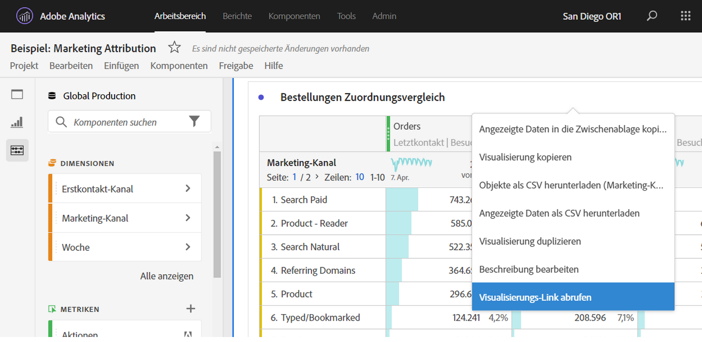

# Erstellen von freigebbaren Links

Analysis Workspace bietet viele Möglichkeiten, ein Projekt für Ihre Benutzer freizugeben, einschließlich der Möglichkeit, einen Link zu einem Projekt oder einem bestimmten Teil eines Projekts absurufen. Bei einigen Link-Typen muss sich die Person bei Adobe Analytics anmelden, bevor sie auf das Projekt zugreifen kann, bei anderen hingegen nicht.

## Abrufen eines Projekt-Links zur Freigabe für andere Workspace-Benutzende {#project-link}

Um einen Link zu einem Projekt freizugeben, gehen Sie zu dem Projekt, das Sie freigeben möchten, und wählen Sie dann [!UICONTROL **Freigeben**] > [!UICONTROL **Für Workspace-Benutzer freigeben**] > [!UICONTROL **Über Link freigeben**] aus. Benutzende, für die Sie den Link freigeben, müssen sich anmelden.

Wenn dem Empfänger bzw. der Empfängerin des Links keine [Projektrolle](https://experienceleague.adobe.com/docs/analytics/analyze/analysis-workspace/curate-share/share-projects.html?lang=de) zugewiesen wurde, erhalten Admins das Erlebnis **[!UICONTROL Kann bearbeiten]**, und Nicht-Admins erhalten **[!UICONTROL Kann duplizieren]**.

## Abrufen eines schreibgeschützten Links zur Freigabe für alle

Sie können einen schreibgeschützten Link zu Analysis Workspace-Projekten für Personen freigeben, die keinen Zugriff auf Adobe Analytics haben. Personen, für die Sie den Link freigeben, müssen sich nicht anmelden.

Weitere Informationen finden Sie unter „Projekt für alle freigeben (keine Anmeldung erforderlich)“ im Artikel [Freigeben von Projekten](/help/analyze/analysis-workspace/curate-share/share-projects.md).

## Bedienfeld- oder Visualisierungs-Link abrufen {#panel-link}

Sie können auch einen Link zu einem bestimmten Teil eines Projekts freigeben, z. B. einem Bedienfeld oder einer individuellen Visualisierung. Dies wird manchmal auch als Intra-Linking bezeichnet. Dies kann nützlich sein, um die Aufmerksamkeit Ihrer Benutzerinnen und Benutzer auf wichtige Erkenntnisse im Projekt zu lenken.

* Klicken Sie in der Kopfzeile eines Bedienfelds mit der rechten Maustaste auf **[!UICONTROL Bedienfeld-Link abrufen]**.
* Klicken Sie in einer Tabellen- oder Visualisierungskopfzeile mit der rechten Maustaste auf **[!UICONTROL Visualisierungs-Link abrufen]**.

[Sehen Sie sich das Video an](https://experienceleague.adobe.com/docs/analytics-learn/tutorials/analysis-workspace/visualizations/intra-linking-in-analysis-workspace.html?lang=de), wie Sie Links erstellen und diese verwenden, um Empfänger zu bestimmten Teilen Ihres Projekts zu führen.

