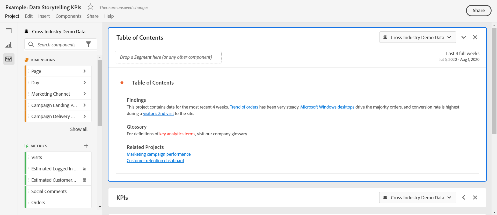
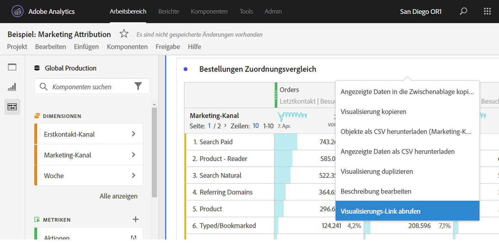

# Erstellen von freigebbaren Links

Analysis Workspace bietet viele Möglichkeiten, ein Projekt für Ihre Benutzer freizugeben, einschließlich der Möglichkeit, einen Link zu einem Projekt oder einem bestimmten Teil eines Projekts absurufen. Bei einigen Link-Typen muss sich die Person bei Adobe Analytics anmelden, bevor sie auf das Projekt zugreifen kann, bei anderen hingegen nicht.

## Abrufen eines Projekt-Links zur Freigabe für andere Workspace-Benutzende {#project-link}

Um einen Link für ein Projekt freizugeben, gehen Sie zu dem Projekt, das Sie freigeben möchten, und wählen Sie dann **[!UICONTROL Freigeben]** > **[!UICONTROL Projektlink abrufen]** (oder **[!UICONTROL Freigeben]** > **[!UICONTROL Für Workspace-Benutzer freigeben]** > **[!UICONTROL Über Link freigeben]**). Benutzende, für die Sie den Link freigeben, müssen sich anmelden.

Wenn dem Empfänger des Links keine [Projektrolle“ zugewiesen wurde](/help/analyze/analysis-workspace/curate-share/share-projects.md) erhalten Administratoren **[!UICONTROL Original bearbeiten]** und Nicht-Administratoren **[!UICONTROL Kopie bearbeiten]** Erlebnisse.

## Abrufen eines schreibgeschützten Links zur Freigabe für alle

Sie können einen schreibgeschützten Link zu Analysis Workspace-Projekten für Personen freigeben, die keinen Zugriff auf Adobe Analytics haben.

Weitere Informationen finden Sie unter [Für alle freigeben](/help/analyze/analysis-workspace/curate-share/share-projects.md#share-a-project-with-anyone-no-login-required).

## Abrufen eines Bedienfelds oder Visualisierungs-Links {#panel-link}

Sie können auch einen Link zu einem bestimmten Teil eines Projekts freigeben, z. B. einem Bedienfeld oder einer individuellen Visualisierung. Dies wird manchmal auch als Intra-Linking bezeichnet. Dies kann nützlich sein, um die Aufmerksamkeit Ihrer Benutzerinnen und Benutzer auf wichtige Erkenntnisse im Projekt zu lenken.

* Wählen Sie im Kontextmenü einer Bereichskopfzeile die Option **[!UICONTROL Bereichslink abrufen]**
* Wählen Sie im Kontextmenü einer Visualisierungskopfzeile die Option **[!UICONTROL Visualisierungslink abrufen]**

[Sehen Sie sich das Video an](https://experienceleague.adobe.com/docs/analytics-learn/tutorials/analysis-workspace/visualizations/intra-linking-in-analysis-workspace.html?lang=de), wie Sie Links erstellen und diese verwenden, um Empfänger zu bestimmten Teilen Ihres Projekts zu führen.

## Verwenden von Links in einem Inhaltsverzeichnis {#TOC}

Ein Tipp für die Nutzung der verschiedenen Link-Optionen besteht darin, immer ein Inhaltsverzeichnis am Anfang Ihres Workspace-Projekts einzufügen. Im Inhaltsverzeichnis können Sie Links zu anderen relevanten Projekten, spezifischen Bedienfeldern und spezifischen Visualisierungen erstellen. Dies erleichtert dem Empfänger des Projekts die Navigation.

[Sehen Sie sich das Video an](https://experienceleague.adobe.com/docs/analytics-learn/tutorials/analysis-workspace/navigating-workspace-projects/create-a-toc-in-analysis-workspace.html?lang=de), wie Sie mithilfe von Links und dem Rich-Text-Editor von Workspace ein Inhaltsverzeichnis erstellen.

<!--
# Create shareable links

Analysis Workspace offers many ways to share a project to your users, including the ability to get a link to a project or a specific part of a project. Some link types require the recipient to log in to Adobe Analytics before accessing the project, while others do not. 

## Get a project link to share with other Workspace users {#project-link} 

To share a link to a project, go to the project you want to share, then select go to [!UICONTROL **Share**] > [!UICONTROL **Share with Workspace users**] > [!UICONTROL **Share by link**]. Users you share the link with are required to log in. 

If the recipient of the link has not been assigned a [project role](/help/analyze/analysis-workspace/curate-share/share-projects.md), admins receive **[!UICONTROL Edit original]** and non-admins receive **[!UICONTROL Edit copy]** experiences.

## Get a read-only link to share with anyone

You can share a read-only link to Analysis Workspace projects with people who don't have access to Adobe Analytics. Users you share the link with are not required to log in. 

For more information, see "Share a project with anyone (no login required)" in the article [Share projects](/help/analyze/analysis-workspace/curate-share/share-projects.md).

## Get panel or visualization link {#panel-link} 

You can also share a link to a specific part of a project, such as a panel or individual visualization. This is sometimes referred to as intra-linking. This can be useful to draw your users' attention to key insights within the project.  

* From any panel header, right-click **[!UICONTROL Get panel link]** 
* From any table or visualization header, right-click **[!UICONTROL Get visualization link]** 

[Watch the video](https://experienceleague.adobe.com/docs/analytics-learn/tutorials/analysis-workspace/visualizations/intra-linking-in-analysis-workspace.html) on how to create links and use them to drive recipients to specific parts of your project. 

-->