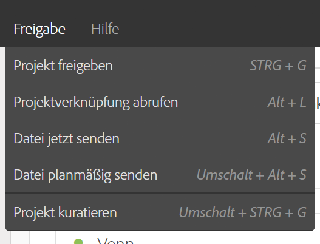
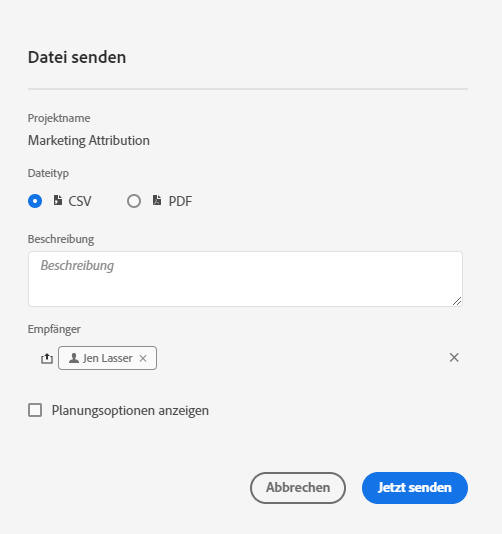
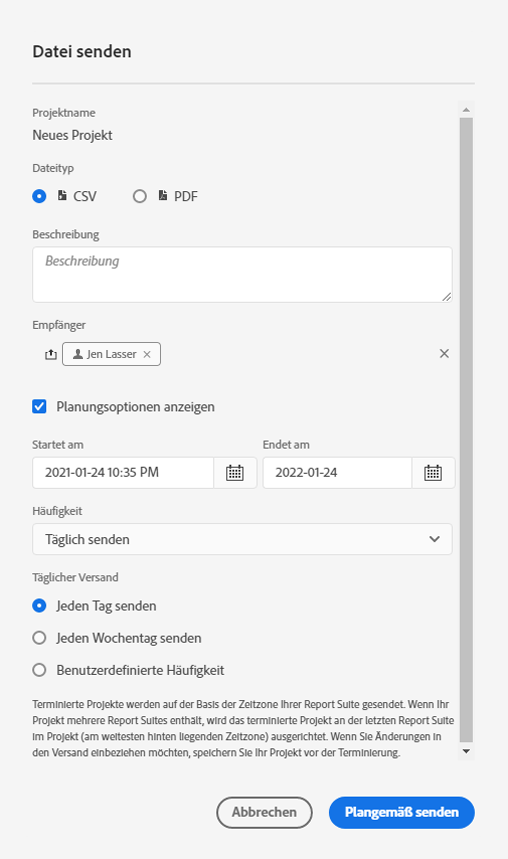

# Senden und Planen von Projekten

Sie können Adobe Analytics-Projekte als Dateien per E-Mail an ausgewählte Benutzer senden. Sie können Dateien ad hoc senden oder Sie können Dateien so konfigurieren, dass sie nach einem Zeitplan gesendet werden.

Beachten Sie beim Senden von Dateien Folgendes:

* Dateien können im CSV- oder PDF-Format gesendet werden.

* Alle auf das Projekt angewendeten Tags werden automatisch auf den Export angewendet.

Es sind auch andere Methoden zum Exportieren von Adobe Analytics-Daten verfügbar, wie unter [Exportübersicht](/help/export/home.md) beschrieben.

## Datei senden

So senden Sie eine Ad-hoc-Datei per E-Mail an Empfänger:

1. Wählen Sie **[!UICONTROL Freigeben] > [!UICONTROL Datei senden]**.
1. Geben Sie den Dateityp an:
   * [!UICONTROL **CSV**]: Wählen Sie diese Option aus, wenn Sie Daten in Textform verwenden möchten.
   * [!UICONTROL **PDF**]: Wählen Sie diese Option, wenn die heruntergeladene Datei alle angezeigten (sichtbaren) Tabellen und Visualisierungen im Projekt enthalten soll.
1. (Optional) Verwenden Sie **[!UICONTROL Beschreibung]** um eine Beschreibung hinzuzufügen, die in die E-Mail aufgenommen werden soll.
1. Fügen Sie Empfänger oder Gruppen hinzu. Sie können auch E-Mail-Adressen eingeben.
1. (Optional) Wählen Sie **[!UICONTROL Planungsoptionen anzeigen]** aus, um [einen Dateiexport zu &#x200B;](#schedule-file-export).
1. Klicken Sie **[!UICONTROL Jetzt senden]**. Wählen Sie zum Abbrechen **[!UICONTROL Abbrechen]** aus.

## Dateiexport planen {#schedule}

So senden Sie eine Datei nach einem Zeitplan per E-Mail an Empfänger:

1. Wählen Sie **[!UICONTROL Freigeben] > [!UICONTROL Dateiexport planen]**.
1. Geben Sie den Dateityp an:
   * [!UICONTROL **CSV**]: Wählen Sie diese Option aus, wenn Sie Daten in Textform verwenden möchten.
   * [!UICONTROL **PDF**]: Wählen Sie diese Option, wenn die heruntergeladene Datei alle angezeigten (sichtbaren) Tabellen und Visualisierungen im Projekt enthalten soll.
1. (Optional) Verwenden Sie **[!UICONTROL Beschreibung]** um eine Beschreibung hinzuzufügen, die in die E-Mail aufgenommen werden soll.
1. Fügen Sie Empfänger oder Gruppen hinzu. Sie können auch E-Mail-Adressen eingeben.
1. (Nur für Kundinnen und Kunden von Healthcare Shield) Geben Sie ein Kennwort ein, um [einen terminierten Bericht mit einem Kennwort zu schützen](#password-protect-a-new-scheduled-project).
1. Stellen Sie sicher **[!UICONTROL dass „Planungsoptionen]**&quot; ausgewählt ist.
1. Wählen Sie eine **[!UICONTROL Häufigkeit]** aus. Folgende Optionen stehen zur Auswahl:

   | Häufigkeit | Optionen |
   |---|---|
   | **[!UICONTROL Stündlich senden]** | Geben Sie einen Wert für **[!UICONTROL Alle Stunden senden]** ein. |
   | **[!UICONTROL Täglich senden]** | Wählen Sie eine **[!UICONTROL Tägliche Häufigkeit]** aus: **[!UICONTROL Täglich senden]**, **[!UICONTROL Täglich senden]** oder **[!UICONTROL Benutzerdefinierte Häufigkeit]**. Wenn Sie **[!UICONTROL Benutzerdefinierte Häufigkeit]** auswählen, geben Sie einen Wert für **[!UICONTROL Alle Tage senden]** ein. |
   | **[!UICONTROL Wöchentlich senden]** | Geben Sie einen Wert für **[!UICONTROL Nach jeder Anzahl von Wochen senden]** ein. und wählen Sie einen **[!UICONTROL Wochentag]**. |
   | **[!UICONTROL Monatlich nach Wochentag senden]** | Wählen Sie einen **[!UICONTROL Wochentag]** und eine **[!UICONTROL Woche des Monats]** aus. |
   | **[!UICONTROL Monatlich nach Tag des Monats senden]** | Wählen Sie einen Wert unter **[!UICONTROL An diesem Tag des Monats senden]** aus. |
   | **[!UICONTROL Jährlich nach Tag des Monats senden]** | Wählen Sie einen **[!UICONTROL Wochentag]**, eine **[!UICONTROL Woche des Monats]** und einen **[!UICONTROL Monatstag des Jahres]** aus. |
   | **[!UICONTROL Jährlich nach bestimmtem Datum senden]** | Wählen Sie einen **[!UICONTROL Monat des Jahres]** und wählen Sie einen Wert aus **[!UICONTROL An diesem Tag des Monats senden]**. |

1. Geben Sie in &quot;**[!UICONTROL am“ ein]** ein. Wählen Sie alternativ  aus, um ein Startdatum aus dem Kalender auszuwählen.

1. Geben Sie in „Endet am **[!UICONTROL ein Enddatum]**. Wählen Sie alternativ  aus, um ein Enddatum aus dem Kalender auszuwählen.
1. Wählen Sie **[!UICONTROL Planmäßig senden]** aus. Wählen Sie zum Abbrechen **[!UICONTROL Abbrechen]** aus.

## Manager für geplante Projekte {#manager}

Geplante Analysis Workspace-Projekte können über die Hauptbenutzeroberfläche mithilfe von **[!UICONTROL Komponenten]** > **[!UICONTROL Geplante Projekte]** verwaltet werden. Weitere Informationen finden Sie unter [Geplante Projekte](/help/components/scheduled-projects-manager.md).

<!--
# Schedule projects

From the Workspace **Share menu**, you can send Analysis Workspace projects using email to selected recipients. Files can be sent in CSV or PDF format. After you share scheduled projects, you can edit the schedule settings to modify the frequency, receipient list, or file type using the Scheduled Projects manager.

## Send file now

To send a file immediately to recipients via email:

1. Click **[!UICONTROL Share] > [!UICONTROL Export file]**.
1. Specify the file type:
   * [!UICONTROL **CSV**]: Choose this option if you want plain-text data.
   * [!UICONTROL **PDF**]: Choose this option if you want the downloaded file to contain all the displayed (visible) tables and visualizations in the project.
1. (Optional) Add a description to include in the email to explain the file being received. 
1. Add recipients or groups. Email addresses can also be entered. 
1. Click **[!UICONTROL Send Now]**.
1. (Optional) Click **[!UICONTROL Show scheduling options]** to specify a delivery schedule.

## Send file on schedule

To send a file on a recurring schedule to recipients via email:

1. Click **[!UICONTROL Share] > [!UICONTROL Schedule file export]**.
1. Specify the file type (CSV or PDF).
1. (Optional) Add a description that will be included in the email to explain the file being received. 
1. Add recipients or groups. Email addresses can also be entered. 
1. Specify the range the schedule should be delivered over by modifying Starting on and Ending on inputs. The end date must be within a year from the day the schedule is created or modified.
1. Specify the delivery frequency. Each frequency allows for different customizations. 
1. Click **[!UICONTROL Send on schedule]**.

## Manage scheduled projects

When you manage scheduled projects, you can edit and delete recurring project schedules:

*  Change the file type (.csv or PDF)
*  Update the project description
*  Add or remove recipients
*  Change the frequency

Scheduled Analysis Workspace projects can be managed under **Analytics > Components > Scheduled Projects**.

For more information, see [Scheduled projects](/help/components/scheduled-projects-manager.md)
-->
