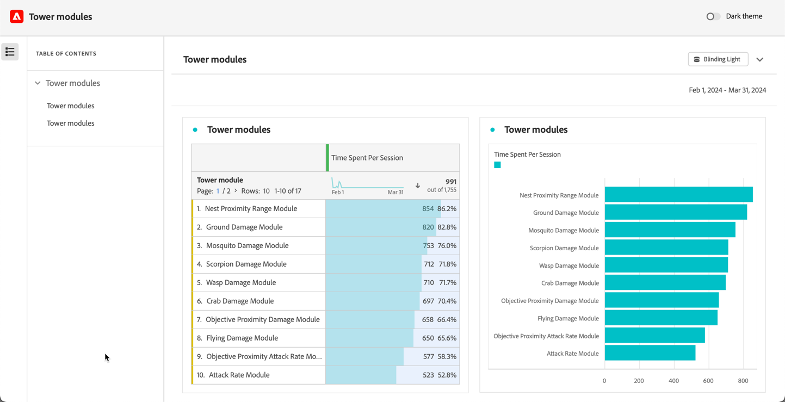

# Schreibgeschützte Projekte

Sie können Projekte über die Funktion [Freigeben“ schreibgeschützt für Empfänger ](share-projects.md). Empfänger mit der Rolle **[!UICONTROL Schreibgeschützt]** erhalten ein eingeschränkteres Projekterlebnis.

Dies kann wünschenswert sein, wenn Sie ein Projekt für Benutzende freigeben, die mit der Datenstruktur Ihres Unternehmens, Analysis Workspace oder Adobe Analytics im Allgemeinen weniger vertraut sind, aber dennoch Daten und Einblicke in einer sicheren Umgebung einsehen sollen.

Die Interaktionen für schreibgeschützte Empfänger sind begrenzt.

## Deaktivierte Interaktionen

Zu den deaktivierten Interaktionen in einem schreibgeschützten Projekt gehören:

* Ausgeblendeter linker Bereich
* Datumsbereich des Bedienfeldkalenders. Hinweis: Wenn Sie Empfängern die Kalenderkontrolle gewähren möchten, fügen Sie ein [Dropdown-Segment mit Datumsbereichen“ ](https://experienceleague.adobe.com/docs/analytics-learn/tutorials/analysis-workspace/using-panels/using-drop-down-filters.html?lang=de).
* Freiformsegmentierung
* Freiform – Anzahl der sichtbaren Zeilen
* Freiformzeilen-, Spalten- oder Visualisierungseinstellungen
* Bedienfeldsegmente
* Menüs „Bearbeiten“, „Einfügen“ und „Komponenten“
* Workspace-Tipps

## Aktivierte Interaktionen

Zu den wichtigen aktivierten Interaktionen in einem schreibgeschützten Projekt gehören:

| Bereich | Aktivierte Interaktionen |
| --- | --- |
| Freiformtabellen | <ul><li>Paginierung und Sortierung</li><li>Bewegen</li><li>Zellauswahlen, die verknüpfte Visualisierungen aktualisieren</li><li>Über das Kontextmenü > Visualisierungs-Link abrufen</li><li>Über das Kontextmenü > In Zwischenablage kopieren</li></ul> |
| Visualisierungen | <ul><li>Klicken zum Aktivieren/Deaktivieren der Legende</li><li>Bewegen</li><li>Über das Kontextmenü > Visualisierungs-Link abrufen</li><li>Reduzieren/Erweitern</li><li>Fluss – Flussknoten erweitern</li><li>Karte – Zoomen</li></ul> |
| Bedienfelder | <ul><li>Interaktive Dropdown-Segmente</li><li>Über das Kontextmenü > Bereichslink abrufen</li><li>Reduzieren/Erweitern</li></ul> |
| Projekt | <ul><li>Alle Infosymbole überprüfen</li><li>Projektmenü – Neu, Öffnen, Als Landingpage festlegen, Aktualisieren, CSV/PDF herunterladen, eingeschränkte Projektinfo und Einstellungen</li><li>Menü „Freigeben“ – Projekt-Link abrufen, Datei jetzt senden</li><li>Menü „Hilfe“ – Alle Aktionen mit Ausnahme der Optionen für Tipps und Debugger</li></ul> |

## Für alle freigeben

Wenn Sie ein Projekt mithilfe von [Für alle freigeben](share-projects.md#share-a-project-with-anyone-no-login-required) ausgewählt haben, kann der Empfänger des Links nur das Projekt anzeigen und nicht mit dem Projekt interagieren.

