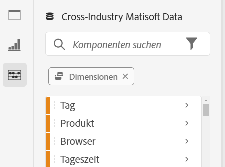

# Analysis Workspace – Überblick {#analysis-workspace-overview}

Mit Analysis Workspace können Sie schnell Analysen erstellen, um Erkenntnisse zu gewinnen und diese Erkenntnisse dann für andere freizugeben. Mithilfe der Drag-and-Drop-Browser-Oberfläche können Sie Ihre Analyse erstellen, Visualisierungen hinzufügen, um Daten lebendig werden zu lassen, einen Datensatz kuratieren sowie [Projekte](/help/analyze/analysis-workspace/build-workspace-project/freeform-overview.md) für andere in Ihrer Organisation freigeben und planen.

>[!BEGINSHADEBOX]

Unter  [Analysis Workspace – Übersicht](https://video.tv.adobe.com/v/26266/?quality=12&learn=on){target="_blank"} finden Sie ein Demovideo.

>[!ENDSHADEBOX]

## Benutzeroberfläche

Das folgende Bild und die zugehörige Tabelle erläutern die Hauptelemente der Benutzeroberfläche von Analysis Workspace:

| Standort | Name und Funktion |
|:---------:|----------|
| A  | Enthält den Projektnamen, eine Menüstruktur für den Zugriff auf die Funktionen, eine Schaltfläche  zum Zurückkehren zur Projektliste und eine Schaltfläche **[!UICONTROL Freigabe]** zum [Freigeben Ihres Workspace-Projekts](/help/analyze/analysis-workspace/curate-share/share-projects.md).  Sie können jederzeit den Namen Ihres Projekts (z. B. „Neues Projekt“) auswählen, um den Namen zu ändern.  Wählen Sie  aus, um Ihr Projekt als bevorzugtes Projekt  zu markieren. |
| B | **Schaltflächen-Panel**: Enthält Schaltflächen für den Zugriff auf die wichtigsten [Funktionen](#features) von Analysis Workspace:<ul><li> [[!UICONTROL Panels]](/help/analyze/analysis-workspace/c-panels/panels.md)</li><li> [[!UICONTROL Visualisierungen]](/help/analyze/analysis-workspace/visualizations/freeform-analysis-visualizations.md)</li><li> [[!UICONTROL Komponenten]](/help/components/home.md)</li><li> [[!UICONTROL Inhaltsverzeichnis]](/help/analyze/analysis-workspace/build-workspace-project/project-table-of-contents.md)</li><li> [[!UICONTROL Datenwörterbuch]](/help/analyze/analysis-workspace/components/data-dictionary/data-dictionary-overview.md)</li></ul> |
| C | **Linkes Bedienfeld:** Dieser Bereich enthält einzelne Bedienfelder, Visualisierungen, Komponenten oder Listen. Der Inhalt hängt von der im Schaltflächenbedienfeld ausgewählten Schaltfläche ab. |
| D | **Arbeitsfläche:** Der Hauptbereich, in den Sie Inhalte aus dem linken Bedienfeld ziehen, um Ihr Projekt zu erstellen. Das Projekt wird dynamisch aktualisiert, wenn Sie Bedienfelder hinzufügen, Visualisierungen zu Bedienfeldern hinzufügen und Komponenten zu Visualisierungen hinzufügen. Sie können mehrere Bedienfelder erstellen und in jedem Bedienfeld können Sie mehrere Visualisierungen erstellen. Jedes Panel basiert auf einer ausgewählten Report Suite. Die ausgewählte Report Suite bestimmt verfügbare Komponenten wie Metriken und Dimensionen. Weitere Informationen finden Sie unter [Panels – Report Suite](/help/analyze/analysis-workspace/c-panels/panels.md#report-suite). |

## Funktionen

Die Hauptfunktionen von Analysis Workspace sind über das Schaltflächenbedienfeld zugänglich:

| Symbol | Funktion | Beschreibung |
|:---:|---|---|
|  | **[!UICONTROL Bedienfelder]** | [Bedienfelder](/help/analyze/analysis-workspace/c-panels/panels.md) dienen zur Organisation Ihrer Analyse in einem Projekt und können viele Tabellen und Visualisierungen enthalten. Viele der in Analysis Workspace bereitgestellten Bedienfelder ermöglichen das Generieren eines vollständigen Satzes von Analysen auf der Grundlage einiger weniger Benutzereingaben. |
|  | **[!UICONTROL Visualisierungen]** | [Visualisierungen](/help/analyze/analysis-workspace/visualizations/freeform-analysis-visualizations.md), wie z. B. ein Balken- oder Liniendiagramm, können verwendet werden, um Daten visuell lebendig werden zu lassen. Wählen Sie im linken Bedienfeld das mittlere Symbol **[!UICONTROL Visualisierungen]** aus, um die vollständige Liste der verfügbaren Visualisierungen anzuzeigen. |
|  | **[!UICONTROL Komponenten]** | Zu den [Komponenten](/help/components/home.md) gehören die folgenden Elemente:<ul><li> [Dimensionen](/help/components/dimensions/overview.md)</li><li> [Metriken](/help/analyze/analysis-workspace/components/apply-create-metrics.md)</li><li> [Segmente](/help/components/segmentation/seg-overview.md)</li><li> [Datumsbereiche](/help/analyze/analysis-workspace/components/calendar-date-ranges/calendar.md)</li></ul> |
|  | **[!UICONTROL Inhaltsverzeichnis]** | Im [Inhaltsverzeichnis](/help/analyze/analysis-workspace/build-workspace-project/project-table-of-contents.md) sind alle im Projekt enthaltenen Panels und Visualisierungen in Form einer reduzierbaren Liste organisiert, sodass Sie schnell auf ein bestimmtes Panel oder eine bestimmte Visualisierung zugreifen können. |
|  | **Datenwörterbuch** | Das [Datenwörterbuch](/help/analyze/analysis-workspace/components/data-dictionary/data-dictionary-overview.md) hilft Benutzenden und Admins dabei, die Komponenten in ihrer Analytics-Umgebung zu verfolgen und besser zu verstehen. |

## Menü

Die meisten Analysis Workspace-Funktionen sind per Drag-and-Drop und über Kontextmenüs in Bedienfeldern, Visualisierungen und Komponenten verfügbar.

Die Funktionen können auch über das Workspace-Menü sowie über Tastaturbefehle oder Hotkeys aufgerufen werden. Die Tastaturbefehle unterscheiden sich je nach Betriebssystem, unter dem der Browser ausgeführt wird. Eine entsprechende Übersicht finden Sie in den nachfolgenden Tabellen.

Beachten Sie, dass auf Ihrer Tastatur möglicherweise die folgenden Symbole verwendet werden:

- **⇧** für die **[!UICONTROL *Umschalttaste *]**
- **⌘** für die **[!UICONTROL *Befehlstaste *]**.
- **⌃** für die **[!UICONTROL *Strg-Taste *]**.
- **⌥** für die **[!UICONTROL *Wahltaste *]**.
- **⎇** für die **[!UICONTROL *Alt-Taste *]**.

Eine Übersicht über die verfügbaren Menüs finden Sie in den nachfolgenden Tabellen.

| **[!UICONTROL Projekt]** | Mac-Tastaturbefehl | Windows-Tastaturbefehl | Beschreibung |
|---|---|---|---|
| **[!UICONTROL Erstellen eines Projekts]** | **[!UICONTROL *Umschalt+Befehlstaste+P *]** | **[!UICONTROL *Umschalt+Strg+P *]** | Erstellen eines neuen Projekts. |
| **[!UICONTROL Erstellen einer mobilen Scorecard]** | | | [Erstellen einer neuen mobilen Scorecard](/help/analyze/mobile-app/create-scorecard.md). |
| **[!UICONTROL Öffnen…]** | **[!UICONTROL *Befehlstaste+O *]** | **[!UICONTROL *Strg+O *]** | [Öffnen eines vorhandenen Projekts](/help/analyze/analysis-workspace/build-workspace-project/save-projects.md#open-another-project). |
| **[!UICONTROL Vorherige Version öffnen…]** | **[!UICONTROL *Wahltaste+Befehlstaste+O *]** | **[!UICONTROL *Alt+Strg+O *]** | [Öffnen früherer Versionen Ihres Projekts](/help/analyze/analysis-workspace/build-workspace-project/save-projects.md#open-previous-version). |
| **[!UICONTROL Speichern]** | **[!UICONTROL *Befehlstaste+S *]** | **[!UICONTROL *Strg+S *]** | [Speichern Ihres Projekt](/help/analyze/analysis-workspace/build-workspace-project/save-projects.md#save-projects) |
| **[!UICONTROL Mit Hinweisen speichern…]** | **[!UICONTROL *Wahltaste+Befehlstaste+S *]** | **[!UICONTROL *Alt+Strg+S *]** | [Hinzufügen von Hinweisen zur gespeicherten Projektversion](/help/analyze/analysis-workspace/build-workspace-project/save-projects.md#save-project-options). |
| **[!UICONTROL Speichern unter…]** | **[!UICONTROL *Umschalt+Befehlstaste+S *]** | **[!UICONTROL *Umschalt+Strg+S *]** | [Speichern des Projekts unter einem anderen Namen und mit anderen Details](/help/analyze/analysis-workspace/build-workspace-project/save-projects.md#save-project-options) |
| **[!UICONTROL Projekt aktualisieren]** | **[!UICONTROL *Wahltaste+R *]** | **[!UICONTROL *Alt+R *]** | Aktualisieren des Projekts. |
| **[!UICONTROL CSV herunterladen]** | **[!UICONTROL *Umschalt+Befehlstaste+V *]** | **[!UICONTROL *Umschalt+Strg+V *]** | Herunterladen des Projekts als CSV-Datei |
| **[!UICONTROL PDF herunterladen]** | **[!UICONTROL *Umschalt+Befehlstaste+B *]** | **[!UICONTROL *Umschalt+Strg+B *]** | Herunterladen des Projekts als PDF-Dokument. |
| **[!UICONTROL Projektinfo und Einstellungen]** | | | Definieren der Einstellungen für Ihre Projekte, wie z. B. Name, Tags, Farbpalette und mehr. |
| **[!UICONTROL Benutzereinstellungen]** | | | [Konfigurieren der Voreinstellungen für die Verwendung von Analysis Workspace](/help/analyze/analysis-workspace/user-preferences.md). |

| **[!UICONTROL Bearbeiten]** | Mac-Tastaturbefehl | Windows-Tastaturbefehl | Beschreibung |
|---|---|---|---|
| **[!UICONTROL Rückgängig]** | **[!UICONTROL *Befehlstaste+Z *]** | **[!UICONTROL *Strg+Z *]** | Rückgängigmachen der vorherigen Aktion. |
| **[!UICONTROL Wiederherstellen]** | **[!UICONTROL *Umschalt+Befehlstaste+Z *]** | **[!UICONTROL *Strg+Umschalt+Z *]** | Wiederherstellen der vorherigen Aktion. |
| **[!UICONTROL Alle löschen]** | **[!UICONTROL *Wahltaste+W *]** | **[!UICONTROL *Alt+W *]** | Löschen aller Bedienfelder im aktuellen Projekt. |

| **[!UICONTROL Einfügen]** | Mac-Tastaturbefehl | Windows-Tastaturbefehl | Beschreibung |
|---|---|---|---|
| **[!UICONTROL Leeres Bedienfeld]** | **[!UICONTROL *Wahltaste+B *]** | **[!UICONTROL *Alt+B *]** | Einfügen eines [leeren Bedienfelds](/help/analyze/analysis-workspace/c-panels/blank-panel.md). |
| **[!UICONTROL Gleichzeitige Medienbetrachtende]** | **[!UICONTROL *Wahltaste+H *]** | **[!UICONTROL *Alt-H *]** | Einfügen des Bedienfelds [Gleichzeitige Medienbetrachtende](/help/analyze/analysis-workspace/c-panels/media-concurrent-viewers.md) |
| **[!UICONTROL Verbrachte Zeit bei der Medienwiedergabe]** | **[!UICONTROL *Wahltaste+I *]** | **[!UICONTROL *Alt+I *]** | Einfügen eines Bedienfelds [Verbrachte Zeit bei der Medienwiedergabe](/help/analyze/analysis-workspace/c-panels/media-playback-time-spent.md). |
| **[!UICONTROL Medien-Zielgruppendurchschnitt pro Minute]** | **[!UICONTROL *Wahltaste+M *]** | **[!UICONTROL *Alt+M *]** | Einfügen eines Bedienfelds [Medien-Zielgruppendurchschnitt pro Minute](/help/analyze/analysis-workspace/c-panels/average-minute-audience-panel.md). |
| **[!UICONTROL Attribution]** | **[!UICONTROL *Wahltaste+E *]** | **[!UICONTROL *Alt+E *]** | Einfügen eines Bedienfelds [Attribution](/help/analyze/analysis-workspace/c-panels/attribution.md). |
| **[!UICONTROL Freiform]** | **[!UICONTROL *Wahltaste+A *]** | **[!UICONTROL *Alt+A *]** | Einfügen eines Bedienfelds [Freiform](/help/analyze/analysis-workspace/c-panels/freeform-panel.md). |
| **[!UICONTROL Quick Insights]** | **[!UICONTROL *Wahltaste+J *]** | **[!UICONTROL *Alt+J *]** | Einfügen eines Bedienfelds [Quick Insights](/help/analyze/analysis-workspace/c-panels/quickinsight.md). |
| **[!UICONTROL Freiformtabelle]** | **[!UICONTROL *Wahltaste+1 *]** | **[!UICONTROL *Alt+1 *]** | Einfügen einer [Freiformtabellen-Visualisierung](/help/analyze/analysis-workspace/visualizations/freeform-table/freeform-table.md). |
| **[!UICONTROL Linie]** | **[!UICONTROL *Wahltaste+2 *]** | **[!UICONTROL *Alt+2 *]** | Einfügen einer [Linienvisualisierung](/help/analyze/analysis-workspace/visualizations/line.md). |
| **[!UICONTROL Balken]** | **[!UICONTROL *Wahltaste+3 *]** | **[!UICONTROL *Alt+3 *]** | Einfügen einer [Balkenvisualisierung](/help/analyze/analysis-workspace/visualizations/bar.md). |
| **[!UICONTROL Kombination]** | **[!UICONTROL *Wahltaste+4 *]** | **[!UICONTROL *Alt+4 *]** | Einfügen einer [Kombinationsvisualisierung](/help/analyze/analysis-workspace/visualizations/combo-charts.md). |

| **[!UICONTROL Komponenten]** | Mac-Tastaturbefehl | Windows-Tastaturbefehl | Beschreibung |
|---|---|---|---|
| **[!UICONTROL Segment erstellen …]** | **[!UICONTROL *Umschalt+Befehlstaste+E *]** | **[!UICONTROL *Umschalt+Strg+E *]** | Erstellen eines neuen [Segments](/help/components/segmentation/segmentation-workflow/seg-create.md). |
| **[!UICONTROL Metrik erstellen…]** | **[!UICONTROL *Umschalt+Befehlstaste+C *]** | **[!UICONTROL *Umschalt+Strg+C *]** | Erstellen einer neuen [berechneten Metrik](/help/components/calculated-metrics/cm-overview.md). |
| **[!UICONTROL Datumsbereich erstellen]** | **[!UICONTROL *Umschalt+Befehlstaste+D *]** | **[!UICONTROL *Umschalt+Strg+D *]** | Erstellen eines neuen [Datumsbereichs](/help/analyze/analysis-workspace/components/calendar-date-ranges/calendar.md). |
| **[!UICONTROL Anmerkung erstellen...]** | **[!UICONTROL *Umschalt+Befehlstaste+O *]** | **[!UICONTROL *Umschalt+Strg+O *]** | Erstellen einer neuen [Anmerkung](/help/analyze/analysis-workspace/components/annotations/overview.md) |
| **[!UICONTROL Aktualisieren von Komponenten]** | **[!UICONTROL *Wahltaste+Umschalt+R *]** | **[!UICONTROL *Umschalt+Alt+R *]** | Aktualisieren der Komponenten im Projekt. |

| **[!UICONTROL Freigeben]** | Mac-Tastaturbefehl | Windows-Tastaturbefehl | Beschreibung |
|---|---|---|---|
| **[!UICONTROL Für Arbeitsbereich-Benutzende freigeben]** | **[!UICONTROL *Befehlstaste+H *]** | **[!UICONTROL *Strg+H *]** | [Freigeben des Projekts für andere Workspace-Benutzende](/help/analyze/analysis-workspace/curate-share/share-projects.md#share-with-customer-journey-analytics-users-and-groups-in-your-organization) |
| **[!UICONTROL Für alle freigeben]** | **[!UICONTROL *Wahltaste+L *]** | **[!UICONTROL *Alt+L *]** | [Freigeben einer schreibgeschützten Version des Projekts für alle](/help/analyze/analysis-workspace/curate-share/share-projects.md#share-a-link-to-a-project) |
| **[!UICONTROL Datei senden]** | **[!UICONTROL Wahltaste+S]** | **[!UICONTROL *Alt+S *]** | [Umgehendes Senden eines Projekts als CSV- oder PDF-Datei an bestimmte Empfangende](/help/analyze/analysis-workspace/curate-share/send-schedule-files.md) |
| **[!UICONTROL Dateiexport planen]** | **[!UICONTROL *Umschalt+Wahltaste+S *]** | **[!UICONTROL *Umschalt+Alt+S *]** | [Planmäßiges Senden des Projekts als CSV- oder PDF-Datei an andere Empfängerinnen und Empfänger](/help/analyze/analysis-workspace/curate-share/send-schedule-files.md) |
| **[!UICONTROL Projektdaten kuratieren]** | **[!UICONTROL *Umschalt+Befehlstaste+G *]** | **[!UICONTROL *Umschalt+Strg+G *]** | [Kuratieren der Projektdaten](/help/analyze/analysis-workspace/curate-share/curate.md) |

| Hilfe | Beschreibung |
|---|---|
| **[!UICONTROL Videos]** | Öffnen Sie den YouTube-Kanal von Customer Journey Analytics in einer neuen Browser-Registerkarte. |
| **[!UICONTROL Hilfedokumentation]** | Öffnen Sie die Dokumentation (die Sie gerade lesen …) in einer neuen Browser-Registerkarte. |
| **[!UICONTROL Hilfeforum]** | Öffnen Sie das Communitys-Forum von Adobe Analytics Experience League in einer neuen Browser-Registerkarte. |
| **[!UICONTROL Tastaturbefehle]** | Anzeigen einer Übersicht der Hotkeys (Tastaturbefehle), die Sie in Workspace verwenden können. |
| **[!UICONTROL Debugger aktivieren]** | Aktivieren des Debuggers. Ihr Projekt wird neu geladen. |
| **[!UICONTROL Debugger deaktivieren]** | Deaktivieren des Debuggers. Ihr Projekt wird neu geladen. |
| **[!UICONTROL Leistung]** | Anzeigen eines Dialogfelds mit Metriken zur **[!UICONTROL Analysis Workspace-Leistung]**. Verwenden Sie **[!UICONTROL Als CSV herunterladen]**, um eine CSV-Datei mit den Leistungsmetriken herunterzuladen. |
| **[!UICONTROL Über den Arbeitsbereich]** | Anzeigen des Dialogfelds **[!UICONTROL Über den Arbeitsbereich]** mit Versionsinformationen, Funktionszugriffsebenen und aktiven Featureflags. |

## Datenquellen

Durch Synchronisieren von Visualisierungen können Sie kontrollieren, welche Datentabelle oder Datenquelle zu einer Visualisierung gehört. Weitere Informationen finden Sie unter [Verwalten von Datenquellen](/help/analyze/analysis-workspace/visualizations/t-sync-visualization.md).

## Verwenden von Analysis Workspace

So verwenden Sie Analysis Workspace:

1. Melden Sie sich bei [Adobe Experience Cloud](https://experience.adobe.com) an.
1. Wählen Sie **[!UICONTROL Customer Journey Analytics]** im App-Umschalter  oben rechts in der Benutzeroberfläche aus.
1. Standardmäßig wird die Seite **[!UICONTROL Projekte]** von Analysis Workspace angezeigt. Wenn ein bestimmtes Projekt für Sie ausgewählt wurde oder Sie kürzlich daran gearbeitet haben, wird dieses Projekt standardmäßig angezeigt.

### Erstellen eines Projekts

Eine Analyse in Analysis Workspace wird als [Projekt](/help/analyze/analysis-workspace/build-workspace-project/freeform-overview.md) bezeichnet.

Sie können ein Projekt in Analysis Workspace erstellen, wie unter [Erstellen von Projekten](/help/analyze/analysis-workspace/build-workspace-project/create-projects.md) beschrieben.

Projekte können in Ordner und Unterordner unterteilt werden, wie unter [Ordner in Analysis Workspace](/help/analyze/analysis-workspace/build-workspace-project/workspace-folders/about-folders.md) beschrieben.

### Kuratieren und Freigeben eines Projekts

Bei der Erstellung einer Analyse in Analysis Workspace wird Ihre Arbeit [automatisch gespeichert](/help/analyze/analysis-workspace/build-workspace-project/save-projects.md).

Wenn Sie das Projekt fertiggestellt haben und es konkrete Erkenntnisse liefert, möchten es vielleicht auch andere nutzen. Sie können das Projekt für Benutzende sowie Gruppen in Ihrer Organisation oder auch für Personen außerhalb Ihrer Organisation freigeben. Informationen zum Freigeben eines Projekts finden Sie unter [Freigeben von Projekten](/help/analyze/analysis-workspace/curate-share/share-projects.md).

## Zusätzliche Ressourcen {#resources}

- Adobe bietet Hunderte von [Analytics-Video-Tutorials](https://experienceleague.adobe.com/de/docs/analytics-learn/tutorials/overview).
- Für neue Funktionen siehe [Versionshinweise zu Adobe Experience Cloud](https://experienceleague.adobe.com/de/docs/release-notes/experience-cloud/current).

<!--
# Analysis Workspace overview {#analysis-workspace-overview}

Analysis Workspace allows you to build analyses quickly to gather insights and then share those insights with others. Using the drag-and-drop browser interface, you can craft your analysis, add visualizations to bring data to life, curate a dataset, and share and schedule [projects](/help/analyze/analysis-workspace/build-workspace-project/freeform-overview.md) with anyone you choose.

>[!BEGINSHADEBOX]

See  [Analysis workspace overview](https://video.tv.adobe.com/v/26266/?quality=12&learn=on){target="_blank"} for a demo video.

>[!ENDSHADEBOX]

## Interface

The following image and accompanying table explain the main elements in the Analysis Workspace user interface:

| Location | Name and function |
|:---------:|----------|
| A | Contains the name of the project, a menu structure to access functionality, a button  to return back to your Project list, and a **[!UICONTROL Share]** button to [share your Workspace project](/help/analyze/analysis-workspace/curate-share/share-projects.md).  Select the name of your project (for example: New project) at any time to change the name.  Select  to mark your project as a favorite project . |
| B | **Button panel:** Contains buttons for accessing the key [features](#features) of Analysis Workspace:<ul><li> [[!UICONTROL Panels]](/help/analyze/analysis-workspace/c-panels/panels.md)</li><li> [[!UICONTROL Guided Analysis]](/help/guided-analysis/overview.md)</li><li> [[!UICONTROL Visualizations]](/help/analyze/analysis-workspace/visualizations/freeform-analysis-visualizations.md)</li><li> [[!UICONTROL Components]](/help/components/overview.md)</li><li> [[!UICONTROL Table of contents]](/help/analyze/analysis-workspace/build-workspace-project/project-table-of-contents.md)</li><li> [[!UICONTROL Data Dictionary]](/help/components/data-dictionary/data-dictionary-overview.md)</li></ul> |
| C | **Left panel:** This area contains individual panels, visualizations, components, or lists. The content depends on the button selected in the button panel.  |
| D | **Canvas:** The main area where you drag content from the left panel to build your project. The project dynamically updates as you add panels, add visualizations to panels, and add components to visualizations. You can create multiple panels, and within each panel you can create multiple visualizations. Each panel is based on a selected data view. The selected data view determines available components like metrics and dimensions. See [Panels - Data view](/help/analyze/analysis-workspace/c-panels/panels.md#data-view) for more information. | 

## Features

The key features of Analysis Workspace are available through the button panel:

| Icon | Feature | Description |
|:---:|---|---|
|  | **[!UICONTROL Panels]** | [Panels](/help/analyze/analysis-workspace/c-panels/panels.md) are used to organize your analysis within a project and can contain many tables & visualizations. Many of the panels provided in Analysis Workspace generate a full set of analyses based on a few user inputs. |
|  | **[!UICONTROL Guided Analysis]** | [Guided analysis](../guided-analysis/overview.md) allows you to self-serve high quality data and insights about the customer journey through guided workflows. You can create an analysis for inclusion in your Workspace project, or include an existing analysis previously saved. |
|  | **[!UICONTROL Visualizations]** | [Visualizations](/help/analyze/analysis-workspace/visualizations/freeform-analysis-visualizations.md), such as a bar or line chart, can be used to bring data visually to life. On the far left panel, select the middle **[!UICONTROL Visualizations]** icon to see the full list of visualizations available. |
|  | **[!UICONTROL Components]** | [Components](/help/components/overview.md) include the following elements:<ul><li> [Dimensions](/help/components/dimensions/overview.md)</li><li> [Metrics](/help/components/apply-create-metrics.md)</li><li> [Segments](/help/components/segments/seg-overview.md)</li><li> [Date ranges](/help/components/date-ranges/overview.md)</li></ul> |
|  | **[!UICONTROL Table of contents]** | The table of contents organizes all panels and visualizations included in the project into a collapsible list, allowing you to access a specific panel or visualization quickly. |
| | **Data dictionary** | The [Data dictionary](/help/components/data-dictionary/data-dictionary-overview.md) helps both users and administrators keep track of and better understand the components in their Analytics environment. |

## Menu

Most of the functionality of Analysis Workspace is available through drag and drop, and trough context menus within panels, visualizations and components.

Functionality is also available through the Workspace menu and shortcuts or hotkeys. Shortcut keys differ depending on the operating system that your browser is running on. See the tables below for an overview.  

Note that on your keyboard the following symbols might be used:

- **⇧** for **[!UICONTROL *shift*]**.
- **⌘** for **[!UICONTROL *cmd*]** (command).
- **⌃** for **[!UICONTROL *ctrl*]** (control).
- **⌥** for **[!UICONTROL *opt*]** (option).
- **⎇** for **[!UICONTROL *alt*]** (alternate).

See the tables below for an overview of the available menus.  

| **[!UICONTROL Project]** | Shortcut Mac | Shortcut Windows | Description |
|---|---|---|---|
| **[!UICONTROL Create project]** | **[!UICONTROL *shift+cmd+p*]** | **[!UICONTROL *shift+ctrl+p*]** | Create a new project. |
| **[!UICONTROL Create a mobile scorecard]** | | | [Create a new mobile scorecard](/help/mobile-app/create-scorecard.md). |
| **[!UICONTROL Open...]** | **[!UICONTROL *cmd+o*]** | **[!UICONTROL *ctrl+o*]** | [Open an existing project](/help/analyze/analysis-workspace/build-workspace-project/save-projects.md#open-another-project). |
| **[!UICONTROL Open previous version...]** | **[!UICONTROL *opt+cmd+o*]** | **[!UICONTROL *alt+ctrl+o*]** | [Open earlier versions of your project](/help/analyze/analysis-workspace/build-workspace-project/save-projects.md#open-previous-version). |
| **[!UICONTROL Save]** | **[!UICONTROL *cmd+s*]** | **[!UICONTROL *ctrl+s*]** | [Save your project](/help/analyze/analysis-workspace/build-workspace-project/save-projects.md#save-projects). |
| **[!UICONTROL Save with notes...]** | **[!UICONTROL *opt+cmd+s*]** | **[!UICONTROL *alt+ctrl+s*]** | [Add notes to the project version that you save](/help/analyze/analysis-workspace/build-workspace-project/save-projects.md#save-project-options). |
| **[!UICONTROL Save as...]** | **[!UICONTROL *shift+cmd+s*]** | **[!UICONTROL *shift+ctrl+s*]** | [Save the project using a different name and details](/help/analyze/analysis-workspace/build-workspace-project/save-projects.md#save-project-options). |
| **[!UICONTROL Refresh project]** | **[!UICONTROL *opt+r*]** | **[!UICONTROL *alt+r*]** | Refresh the project. |
| **[!UICONTROL Download CSV]** | **[!UICONTROL *shift+cmd+v*]** | **[!UICONTROL *shift+ctrl+v*]** | Download the project as a CSV file. |
| **[!UICONTROL Download PDF]**| **[!UICONTROL *shift+cmd+b*]** | **[!UICONTROL *shift+ctrl+b*]** | Download the project as a PDF document. |
| **[!UICONTROL Project info & settings]** | | | Define settings for your projects, such as name, tags, color palette, and more. |
| **[!UICONTROL User settings]** | | | [Configure preferences for using Analysis Workspace](/help/analyze/analysis-workspace/user-preferences.md). |

| **[!UICONTROL Edit]** | Shortcut Mac | Shortcut Windows | Description |
|---|---|---|---|
| **[!UICONTROL Undo]** | **[!UICONTROL *cmd+z*]** | **[!UICONTROL *ctrl+z*]** | Undo the previous action. |
| **[!UICONTROL Redo]** | **[!UICONTROL *cmd+shift+z*]** | **[!UICONTROL *ctrl+shift+z*]** | Redo the previous action. |
| **[!UICONTROL Clear all]** | **[!UICONTROL *opt+w*]** | **[!UICONTROL *alt+w*]** | Clear all panels in the current project. | 

| **[!UICONTROL Insert]** | Shortcut Mac | Shortcut Windows | Description |
|---|---|---|---|
| **[!UICONTROL Blank panel]** | **[!UICONTROL *opt+b*]** | **[!UICONTROL *alt+b*]** |  Insert a [Blank panel](/help/analyze/analysis-workspace/c-panels/blank-panel.md). |
| **[!UICONTROL Media concurrent viewers]** | **[!UICONTROL *opt+h*]** | **[!UICONTROL *alt-h*]** |  Insert a [Media concurrent viewers](/help/analyze/analysis-workspace/c-panels/media-concurrent-viewers.md) panel. |
| **[!UICONTROL Media playback time spent]** | **[!UICONTROL *opt+i*]** | **[!UICONTROL *alt+i*]** |  Insert a [Media playback time spent](/help/analyze/analysis-workspace/c-panels/media-playback-time-spent.md) panel. |
| **[!UICONTROL Media average minute audience]** | **[!UICONTROL *opt+m*]** | **[!UICONTROL *alt+m*]** |  Insert a [Media average minute audience](/help/analyze/analysis-workspace/c-panels/average-minute-audience-panel.md) panel. | 
| **[!UICONTROL Attribution]** | **[!UICONTROL *opt+e*]** | **[!UICONTROL *alt+e*]** |  Insert an [Attribution](/help/analyze/analysis-workspace/c-panels/attribution.md) panel. |
| **[!UICONTROL Freeform]** | **[!UICONTROL *opt+a*]** | **[!UICONTROL *alt+a*]** |  Insert a [Freeform](/help/analyze/analysis-workspace/c-panels/freeform-panel.md) panel. |
| **[!UICONTROL Quick insights]** | **[!UICONTROL *opt+j*]** | **[!UICONTROL *alt+j*]** |  Insert a [Quick insights](/help/analyze/analysis-workspace/c-panels/quickinsight.md) panel. |
| **[!UICONTROL Experimentation]** |**[!UICONTROL *opt+x*]** | **[!UICONTROL *alt+x*]** |  Insert an [Experimentation](/help/analyze/analysis-workspace/c-panels/experimentation.md) panel. |
| **[!UICONTROL Freeform table]** | **[!UICONTROL *opt+1*]** | **[!UICONTROL *alt+1*]**|  Insert a [Freeform table](/help/analyze/analysis-workspace/visualizations/freeform-table/freeform-table.md) visualization. |
| **[!UICONTROL Line]** | **[!UICONTROL *opt+2*]** | **[!UICONTROL *alt+2*]** |  Insert a [Line](/help/analyze/analysis-workspace/visualizations/line.md) visualization. |
| **[!UICONTROL Bar]** | **[!UICONTROL *opt+3*]** | **[!UICONTROL *alt+3*]** |  Insert a [Bar](/help/analyze/analysis-workspace/visualizations/bar.md) visualization. |
| **[!UICONTROL Combo]** | **[!UICONTROL *opt+4*]**| **[!UICONTROL *alt+4*]** |  Insert a [Combo](/help/analyze/analysis-workspace/visualizations/combo-charts.md) visualization. | 

| **[!UICONTROL Components]** | Shortcut Mac | Shortcut Windows | Description |
|---|---|---|---|
| **[!UICONTROL Create segment...]** | **[!UICONTROL *shift+cmd+e*]** | **[!UICONTROL *shift+ctrl+e*]** | Create a new [segment](/help/components/segments/seg-create.md). |
| **[!UICONTROL Create metric...]** | **[!UICONTROL *shift+cmd+c*]** | **[!UICONTROL *shift+ctrl+c*]** | Create a new [calculated metric](/help/components/calc-metrics/calc-metr-overview.md). |
| **[!UICONTROL Create date range...]** | **[!UICONTROL *shift+cmd+d*]** | **[!UICONTROL *shift+ctrl+d*]** | Create a new [date range](/help/components/date-ranges/overview.md). |
| **[!UICONTROL Create annotation...]** | **[!UICONTROL *shift+cmd+o*]** | **[!UICONTROL *shift+ctrl+o*]** | Create a new [annotation](/help/components/annotations/overview.md). |
| **[!UICONTROL Create audience...]** | **[!UICONTROL *shift+cmd+u*]** | **[!UICONTROL *shift+ctrl+u*]** | Create a new [audience](/help/components/audiences/audiences-overview.md). |
| **[!UICONTROL Refewsh components]** | **[!UICONTROL *opt+shift+r*]** | **[!UICONTROL *alt+shift+r*]** | Refresh the components in the project. |

| **[!UICONTROL Share]** | Shortcut Mac | Shortcut Windows | Description |
|---|---|---|---|
| **[!UICONTROL Share with Workspace users]** | **[!UICONTROL *cmd+h*]** | **[!UICONTROL *ctrl+h*]** | [Share the project with other Workspace users](/help/analyze/analysis-workspace/curate-share/share-projects.md#share-with-customer-journey-analytics-users-and-groups-in-your-organization). |
| **[!UICONTROL Share with anyone]** | **[!UICONTROL *opt+l*]** | **[!UICONTROL *alt+l*]**| [Share a read-only version of the project with anyone](/help/analyze/analysis-workspace/curate-share/share-projects.md#share-a-link-to-a-project). |
| **[!UICONTROL Send file]** | **[!UICONTROL opt+s]** | **[!UICONTROL *alt+s*]** | [Send the project as a CSV or PDF file to other recipients](/help/analyze/analysis-workspace/curate-share/send-schedule-files.md). |
| **[!UICONTROL Schedule file export]** | **[!UICONTROL *shift+opt+s*]** | **[!UICONTROL *shift+alt+s*]** | [Send the project on a schedule as a CSV or PDF file to other recipients](/help/analyze/analysis-workspace/curate-share/send-schedule-files.md). | 
| **[!UICONTROL Curate project data]** | **[!UICONTROL *shift+cmd+g*]** | **[!UICONTROL *shift+ctrl+g*]** | [Curate the project data](/help/analyze/analysis-workspace/curate-share/curate.md). |

| Help | Shortcut Mac | Shortcut Windows | Description |
|---|---|---|---|
| **[!UICONTROL Videos]** | | | Open the Customer Journey Analytics YouTube channel in a new browser tab. |
| **[!UICONTROL Help documentation]** | | | Open the documentation (you are actually reading just now...) in a new browser tab. |
| **[!UICONTROL Help forum]** | | | Open the Adobe Analytics Experience League communities forum in a new browser tab. |
| **[!UICONTROL Hotkeys]** | | | Show an overview of the hotkeys (shortcuts) you can use in Workspace. |
| **[!UICONTROL Enable debugger]** |  | | Enable the debugger. Your project will reload. | 
| **[!UICONTROL Disable debugger]** | | | Disable the debugger. Your project will reload. |
| **[!UICONTROL Performance]** | | | Show a dialog displaying metrics on the **[!UICONTROL Analysis Workspace performance]**. Use **[!UICONTROL Download as CSV]** to download a CSV file of the performance metrics. |
| **[!UICONTROL About Workspace]** | | | Show an **[!UICONTROL About Analysis Workspace]** dialog with version information, feature access levels and active feature flags. |

## Data sources

You synchronize visualizations to control which data table or data source corresponds to a visualization. See [manage data sources](/help/analyze/analysis-workspace/visualizations/t-sync-visualization.md) for more information.

## Use Analysis Workspace

To start using Analysis Workspace: 

1. Log in to [Adobe Experience Cloud](https://experience.adobe.com).
1. Select **[!UICONTROL Customer Journey Analytics]** from the app switcher  at the top right of the interface.
1. The **[!UICONTROL Projects]** page of Analysis Workspace is shown by default. If a specific project has been selected for you or you have been working on recently, then that project is shown by default.

### Create a project

An analysis in Analysis Workspace is referred to as a [project](/help/analyze/analysis-workspace/build-workspace-project/freeform-overview.md). 

You can create a project in Analysis Workspace as described in [Create projects](/help/analyze/analysis-workspace/build-workspace-project/create-projects.md).

Projects can be organized into folders and subfolders, as described in [Folders in Analysis Workspace](/help/analyze/analysis-workspace/build-workspace-project/workspace-folders/about-folders.md).

### Save and share a project

As you create an analysis in Analysis Workspace, your work is [automatically saved](/help/analyze/analysis-workspace/build-workspace-project/save-projects.md). 

When you finish building out the project and it's gathering actionable insights, others might want to consume the project. You can share the project with users and groups in your organization, or even with people outside your organization. For information about sharing a project, see [Share projects](/help/analyze/analysis-workspace/curate-share/share-projects.md).

## Additional resources {#resources}

- The [Learning landing](/help/getting-started/landing.md#learning) page in Customer Journey Analytics. This page is  great way to become acquainted with Analysis Workspace. Especially the Learning Workspace Fundamental. This template walks you through common terminology and steps for building your first analysis in Workspace
- Adobe offers hundreds of [Analytics video training tutorials](https://experienceleague.adobe.com/en/docs/analytics-learn/tutorials/overview).
- See [Adobe Experience Cloud release notes](https://experienceleague.adobe.com/en/docs/release-notes/experience-cloud/current) for updates about new features.

<!--
# Analysis Workspace overview

Analysis Workspace allows you to quickly build analyses to gather insights and then share those insights with others. Using the drag-and-drop browser interface, you can craft your analysis, add visualizations to bring data to life, curate a dataset, and share and schedule projects with anyone you choose.

The following video provides a brief overview with examples of what is possible.

>[!BEGINSHADEBOX]

See  [Analysis Workspace overview](https://video.tv.adobe.com/v/26266/?quality=12&learn=on){target="_blank"} for a demo video.

>[!ENDSHADEBOX]

## Areas of Analysis Workspace

The following image and accompanying table explain some of the main areas in Analysis Workspace:

| Location in image | Name and function |
|---------|----------|
| A | **Far left rail:** Contains tabs for adding panels, visualizations, and components to Analysis Workspace. Also contains the Data Dictionary icon that is used to open the Data Dictionary. |
| B | **Left rail:** Depending on which tab is selected in the far left rail, this area contains individual panels, visualizations, or components. |
| C | **Canvas:** This is the main area where you drag content from the left rails to build your project. The project dynamically updates as you add panels, visualizations, and components to the canvas. | 
| D | **Report suite drop-down menu:** For each panel in Analysis Workspace, the report suite drop-down menu allows you to choose the report suite that you want to use as your data source. | 

## Features in Analysis Workspace {#analysis}

Following are some of the key features available in Analysis Workspace: 

### Panels

**Panels** are used to organize your analysis within a project and can contain many tables & visualizations. Many of the panels provided in Analysis Workspace generate a full set of analyses based on a few user inputs. On the far left rail, select the top **[!UICONTROL Panels]** icon to see a full list of panels available.

To learn more about panels, see [Panels overview](/help/analyze/analysis-workspace/c-panels/panels.md).

### Visualizations

**Visualizations**, such as a bar or line chart, can be used to visually bring data to life. On the far left rail, select the middle **[!UICONTROL Visualizations]** icon to see the full list of visualizations available. 

To learn more about visualizations, see [Visualizations overview](/help/analyze/analysis-workspace/visualizations/freeform-analysis-visualizations.md).

### Components

Components in Analysis Workspace consist of the following:

* Dimensions

* Metrics

* Segments

* Date ranges

To learn more about each of these component types, see [Components overview](/help/analyze/analysis-workspace/components/analysis-workspace-components.md). 

Each of these component types can be added to a visualization (such as a Freeform table) to start answering your business questions. 

After you understand component terminology, you can drag components into visualizations (including Freeform tables) to [build your analysis](/help/analyze/analysis-workspace/build-workspace-project/freeform-overview.md).

### Data Dictionary

The Data Dictionary in Analysis Workspace helps both users and administrators keep track of and better understand the components in their Analytics environment.

To learn more about the Data Dictionary, see [Data Dictionary overview](/help/analyze/analysis-workspace/components/data-dictionary/data-dictionary-overview.md).

### Data Sources

Synchronizing visualizations lets you control which data table or data source corresponds to a visualization. Here is more information on how you can [manage data sources](/help/analyze/analysis-workspace/visualizations/t-sync-visualization.md).

## Start using Analysis Workspace

### Log in to Adobe Analytics {#login}

To start using Analysis Workspace, log in to Adobe Analytics by going to [experience.adobe.com/analytics](https://experience.adobe.com/analytics). The Projects page of Analysis Workspace is shown by default. If a specific project has been selected for you, that project is shown by default.

### Create a project {#new-project}

An analysis in Analysis Workspace is referred to as a [project](/help/analyze/analysis-workspace/build-workspace-project/freeform-overview.md).  

You can create a project in Analysis Workspace as described in [Create projects](/help/analyze/analysis-workspace/build-workspace-project/create-projects.md).

Projects can be organized into folders and subfolders, as described in [Folders in Analysis Workspace](/help/analyze/analysis-workspace/build-workspace-project/workspace-folders/about-folders.md).

### Save and share a project

As you create an analysis in Analysis Workspace, your work is [automatically saved](/help/analyze/analysis-workspace/build-workspace-project/save-projects.md). 

When you finish building out the project and it's gathering actionable insights, the project is ready to be consumed by others. You can share the project with users and groups in your organization, or even with people outside your organization. For information about sharing a project, see [Share projects](/help/analyze/analysis-workspace/curate-share/share-projects.md).

## Additional resources {#resources}

* Adobe offers hundreds of [Analytics video training tutorials](https://experienceleague.adobe.com/docs/analytics-learn/tutorials/overview.html).
* See [Adobe Experience Cloud release notes](https://experienceleague.adobe.com/docs/release-notes/experience-cloud/current.html#analytics) for updates about new features.
* A great way to become acquainted with Analysis Workspace is through the Analysis Workspace Training Tutorial template. This template walks you through common terminology and steps for building your first analysis in Workspace. To begin the tutorial:
  1. On the [!UICONTROL **Workspace**] tab in Adobe Analytics, select **[!UICONTROL Learning]** on the left.
  1. Select **[!UICONTROL Open Tutorial]**.
     

-->