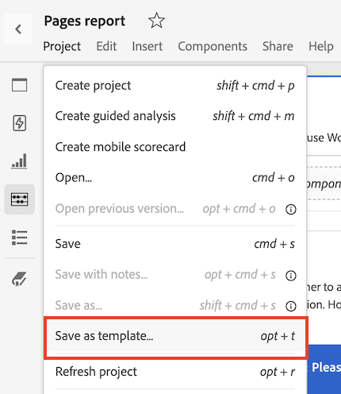

# Erstellen und Verwalten von Vorlagen

Administratoren können Vorlagen erstellen und für andere Benutzer in ihrer Unternehmensanmeldung speichern, die sie verwenden können.

Personen in der Unternehmensanmeldung können diese Unternehmensvorlagen verwenden, wie unter [Vorlagen verwenden](/help/analyze/analysis-workspace/templates/use-templates.md) beschrieben.

## Erstellen einer Vorlage

So erstellen Sie eine neue Vorlage, die von Personen in Ihrem Anmeldeunternehmen verwendet werden kann:

1. Erstellen Sie in Analysis Workspace ein Projekt in Ihrem gewünschten Zustand.

1. Wählen Sie [!UICONTROL **Projekt**] > **[!UICONTROL Als Vorlage speichern...]**.

   

1. Geben Sie die folgenden Informationen im Dialogfeld [!UICONTROL Als Vorlage speichern] an:

   | Feld | Beschreibung |
   |---------|----------|
   | **[!UICONTROL Name]** | Geben Sie einen beschreibenden Namen für die Vorlage an. |
   | **[!UICONTROL Beschreibung]** | Geben Sie eine kurze Beschreibung für die Vorlage ein, in der die Verwendungszwecke beschrieben werden. |
   | **[!UICONTROL Warum diese Vorlage verwenden]** | Geben Sie eine kurze Erläuterung an, um Mitarbeiter in der Organisation darüber zu informieren, wie diese Vorlage verwendet werden kann. Diese Erklärung wird auf der Vorschauseite der Vorlage angezeigt. |
   | **[!UICONTROL Kanäle]** | Wählen Sie die für diese Vorlage zutreffenden Kanäle aus. Sie können mehrere Kanäle auswählen: **[!UICONTROL Web]**, **[!UICONTROL Mobile]**, **[!UICONTROL Cross-Channel]**, **[!UICONTROL Callcenter]** und **[!UICONTROL In-store]**.
Die ausgewählten Auswahlmöglichkeiten bestimmen, wo die Vorlage angezeigt wird und welche Filter für Benutzer gelten, die über die Seite &quot;Organisationsvorlagen&quot;darauf zugreifen.
 |
   | **[!UICONTROL Anwendungsbeispiele]** | Wählen Sie die Anwendungsfälle aus, die auf diese Vorlage zutreffen. Sie können mehrere Anwendungsfälle auswählen: **[!UICONTROL Interaktion]**, **[!UICONTROL Konversion]**, **[!UICONTROL Zielgruppe]** und **[!UICONTROL Akquise]**. 
Die ausgewählten Auswahlmöglichkeiten bestimmen, wo die Vorlage angezeigt wird und welche Filter für Benutzer gelten, die über die Seite &quot;Organisationsvorlagen&quot;darauf zugreifen.
 |
   | **[!UICONTROL Tags]** | Geben Sie alle Tags an, die Sie auf die Vorlage anwenden möchten. Benutzer können die Liste der Vorlagen nach den von Ihnen hinzugefügten Tags filtern. |

1. Wählen Sie [!UICONTROL **Als Vorlage speichern**] aus.

Informationen dazu, wie Benutzer ein Projekt basierend auf einer Vorlage erstellen können, finden Sie unter [Erstellen eines Projekts basierend auf einer Vorlage](/help/analyze/analysis-workspace/templates/use-templates.md#create-a-project-based-on-a-template) in [Vorlagen verwenden](/help/analyze/analysis-workspace/templates/use-templates.md).

## Vorlagen bearbeiten oder löschen

Administratoren können Unternehmensvorlagen bearbeiten oder löschen.

1. Wählen Sie in Analysis Workspace die Registerkarte [!UICONTROL **Workspace**] und dann **[!UICONTROL _login_company_name _templates]**aus.

1. Wenn Sie Vorlagen in einer Spaltenansicht anzeigen :

   1. Markieren Sie die Vorlage, die Sie bearbeiten oder löschen möchten, und klicken Sie auf das Infosymbol neben dem Vorlagennamen.

      

   1. Wählen Sie **[!UICONTROL Vorschau]** aus.

   1. Wählen Sie das Symbol Mehr und dann **[!UICONTROL Bearbeiten]** oder **[!UICONTROL Löschen]** aus.

      

1. Wenn Sie Vorlagen in einer Kartenansicht anzeigen, :

   1. Suchen Sie die Vorlage, die Sie bearbeiten oder löschen möchten.

      

   1. Wählen Sie das Symbol Mehr und dann **[!UICONTROL Bearbeiten]** oder **[!UICONTROL Löschen]** aus.

      

## Umbenennen, Taggen oder Genehmigen von Vorlagen

Administratoren können Unternehmensvorlagen umbenennen, taggen und genehmigen.

1. Wählen Sie in Analysis Workspace die Registerkarte [!UICONTROL **Workspace**] und dann in der linken Leiste die Registerkarte **[!UICONTROL Projekte]** aus.

1. Wählen Sie das Filtersymbol aus, um die Liste der Projekte zu filtern.

1. Wählen Sie in der Filterleiste **SONSTIGE FILTER** und dann **Unternehmensvorlagen** aus.

   Eine Liste der Unternehmensvorlagen wird angezeigt. Alle regulären Projekte werden nicht angezeigt, es sei denn, sie sind angeheftet.

   Unternehmensvorlagen können über das  identifiziert werden, das dem Vorlagennamen vorangeht.

   

1. Klicken Sie auf das Symbol &quot;**...** elilpsis&quot;neben einer Vorlage, um die verfügbaren Optionen anzuzeigen.

   

1. Wählen Sie **[!UICONTROL Umbenennen]**, **[!UICONTROL Tag]** oder **[!UICONTROL Genehmigen]** aus.

   Sie können auch eine Vorlage löschen oder eine Vorlage löschen, wie unter [Vorlagen bearbeiten oder löschen](#edit-or-delete-templates) beschrieben.

1. (Optional) Um zur regulären Ansicht zurückzukehren, deaktivieren Sie in der Filterleiste die Option **[!UICONTROL Unternehmensvorlagen]**.

## Zugriff auf eine Unternehmensvorlage

Wie bei Vorlagen, die von Adobe bereitgestellt werden, können Benutzer in der Organisation auf Vorlagen zugreifen, die von Administratoren erstellt werden.

Informationen zum Zugriff auf eine Unternehmensvorlage finden Sie unter [Zugreifen auf und Ausführen einer Vorlage](/help/analyze/analysis-workspace/templates/use-templates.md#access-and-run-a-template) in [Vorlagen verwenden](/help/analyze/analysis-workspace/templates/use-templates.md).
