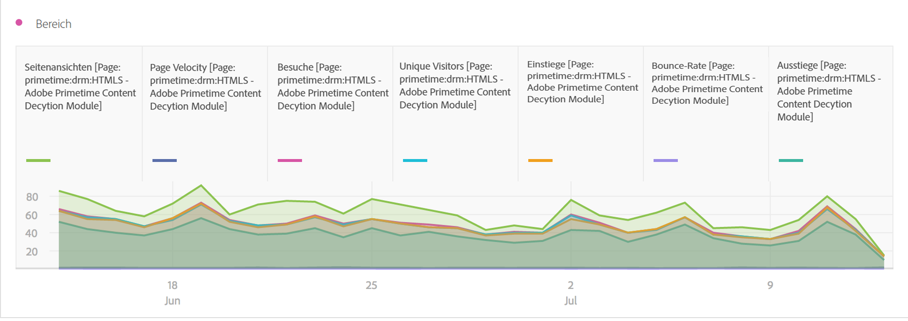
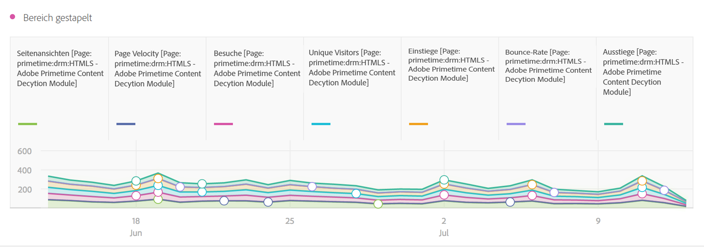

# Bereich (gestapelt)

>[!BEGINSHADEBOX]

_In diesem Artikel werden die Visualisierungen „Bereich“ und „Bereiche gestapelt“ in_  _**Adobe Analytics** beschrieben._ _Unter [Bereich und Bereiche gestapelt](https://experienceleague.adobe.com/de/docs/analytics-platform/using/cja-workspace/visualizations/area) finden Sie die Version dieses Artikels für_  _**Customer Journey Analytics**._

>[!ENDSHADEBOX]

Die Bereichsvisualisierung bietet die Optionen „Standardmäßig“ und „Gestapelt“.

## Bereich {#area}

<!-- markdownlint-disable MD034 -->

>[!CONTEXTUALHELP]
>id="workspace_area_button"
>title="Flächendiagramm"
>abstract="Erstellen Sie eine Flächendiagrammvisualisierung, um die Schnittmenge mehrerer Metriken darzustellen."

<!-- markdownlint-enable MD034 -->

Die  **[!UICONTROL Bereichsvisualisierung]** sieht aus wie ein Liniendiagramm, aber mit einem farbigen Bereich unterhalb der Linie. Fügen Sie ein Flächendiagramm hinzu, wenn Sie mehrere Metriken darstellen und den Bereich visualisieren möchten, der durch die Schnittmenge von zwei oder mehr Metriken gebildet wird.

## Bereiche gestapelt {#area-stacked}

<!-- markdownlint-disable MD034 -->

>[!CONTEXTUALHELP]
>id="workspace_areastacked_button"
>title="Bereiche gestapelt"
>abstract="Erstellen Sie eine Flächendiagramm-Visualisierung, um die Stapelung mehrerer Metriken darzustellen."

<!-- markdownlint-enable MD034 -->

Die Visualisierung  **[!UICONTROL Bereiche gestapelt]** entspricht einem Flächendiagramm, aber hier beginnt jede Serie über der vorherigen Serie.

Verwenden Sie die Option **[!UICONTROL 100 % gestapelt]** in den  **[!UICONTROL Einstellungen]**, um das Diagramm in eine 100 % gestapelte Visualisierung umzuwandeln.

>[!MORELIKETHIS]
>
>[Hinzufügen einer Visualisierung zu einem Bedienfeld](/help/analyze/analysis-workspace/visualizations/freeform-analysis-visualizations.md#add-visualizations-to-a-panel)
>[Visualisierungseinstellungen](/help/analyze/analysis-workspace/visualizations/freeform-analysis-visualizations.md#settings)
>[Kontextmenü der Visualisierung](/help/analyze/analysis-workspace/visualizations/freeform-analysis-visualizations.md#context-menu)
>
