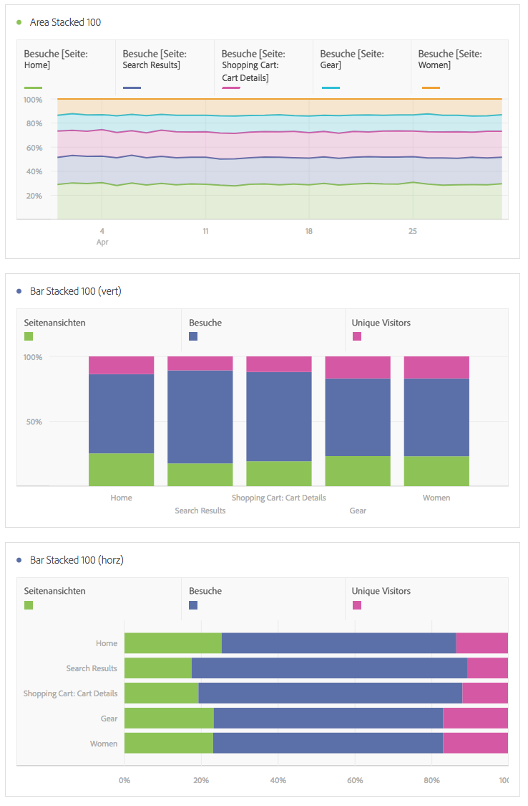

# Bereich und Bereich gestapelt

>[!BEGINSHADEBOX]

*In diesem Artikel werden die Visualisierungen „Bereich“ und „Bereich gestapelt“ in **Adobe Analytics**. Siehe [Bereich und Bereich gestapelt](https://experienceleague.adobe.com/en/docs/analytics-platform/using/cja-workspace/visualizations/area) für die **Customer Journey Analytics**-Version dieses Artikels.*

>[!ENDSHADEBOX]

Die Bereichsvisualisierung verfügt über eine standardmäßige und gestapelte Option.

## Bereich {#area}

<!-- markdownlint-disable MD034 -->

>[!CONTEXTUALHELP]
>id="workspace_area_button"
>title="Flächendiagramm"
>abstract="Erstellen Sie eine Flächendiagrammvisualisierung, um die Schnittmenge mehrerer Metriken darzustellen."

<!-- markdownlint-enable MD034 -->

Diese Visualisierung entspricht einem Kantengraph, bei dem der Bereich unter der Linie farbig dargestellt ist. Verwenden Sie ein Flächendiagramm, wenn Sie mehrere Metriken darstellen und den Bereich visualisieren möchten, der durch die Schnittmenge von zwei oder mehr Metriken gebildet wird.

## Bereich gestapelt {#area-stacked}

<!-- markdownlint-disable MD034 -->

>[!CONTEXTUALHELP]
>id="workspace_areastacked_button"
>title="Bereich gestapelt"
>abstract="Erstellen Sie eine Flächendiagramm-Visualisierung, um die Stapelung mehrerer Metriken darzustellen."

<!-- markdownlint-enable MD034 -->

Diese Visualisierung entspricht einem Flächendiagramm, aber hier beginnt jede Serie über der vorherigen Serie.

Mit der neuen Einstellung für gestapelte Bereichsdiagramme erhalten Sie eine zu „100 % gestapelte“ Visualisierung.

Im Folgenden finden Sie ein Video zu „100 % gestapelte Visualisierungen“:

>[!VIDEO](https://video.tv.adobe.com/v/23131/?quality=12)
