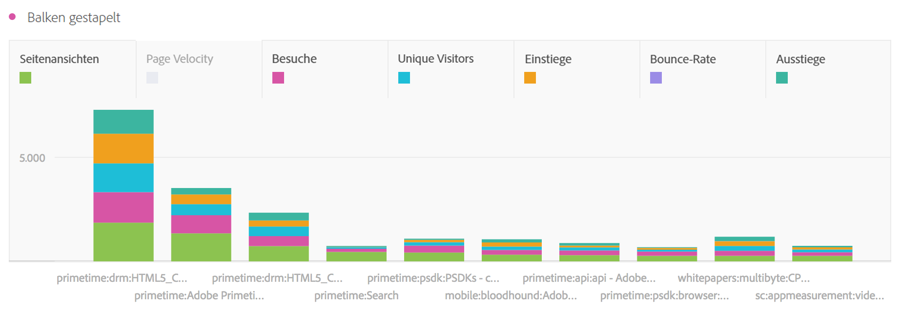

# Balken (gestapelt)

>[!BEGINSHADEBOX]

_In diesem Artikel werden die Visualisierungen „Balken“ und „Balken gestapelt“ in_  _&#x200B;**Adobe Analytics** beschrieben._ _Unter [Balken und Balken gestapelt](https://experienceleague.adobe.com/de/docs/analytics-platform/using/cja-workspace/visualizations/bar) finden Sie die Version dieses Artikels für_  _&#x200B;**Customer Journey Analytics**._

>[!ENDSHADEBOX]

Die Balkenvisualisierung bietet die Optionen „Standardmäßig“ und „Gestapelt“.

## Balken {#bar}

<!-- markdownlint-disable MD034 -->

>[!CONTEXTUALHELP]
>id="workspace_bar_button"
>title="Balken"
>abstract="Erstellen Sie eine Balkenvisualisierung, um verschiedene Werte aus einer oder mehreren Metriken darzustellen."

<!-- markdownlint-enable MD034 -->

Die  Visualisierung **[!UICONTROL Balken]** zeigt vertikale Balken, die verschiedene Werte aus einer oder mehreren Metriken darstellen.

In den Visualisierungseinstellungen können Sie über ein Dropdown-Menü für die Granularität eine Trend-Visualisierung (z. B. Linie, Balken) von täglich über wöchentlich zu monatlich usw. ändern.

## Balken gestapelt {#bar-stacked}

<!-- markdownlint-disable MD034 -->

>[!CONTEXTUALHELP]
>id="workspace_barstacked_button"
>title="Balken gestapelt"
>abstract="Erstellen Sie eine Balkenvisualisierung, um verschiedene Werte aus einer oder mehreren gestapelten Metriken darzustellen."

<!-- markdownlint-enable MD034 -->

Die Visualisierung  **[!UICONTROL Balken gestapelt]** entspricht einem Balkendiagramm, aber die Serienbalken sind hier übereinander gestapelt.

Verwenden Sie die Option **[!UICONTROL 100 % gestapelt]** in den  **[!UICONTROL Einstellungen]**, um das Diagramm in eine zu 100 % gestapelte Visualisierung umzuwandeln.

>[!MORELIKETHIS]
>
>[Hinzufügen einer Visualisierung zu einem Panel](/help/analyze/analysis-workspace/visualizations/freeform-analysis-visualizations.md#add-visualizations-to-a-panel)
>&#x200B;>[Visualisierungseinstellungen](/help/analyze/analysis-workspace/visualizations/freeform-analysis-visualizations.md#settings)
>&#x200B;>[Kontextmenü der Visualisierung](/help/analyze/analysis-workspace/visualizations/freeform-analysis-visualizations.md#context-menu)
>