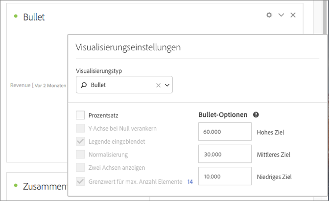

# Lineardiagramm {#bullet-graph}

<!-- markdownlint-disable MD034 -->

>[!CONTEXTUALHELP]
>id="workspace_bullet_goalvalue"
>title="Zielwert"
>abstract="**[!UICONTROL Hohes Ziel]** entspricht dem angestrebten Hauptziel. Mit **[!UICONTROL Niedriges Ziel]** und **[!UICONTROL Mittleres Ziel]** werden Bereiche unterhalb des Zielwerts [!UICONTROL Hohes Ziel] erstellt. Hinweis: Wenn die Option **[!UICONTROL Prozentsatz]** aktiviert ist, geben Sie Ziele als Ganzzahlen ein, z. B. `20`, wenn Ihr Ziel zwanzig Prozent ist."

<!-- markdownlint-enable MD034 -->

<!-- markdownlint-disable MD034 -->

>[!CONTEXTUALHELP]
>id="workspace_bullet_button"
>title="Horizontales Säulendiagramm"
>abstract="Erstellen Sie eine Visualisierung als horizontales Säulendiagramm, um anzuzeigen, wie eine Metrik gegenüber Leistungsbereichen (Zielen) abschneidet."

<!-- markdownlint-enable MD034 -->

>[!BEGINSHADEBOX]

*In diesem Artikel wird die Visualisierung mit Aufzählungszeichen in **Adobe Analytics**. Siehe [Aufzählungszeichen](https://experienceleague.adobe.com/en/docs/analytics-platform/using/cja-workspace/visualizations/bullet-graph) für die **Customer Journey Analytics**-Version dieses Artikels.*

>[!ENDSHADEBOX]

Schauen wir uns einmal an, wie ein Wert, der Sie interessiert, im Vergleich zu anderen Leistungsbereichen (Zielen) liegt oder ausfällt.

Das Lineardiagramm enthält einen einzigen primären Messwert (z. B. aktueller Umsatz im Jahr) und ermöglicht Ihnen die Eingabe qualitativer Bereiche und Leistungsbereiche (z. B. im Vergleich zu einem Zielumsatz). Sie können zwischen „Hoch“, „Mittel“ und „Niedrig“ wählen. In den [!UICONTROL Visualisierungseinstellungen] können Sie Zielbereiche festlegen.

Im Folgenden finden Sie ein Video zur Visualisierung von Bullet-Diagrammen:

>[!VIDEO](https://video.tv.adobe.com/v/23989/?quality=12)
