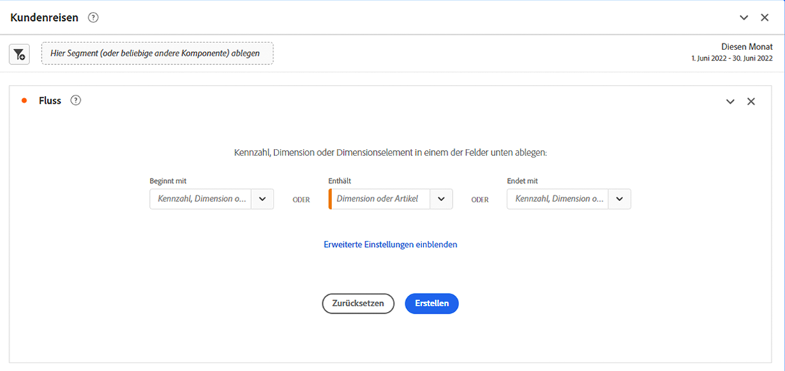
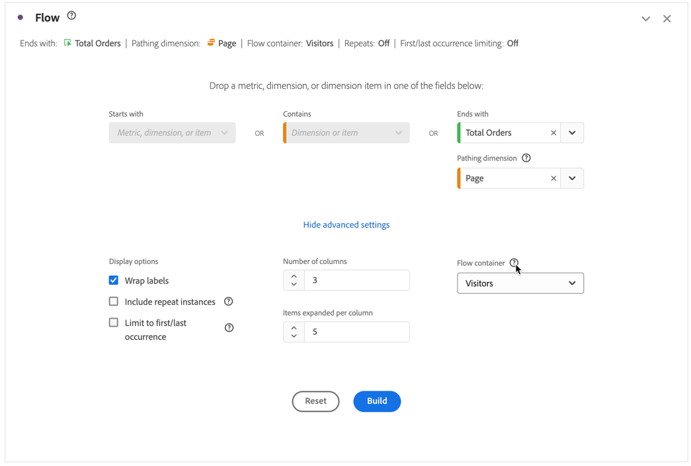
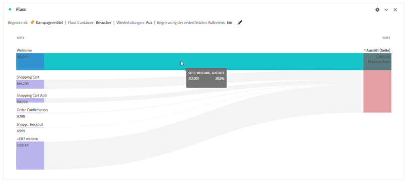
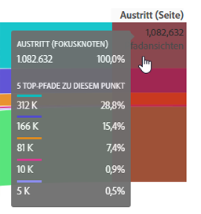
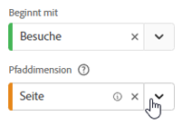
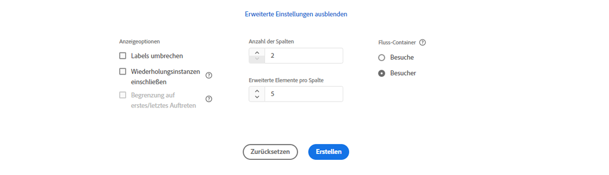

# Konfigurieren einer Flussvisualisierung

Flussvisualisierungen helfen Ihnen, die Journey zu verstehen, die von einem bestimmten Konversionsereignis auf Ihrer Website oder in Ihrer Mobile App ausgeht oder dazu führt. Die Flussvisualisierung folgt einem Pfad durch Ihre Dimensionen (und Dimensionselemente) oder Metriken.

Mit Flussvisualisierungen können Sie den Anfang oder das Ende des Pfads konfigurieren, an dem Sie interessiert sind, oder alle Pfade analysieren, die durch eine Dimension oder ein Dimensionselement führen.

## Verwenden

1. Fügen Sie eine Visualisierung  **[!UICONTROL Flow]** hinzu. Siehe [Hinzufügen einer Visualisierung zu einem Bedienfeld](../freeform-analysis-visualizations.md#add-visualizations-to-a-panel).

1. Sie können Ihre Flussvisualisierung mithilfe einer der folgenden Optionen verankern:

   * [!UICONTROL **Beginnt mit**] (Metriken, Dimensionen oder Elemente) oder
   * [!UICONTROL **Enthält**] (Dimensionen oder Elemente) oder
   * [!UICONTROL **Endet mit**] (Metriken, Dimensionen oder Elemente)

   Jede dieser Kategorien wird auf dem Bildschirm als *Ablagebereich“*. Sie können den Ablagebereich auf drei Arten füllen:

   * Verwenden Sie das Dropdown-Menü, um Metriken oder Dimensionen auszuwählen.
   * Ziehen Sie Dimensionen oder Metriken aus dem linken Bedienfeld.
   * Beginnen Sie mit der Eingabe des Namens einer Dimension oder Metrik und wählen Sie sie dann aus, wenn sie in der Dropdown-Liste angezeigt wird.

   >[!IMPORTANT]
   >
   >Berechnete Metriken können nicht in den Feldern **[!UICONTROL Beginnt mit]** oder **[!UICONTROL Endet mit]** verwendet werden.

1. Wenn Sie eine Metrik auswählen, müssen Sie auch eine &quot;[!UICONTROL **&quot;-Dimension angeben**] die als Pfad verwendet werden soll, der zu der ausgewählten Komponente führt oder von ihr stammt, wie hier dargestellt. Die Standardeinstellung ist [!UICONTROL **Seite**].

   

1. (Optional) Wählen Sie **[!UICONTROL Erweiterte Einstellungen anzeigen]** aus, um eine der folgenden Optionen zu konfigurieren:

   | Einstellung | Beschreibung |
   | --- | --- |
   | **[!UICONTROL Beschriftungen umbrechen]** | Die Bezeichnungen der Flusselemente werden üblicherweise aus Platzgründen auf dem Bildschirm abgeschnitten. Aktivieren Sie dieses Kontrollkästchen, um die gesamte Bezeichnung anzuzeigen.  Standard = deaktiviert. |
   | **[!UICONTROL Wiederholungsinstanzen einschließen]** | Flussvisualisierungen basieren auf Instanzen einer Dimension. Mit dieser Einstellung haben Sie die Möglichkeit, wiederholte Instanzen, z. B. das Neuladen von Seiten, ein- oder auszuschließen. Wiederholungen können jedoch nicht aus Flussvisualisierungen entfernt werden, die Dimensionen mit mehreren Werten enthalten, wie listVars, listProps, s.product, Merchandising-eVars usw. 
Standardmäßig ist diese Option deaktiviert.
 |
   | **[!UICONTROL Begrenzung auf erstes/letztes Auftreten]** | Begrenzen Sie Pfade auf Pfade, die mit dem ersten oder letzten Vorkommen einer Dimension, eines Elements oder einer Metrik beginnen oder enden. Eine [ Erklärung finden Sie unter „Begrenzung auf erstes ](#example-scenario-for-limit-to-firstlast-occurrence) letztes Auftreten“. |
   | **[!UICONTROL Anzahl der Spalten]** | Die Anzahl der Spalten, die Ihr Flussdiagramm enthalten soll. Sie können maximal 5 Spalten angeben. |
   | **[!UICONTROL Erweiterte Elemente pro Spalte]** | Die Anzahl der Elemente, die jede Spalte enthalten soll. Sie können pro Spalte maximal 10 erweiterte Elemente angeben. |
   | **[!UICONTROL Fluss-Container]** | Sie können zwischen **[!UICONTROL Sitzungen]** und **[!UICONTROL Person) wechseln]** um die Pfade zu analysieren. Mit diesen Einstellungen können Sie die Interaktion einer Person auf Personenebene (sitzungsübergreifend) verstehen oder die Analyse auf eine einzelne Sitzung beschränken. |

   >[!IMPORTANT]
   >
   >Die Kombination von **[!UICONTROL Anzahl der Spalten]** und **[!UICONTROL Erweiterte Elemente pro Spalte]** bestimmt die Anzahl der zugrunde liegenden Anfragen, die zum Erstellen der Flussvisualisierung erforderlich sind. Je höher diese Zahlen sind, desto länger dauert das Rendern einer Visualisierung.

1. Wählen Sie **[!UICONTROL Erstellen]** aus.

### Beispiel

Angenommen, Sie möchten den Pfad nachverfolgen, den Benutzer von und zu den beliebtesten Seiten Ihrer Site gewählt haben.

1. Erstellen Sie eine Flussvisualisierung wie oben beschrieben.
1. Ziehen Sie die Dimension [!UICONTROL **Seite**] in das Feld **[!UICONTROL Enthält]** und wählen Sie [!UICONTROL **Erstellen**] aus.
1. Die Flussvisualisierung erstellt im Mittelpunkt der Visualisierung eine Seite, die im Fokusknoten am häufigsten angezeigt wird. Außerdem werden die obersten Seiten, die zu dieser Seite führen (links neben dem Fokusknoten), sowie die obersten Seiten, die von dieser Seite führen (rechts neben dem Fokusknoten) angezeigt.
1. Analysieren Sie die Daten im Fluss, wie unter [Konfigurieren](#configure) beschrieben.

## Konfigurieren

Eine Zusammenfassung der Flusskonfiguration wird oben in den Visualisierungen angezeigt. Die Pfade in dem Diagramm sind proportional. Pfade mit mehr Aktivität werden dicker dargestellt.

Um die Daten weiter zu untersuchen, haben Sie mehrere Möglichkeiten:

* Das Flussdiagramm ist interaktiv. Wenn Sie den Mauszeiger über das Diagramm halten, werden jeweils andere Details angezeigt.

* Wenn Sie einen Knoten in dem Diagramm auswählen, werden die zugehörigen Details zu diesem Knoten angezeigt. Wählen Sie den Knoten erneut aus, um ihn zu reduzieren.

  

* Sie können eine Spalte so filtern, dass nur bestimmte Ergebnisse angezeigt werden, z. B. das Ein- und Ausschließen, die Angabe von Kriterien usw.

* Wählen Sie  auf der linken oder rechten Seite aus, um eine Spalte zu erweitern.

* Um die Ausgabe anzupassen, verwenden Sie die Optionen [Kontextmenü](#context-menu) .

* Um den Fluss zu bearbeiten oder ihn mit verschiedenen Optionen neu zu erstellen, wählen  neben der Konfigurationsübersicht aus.

## Filter

Über jeder Spalte wird ein Filter  angezeigt, wenn Sie den Mauszeiger darüber bewegen. Durch Auswahl des Filters rufen Sie dasselbe Filterdialogfeld ab, das in der Freiformtabelle vorhanden ist. Siehe [Filtern und Sortieren](freeform-table/../../freeform-table/filter-and-sort.md).

* Verwenden Sie **[!UICONTROL Erweitert anzeigen]** um erweiterte Einstellungen so zu konfigurieren, dass bestimmte Kriterien mit einer Liste von Benutzern ein- oder ausgeschlossen werden. Weitere Informationen finden [ unter ](../freeform-table/filter-and-sort.md) und Sortieren .
* Nachdem Sie eine Spalte gefiltert haben, spiegelt diese Spalte die Filterung wider. Ein blauer  bedeutet, dass die Spalte gefiltert wird.  Der Filter reduziert entweder die Spalte, sodass nur das im Filter zulässige Element angezeigt wird. Oder es entfernt alle Elemente mit Ausnahme des Elements, das Sie in den Filter aufnehmen möchten.
* Alle nachgelagerten und vorgelagerten Spalten bleiben bestehen, solange Daten in die verbleibenden Knoten fließen.
* Um einen Filter zu entfernen, wählen Sie  aus, um das Filtermenü zu öffnen. Entfernen Sie alle angewendeten Filter und wählen Sie **[!UICONTROL Speichern]** aus. Der Fluss sollte zum vorherigen, ungefilterten Status zurückkehren.

## Kontextmenü

Verwenden Sie ein Kontextmenü auf einem beliebigen Knoten in der Flussvisualisierung mit den folgenden Optionen:

| Option | Beschreibung |
|--- |--- |
| **[!UICONTROL Auf diesen Knoten fokussieren]** | Wechselt den Fokus auf den ausgewählten Knoten. Der Fokusknoten wird in der Mitte des Flussdiagramms angezeigt. |
| **[!UICONTROL Neu starten]** | Kehren Sie zum Freiformdiagramm-Builder zurück, in dem Sie ein neues Flussdiagramm erstellen können. |
| **[!UICONTROL Erstellen Sie einen Filter für diesen Pfad]** | Erstellen Sie einen Filter. Diese Auswahl führt Sie zum Filter-Builder, in dem Sie den neuen Filter konfigurieren können. |
| **[!UICONTROL Aufschlüsselung]** | Hiermit können Sie den Knoten nach verfügbaren Dimensionen, Metriken oder Zeiten aufschlüsseln. |
| **[!UICONTROL Filterspalte]** | Es werden dieselben Filteroptionen angezeigt, die auch in der Freiformtabelle verfügbar sind. Weitere Informationen zu den verfügbaren Optionen finden Sie im Abschnitt „Anwenden eines einfachen oder erweiterten Filters auf eine Tabelle“ in &quot;[ und Sortieren von Tabellen](/help/analyze/analysis-workspace/visualizations/freeform-table/filter-and-sort.md). |
| **[!UICONTROL Element ausschließen]** oder **[!UICONTROL Ausgeschlossene Elemente wiederherstellen]** | Entfernt einen bestimmten Knoten aus der Spalte und erstellt daraus automatisch einen Filter oben in der Spalte. Um das ausgeschlossene Element wiederherzustellen, wählen Sie im Kontextmenü die Option **[!UICONTROL Ausgeschlossenes Element wiederherstellen]** aus. Sie können den Filter auch oben in der Spalte öffnen und die Box mit dem Element entfernen, das Sie gerade ausgeschlossen haben. |
| **[!UICONTROL Trend]** | Mit dieser Option erstellen Sie ein Trenddiagramm für den Knoten. |
| **[!UICONTROL Nächste Spalte anzeigen]** / **[!UICONTROL Vorherige Spalte anzeigen]** | Zeigt die nächste (rechte) oder vorherige (linke) Spalte der Visualisierung an. |
| **[!UICONTROL Spalte ausblenden]**n | Blendet die ausgewählte Spalte aus der Visualisierung aus. |
| **[!UICONTROL Gesamte Spalte erweitern]** | Hiermit erweitern Sie eine Spalte so, dass alle Knoten angezeigt werden. In der Standardeinstellung werden nur die obersten fünf Knoten angezeigt. |
| **[!UICONTROL Zielgruppe aus Auswahl erstellen]** | Erstellt eine Zielgruppe basierend auf der ausgewählten Spalte. |
| **[!UICONTROL Gesamte Spalte reduzieren]** | Diese Option blendet alle Knoten in einer Spalte aus. |

## Begrenzung auf erstes/letztes Auftreten

Beachten Sie bei Verwendung dieser Option Folgendes:

* **[!UICONTROL Auf das erste/letzte Vorkommen beschränken]** zählt nur das erste/letzte Vorkommen in der Reihe. Alle anderen Vorkommen der Kriterien **[!UICONTROL Beginnt mit]** oder **[!UICONTROL Endet mit]** werden verworfen.
* Bei Verwendung mit einem Fluss **[!UICONTROL Beginnt mit]** wird nur das erste Vorkommen einbezogen, das den Startkriterien entspricht.
Im folgenden Beispiel sind **alle** Vorkommen von *Zum Warenkorb hinzufügen* und *Hauptproduktkategorie* in jedem Schritt des Flusses enthalten.
  

  Im folgenden Beispiel sind nur die **ersten** Vorkommen von *Zum Warenkorb hinzufügen* und *Hauptproduktkategorie* in jedem Schritt des Flusses enthalten.
  
* Bei Verwendung mit einem Fluss **[!UICONTROL Endet mit]** wird nur das letzte Vorkommen einbezogen, das den Endkriterien entspricht.
Im folgenden Beispiel sind **alle** Vorkommen von *Produkthauptkategorie* und *Zum Warenkorb hinzufügen* in jedem Schritt des Flusses enthalten.
  

  Im folgenden Beispiel sind nur die **letzten** Vorkommen von *Produkthauptkategorie* und *Zum Warenkorb hinzufügen* in jedem Schritt des Flusses enthalten.
  
* Die verwendete Reihe unterscheidet sich je nach Container. Bei Verwendung des **[!UICONTROL Person]**-Containers ist die Ereignisreihe die Sitzung. Bei Verwendung des **[!UICONTROL Sitzungs]**-Containers sind die Ereignisreihen alle Ereignisse für eine bestimmte Benutzerin oder einen bestimmten Benutzer im bereitgestellten Datumsbereich.
* Die Option **[!UICONTROL Begrenzung auf erstes/letztes Auftreten]** kann in den erweiterten Einstellungen konfiguriert werden, wenn eine Metrik oder ein Element der Dimension in den Feldern **[!UICONTROL Beginnt mit]** oder **[!UICONTROL Endet mit]** verwendet wird.

>[!MORELIKETHIS]
>
>[Hinzufügen einer Visualisierung zu einem Bedienfeld](/help/analyze/analysis-workspace/visualizations/freeform-analysis-visualizations.md#add-visualizations-to-a-panel)
>[Visualisierungseinstellungen](/help/analyze/analysis-workspace/visualizations/freeform-analysis-visualizations.md#settings)
>[Kontextmenü der Visualisierung](/help/analyze/analysis-workspace/visualizations/freeform-analysis-visualizations.md#context-menu)
>

<!--
## Create a flow visualization {#configure}

1. Add a blank panel to your project and click the visualizations icon in the left rail. 

   Or
   
   Add a visualization in any of the ways described in the "Add visualizations to a panel" section in [Visualizations overview](/help/analyze/analysis-workspace/visualizations/freeform-analysis-visualizations.md).

1. Anchor your Flow visualization using one of the following options:

   * [!UICONTROL **Starts with**] (metrics, dimensions, or items), or
   * [!UICONTROL **Contains**] (dimensions, or items), or
   * [!UICONTROL **Ends with**] (metrics, dimensions, or items)

   Each of these categories is shown onscreen as a "drop zone." You can populate the drop zone in 3 ways:

   * Use the drop-down menu to select metrics or dimensions.
   * Drag dimensions or metrics from the left rail.
   * Begin typing the name of a dimension or metric, then select it when it appears in the drop-down list.

   >[!IMPORTANT]
   >
   >Calculated metrics cannot be used in the  **[!UICONTROL Starts with]** or **[!UICONTROL Ends with]** fields.

1. If you choose a metric, you also need to provide a [!UICONTROL **Pathing Dimension**] to use as your path leading to or coming from your selected component, as shown here. The default is [!UICONTROL **Page**].

   

1. (Optional) Select **[!UICONTROL Show advanced settings]** to configure any of the following options:

   

   | Setting | Description |
   | --- | --- |
   | **[!UICONTROL Wrap labels]** | Normally, the labels on the Flow elements are truncated to save screen real estate, but you can make the entire label visible by checking this box.  Default = unchecked. |
   | **[!UICONTROL Include repeat instances]** | Flow visualizations are based on instances of a dimension. This setting gives you the option to include or exclude repeated instances, e.g. Page reloads. However, repeats cannot be removed from Flow visualizations that include multi-valued dimensions, such as listVars, listProps, s.product, merchandising eVars, etc. 
This option is disabled by default.
 |
   | **[!UICONTROL Limit to first/last occurrence]** | Limit paths to those that start/end with the first/last occurrence of a dimension/item/metric. See the section below, [Example scenario for 'limit to first/last occurrence'](#example-scenario-for-limit-to-firstlast-occurrence), for a more detailed explanation. |
   | **[!UICONTROL Number of columns]** | The number of columns you want in your Flow diagram. You can specify a maximum of 5 columns. |
   | **[!UICONTROL Items expanded per column]** | The number of items you want in each column. You can specify a maximum of 10 items expanded per column.  |
   | **[!UICONTROL Flow container]** | <ul><li>Visit</li><li>Visitor</li></ul> Lets you switch between Visit and Visitor to analyze visitor pathing. These settings help you understand visitor engagement at the visitor level (across visits), or constrain the analysis to a single visit.|

   >[!IMPORTANT]
   >
   >The combination of **[!UICONTROL Number of columns]** and **[!UICONTROL Items expanded per column]** determine the number of underlying requests required to create the flow visualization. The higher those numbers, the longer it takes to render a visualization.

1. Select **[!UICONTROL Build]**.

>[!INFO]
>
>**Example:** Suppose that you want to trace the path that users took both to and from the most popular pages on your site.
>
>To do this, you would
> 
>1. Begin creating a flow visualization as described above.
>1. Drag the [!UICONTROL **Page**] dimension into the **[!UICONTROL Contains]** field, then select [!UICONTROL **Build**].
>1. The Flow visualization builds with the most-viewed page visible in the focus node in the center of the visualization. You also see the top pages leading into that page (to the left of the focus node) as well as the top pages leading out of that page (to the right of the focus node).
>1. Analyze data in the flow, as described in [View and change the Flow output](#view-and-change-the-flow-output).

## View and change the Flow output {#output}

A summary of the Flow configuration appears at the top of the diagram. The thickness of a path in the diagram is proportional to its activity, with paths with more activity appearing thicker than those with less activity.

To drill down further into the data, you have several options:

* The flow diagram is interactive. Mouse over the diagram to change the details that are shown.

* When you select on a node in the diagram, the details for that node appear. Select on the node again to collapse it.

   

* You can filter a column to display only certain results, such as including and excluding, specifying criteria, and so forth.

* Select the plus sign (+) on the left to expand a column.

* Use the right-click options explained below to further customize the output.

* Select the pencil icon next to the configuration summary to further edit the flow or rebuild it with different options.

* You can also export and further analyze your Flow diagram as part of a project's .CSV file by going to **[!UICONTROL Project]** > **[!UICONTROL Download CSV]**.

## Filtering

Above each column, a filter appears when you hover over it. By selecting the filter, you get the same filter dialog that exists in the Freeform table today. This filter works the same as it does in the Freeform table.

* Use advanced settings to include or exclude certain criteria with our list of operators.
* Once you have filtered an item from the list, that specific column will reflect the filtering. (The filter either reduces it to only show the item allowed in the filter, or it removes all items except for the one item you want in the filter.
* All downstream and upstream columns should persist, as long as there is data flowing into the remaining nodes.
* Once applied, the filter icon appears in blue above the column it is filtering.
* To remove a filter, select the filter icon to open the filter menu. Remove any filters applied and then select **[!UICONTROL Save]**. The flow should return to its previous, unfiltered state.

## Right-click options {#right-click}

| Option | Description |
|--- |--- |
| [!UICONTROL Start over] | Returns you to the Freeform diagram builder, where you can build a new Flow diagram. |
| [!UICONTROL Create segment for this path] | Create a segment. This takes you into the Segment Builder, where you can configure the new segment. |
| [!UICONTROL Breakdown] | Break the node down by available Dimensions, Metrics, or Time. |
| [!UICONTROL Trend] | Create a trended diagram for the node. |
| Show next column / Show previous column | Reveals the next (right) or previous (left) column of the visualization. |
| Hide column | Hides the selected column from the visualization. | 
| [!UICONTROL Expand entire column] | Expand a column to show all nodes. By default, only the top five nodes display. |

## Example scenario for 'limit to first/last occurrence'

When using this option, keep in mind that:

* **[!UICONTROL Limit to first/last occurrence]** counts only the first/last occurrence in the series. All other occurrences of the **[!UICONTROL Starts with]** or **[!UICONTROL Ends with]** criteria are discarded.
* If used with a **[!UICONTROL Starts with]** flow, only the first occurrence that matches the start criteria is included.
* If used with an **[!UICONTROL Ends with]** flow, only the last occurrence that matches the end criteria will be included.
* The series used differs based on the container. If using the **[!UICONTROL Visit]** container, the series of hits will be the session. If using the **[!UICONTROL Visitor]** container, the series of hits will be all the hits for a given user in the provided date range.
* The **[!UICONTROL Limit to first/last occurrence]** option can be configured in the advanced settings when using a Metric or Dimension Item in the "Starts with" or "Ends with" fields.

Example series of hits:

Home > Products > Add to cart > Products > Add to Cart > Billing > Order Confirmation

### Consider a flow analysis using the following settings:

* Start with[!UICONTROL  Add to cart] (Dimension Item)
* [!UICONTROL Page] pathing dimension
* [!UICONTROL Visit] container

If **[!UICONTROL Limit to first/last occurrence]** is *disabled*, then this single series of hits counts 2 occurrences of "Add to Cart".
Expected Flow Output:
"Add to Cart" (2) —> "Products" (1)
                  -> "Billing" (1)

However, if **[!UICONTROL Limit to first/last occurrence]** is *enabled*, only the first occurrence of "Add to cart" is included in the analysis.
Expected Flow Output:
"Add to Cart" (1) —> "Products" (1)

### Consider the same series of hits but using the following settings:

* Ends with [!UICONTROL Add to cart] (Dimension Item)
* [!UICONTROL Page] pathing dimension
* [!UICONTROL Visit] container

If **[!UICONTROL Limit to first/last occurrence]** is *disabled*, then this single series of hits would count 2 occurrences of "Add to Cart".
Expected Flow Output:
"Products" (2) <— "Add to cart" (2)

However, if **[!UICONTROL Limit to first/last occurrence]** is *enabled*, only the last occurrence of [!UICONTROL Add to cart] would be included in the analysis.
Expected Flow Output:
"Products" (1) <— "Add to cart" (1)

-->