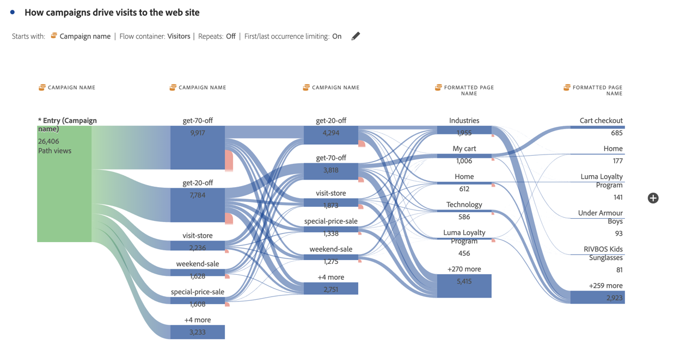

# Interdimensionale Flüsse

Mithilfe eines interdimensionalen Flusses können Sie Benutzerpfade über verschiedene Dimensionen hinweg untersuchen.

>[!BEGINSHADEBOX]

Siehe  [Interdimensionale ](https://video.tv.adobe.com/v/24041?quality=12&learn=on){target="_blank"}) für ein Demovideo.

>[!ENDSHADEBOX]

In diesem Artikel wird gezeigt, wie dieser Fluss für zwei Anwendungsfälle verwendet werden kann: Interaktionen mit Mobile Apps und Ereignisse und wie Kampagnen Web-Besuche fördern.

## Mobile-App-Interaktionen und -Ereignisse

Die Dimension [!UICONTROL Bildschirmname] wird in diesem Beispielfluss verwendet, um zu sehen, wie Benutzer die verschiedenen Bildschirme (Szenen) in der App verwenden. Der obere Bildschirm ist **[!UICONTROL luma: content: ios: en: home]**, was die Startseite der App ist:

Um die Interaktion zwischen Bildschirmen und Ereignistypen (z. B. zum Warenkorb hinzufügen, Käufe und andere) in dieser App zu untersuchen, ziehen Sie die Dimension **[!UICONTROL Ereignistypen]** per Drag-and-Drop:

* Ersetzen Sie diese Dimension zusätzlich zu jedem verfügbaren Schritt im Fluss:

  

* Fügen Sie außerhalb der aktuellen Flussvisualisierung die Dimension hinzu:

  

Die folgende Flussvisualisierung zeigt das Ergebnis des Hinzufügens der Dimension **[!UICONTROL Ereignistypen]** . Die Visualisierung bietet Einblicke, wie sich Benutzer von Mobile Apps durch verschiedene Bildschirme in der App bewegen, bevor sie Produkte zu einem Warenkorb hinzufügen, die App schließen, ein Angebot erhalten und vieles mehr.

## Wie Kampagnen zu Web-Besuchen führen

Sie möchten analysieren, welche Kampagnen zu Besuchen auf der Website führen. Sie erstellen eine Flussvisualisierung mit dem **[!UICONTROL Kampagnennamen]** als Dimension

Sie ersetzen die letzte Dimension **[!UICONTROL Kampagnenname]** durch die Dimension **[!UICONTROL Formatierter Seitenname]** und fügen am Ende **[!UICONTROL Flussvisualisierung eine weitere Dimension Formatierter Seitenname]** hinzu.

Sie können den Mauszeiger über einen der Flüsse bewegen, um weitere Details anzuzeigen. Beispielsweise welche Kampagnen zu einem Warenkorb-Checkout geführt haben.

