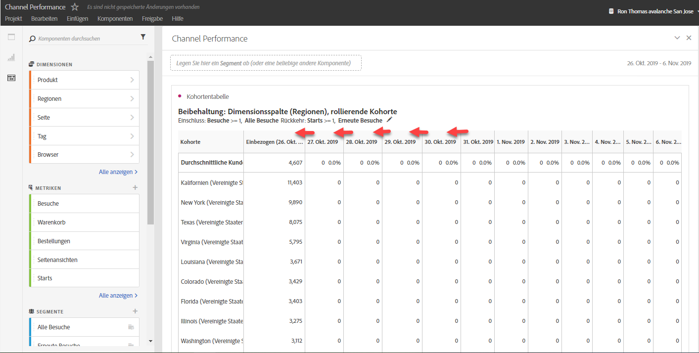
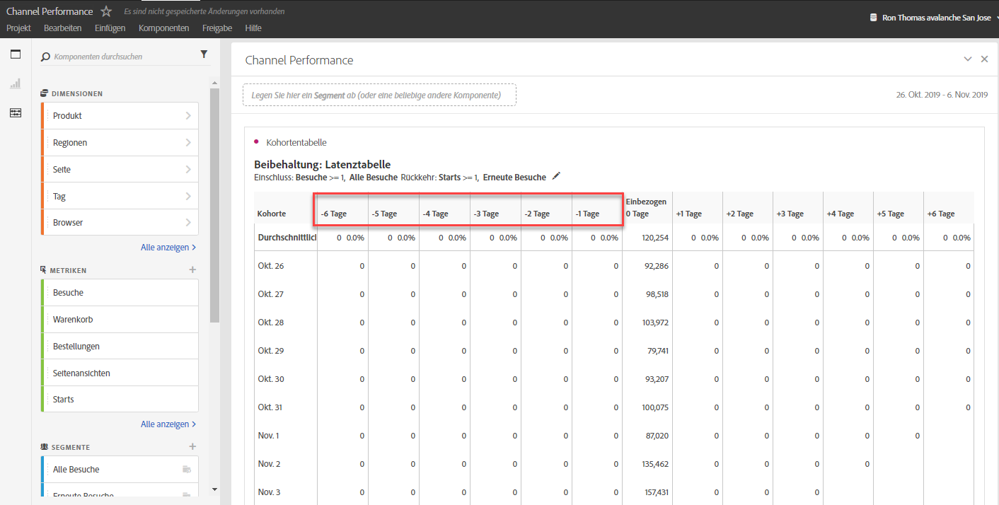
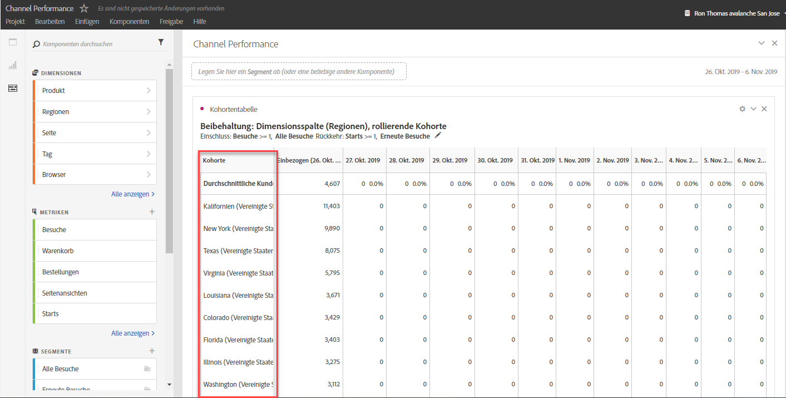

# Überblick über Kohortentabellen {#cohort-table-overview}

<!-- markdownlint-disable MD034 -->

>[!CONTEXTUALHELP]
>id="workspace_cohorttable_button"
>title="Kohortentabelle"
>abstract="Erstellen Sie eine Kohortenvisualisierung, um Benutzende bei Abschluss eines Ereignisses zu gruppieren und die anhaltende Interaktion und Abwanderung im Zeitverlauf zu analysieren."

<!-- markdownlint-enable MD034 -->

<!-- markdownlint-disable MD034 -->

>[!CONTEXTUALHELP]
>id="workspace_cohorttable_panel"
>title="Kohortentabelle"
>abstract="Gruppieren Sie Benutzende bei Abschluss eines Ereignisses und analysieren Sie dann ihre anhaltenden Interaktionen und Abwanderungen im Zeitverlauf.  **Parameter &#x200B;** **Aufnahmekriterien**: Die Komponenten, die zur Definition der anfänglichen Besucherkohorten verwendet werden. **Rückkehrkriterien**: Die Komponenten, mit denen bestimmt wird, ob eine Besucherin bzw. ein Besucher zurückgekehrt ist."

<!-- markdownlint-enable MD034 -->

>[!BEGINSHADEBOX]

_In diesem Artikel wird die Kohortentabelle in_  _&#x200B;**Adobe Analytics** beschrieben._ _Unter [Kohortentabelle](https://experienceleague.adobe.com/de/docs/analytics-platform/using/cja-workspace/visualizations/cohort-table/cohort-analysis) finden Sie die Version dieses Artikels für_  _&#x200B;**Customer Journey Analytics**._

>[!ENDSHADEBOX]

Eine *Kohorte* ist eine Personengruppe mit gemeinsamen Merkmalen innerhalb eines vorgegebenen Zeitraums. Eine Visualisierung  **[!UICONTROL Kohortentabelle]** ist z. B. dann nützlich, wenn Sie wissen möchten, wie eine Kohorte mit einer Marke interagiert. Sie können problemlos Trend-Änderungen offenlegen und entsprechend reagieren. (Erläuterungen zur [!UICONTROL Kohortenanalyse] sind im Internet verfügbar, z. B. unter [Cohort Analysis 101](https://de.wikipedia.org/wiki/Cohort_analysis).)

Nachdem Sie einen Kohortenbericht erstellt haben, können Sie dessen Komponenten (bestimmte Dimensionen, Metriken und Filter) kuratieren und den Kohortenbericht dann für andere freigeben. Weitere Informationen finden Sie unter [Kuratieren und freigeben](/help/analyze/analysis-workspace/curate-share/curate.md).

Beispiele für die Nutzung einer [!UICONTROL Kohortentabelle]:

* Starten Sie Kampagnen, die dafür ausgelegt sind, eine erwünschte Aktion anzuregen.
* Erhöhen Sie das Marketingbudget genau zum richtigen Zeitpunkt im Kundenlebenszyklus.
* Erkennen Sie, wann eine Testphase oder ein Angebot beendet werden sollte, um den Wert zu maximieren.
* Gewinnen Sie Ideen für A/B-Tests in Bereichen wie Preisstruktur, Upgrade-Pfad usw.

[!UICONTROL Kohortentabelle] steht allen Adobe Analytics-Kunden mit Zugriffsrechten auf [!UICONTROL Analysis Workspace] zur Verfügung.

>[!BEGINSHADEBOX]

Unter  [Kohortenanalyse in Analysis Workspace](https://video.tv.adobe.com/v/23990/?quality=12&learn=on){target="_blank"} finden Sie ein Demovideo.

>[!ENDSHADEBOX]

>[!IMPORTANT]
>
>Die [!UICONTROL Kohortenanalyse] unterstützt keine nicht filterbaren Metriken (einschließlich berechneter Metriken), nicht ganzzahlige Metriken (z. B. Umsatz) oder Vorkommnisse. In der [!UICONTROL Kohortenanalyse] können nur Metriken verwendet werden, die auch in Filtern verwendet werden können. Außerdem können diese Metriken jeweils nur um 1 inkrementiert werden.

Kohortentabellen in Adobe Analytics unterstützen doppelbasierte (oder beliebige numerische) Metriken. Beispielsweise kann „Purchase.Value“ (eine Dublette) als Einschluss-/Rückgabemetrik verwendet werden. Darüber hinaus sind alle Metriken, die über den Analytics-Quell-Connector an Adobe Experience Platform übergeben werden, ebenfalls Dubletten.

## Funktionen der Kohortentabelle

In den folgenden Abschnitten werden Funktionen zur Kohortenanalyse beschrieben, die eine Feinabstimmung der Kontrolle über die Kohorten ermöglichen, die Sie erstellen.

Weitere ausführliche Informationen zum Erstellen einer Kohorte und zum Ausführen eines [!UICONTROL Kohortenanalyse-Berichts] finden Sie unter [Konfigurieren einer Kohortentabelle](/help/analyze/analysis-workspace/visualizations/cohort-table/t-cohort.md).

### Aufbewahrungstabelle

Eine [!UICONTROL Bindungskohortentabelle] gibt Personen zurück: Jede Datenzelle zeigt die Roh- und Prozentanzahl der Personen in der Kohorte, die die Aktion während dieses Zeitraums ausgeführt haben. Sie können bis zu drei Metriken und bis zu zehn Filter einschließen.

### Abwanderungstabelle

Eine [!UICONTROL Abwanderungskohortentabelle] ist die Umkehrung einer Bindungstabelle und zeigt die Personen an, die abgewandert sind oder die Rückkehrkriterien für Ihre Kohorte im Laufe der Zeit nie erfüllt haben. Sie können bis zu drei Metriken und bis zu zehn Filter einschließen.

### Rollierende Berechnung

Sie können die Kundenbindung oder -abwanderung basierend auf der vorherigen Spalte berechnen, nicht basierend auf der eingeschlossenen Spalte, was als rollierende Berechnung bezeichnet wird.

### Latenztabelle

Eine Latenztabelle misst die verstrichene Zeit vor und nach dem Aufnahmeereignis. Das Messen der Latenz ist ein hervorragendes Instrument für die Vor- und Nachanalyse. Die Spalte **[!UICONTROL Aufnahme]** befindet sich in der Mitte der Tabelle und die Zeiträume vor und nach dem Aufnahmeereignis werden auf beiden Seiten angezeigt.

### Benutzerdefinierte Dimensionskohorte

Sie können Kohorten auf Grundlage einer ausgewählten Dimension und nicht auf Grundlage zeitbasierter Kohorten (was die Standardeinstellung ist) erstellen. Verwenden Sie Dimensionen wie [!UICONTROL Ort-Geo], [!UICONTROL Marketing-Kanal], [!UICONTROL Kampagne], [!UICONTROL Produkt], [!UICONTROL Seite], [!UICONTROL Region] oder jede andere Dimension, um zu zeigen, wie sich die Bindung ändert. Basierend auf den verschiedenen Werten dieser Dimensionen.

>[!MORELIKETHIS]
>
>[Konfigurieren einer Kohortentabelle](/help/analyze/analysis-workspace/visualizations/cohort-table/t-cohort.md).
>

<!--
A *`cohort`* is a group of people sharing common characteristics over a specified period. [!UICONTROL Cohort Analysis] is useful, for example, when you want to learn how a cohort engages with a brand. You can easily spot changes in trends, then respond accordingly. (Explanations of [!UICONTROL Cohort Analysis] are available on the web, such as at [Cohort Analysis 101](https://en.wikipedia.org/wiki/Cohort_analysis).)

After creating a cohort report, you can curate its components (specific dimensions, metrics, and segments), then share the cohort report with anyone. See [Curate and Share](/help/analyze/analysis-workspace/curate-share/curate.md).

Examples of what you can do with [!UICONTROL Cohort Analysis]:

* Launch campaigns designed to spur a desired action.
* Shift marketing budget at exactly the right time in the customer lifecycle.
* Recognize when to end a trial or an offer, in order to maximize value.
* Gain ideas for A/B testing in areas such as pricing, upgrade path, and so on.

[!UICONTROL Cohort Analysis] is available for all Adobe Analytics customers with access rights to [!UICONTROL Analysis Workspace].

>[!BEGINSHADEBOX]

See  [Cohort analysis in Analysis Workspace](https://video.tv.adobe.com/v/25965?quality=12&learn=on){target="_blank"} for a demo video.

>[!ENDSHADEBOX]

>[!IMPORTANT]
>
>[!UICONTROL Cohort Analysis] does not support non-segmentable metrics (including calculated metrics), non-integer metrics (such as Revenue), or Occurrences. 
>
>Only metrics that can be used in segments can be used in [!UICONTROL Cohort Analysis], and they can only be incremented by >1 at a time. 

## Cohort Analysis capabilities

The following sections describe Cohort Analysis features that allow for fine-tuned control over the cohorts you are building.

For more detailed information about creating a cohort and running a [!UICONTROL Cohort Analysis] report, see [Configure a Cohort Analysis report](/help/analyze/analysis-workspace/visualizations/cohort-table/t-cohort.md).

### [!UICONTROL Retention] Table

A [!UICONTROL Retention] cohort report returns visitors: each data cell shows the raw number and percentage of visitors in the cohort who did the action during that time period. You can include up to 3 metrics and up to 10 segments.

>[!BEGINSHADEBOX]

See  [Calculate rolling retention](https://video.tv.adobe.com/v/25962?quality=12&learn=on){target="_blank"} for a demo video.

>[!ENDSHADEBOX]

### [!UICONTROL Churn] Table

A [!UICONTROL Churn] cohort is the inverse of a retention table and shows the visitors who fell out or never met the return criteria for your cohort over time. You can include up to 3 metrics and up to 10 segments.

>[!BEGINSHADEBOX]

See  [Churn analysis](https://video.tv.adobe.com/v/25966?quality=12&learn=on){target="_blank"} for a demo video.

>[!ENDSHADEBOX]

### [!UICONTROL Rolling Calculation]

Lets you calculate retention or churn based on the previous column, not the included column.

### [!UICONTROL Latency] Table

Measures the time that has elapsed before and after the inclusion event occurred. This is an excellent tool for pre/post analysis. The **[!UICONTROL Included]** column is in the center of the table and time periods before and after the inclusion event are shown on both sides.

### [!UICONTROL Custom Dimension] Cohort

Create cohorts based on a selected dimension, and not time-based cohorts, which are the default. Use dimensions such as [!UICONTROL marketing channel], [!UICONTROL campaign], [!UICONTROL product], [!UICONTROL page], [!UICONTROL region], or any other dimension in Adobe Analytics to show how retention changes based on the different values of these dimensions.

-->
