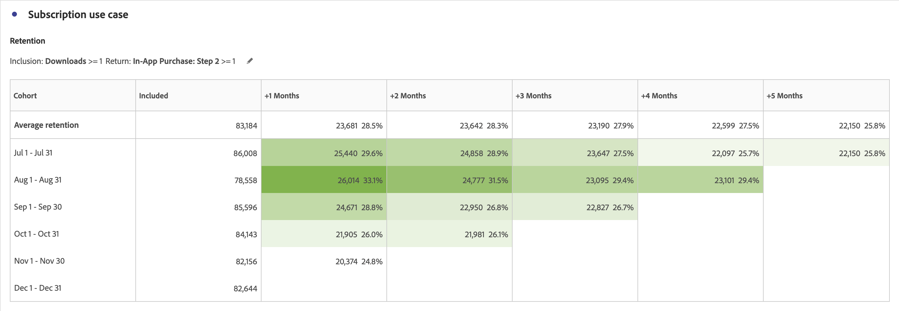

# Anwendungsfälle für die Kohortenanalyse

In diesem Artikel werden mehrere typische Anwendungsfälle besprochen, für die Kohortentabellen hilfreich sind, um nützliche Einblicke in die Durchführung nächster Aktionen zu erhalten.

## App-Interaktion

Angenommen, Sie möchten analysieren, wie Benutzer, die Ihre App installieren, im Laufe der Zeit mit der App interagieren. Installieren Benutzende die App und verwenden sie danach nie mehr? Oder nutzen sie die App eine Weile und hören dann auf, sie zu verwenden? Oder bleiben die Nutzer im Laufe der Zeit aktiv?

Sie können eine sechsmonatige Kohortenanalyse erstellen. Besucher werden in den folgenden Monaten nicht als *`engaged`* gezählt, es sei denn, diese Benutzer haben eine Sitzung oder starten die App. Die [!UICONTROL Kohortenanalyse] zeigt Ihnen dann Nutzungsmuster, bei denen *`App Install`* immer in Monat 0 auftritt. Sie werden möglicherweise feststellen, dass die Nutzung in Monat 2 einbricht, unabhängig davon, wann Benutzer die App installiert haben. Mit dieser Analyse können Sie im zweiten Monat nach der Installation der App eine E-Mail oder eine Push-Nachricht an alle Benutzer senden, um sie an die Verwendung der App zu erinnern.

+++ Beispielvisualisierung einer Kohortentabelle

+++

## Abonnement

Sie arbeiten unter Adobe.com und bieten ein kostenloses Creative Cloud-Abonnement an. Ziel ist es, dass Benutzer von der kostenlosen Version auf die 30-Tage-Testversion oder letztendlich auf die kostenpflichtige Version aktualisieren.

Verwenden Sie [!UICONTROL Kohortenanalyse] um beispielsweise zu verstehen, dass im ersten Monat nach der Installation zwischen 8 % und 10 % der kostenlosen Creative Cloud-Benutzer unabhängig vom Installationszeitpunkt ein Upgrade durchführen. Dann Upgrade von 12-15 % im zweiten Monat der Nutzung. Danach fällt das Upgrade deutlich ab: 4-5 % in Monat drei, 3-4 % in Monat vier und 1-2 % in Monat fünf.

Da Sie im dritten Monat keine potenziellen Kunden verlieren möchten, richten Sie eine E-Mail-Kampagne ein, die Mitte des dritten Monats an eine Stichprobe von Benutzern gesendet werden soll. In dieser Kampagne bieten Sie Benutzern, die noch kein Upgrade durchgeführt haben, einen Gutschein im Wert von 50 $ an.

Sehen Sie sich einige Monate später Ihre Kohortenanalyse an. Bei Kohorten, die nach dem Start der Kampagne gebildet wurden, ist die Konversionsrate auf bezahlte Creative Cloud-Abonnements im dritten Monat von 4-5% auf 13-14% gestiegen. Die Konversion resultiert in hunderttausenden von Dollar pro Kohorte, für jede monatliche Kohorte, die ab diesem Zeitpunkt drei Monate erreicht.

+++ Beispielvisualisierung einer Kohortentabelle

+++

## Komplexe Kohortensegmente

Sie führen eine Analyse für eine große Hotelkette durch, die mehrere Kundengruppen für Werbeaktionen anspricht und die Kundengruppen im Vergleich zur Leistung verfolgt. Um die besten Gruppen von Benutzerkohorten zu identifizieren, die angesprochen werden sollen, sollten Sie sehr spezifische Kohortengruppen erstellen. Verwenden Sie die erweiterten [!UICONTROL Einschluss]- und [!UICONTROL Rückgabe]-Kriterien in [!UICONTROL Kohorten]-Tabellen, um genau die richtigen Kohortengruppierungen mit mehreren Metriken und Segmenten zu definieren. Diese Analyse hilft Ihnen, Kundengruppen zu identifizieren, die unterdurchschnittlich gut abschneiden, sodass Sie sie gezielt mit Werbeaktionen und Angeboten ansprechen können, um die Buchungen zu steigern.

+++ Beispielvisualisierung einer Kohortentabelle

+++

## App-Versionsübernahme

Sie sind der Analyst für ein großes Versicherungsunternehmen, das die Kundeninteraktion durch die Verwendung seiner mobilen App vorantreibt. Wenn der App neue Funktionen hinzugefügt werden, sollten Kunden ein Upgrade auf die neueste App-Version durchführen. Sie können App-Versionen mithilfe der [!UICONTROL benutzerdefinierten Dimension-Kohorte nebeneinander analysieren und vergleichen] um zu ermitteln, welche Kunden welche App-Version als Ziel haben. Darüber hinaus können Sie die Kundenbindung und Abwanderung verfolgen, um zu sehen, ob bestimmte Mobile-App-Versionen Kunden im Laufe der Zeit davon abhalten, die Mobile App zu verwenden. Durch die Bemühungen um mobile Nachrichten können Sie erneut mit diesen Benutzern interagieren, sodass die Benutzer auf die neueste Version aktualisieren, um die neuesten Funktionen zu nutzen.

+++ Beispielvisualisierung einer Kohortentabelle

+++

## Kampagnen-Stickiness

Sie sind der Analyst eines multinationalen Medienunternehmens, das mithilfe zielgerichteter Kampagnen Benutzer zu ihren verschiedenen Plattformen bringt, um die Interaktion zu fördern. Die Werbeausgaben pro Plattform basieren auf der Kundeninteraktion und Kundenbindung. Erfolgreiche Kampagnen sind für den Erfolg des Unternehmens von entscheidender Bedeutung. Mit der neuen Funktion [!UICONTROL Benutzerdefinierte Dimension] Kohortentabellen in [!UICONTROL Kohortentabellen] können Sie verschiedene Kampagnen nebeneinander vergleichen, um zu ermitteln, welche Kampagnen am effektivsten Benutzende gewinnen und binden, um die Interaktion zu steigern. Anschließend können Sie ermitteln, welche Aspekte eine Kampagne erfolgreich machen, und dieses Wissen auf andere Kampagnen anwenden, um die Interaktion über verschiedene Plattformen hinweg zu steigern.

+++ Beispielvisualisierung einer Kohortentabelle

+++

## Produkteinführung

Sie sind der Analyst für eine große Bekleidungs-retailer, die viele spezifische Kundensegmente hat, die große Teile des Umsatzes für ihr Unternehmen antreiben. Für jedes Segment werden spezifische Produkte unter Berücksichtigung des jeweiligen Segments entwickelt und hergestellt. Bei jeder Produkteinführung möchten Sie wissen, wie das neue Produkt im Laufe der Zeit die Umsätze in verschiedenen Kohorten gesteigert hat. Mit der neuen Einstellung [!UICONTROL Latenztabelle] in [!UICONTROL Kohortenanalyse] können Sie das Verhalten und den Umsatz eines bestimmten Kundensegments vor und nach der Markteinführung analysieren. Anhand dieser Informationen können Sie feststellen, welche Produkte neue Umsätze generieren und welche nicht mit den Kunden interagieren.

+++ Beispielvisualisierung einer Kohortentabelle

+++

## Individuelle Klebrigkeit - die meisten treuen Benutzer

Sie sind der Analyst einer großen Fluggesellschaft, die den größten Teil ihres Erfolgs und Umsatzes von wiederkehrenden und treuen Kunden erzielt. In vielen Fällen machen treue Reisende den Großteil des Umsatzes aus und die Bindung dieser Kunden ist entscheidend für den langfristigen Erfolg. Es kann oft schwierig sein, die treuesten und konsistentesten Kunden zu identifizieren. Mit der neuen Einstellung [!UICONTROL Rollierende Berechnung] in der [!UICONTROL Kohortenanalyse] können Sie jedoch treue Kundensegmente analysieren und herausfinden, welche Reisenden Monat für Monat zu Wiederholungskäufern wurden. Anschließend können Sie diese Reisenden mit Prämien und Vergünstigungen für ihre Treue belohnen. Darüber hinaus können Sie durch den Wechsel des Kohortentyps von Bindung zu Abwanderung auch erkennen, welche Kunden Monat für Monat keine Wiederholungskäufer waren. Anschließend können Sie diese Segmente mit Werbeaktionen ansprechen, um erneut mit diesen Kunden zu interagieren, sodass diese auch in Zukunft treu bleiben.

+++ Beispielvisualisierungen von Kohortentabellen

+++
