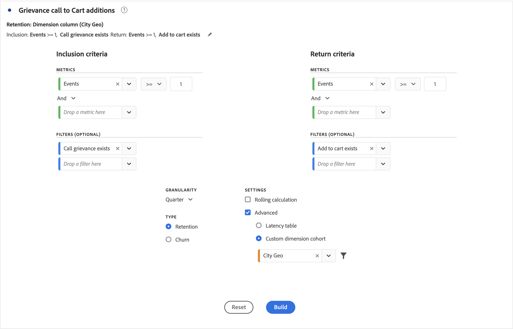

# Konfigurieren einer Kohortentabelle

So erstellen und konfigurieren Sie eine [!UICONTROL Kohortentabelle]:

1. Fügen Sie eine  **[!UICONTROL Kohortentabellenvisualisierung]** hinzu. Weitere Informationen finden Sie unter [Hinzufügen einer Visualisierung in einem Bedienfeld](../freeform-analysis-visualizations.md#add-visualizations-to-a-panel)

1. Bestimmen Sie die **[!UICONTROL Aufnahmekriterien]**, die **[!UICONTROL Rückkehrkriterien]**, den **[!UICONTROL Kohortentyp]** und die **[!UICONTROL Einstellungen]** wie in der Tabelle unten definiert.

   

   | Element | Beschreibung |
   |--- |--- |
   | **[!UICONTROL Aufnahmekriterien]** | Sie können bis zu 10 Einschlussfilter und bis zu 3 Einschlussmetriken anwenden. Die Metrik gibt an, zu welcher Kohorte eine Benutzerin bzw. ein Benutzer gehört. Wenn die Aufnahmemetrik z. B. die Bestellungen sind, werden nur Benutzende, die innerhalb des Zeitraums der Kohortenanalyse bestellt haben, in der anfänglichen Kohorte platziert. Der Standardoperator zwischen den Kennzahlen ist AND, kann aber in OR geändert werden. Außerdem können Sie diesen Metriken numerische Filter hinzufügen. Beispiel: `Sessions >= 1`.  |
   | **[!UICONTROL Rückkehrkriterien]** | Sie können bis zu 10 Rückgabefilter und bis zu 3 Rückgabemetriken anwenden. Die Kennzahl gibt an, ob eine Person gewonnen wurde (Bindung) oder nicht (Abwanderung). Wenn die Rückkehrmetrik z. B. die Videoansichten sind, werden nur Benutzende, die in nachfolgenden Zeiträumen (nach dem Zeitraum, in dem sie zu einer Kohorte hinzugefügt wurden) Videos angesehen haben, als zurückgekehrt dargestellt. Eine weitere Metrik, die die Bindung quantifiziert, sind die Sitzungen. |
   | **[!UICONTROL Granularität]** | Die Zeitgranularität: Tag, Woche, Monat, Quartal oder Jahr. |
   | **[!UICONTROL Typ]** | **[!UICONTROL Bindung]** (Standard): Durch die **[!UICONTROL Bindungskohorte]** wird gemessen, in welchem Maße die Personenkohorten im Laufe der Zeit zu Ihnen zurückkehren. Eine Bindungskohorte ist die Standardkohorte und zeigt das Verhalten von wiederkehrenden Benutzenden an. Eine grüne Farbe zeigt eine Kohorte [!UICONTROL Bindung] in der Tabelle an. **[!UICONTROL Abwanderung ]**: Eine Kohorte**[!UICONTROL  Abwanderung ]**(auch als Attrition oder Fallout bezeichnet) misst, wie Ihre Personenkohorten im Laufe der Zeit aus Ihrer Eigenschaft herausfallen. Abwanderung ist das Gegenteil von Bindung: `Churn = 1 - Retention`. Die [!UICONTROL Abwanderung] ist ein guter Messwert für die Treue und Chancen, da Ihnen gezeigt wird, wie häufig Kundinnen und Kunden nicht zurückkehren. Sie können die Abwanderung nutzen, um Fokusbereiche zu analysieren und zu identifizieren, damit Sie herauszufinden, welche Kohortenfilter etwas Aufmerksamkeit erfordern könnten. Eine rote Farbe zeigt eine [!UICONTROL Abwanderungskohorte] in der Tabelle an (ähnlich wie „Fallout“ in der**[!UICONTROL  Flussvisualisierung ]**).  |
   | **[!UICONTROL Einstellungen]** | **[!UICONTROL Rollierende Berechnung]**: Ermöglicht es Ihnen, die Bindung oder die Abwanderung auf Grundlage der vorherigen Spalte und nicht der eingeschlossenen Spalte zu berechnen (Standard). Durch eine [!UICONTROL rollierende Berechnung] wird die Berechnungsmethode für Ihre „Rückkehr“-Zeiten verändert. Im Gegensatz dazu findet die normale Berechnung Benutzende, die die Rückkehrkriterien erfüllen und Teil des Einschlusszeitraums waren, unabhängig davon, ob sie im vorherigen Zeitraum in der Kohorte waren oder nicht. Im Gegensatz dazu findet [!UICONTROL Rollierende Berechnung] Benutzer, die die „Rückkehr“-Kriterien erfüllen und Teil des vorherigen Zeitraums waren. Daher filtert [!UICONTROL Rollierende Berechnung] Benutzer, die die „Rückkehr“-Kriterien kontinuierlich in jedem Zeitraum erfüllen, und trichtert sie. [!UICONTROL Rückkehrkriterien] werden auf jeden Zeitraum bis zum ausgewählten Zeitraum angewendet.   **[!UICONTROL Latenztabelle ]**: Eine [!UICONTROL Latenztabelle] misst die Zeit, die vor und nach dem Aufnahmeereignis verstrichen ist. Die [!UICONTROL Latenztabelle] eignet sich ideal für die Vor- und Nachanalyse. Angenommen, es steht ein Produkt- oder Kampagnen-Launch bevor und Sie möchten das Verhalten vor und nach dem Launch verfolgen. Die [!UICONTROL Latenztabelle] zeigt das Verhalten davor und danach nebeneinander an, um die direkten Auswirkungen darzustellen. Die Zellen für vor der Aufnahme in der [!UICONTROL Latenztabelle] berechnen die Benutzenden, die die [!UICONTROL Einschlusskriterien] für den Aufnahmezeitraum und anschließend die [!UICONTROL Rückkehrkriterien] in den Zeiträumen vor dem Aufnahmezeitraum erfüllen. Die [!UICONTROL Latenztabelle] und die [!UICONTROL bBenutzerdefinierte Kohorte der Dimension] können nicht zusammen verwendet werden.  **[!UICONTROL Benutzerdefinierte Kohorte der Dimension]**: Erstellen Sie Kohorten auf Grundlage der ausgewählten Dimension und nicht auf Grundlage zeitbasierter Kohorten (Standard). Viele Kunden möchten ihre Kohorten nach etwas anderem als der Zeit analysieren, und die neue Funktion für benutzerdefinierte Kohorten der Dimension bietet Ihnen genau diese Flexibilität, Kohorten basierend auf Dimensionen ihrer Wahl zu erstellen. Verwenden Sie Dimensionen wie Marketing-Kanal, Kampagne, Produkt, Seite, Region oder eine beliebige andere Dimension, um anzuzeigen, wie die Bindung sich basierend auf verschiedenen Werten dieser Dimensionen verändert. Die Definition eines Kohortenfilters mit [!UICONTROL benutzerspezifischer Dimension] wendet das Dimensionselement nur als Teil des Einschlusszeitraums an, nicht als Teil der Rückgabedefinition.  Nach Auswahl der Option [!UICONTROL Benutzerdefinierte Kohorte der Dimension] können Sie jede beliebige Dimension in die Drop-Zone ziehen. Durch Hinzufügen von Dimensionen können Sie ähnliche Dimensionselemente über den gleichen Zeitraum hinweg miteinander vergleichen. Sie können beispielsweise die Leistung von Städten nebeneinander, Produkte, Kampagnen usw. vergleichen. Die Kohortentabelle gibt Ihre 14 wichtigsten Dimensionselemente zurück. Sie können jedoch einen Filter  verwenden, um nur die gewünschten Dimensionselemente anzuzeigen. Eine [!UICONTROL benutzerdefinierte Kohorte der Dimension] kann nicht mit der Funktion [!UICONTROL Latenztabelle] verwendet werden.  |

1. Klicken Sie auf **[!UICONTROL Erstellen]**.
1. Um die [!UICONTROL Kohortentabelle] erneut zu konfigurieren, wählen Sie  aus.

1. (Optional) Erstellen Sie ein Segment aus einer Auswahl.

   Wählen Sie eine oder mehrere Zellen aus (fortlaufend oder nicht fortlaufend) und klicken Sie mit der rechten Maustaste auf **[!UICONTROL Segment aus Auswahl erstellen]**.

1. Bearbeiten Sie das Segment im [Segment Builder](/help/components/segmentation/segmentation-workflow/seg-build.md) weiter und klicken Sie anschließend auf **[!UICONTROL Speichern]**.

   Das gespeicherte Segment kann in [!UICONTROL Analysis Workspace] im Bedienfeld [!UICONTROL Segment] verwendet werden.

## Einstellungen

Sie können bestimmte Einstellungen für eine [!UICONTROL Kohortentabelle] definieren.

1. Wählen Sie  aus, um die Einstellungen für die [!UICONTROL Kohortentabelle] anzupassen.

   | Einstellung | Beschreibung |
   |---|---|
   | **Nur Prozentwert anzeigen** | Entfernt den Zahlenwert und zeigt nur den Prozentsatz an. |
   | **Prozentwert auf nächste Ganzzahl runden** | Rundet den Prozentwert auf den nächsten ganzzahligen Wert, anstatt den Dezimalwert anzuzeigen. |
   | **Zeile mit durchschnittlichem Prozentwert anzeigen** | Fügt oben in der Tabelle eine neue Zeile ein und trägt dort die Spaltendurchschnitte der Werte ein. |

>[!MORELIKETHIS]
>
>[Hinzufügen einer Visualisierung zu einem Bedienfeld](/help/analyze/analysis-workspace/visualizations/freeform-analysis-visualizations.md#add-visualizations-to-a-panel)
>[Einstellungen der Visualisierung](/help/analyze/analysis-workspace/visualizations/freeform-analysis-visualizations.md#settings)
>[Kontextmenü der Visualisierung](/help/analyze/analysis-workspace/visualizations/freeform-analysis-visualizations.md#context-menu)
>

