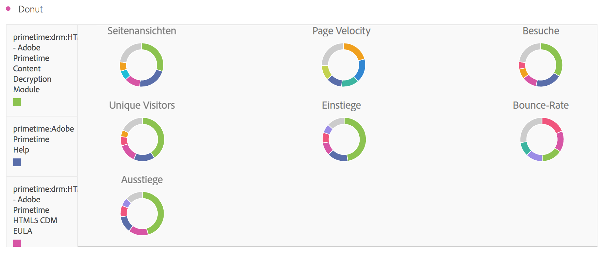

# [!UICONTROL Ringdiagramm] {#donut}

<!-- markdownlint-disable MD034 -->

>[!CONTEXTUALHELP]
>id="workspace_donut_button"
>title="Ringdiagramm"
>abstract="Erstellen Sie eine Ringvisualisierung, um die prozentualen Anteile eines Ganzen zu vergleichen, typischerweise bei einer geringen Anzahl an Werten."

<!-- markdownlint-enable MD034 -->

>[!BEGINSHADEBOX]

_In diesem Artikel wird die Ringidagramm-Visualisierung in_ _**Adobe Analytics**._ _Siehe [Ringdiagramm](https://experienceleague.adobe.com/en/docs/analytics-platform/using/cja-workspace/visualizations/donut) für die_ _**Customer Journey Analytics**-Version dieses Artikels._

>[!ENDSHADEBOX]

Ähnlich einem Tortendiagramm zeigt die Visualisierung  **[!UICONTROL Donut]** die Daten als Teile oder Filter eines Ganzen. Verwenden Sie eine Ringdiagramm-Visualisierung, wenn Sie die Prozentsätze eines Ganzen vergleichen, in der Regel bei einer geringen Anzahl an Elementen.

>[!BEGINSHADEBOX]

Siehe  [Hinzufügen einer Ringdiagramm](https://video.tv.adobe.com/v/334309/?quality=12){target="_blank"} für ein Demovideo.

>[!ENDSHADEBOX]

>[!MORELIKETHIS]
>
>[Hinzufügen einer Visualisierung zu einem Bedienfeld](/help/analyze/analysis-workspace/visualizations/freeform-analysis-visualizations.md#add-visualizations-to-a-panel)
>[Visualisierungseinstellungen](/help/analyze/analysis-workspace/visualizations/freeform-analysis-visualizations.md#settings)
>[Kontextmenü der Visualisierung](/help/analyze/analysis-workspace/visualizations/freeform-analysis-visualizations.md#context-menu)
>

