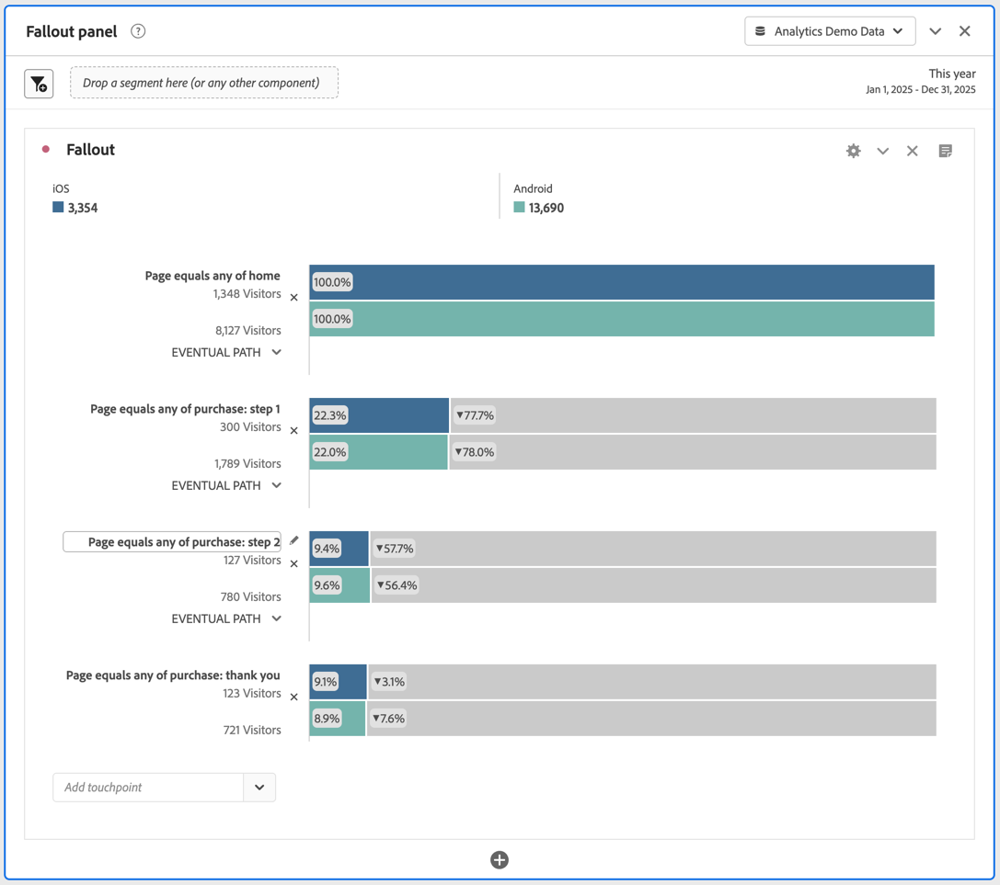

# Segmente in der Fallout-Analyse anwenden

Sie können in Analysis Workspace Segmente aus einem Touchpoint erstellen, Segmente als Touchpoints hinzufügen und wichtige Workflows über verschiedene Segmente hinweg vergleichen.

>[!IMPORTANT]
>
>Segmente, die als Checkpoints in Fallout verwendet werden, müssen einen Container verwenden, der auf einer niedrigeren Ebene liegt als der Gesamtkontext der Fallout-Visualisierung. Bei einem Besucherkontext-Fallout müssen Segmente, die als Checkpoints verwendet werden, besuchsbasierte oder Hit-basierte Segmente sein. Bei einem besuchskontextbezogenen Fallout müssen Segmente, die als Checkpoint verwendet werden, Hit-basierte Segmente sein. Wenn Sie eine ungültige Kombination verwenden, beträgt der Fallout 100 %. In der Fallout-Visualisierung wird eine Warnung angezeigt, wenn Sie ein inkompatibles Segment als Touchpoint hinzufügen. Bestimmte ungültige Segment-Container-Kombinationen führen zu ungültigen Fallout-Diagrammen, z. B.:
>
>* Verwenden eines besucherbasierten Segments als Touchpoint innerhalb einer auf den Besucherkontext bezogenen Fallout-Visualisierung.
>* Verwenden eines besucherbasierten Segments als Touchpoint innerhalb einer auf den Besuchskontext bezogenen Fallout-Visualisierung
>* Verwenden eines besuchsbasierten Segments als Touchpoint innerhalb einer auf den Besuchskontext bezogenen Fallout-Visualisierung
>

## Erstellen eines Segments aus einem Touchpoint

1. Als Erstes erstellen Sie ein Segment aus einem bestimmten Touchpoint, an dem Sie interessiert sind und der sich möglicherweise lohnt, auch in andere Berichte übernommen zu werden. Klicken Sie dazu mit der rechten Maustaste auf den Touchpoint und wählen Sie dann **[!UICONTROL Segment aus Touchpoint erstellen aus]**.

   

   Der Segment Builder wird geöffnet und enthält bereits das vorkonfigurierte sequenzielle Segment, das dem von Ihnen ausgewählten Touchpoint entspricht:

   

1. Geben Sie dem Segment einen Titel und eine Beschreibung und speichern Sie es.

   Dieses Segment kann jetzt in jedem gewünschten Projekt verwendet werden.

## Hinzufügen eines Segments als Touchpoint

Wenn Sie beispielsweise sehen möchten, wie sich die Mobile-App-Treffer im Trend auswirken und wie sich dies auf den Fallout auswirkt, ziehen Sie einfach das Segment Mobile-App-Treffer in den Fallout:

Sie können auch einen UND-Touchpoint erstellen, indem Sie das Segment Mobile-App-Treffer auf einen anderen Checkpoint ziehen.

## Vergleichen von Segmenten im Fallout

In der Fallout-Visualisierung können Sie eine unbegrenzte Anzahl von Segmenten miteinander vergleichen. (Beachten Sie, dass Sie im folgenden Video bis zu drei Segmente vergleichen können, was falsch ist.)

1. Wählen Sie die zu vergleichenden Segmente aus dem Bedienfeld [!UICONTROL Segment] auf der linken Seite aus. Im Beispiel sind zwei Segmente ausgewählt: **[!UICONTROL iOS]** und **[!UICONTROL Android]**.
1. Ziehen Sie die drei Segmente in den Ablegebereich für Segmente am oberen Rand der Visualisierung.

   

1. Optional: Sie können *Alle Personen* als Standard-Container beibehalten oder den Container löschen.

1. Sie können jetzt den Fallout über die drei Segmente hinweg vergleichen, z. B. wo ein Segment eine bessere Leistung als das andere erzielt, oder andere Einblicke erhalten.
