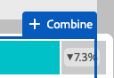

# Fallout-Visualisierung konfigurieren

Sie können die Touchpoints angeben, um eine mehrdimensionale Fallout-Sequenz zu erstellen. Normalerweise ist ein Touchpoint eine Seite auf Ihrer Site. Touchpoints sind jedoch nicht auf Seiten beschränkt. So können Sie zum Beispiel Ereignisse (wie Einheiten) sowie eindeutige Personen und erneute Besuche hinzufügen. Sie können auch Dimensionen hinzufügen, z. B. eine Kategorie, einen Browser-Typ oder einen internen Suchbegriff.

Sie können sogar Segmente innerhalb eines Touchpoints hinzufügen. Vielleicht möchten Sie zum Beispiel Segmente vergleichen (wie etwa iOS- und Android™-Benutzende). Wenn Sie die gewünschten Segmente an die Oberseite des Trichters ziehen, werden Informationen über diese Segmente zum Fallout-Bericht hinzugefügt. Wenn Sie möchten, dass nur diese Segmente angezeigt werden, können Sie die Grundlinie „Alle Besuche“ entfernen.

Es gibt keine Einschränkungen bezüglich der Anzahl der Schritte, die hinzugefügt werden können, oder der Dimensionen, die verwendet werden können.

Sie können Pfade für Dimensionen, Metriken und Segmente erstellen. Beispiel: Angenommen, jemand sucht auf der einen Seite nach „Schuhe, Shirt“ und auf der nächsten Seite nach „Schuhe, Socken“. Der nächste Produktflussbericht von Schuhe wird „Shirt und Socken“ lauten, NICHT „Shirt“.

## Verwenden

1. Fügen Sie eine Visualisierung des Typs  **[!UICONTROL Fallout]** hinzu. Weitere Informationen finden Sie unter [Hinzufügen einer Visualisierung in einem Bedienfeld](../freeform-analysis-visualizations.md#add-visualizations-to-a-panel).
1. Ziehen Sie eine Komponente in das **[!UICONTROL Touchpoint hinzufügen]** Dropdown-Menü.

   Beispielsweise können Sie dem Fallout-Bericht eine einzelne Seite und nicht die gesamte Dimension hinzufügen. Klicken Sie auf den Pfeil nach rechts  auf der Seitendimension, um eine bestimmte Seite auszuwählen, z. B **[!UICONTROL &quot;]**&quot;, die dem Fallout-Bericht hinzugefügt werden soll.

   

1. Fügen Sie weitere Touchpoints hinzu, bis Ihre Sequenz vollständig ist.

   Die umkreisten Zahlen im grauen Abschnitt der Leiste zeigen den Fallout zwischen Touchpoints an (nicht den gesamten Fallout bis zu diesem Punkt). **[!UICONTROL Touchpoint %]** zeigt den erfolgreichen Fallthrough vom vorherigen Schritt zum aktuellen Schritt im Fallout-Bericht an.

   

   Beim Hinzufügen von Touchpoints haben Sie folgende Möglichkeiten:

   * Kombinieren Sie mehrere Komponenten, indem Sie eine oder mehrere zusätzliche Komponenten auf einen einzelnen Touchpoint ziehen.

     >[!NOTE]
     >
     >Hinweis: Mehrere Segmente werden mit AND verbunden, mehrere Elemente wie Dimensionselemente und Metriken hingegen mit OR.

   * Ordnen Sie Touchpoints neu an, indem Sie sie in der Fallout-Hierarchie auf eine andere Ebene ziehen.

   * Kombinieren eines Touchpoints mit einem anderen Touchpoint. Ziehen Sie zum Kombinieren von Touchpoints einen Touchpoint auf einen anderen. Legen Sie es ab, wenn Sie das Wort **[!UICONTROL Kombinieren]** sehen.

     

   * Einschränken einzelner Touchpoints auf das nächste Ereignis (im Gegensatz zu *letztendlich*) im Pfad. Unter jedem Touchpoint gibt es einen Selektor mit den Optionen **[!UICONTROL Eventueller Pfad]** und **[!UICONTROL Nächstes Ereignis]**, wie hier gezeigt:

     

     | Option | Beschreibung |
     |---|---|
     | **[!UICONTROL Endgültiger Pfad]** (Standard) | Besucher, die (*) auf* nächsten Seite im Pfad, aber nicht unbedingt beim nächsten Ereignis landen, werden gezählt. |
     | **[!UICONTROL Nächstes Ereignis]** | Besucher, die beim nächsten Ereignis auf der nächsten Seite im Pfad landen, werden gezählt. |

   * Bewegen Sie den Mauszeiger über einen Touchpoint, um den Fallout und andere Informationen zu dieser Ebene anzuzeigen. Zu den Informationen gehören der Name des Touchpoints, die Anzahl der Personen und die Erfolgsrate. Sie können die Erfolgsrate auch mit anderen Touchpoints vergleichen.

     

## Einstellungen

Im Rahmen der Visualisierung sind bestimmte Einstellungen verfügbar.

| Fallout-Container | Beschreibung |
|--- |--- |
| **[!UICONTROL Sitzung]** oder **[!UICONTROL Person]** | Sie können bei der Analyse der Personenpfade zwischen [!UICONTROL Sitzung] und [!UICONTROL Person] wechseln. Die Standardeinstellung ist [!UICONTROL Person]. Diese Einstellungen helfen Ihnen, das Engagement von Personen auf Personenebene (über Sitzungen hinweg) zu verstehen, oder die Analyse auf eine einzelne Sitzung zu beschränken. |

## Kontextmenü

Im Rahmen der Visualisierung sind bestimmte Kontextmenüoptionen verfügbar.

### Zugriff auf das Kontextmenü

Sie können auf eine der folgenden Arten auf das Kontextmenü zugreifen:

* Bewegen Sie den Mauszeiger über einen Touchpoint in der Visualisierung und wählen Sie dann **[!UICONTROL Zum Analysieren klicken]** aus.

  

* Klicken Sie mit der rechten Maustaste auf einen Touchpoint in der Visualisierung.

  

### Optionen des Kontextmenüs

Die folgenden Optionen des Kontextmenüs sind verfügbar:

| Option | Beschreibung |
|--- |--- |
| **[!UICONTROL Trend-Touchpoint]** | Zeigt Trend-Daten für einen Touchpoint in einem Liniendiagramm mit einigen vorab definierten Anomalieerkennungsdaten an. |
| **[!UICONTROL Trend-Touchpoint (%)]** | Trend für den gesamten Fallout-Prozentsatz. |
| **[!UICONTROL Trend aller Touchpoints (%)]** | Trend für alle Touchpoint-Prozentsätze im Fallout (außer **[!UICONTROL Alle Personen]**, falls vorhanden) im selben Diagramm |
| **[!UICONTROL Aufschlüsselung an diesem Touchpoint]** | Zeigt an, was Besucher zwischen zwei Touchpoints (diesem und dem nächsten Touchpoint) getan haben, wenn sie sich zum nächsten Touchpoint fortbewegt haben. Mit dieser Option wird eine Freiformtabelle erstellt, in der Ihre Dimensionen angezeigt werden. Sie können Dimensionen und andere Elemente der Tabelle ersetzen. Beispiel: Eine Tabelle mit der Beschriftung **[!UICONTROL Fallthrough: All Visitors > Page entspricht einem der]** und enthält **[!UICONTROL Page]** als Dimension und **[!UICONTROL Unique Visitors]**, segmentiert nach dem [Nur-Projekt-Schnellsegment](/help/components/segmentation/segmentation-workflow/seg-quick.md)**[!UICONTROL Fallthrough: All Visitors > Page entspricht einem der]** als Metrik. Überprüfen Sie das Segment, um zu verstehen, wie das Fallthrough-Segment bestimmt wird. |
| **[!UICONTROL Fallout-Aufschlüsselung an diesem Touchpoint]** | Zeigt an, was Besucherinnen und Besucher, die es nicht über die funnel geschafft haben, unmittelbar nach dem ausgewählten Schritt getan haben. Mit dieser Option wird eine Freiformtabelle erstellt, in der Ihre Dimensionen angezeigt werden. Sie können Dimensionen und andere Elemente der Tabelle ersetzen. Beispiel: Eine Tabelle mit der Beschriftung **[!UICONTROL Fallout: Alle Besucher > Seite entspricht einer der]** und enthält **[!UICONTROL Seite]** als Dimension und **[!UICONTROL Unique Visitors]**, segmentiert nach dem [Nur-Projekt-Schnellsegment](/help/components/segmentation/segmentation-workflow/seg-quick.md)**[!UICONTROL Fallthrough: Alle Besucher > Seite entspricht einer der]**, Segment als Metrik. Überprüfen Sie das Segment, um zu verstehen, wie das Fallout-Segment bestimmt wird. |
| **[!UICONTROL Erstellen von Segmenten aus Touchpoints]** | Erstellen Sie ein neues Segment aus dem ausgewählten Touchpoint. |

>[!MORELIKETHIS]
>
>[Hinzufügen einer Visualisierung in einem Bedienfeld](/help/analyze/analysis-workspace/visualizations/freeform-analysis-visualizations.md#add-visualizations-to-a-panel)
>[Visualisierungseinstellungen](/help/analyze/analysis-workspace/visualizations/freeform-analysis-visualizations.md#settings)
>[Kontextmenü der Visualisierung](/help/analyze/analysis-workspace/visualizations/freeform-analysis-visualizations.md#context-menu)
>

