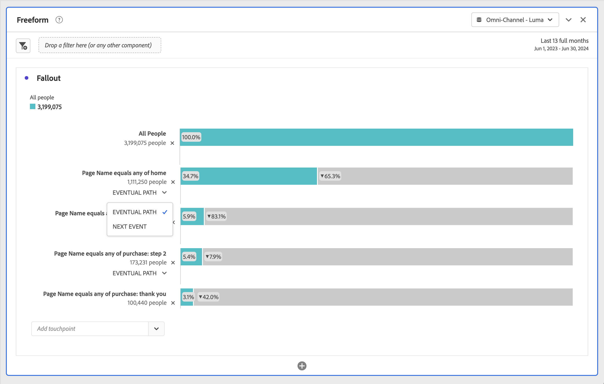

# Fallout-Visualisierung konfigurieren

Sie können die Touchpoints angeben, um eine mehrdimensionale Fallout-Sequenz zu erstellen. Ein Touchpoint ist im Allgemeinen eine Seite auf Ihrer Website. Touchpoints sind jedoch nicht auf Webseiten eingeschränkt. Sie können beispielsweise Ereignisse wie Einheiten sowie Einzelpersonen und wiederkehrende Besuche hinzufügen. Auch Dimensionen können Sie hinzufügen (wie Kategorie, Browsertyp oder interner Suchbegriff).

Sogar Segmente können Sie innerhalb eines Touchpoints hinzufügen. Vielleicht möchten Sie zum Beispiel Segmente vergleichen, z. B. Benutzerinnen und Benutzer von iOS und Android™. Wenn Sie die gewünschten Segmente an die Oberseite des Trichters ziehen, werden Informationen über diese Segmente zum Fallout-Bericht hinzugefügt. Wenn Sie nur diese Segmente anzeigen möchten, können Sie die Grundlinie „Alle Besuche“ entfernen.

Es gibt keine Begrenzung für die Anzahl der Schritte, die Sie hinzufügen können, oder für die Anzahl der verwendeten Dimensionen.

Sie können Pfade für Dimensionen, Metriken und Segmente erstellen. Angenommen, jemand sucht auf der einen Seite nach Schuhen, Shirts und auf der nächsten Seite nach Shirts, Socken. Der nächste Produktflussbericht von Schuhe wird „Shirt und Socken“ lauten, NICHT „Shirt“.

## Verwenden

1. Fügen Sie eine Fallout **[!UICONTROL -]** hinzu. Siehe [Hinzufügen einer Visualisierung zu einem Bedienfeld](../freeform-analysis-visualizations.md#add-visualizations-to-a-panel).
1. Ziehen Sie eine Seite, z. B. die Startseite, aus der Dimension Seite in das Dropdown-Menü *Touchpoint hinzufügen*.

   

   Bewegen Sie den Mauszeiger über einen Touchpoint, um den Fallout und andere Informationen zu dieser Ebene anzuzeigen, wie z. B. den Namen des Touchpoints und die Anzahl der Personen zu diesem Zeitpunkt. Sehen Sie sich die Erfolgsrate für diesen Touchpoint an (und vergleichen Sie sie mit der Erfolgsrate anderer Touchpoints).

   Die umkreisten Zahlen im grauen Abschnitt der Leiste zeigen den Fallout zwischen Touchpoints an (nicht den gesamten Fallout bis zu diesem Punkt). Der **[!UICONTROL Touchpoint %]** zeigt den erfolgreichen Durchlauf vom vorherigen Schritt zum aktuellen Schritt im Fallout-Bericht an.

   Sie können auch eine einzelne Seite anstatt der gesamten Dimension zum Fallout-Bericht hinzufügen. Klicken Sie auf den Pfeil nach rechts  auf der Seitendimension, um eine bestimmte Seite auszuwählen, die dem Fallout-Bericht hinzugefügt werden soll.

1. Fügen Sie weitere Touchpoints hinzu, bis Ihre Sequenz vollständig ist.

   Sie können **mehrere Touchpoints kombinieren** indem Sie eine oder mehrere zusätzliche Komponenten auf einen Touchpoint ziehen.

   >[!NOTE]
   >
   >Mehrere Segmente werden mit UND verbunden, mehrere Elemente wie Dimensionselemente und Metriken jedoch mit ODER.

   

1. Sie können auch **einzelne Touchpoints auf das nächste Ereignis beschränken** (im Gegensatz zu *letztendlich*) im Pfad. Unter jedem Touchpoint befindet sich ein Selektor mit den Optionen **[!UICONTROL Eventueller Pfad]** und **[!UICONTROL Nächstes Ereignis]** wie hier gezeigt:

   

   | Option | Beschreibung |
   |---|---|
   | **[!UICONTROL Eventueller Pfad]** (Standard) | Es werden Personen gezählt, *(letztendlich* auf der nächsten Seite im Pfad, aber nicht notwendigerweise beim nächsten Ereignis landen. |
   | **[!UICONTROL Nächstes Ereignis]** | Wird gezählt und landet beim nächsten Ereignis auf der nächsten Seite im Pfad. |

## Einstellungen

Im Rahmen der Visualisierung sind bestimmte Einstellungen verfügbar.

| Fallout-Container | Beschreibung |
|--- |--- |
| **[!UICONTROL Sitzung]** oder **[!UICONTROL Person]** | Wechseln Sie zwischen [!UICONTROL Sitzung] und [!UICONTROL Person], um den Personenpfad zu analysieren. Die Standardeinstellung ist [!UICONTROL Person]. Diese Einstellungen helfen Ihnen, das Engagement von Personen auf Personenebene (über Sitzungen hinweg) zu verstehen, oder die Analyse auf eine einzelne Sitzung zu beschränken. |

## Kontextmenü

Im Rahmen der Visualisierung stehen spezifische Kontextmenüoptionen zur Verfügung.

| Option | Beschreibung |
|--- |--- |
| **[!UICONTROL Trend-Touchpoint]** | Zeigt Trenddaten für einen Touchpoint in einem Kantengraphen mit einigen vorab definierten Anomalieerkennungsdaten an. |
| **[!UICONTROL Trend-Touchpoint (%)]** | Trends für den gesamten Fallout-Prozentsatz. |
| **[!UICONTROL Trend aller Touchpoints (%)]** | Trendet alle Touchpoint-Prozentsätze im Fallout (mit Ausnahme **[!UICONTROL Alle Personen]** falls enthalten) auf demselben Diagramm. |
| **[!UICONTROL Aufschlüsselung des Fallthroughs an diesem Touchpoint]** | Erfahren Sie, was Personen zwischen zwei Touchpoints (diesem und dem nächsten Touchpoint) getan haben, wenn sie zum nächsten Touchpoint übergegangen sind. Diese Option erstellt eine Freiformtabelle, die Ihre Dimensionen enthält. Dimensionen und andere Elemente der Tabelle können Sie austauschen. |
| **[!UICONTROL Fallout an diesem Touchpoint aufschlüsseln]** | Zeigt an, was Besucher, die nicht im Trichter verblieben sind, unmittelbar nach dem ausgewählten Schritt getan haben. |
| **[!UICONTROL Segment aus Touchpoint erstellen]** | Erstellen Sie ein Segment aus dem ausgewählten Touchpoint. |

>[!MORELIKETHIS]
>
>[Hinzufügen einer Visualisierung zu einem Bedienfeld](/help/analyze/analysis-workspace/visualizations/freeform-analysis-visualizations.md#add-visualizations-to-a-panel)
>[Visualisierungseinstellungen](/help/analyze/analysis-workspace/visualizations/freeform-analysis-visualizations.md#settings)
>[Kontextmenü der Visualisierung](/help/analyze/analysis-workspace/visualizations/freeform-analysis-visualizations.md#context-menu)
>

