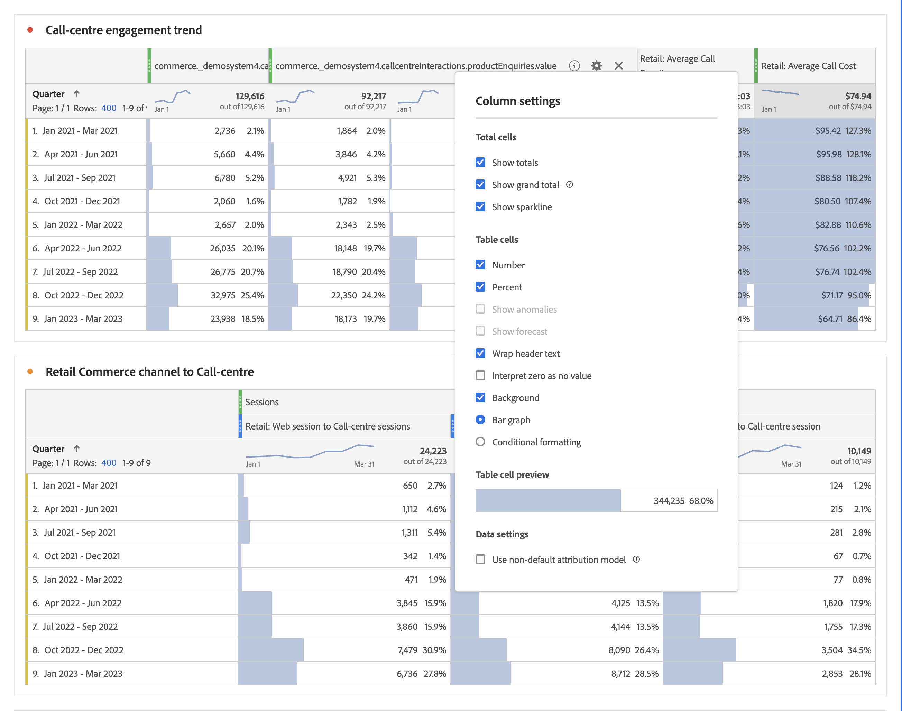
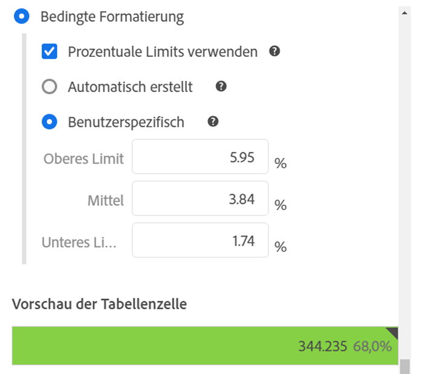
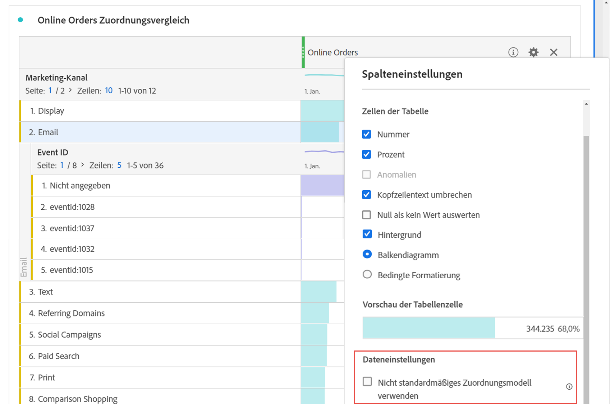

# Spalteneinstellungen

Mithilfe der [!UICONTROL Spalteneinstellungen] können Sie die Spaltenformatierung konfigurieren. Einige davon sind bedingt.

>[!BEGINSHADEBOX]

Unter  [Zeilen- und Spalteneinstellungen in einer Freiformtabelle](https://video.tv.adobe.com/v/40382/?quality=12&learn=on){target="_blank"} finden Sie ein Demovideo.

>[!ENDSHADEBOX]

Um auf [!UICONTROL Spalteneinstellungen] zuzugreifen, wählen Sie  in der Spaltenüberschrift aus.

Sie können Einstellungen für mehrere Spalten gleichzeitig bearbeiten. Wählen Sie mehrere Spalten und dann  in einer der ausgewählten Spalten aus. Sämtliche Änderungen, die Sie vornehmen, werden auf die markierten Zellen aller Spalten angewendet. 

| Option | Beschreibung |
| --- | --- |
| **[!UICONTROL Summen anzeigen]** | Zeigt eine Client-seitige Summe der Spalte an. Bei dieser Summe werden Metriken wie Sitzungen oder Personen **nicht** dedupliziert. |
| **[!UICONTROL Gesamtsumme anzeigen]** | Zeigt eine Server-seitige Summe der Spalte an. Bei dieser Gesamtsumme werden Metriken wie Sitzungen oder Personen dedupliziert. |
| **[!UICONTROL Sparkline zeigen]** | Zeigt ein Liniendiagramm in der Spaltenüberschrift an. |
| **[!UICONTROL Nummer]** | Bestimmt, ob in einer Zelle der numerische Wert der Metrik ein-/ausgeblendet wird. Wenn die Metrik beispielsweise Seitenansichten lautet, ist der numerische Wert die Anzahl der Seitenansichten für das Zeilenelement. |
| **[!UICONTROL Prozent]** | Bestimmt, ob in einer Zelle der Prozentwert der Metrik ein-/ausgeblendet wird. Ist die Metrik beispielsweise „Seitenansichten“, ist der Prozentwert die Anzahl an Seitenansichten für dieses Zeilenelement geteilt durch die Gesamtanzahl der Seitenansichten für diese Spalte. Hinweis: Prozentsätze über 100 % sind möglich, um Genauigkeit sicherzustellen. Die Begrenzung kann auf 1.000 % verschoben werden, um zu verhindern, dass die Spaltenbreite zu groß wird. |
| **[!UICONTROL Anomalien zeigen]** | Bestimmen Sie, ob die Anomalieerkennung für die Werte dieser Spalte ausgeführt wird. |
| **[!UICONTROL Prognose anzeigen]** | Bestimmen Sie, ob Prognosewerte in dieser Spalte angezeigt werden. |
| **[!UICONTROL Kopfzeilentext umbrechen]** | Lassen Sie den Kopfzeilentext in Freiformtabellen umbrechen, damit Kopfzeilen besser lesbar und Tabellen einfacher freizugeben sind. Ein Umbruch ist beim PDF-Rendern und für Metriken mit langen Namen nützlich. Standardmäßig aktiviert. |
| **[!UICONTROL Null nicht als Wert interpretieren]** | Bestimmen Sie, ob in Zellen mit 0-Wert eine 0 oder eine leere Zelle angezeigt wird. Diese Interpretation ist nützlich, wenn Sie die Daten für einzelne Tage eines Monats anzeigen und einige Tage noch in der Zukunft liegen.  Statt für in der Zukunft liegende Daten eine 0 anzuzeigen, werden stattdessen leere Zellen angezeigt. Diagramme berücksichtigen diese Einstellung ebenfalls (die Diagramme zeigen also keine Linie bzw. keinen Balken mit 0-Werten an). |
| **[!UICONTROL Hintergrund]** | Bestimmen Sie, ob in einer Zelle alle Zellformatierungen ein-/ausgeblendet werden, einschließlich Balkendiagramm und bedingter Formatierung |
| **[!UICONTROL Balkendiagramm]** | Zeigte ein horizontales Balkendiagramm mit dem Zellenwert in Relation zum Gesamtwert der Spalte an. |
| **[!UICONTROL Bedingte Formatierung]** | Verwendet eine bedingte Formatierung. Weitere Informationen dazu finden Sie im unten stehenden [Abschnitt](#conditional-formatting). |
| **[!UICONTROL Vorschau der Tabellenzelle]** | Zeigt die jeweiligen Zellen mit allen ausgewählten Formatierungsoptionen in einer Vorschau an. |
| **[!UICONTROL Nicht standardmäßiges Attributionsmodell verwenden]** | Zum Verwenden eines nicht standardmäßigen Attributionsmodells. Weitere Informationen dazu finden Sie im unten stehenden [Abschnitt](#use-non-default-attribution-model). |

## Bedingte Formatierung {#conditional-formatting}

Die bedingte Formatierung gilt für Obergrenzen, Mittelwerte und Untergrenzen, die Sie definieren können. Das Anwenden bedingter Formatierung (Farben usw.) in Freiformtabellen ist bei Aufschlüsselungen ebenfalls automatisch aktiviert, sofern keine [!UICONTROL benutzerdefinierten] Beschränkungen ausgewählt sind.

| Optionen der bedingten Formatierung | Beschreibung |
| --- | --- |
| **[!UICONTROL Prozentuale Limits verwenden]** | Ändert das Limit so, dass es auf Prozentsätzen basiert anstatt auf absoluten Werten. Ein Bereich prozentualer Limits funktioniert bei Metriken, die rein prozentbasiert sind (beispielweise Absprungrate) und eine Anzahl sowie einen Prozentsatz aufweisen (beispielsweise Seitenansichten). |
| **[!UICONTROL Automatisch erstellt]** | Obere/mittlere/untere Limits automatisch auf Basis der Daten berechnen. Die Obergrenze ist der größte Wert in dieser Spalte. Die untere Grenze ist die niedrigste, und der Mittelpunkt ist der Durchschnitt der oberen und unteren Grenzen. |
| **[!UICONTROL Benutzerspezifisch]** | Weisen Sie **[!UICONTROL Oberes Limit]**, **[!UICONTROL Mittel]** und **[!UICONTROL Unteres Limit]** manuell zu. Mit Limits können Sie flexibel bestimmen, ob der Wert einer Spalte als gut, durchschnittlich oder schlecht angesehen wird. |
| **[!UICONTROL Bedingte Formatierungspalette]** | Wendet einen vorkonfigurierten Farbsatz auf Zellen an. Je nachdem, welches der vier ausgewählten Farbschemata verwendet wird, werden hohen, mittleren und niedrigen Werten unterschiedliche Farben zugewiesen.   Wenn Sie eine Dimension in der Tabelle ersetzen, werden die Grenzwerte für die bedingte Formatierung zurückgesetzt. Wenn Sie eine Metrik ersetzen, werden die Grenzwerte für diese Spalte zurückgesetzt (dabei wird eine Metrik auf der x-Achse und eine Dimension auf der y-Achse dargestellt). |

## Verwenden eines nicht standardmäßigen Attributionsmodells {#use-non-default-attribution-model}

<!-- markdownlint-disable MD034 -->

>[!CONTEXTUALHELP]
>id="workspace_freeformtable_column_usenondefaultattributionmodel"
>title="Verwenden eines nicht standardmäßigen Attributionsmodells"
>abstract="Aktivieren Sie ein nicht standardmäßiges Attributionsmodell für die ausgewählten Spalten."

<!-- markdownlint-enable MD034 -->

<!-- markdownlint-disable MD034 -->

>[!CONTEXTUALHELP]
>id="workspace_freeformtable_column_usenondefaultattributionmodel_disabled"
>title="Verwenden eines nicht standardmäßigen Attributionsmodells"
>abstract="Der nicht standardmäßige Attributionsmodus ist für diese Metrik nicht verfügbar."

<!-- markdownlint-enable MD034 -->

>[!NOTE]
>
>Beachten Sie Folgendes, wenn Sie die Attribution einer Komponente auf ein nicht standardmäßiges Attributionsmodell aktualisieren:
>
>* **Bei Verwendung der Komponente in einem Bericht mit *einer einzelnen Dimension*:** Die Attribution der Komponente ignoriert das Zuordnungsmodell, wenn ein nicht standardmäßiges Attributionsmodell verwendet wird.
>
>* **Bei Verwendung der Komponente in einem Bericht mit *mehreren Dimensionen*:** Die Attribution der Komponente behält das Zuordnungsmodell bei, wenn ein nicht standardmäßiges Attributionsmodell verwendet wird.
>
>

So verwenden Sie ein nicht standardmäßiges Attributionsmodell für eine Metrik in Analysis Workspace:

1. Wählen Sie **[!UICONTROL Nicht standardmäßiges Zuordnungsmodell verwenden]** aus. Wenn die Option ausgewählt ist, verwenden Sie **[!UICONTROL Bearbeiten]**, um das Attributionsmodell zu bearbeiten. Um zum standardmäßigen Attributionsmodell zurückzukehren, haben Sie die Auswahl auf.

   

2. Wählen Sie unter **[!UICONTROL Attributionsmodell mit Spalten]** ein **[!UICONTROL Modell]** und ein **[!UICONTROL Lookback-Fenster]** aus. Das Lookback-Fenster bestimmt das Fenster der Datenattribution, das für jede Konversion angewendet wird.

   

### Attributionsmodelle

{{attribution-models-details}}

### Container

{{attribution-container}}

### Lookback-Fenster

{{attribution-lookback-window}}

### Beispiel

{{attribution-example}}

>[!MORELIKETHIS]
>
>* [Verwalten von Datenquellen](/help/analyze/analysis-workspace/visualizations/t-sync-visualization.md)

>[!BEGINSHADEBOX]

Unter  [Dynamische Spalten](https://video.tv.adobe.com/v/23138?quality=12&learn=on){target="_blank"} finden Sie ein Demovideo.

>[!ENDSHADEBOX]

