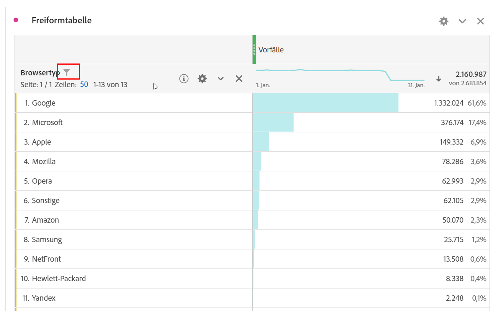

# Dynamische und statische Dimensionselemente

In Freiformtabellen können die Zeilen und Spalten verschiedene Komponentenwerte enthalten. Diese Werte können abhängig von der Analyse, die Sie erstellen möchten, dynamisch (zeitabhängig) oder statisch (nicht zeitabhängig) sein.

## Dynamische Dimensionselemente

Dynamische Dimensionselemente ändern sich mit der Zeit und hängen von der Metrik ab, nach der in der Freiformtabelle sortiert wird. Dynamische Dimensionselemente werden bevorzugt, wenn Sie die obersten Elemente für einen bestimmten Zeitraum analysieren möchten.

Wenn Sie eine Dimension in eine Freiform-Tabelle ablegen, werden dynamische Zeilen zurückgegeben. Dynamische Zeilen stellen die obersten Elemente dar, die der Dimension für eine bestimmte Metrik und einen bestimmten Zeitraum entsprechen. Sie können eine Dimension auch in Freiform-Tabellenspalten ablegen, und die Dimension wird automatisch in die fünf obersten Dimensionselemente erweitert.

Wenn Sie beispielsweise die Dimension „Browser-Typ“ in die Tabelle ziehen, kehren die obersten Dimensionselemente des Browser-Typs (z. B. Microsoft, Apple, Google usw.) dynamisch in die Tabellenzeilen zurück. Wenn sie in eine Spalte abgelegt wurde, werden die obersten 5 Dimensionselemente des Browser-Typs dynamisch zurückgegeben.

Dynamische Dimensionselemente verfügen über die Zeilenfilteroption  und ein  und haben **keine** Sperre . <!--do they have the lock icon? --> Wenn Sie neben einem dynamischen Dimensionselement auf  klicken, wird automatisch ein Filter angewendet. Weitere Informationen zum Anwenden von Filtern auf Tabellen finden Sie unter [Filtern und Sortieren von Tabellen](/help/analyze/analysis-workspace/visualizations/freeform-table/filter-and-sort.md).

## Statische Dimensionselemente

Statische Dimensionselemente ändern sich nicht mit der Zeit. Es handelt sich dabei um feste Komponenten, die immer in einer Freiform-Tabelle zurückgegeben werden. Statische Dimensionselemente werden bevorzugt, wenn Sie immer dasselbe Element analysieren möchten, unabhängig davon, ob es sich um bestimmte Kampagnen oder bestimmte Wochentage handelt.

Jedes Mal, wenn Sie bestimmte Komponentenwerte (Dimension, Metrik, Filter, Datumsbereich) manuell in eine Tabelle eingeben, ist das Ergebnis eine statische Liste von Zeilen oder Spalten. 

Wenn Sie beispielsweise über bestimmte Browser-Typ-Elemente wie „Microsoft“ und „Apple“ ziehen, werden diese beiden Elemente immer in die Tabelle gezogen.

Statische Dimensionselemente können auch erstellt werden, wenn Sie **[!UICONTROL Nur ausgewählte Zeilen anzeigen]** aus dem Kontextmenü für ausgewählte Zeilen auswählen.

Statische Dimensionselemente verfügen **nicht** über die Zeilenfilteroption. Stattdessen sind für jedes Element  und  vorhanden. Wählen Sie  aus, um dieses Dimensionselement aus der Tabelle zu entfernen.

## Gemischte Dimensionselemente

Dimensionselemente aus verschiedenen Dimensionen können derselben Tabelle hinzugefügt werden. In diesen Fällen steht in der Kopfzeile der Zeile **[!UICONTROL Gemischte Dimensionen]**. Diese Dimensionselemente sind statisch. Fügen Sie beispielsweise bestimmte Dimensionselemente aus der Dimension „Browser-Gruppe“ und andere Dimensionselemente aus der Dimension „Browser-Name“ hinzu.

## Freiform-Gesamtzeilen

Dynamische und statische Zeilen verhalten sich in der Freiform-Gesamtzeile unterschiedlich. Standardmäßig:

* Dynamische Zeilen werden Server-seitig summiert und deduplizieren Metriken wie „Sitzungen“ oder „Personen“.
* Statische Zeilen werden Client-seitig summiert und deduplizieren **keine** Metriken. Um die Gesamtzeile Server-seitig zu berechnen, ändern Sie die Zeileneinstellung auf **Gesamtsumme anzeigen**. [Weitere Infos](/help/analyze/analysis-workspace/visualizations/freeform-table/workspace-totals.md)

>[!BEGINSHADEBOX]

Unter  [Neuanordnen von statischen Zeilen](https://video.tv.adobe.com/v/31319?quality=12&learn=on){target="_blank"} finden Sie ein Demovideo.

>[!ENDSHADEBOX]

