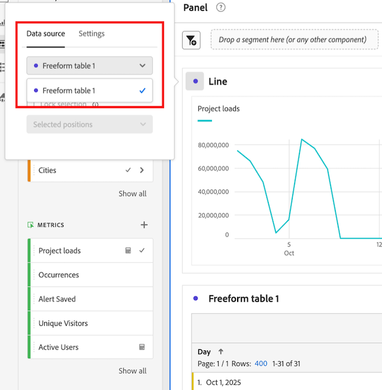

# Anzeigen von Trend-Daten für eine Freiformtabelle

Sie können den Trend der Daten anzeigen, die in einer Freiformtabelle enthalten sind. Diese Trend-Daten werden in Analysis Workspace in den folgenden Bereichen angezeigt:

* [Sparklines](#use-sparklines-to-view-trended-data)

* [Linienvisualisierungen](#use-line-visualizations-to-view-trended-data)

## Verwenden von Sparklines zum Anzeigen von Trend-Daten

Sparklines werden in der Metrik-Spaltenüberschrift von Freiformtabellen angezeigt.

Sparklines umfassen immer:

* Trend-Daten für alle Daten in der Spalte

* Alle Suchfilterkriterien, die auf die Tabellendimension angewendet werden

  Weitere Informationen finden Sie unter [Filtern und Sortieren](/help/analyze/analysis-workspace/visualizations/freeform-table/filter-and-sort.md).

## Verwenden von Linienvisualisierungen zum Anzeigen von Trenddaten

[Line](/help/analyze/analysis-workspace/visualizations/line.md)-Visualisierungen zeigen die Daten der Freiformtabelle an, mit der sie verbunden sind.

### Verbinden einer Linienvisualisierung mit einer Freiformtabelle

Je nachdem, wie und wann die Linienvisualisierung zum Projekt hinzugefügt wurde, ist sie möglicherweise bereits mit der gewünschten Freiformtabelle verbunden. Führen Sie die folgenden Schritte aus, um zu überprüfen oder manuell eine Verbindung herzustellen:

1. Hinzufügen einer Linienvisualisierung zu einem Analysis Workspace-Projekt.

1. Klicken Sie auf den Punkt neben dem Visualisierungsnamen, klicken Sie auf die Registerkarte **[!UICONTROL Datenquelle]** und wählen Sie dann den Namen der Freiformtabelle aus, mit der Sie die Linienvisualisierung verbinden möchten.

   

### Wählen Sie die in der Linienvisualisierung enthaltenen Daten aus

Die in der Visualisierung der verbundenen Zeilen enthaltenen Daten unterscheiden sich je nachdem, welche Zelle in der Freiformtabelle ausgewählt ist.

Um einen Trend aller Daten in der Freiformtabelle anzuzeigen, wählen Sie die Sparkline-Zelle in der Freiformtabelle aus.

Wenn die Sparkline-Zelle ausgewählt ist, wird die Zelle dunkelgrau angezeigt.

Wenn die Sparkline-Zelle der verbundenen Tabelle ausgewählt ist, enthalten Linienvisualisierungen Folgendes:

* Trend-Daten für alle Daten in der Spalte

* Alle Suchfilterkriterien, die auf die Tabellendimension angewendet werden

  Weitere Informationen finden Sie unter [Filtern und Sortieren](/help/analyze/analysis-workspace/visualizations/freeform-table/filter-and-sort.md).

Wenn die Sparkline der verbundenen Tabelle nicht ausgewählt ist, enthalten Linienvisualisierungen Folgendes:

* Daten für die Zeile, die in der verbundenen Tabelle ausgewählt ist. Wenn keine Zeile ausgewählt ist, werden nur Daten für die erste Dimension der verbundenen Tabelle angezeigt.

* Alle auf die Tabellendimension angewendeten Suchfilterkriterien werden ignoriert

  Weitere Informationen finden Sie unter [Filtern und Sortieren](/help/analyze/analysis-workspace/visualizations/freeform-table/filter-and-sort.md).

## Filterkriterien in verbundene Linienvisualisierungen einschließen

Informationen dazu, wann Filterkriterien in Visualisierungen mit verbundenen Linien enthalten sind, finden Sie unter [Filterkriterien in Trend-Daten in Sparklines und Linienvisualisierungen einschließen](/help/analyze/analysis-workspace/visualizations/freeform-table/filter-and-sort.md#include-filter-criteria-in-trended-data-in-sparklines-and-line-visualizations)

