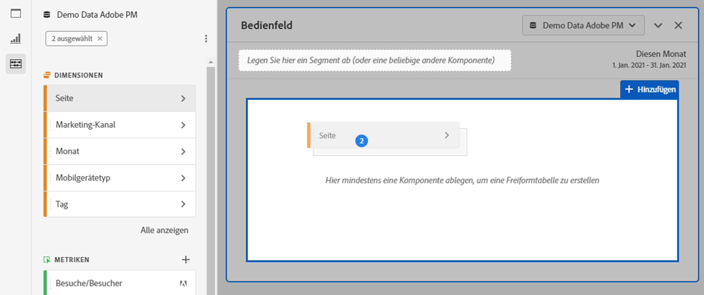

# Überblick über Freiformtabellen {#freeform-table-overview}

<!-- markdownlint-disable MD034 -->

>[!CONTEXTUALHELP]
>id="workspace_freeformtable_button"
>title="Freiformtabelle"
>abstract="Erstellen Sie eine leere Visualisierung einer Freiformtabelle, die Sie mithilfe von Dimensionen, Segmenten, Metriken und Datumsbereichen gestalten können. Sie können die Freiformtabelle als Grundlage für andere Visualisierungen verwenden."

<!-- markdownlint-enable MD034 -->

>[!BEGINSHADEBOX]

_In diesem Artikel wird die Freiformtabellen-Visualisierung in_  _**Adobe Analytics** beschrieben._ _Unter [Freiformtabelle](https://experienceleague.adobe.com/de/docs/analytics-platform/using/cja-workspace/visualizations/freeform-table/freeform-table) finden Sie die Version dieses Artikels für_  _**Customer Journey Analytics**._

>[!ENDSHADEBOX]

In Analysis Workspace bildet eine  **[!UICONTROL Freiformtabellen]**-Visualisierung die Grundlage für die interaktive Analyse von Daten. Sie können eine Kombination von [Komponenten](/help/analyze/analysis-workspace/components/analysis-workspace-components.md) per Drag und Drop in die Zeilen und Spalten ziehen, um eine benutzerdefinierte Tabelle für Ihre Analyse zu erstellen. Sobald eine Komponente abgelegt wird, wird die Tabelle aktualisiert, damit Sie schnell analysieren und weiter recherchieren können.

So erstellen und konfigurieren Sie eine [!UICONTROL Freiformtabelle]:

* Fügen Sie eine Visualisierung  **[!UICONTROL Freiformtabelle]** hinzu. Siehe [Hinzufügen einer Visualisierung zu einem Panel](../freeform-analysis-visualizations.md#add-visualizations-to-a-panel).

## Automatisierte Tabellen

Am schnellsten können Sie eine Tabelle erstellen, indem Sie Komponenten direkt in ein leeres Projekt, ein leeres Bedienfeld oder eine Freiformtabelle ablegen. Eine Freiformtabelle wird in einem empfohlenen Format erstellt. [Tutorial ansehen](https://experienceleague.adobe.com/de/docs/analytics-learn/tutorials/analysis-workspace/building-freeform-tables/auto-build-freeform-tables-in-analysis-workspace).

## Freiformtabellen-Builder

Wenn Sie Ihrer Tabelle lieber zuerst mehrere Komponenten hinzufügen und dann die Daten rendern möchten, können Sie **[!UICONTROL Tabellengenerator aktivieren]** auswählen. Wenn der Generator aktiviert ist, können Sie für komplexere Fragen Tabellen mit Dimensionen, Unterteilungen, Metriken und Filtern per Drag-and-Drop erstellen. Die Daten werden nach Auswahl von **[!UICONTROL Erstellen]** aktualisiert.

## Interaktionen

Es gibt verschiedene Arten, mit Freiformtabellen zu interagieren und sie anzupassen:

### Filtern und Sortieren

* Sie können die Daten in einer Tabelle [filtern und sortieren](filter-and-sort.md).

### Zeilen

* Mit  können Sie schnell aus einer oder mehreren Zeilen [eine neue Visualisierung erstellen](../freeform-analysis-visualizations.md#visualize).
* Sie können mehr Zeilen in einen einzigen Bildschirm einpassen, indem Sie die [Anzeigedichte](/help/analyze/analysis-workspace/build-workspace-project/view-density.md) des Projekts anpassen.
* Jede Dimensionsreihe kann bis zu 400 Zeilen anzeigen, bevor die Paginierung erfolgt. Wählen Sie die Zahl neben **[!UICONTROL Zeilen]** in der ersten Spaltenüberschrift aus, um weitere Zeilen auf einer Seite anzuzeigen. Navigieren Sie mit  in der ersten Spaltenüberschrift zu einer anderen Seite.
* Sie können Zeilen nach zusätzlichen Komponenten aufschlüsseln. Um mehrere Zeilen gleichzeitig aufzuschlüsseln, wählen Sie mehrere Zeilen aus und ziehen Sie dann die nächste Komponente auf die ausgewählten Zeilen. Weitere Informationen zu [Aufschlüsselungen](/help/analyze/analysis-workspace/components/dimensions/t-breakdown-fa.md).
* Zeilen können [gefiltert](/help/analyze/analysis-workspace/visualizations/freeform-table/filter-and-sort.md) werden, um einen reduzierte Anzahl von Elementen anzuzeigen. Weitere Einstellungen finden Sie unter [Zeileneinstellungen](/help/analyze/analysis-workspace/visualizations/freeform-table/column-row-settings/table-settings.md).

### Spalten

* Komponenten können innerhalb von Spalten gestapelt werden, um gefilterte Metriken, tabellenübergreifende Analysen und mehr zu erstellen.
* Die Ansicht jeder Spalte kann unter den [Spalteneinstellungen](/help/analyze/analysis-workspace/visualizations/freeform-table/column-row-settings/column-settings.md) angepasst werden.
* Über das [Kontextmenü](/help/analyze/analysis-workspace/visualizations/freeform-analysis-visualizations.md#context-menu) sind verschiedene Aktionen verfügbar. Das Menü enthält verschiedene Aktionen, je nachdem, ob Sie die Tabellenüberschrift, die Zeilen oder die Spalten auswählen.

## Einstellungen

Wählen Sie  aus, um **[!UICONTROL Tabelleneinstellungen]** anzuzeigen. Die folgenden spezifischen [Visualisierungseinstellungen](../freeform-analysis-visualizations.md#settings) sind verfügbar:

### Datenquelle

| Option | Beschreibung |
|---|---|
| **[!UICONTROL Verknüpfte Visualisierungen]**. | Listet alle verknüpften Visualisierungen auf. |
| **[!UICONTROL Datenquelle zeigen]** | Wenn diese Option deaktiviert ist, wird die Freiformtabelle, die als Datenquelle für die Visualisierung fungiert, in Workspace ausgeblendet. |

### Einstellungen

| Option | Beschreibung |
|---|---|
| **[!UICONTROL Datum in allen Spalten ausrichten, sodass es in derselben Zeile beginnt]** | Um die Daten in allen Spalten so auszurichten oder nicht auszurichten, dass sie alle in derselben Zeile beginnen. |

## Kontextmenü

Die folgenden [Kontextmenü](../freeform-analysis-visualizations.md#context-menu)-Optionen sind in der Kopfzeile der Visualisierung verfügbar:

| Option | Beschreibung |
| --- | --- |
| **[!UICONTROL Kopierte Visualisierung einfügen]**n | Fügen Sie eine kopierte Visualisierung an einer anderen Stelle innerhalb des Projekts oder in ein ganz anderes Projekt ein. |
| **[!UICONTROL Daten in die Zwischenablage kopieren]** | Kopieren Sie Daten aus der Visualisierung in die Zwischenablage. |
| **[!UICONTROL Auswahl in die Zwischenablage kopieren]** | Zum Kopieren der Auswahl aus der Visualisierung in die Zwischenablage. |
| **[!UICONTROL Objekte als CSV herunterladen (*Dimensionsname*)]** | Zum sofortigen Herunterladen der Dimensionselemente (bis zu maximal 50.000) der Visualisierung auf Ihr lokales Gerät. Maximal 50.000 Dimensionselemente für die ausgewählte Dimension. |
| **[!UICONTROL Visualisierung kopieren]** | Kopieren Sie die Visualisierung, sodass Sie sie an einer anderen Stelle innerhalb des Projekts oder in ein ganz anderes Projekt einfügen können. |
| **[!UICONTROL Daten als CSV herunterladen]** | Lädt die angezeigten Daten der Visualisierung sofort auf Ihr lokales Gerät herunter. |
| **[!UICONTROL Visualisierung duplizieren]** | Erstellen Sie ein exaktes Duplikat der Visualisierung. |
| **[!UICONTROL Beschreibung bearbeiten]** | Fügen Sie Text zur Beschreibung der Visualisierung hinzu (oder bearbeiten Sie ihn). Siehe [Text](../text.md). |
| **[!UICONTROL Visualisierungs-Link abrufen]** | Kopieren Sie einen Link und teilen Sie ihn direkt in der Visualisierung. Der Link wird im Dialogfeld „Link freigeben“ angezeigt. Wählen Sie „Kopieren“ aus, um den Link in die Zwischenablage zu kopieren. |
| **[!UICONTROL Neu starten]** | Löscht die Konfiguration für die aktuelle Visualisierung, damit Sie sie von Grund auf neu konfigurieren können. |

## Videos

>[!BEGINSHADEBOX]

Unter  [Freiformtabellen-Builder – Übersicht](https://video.tv.adobe.com/v/31318?quality=12&learn=on){target="_blank"} finden Sie ein Demovideo.

>[!ENDSHADEBOX]

>[!BEGINSHADEBOX]

Unter  [Freiformtabellen-Filter](https://video.tv.adobe.com/v/23232?quality=12&learn=on){target="_blank"} finden Sie ein Demovideo.

>[!ENDSHADEBOX]

>[!BEGINSHADEBOX]

Unter  [Gesamtwerte der Freiformtabelle](https://video.tv.adobe.com/v/29273?quality=12&learn=on){target="_blank"} finden Sie ein Demovideo.

>[!ENDSHADEBOX]

>[!MORELIKETHIS]
>
>[Hinzufügen einer Visualisierung zu einem Bedienfeld](/help/analyze/analysis-workspace/visualizations/freeform-analysis-visualizations.md#add-visualizations-to-a-panel)
>>[Visualisierungseinstellungen](/help/analyze/analysis-workspace/visualizations/freeform-analysis-visualizations.md#settings)
>>[Kontextmenü der Visualisierung](/help/analyze/analysis-workspace/visualizations/freeform-analysis-visualizations.md#context-menu)
>

