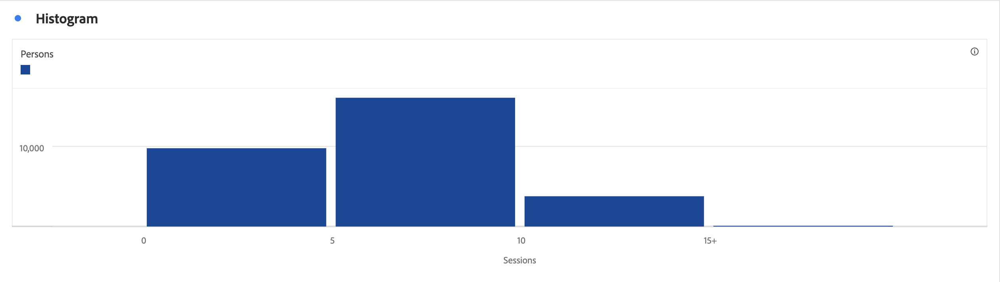

# Histogramm {#histogram}

<!-- markdownlint-disable MD034 -->

>[!CONTEXTUALHELP]
>id="workspace_histogram_button"
>title="Histogramm"
>abstract="Erstellen Sie eine Histogrammvisualisierung, um die Verteilung numerischer Daten in Bereichsgruppen darzustellen."

<!-- markdownlint-enable MD034 -->

>[!BEGINSHADEBOX]

_In diesem Artikel wird die Histogrammvisualisierung in {_} _**Adobe Analytics**._ _Siehe [Histogramm](https://experienceleague.adobe.com/en/docs/analytics-platform/using/cja-workspace/visualizations/histogram) für die_ _**Customer Journey Analytics**-Version dieses Artikels._

>[!ENDSHADEBOX]

Die **[!UICONTROL Histogramm]**-Visualisierung ähnelt einer [!UICONTROL Balken]-Visualisierung, gruppiert jedoch Zahlen in Bereiche (Buckets). Analytics automatisiert diese Zusammenfassung von Zahlen zu Bereichen, wobei Sie jedoch die Einstellungen unter [Erweiterte Einstellungen](#advanced-settings) ändern können.

## Verwenden

So erstellen Sie ein Histogramm:

1. Fügen Sie Histogramm **[!UICONTROL hinzu]**. Siehe [Hinzufügen einer Visualisierung zu einem Bedienfeld](freeform-analysis-visualizations.md#add-visualizations-to-a-panel).
1. Ziehen Sie eine Metrik aus der **[!UICONTROL Metriken]** Komponentenliste oder wählen Sie eine Metrik aus dem [!UICONTROL *Metrik hinzufügen*] Dropdown-Menü aus.
1. (Optional) Wählen Sie **[!UICONTROL Erweiterte Einstellungen anzeigen]** aus. Siehe [Erweiterte Einstellungen](#advanced-settings)
1. Wählen Sie **[!UICONTROL Erstellen]** aus.

>[!NOTE]
>
>Histogramme unterstützen nur Standardmetriken, keine berechneten Metriken.

Im folgenden Beispiel wird ein Histogramm verwendet, um Sitzungen für die Anzahl der Personen zu gruppieren. Das Histogramm zeigt, dass die meisten Personen für den ausgewählten Datumsbereich zwischen 16 und 21 Sitzungen haben.

## Erweiterte Einstellungen

Im Rahmen der Visualisierung stehen spezifische Histogrammeinstellungen zur Verfügung.

| Histogramm-Einstellungen | Beschreibung |
|---|---|
| **[!UICONTROL Start-Bucket]** | Bestimmt, mit welchem Paket das Histogramm beginnt. Die Standardeinstellung lautet 1. Sie können Startwerte von null bis unendlich festlegen, jedoch keine negativen Zahlen. |
| **[!UICONTROL Metrische Buckets]** | Ermöglicht das Erhöhen/Verringern der Anzahl der Datenbereiche (Buckets). Die maximale Anzahl von Buckets ist 50. |
| **[!UICONTROL Metrik-Bucket-Größe]** | Hiermit können Sie die Größe der einzelnen Behälter festlegen. So könnten Sie zum Beispiel die Behältergröße von 1 Seitenansicht zu 2 Seitenansichten ändern. |
| **[!UICONTROL Zählmethode]** | Wählen Sie aus **[!UICONTROL Person]**, **[!UICONTROL Sitzung]** oder **[!UICONTROL Ereignis]**. Zum Beispiel Seitenansichten pro Sitzung oder Seitenansichten pro Person oder Seitenansichten pro Ereignis. |

<!--Russ or Meike - Check Hit Type link above. -->

**Beispiele**:

| Startereimer | Metrische Buckets | Metrik-Bucket-Größe | Ergebnis |
|:----:|:--:|:--:|:--|
| 1 | 5 | 2 |  |
| 0 | 3 | 5 |  |

>[!MORELIKETHIS]
>
>[Hinzufügen einer Visualisierung zu einem Bedienfeld](/help/analyze/analysis-workspace/visualizations/freeform-analysis-visualizations.md#add-visualizations-to-a-panel)
>[Visualisierungseinstellungen](/help/analyze/analysis-workspace/visualizations/freeform-analysis-visualizations.md#settings)
>[Kontextmenü der Visualisierung](/help/analyze/analysis-workspace/visualizations/freeform-analysis-visualizations.md#context-menu)
>[Verwenden von Histogrammen zur Identifizierung unerwarteter Datenwerte](https://experienceleaguecommunities.adobe.com/t5/adobe-analytics-blogs/using-histograms-to-identify-unexpected-data-values/ba-p/596168)

