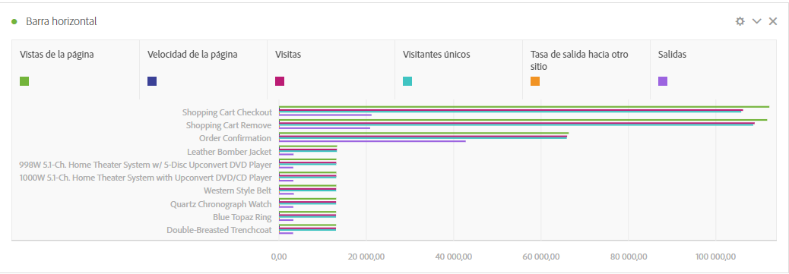
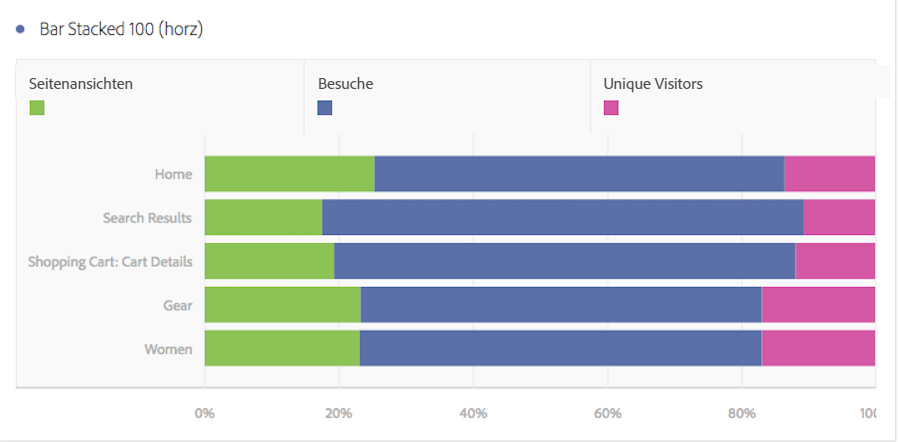

# Horizontalbalken und Horizontalbalken gestapelt

>[!BEGINSHADEBOX]

*In diesem Artikel werden die Visualisierungen „Horizontalbalken“ und „Horizontalbalken gestapelt“ in **Adobe Analytics**. Siehe [Horizontalbalken und Horizontalbalken gestapelt](https://experienceleague.adobe.com/en/docs/analytics-platform/using/cja-workspace/visualizations/horizontal-bar) für die **Customer Journey Analytics**-Version dieses Artikels.*

>[!ENDSHADEBOX]

Die horizontale Balkenvisualisierung hat eine standardmäßige und eine gestapelte Option.

## Horizontalbalken {#horizontal-bar}

<!-- markdownlint-disable MD034 -->

>[!CONTEXTUALHELP]
>id="workspace_horizontalbar_button"
>title="Horizontalbalken"
>abstract="Erstellen Sie eine Horizontalbalkenvisualisierung, um verschiedene Werte aus einer oder mehreren Metriken darzustellen."

<!-- markdownlint-enable MD034 -->

Diese Visualisierung zeigt Horizontalbalken, die verschiedene Werte aus einer oder mehreren Metriken darstellen.

## Horizontalbalken gestapelt {#horizontal-bar-stacked}

<!-- markdownlint-disable MD034 -->

>[!CONTEXTUALHELP]
>id="workspace_horizontalbarstacked_button"
>title="Horizontalbalken gestapelt"
>abstract="Erstellen Sie eine Horizontalbalkenvisualisierung, um verschiedene Werte aus einer oder mehreren gestapelten Metriken darzustellen."

<!-- markdownlint-enable MD034 -->

Diese Visualisierung entspricht dem [!UICONTROL horizontalen Balkendiagramm], die Serien sind hier jedoch gestapelt.

Mit der neuen Einstellung [!UICONTROL Horizontalbalken gestapelt] erhalten Sie eine zu „100 % gestapelte“ Visualisierung.

