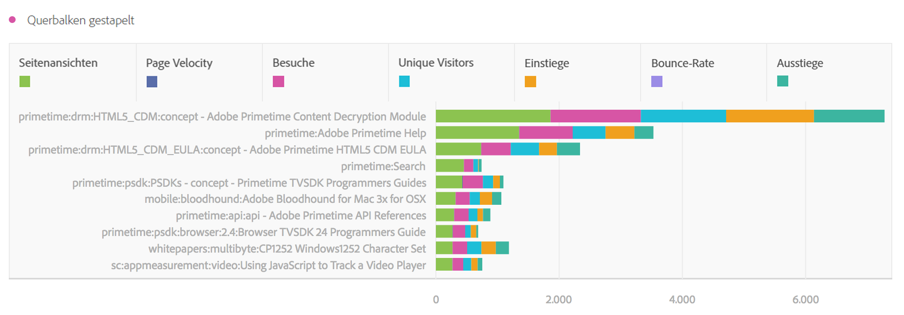

# Horizontalbalken (gestapelt)

>[!BEGINSHADEBOX]

_In diesem Artikel werden die Visualisierungen „Horizontalbalken“ und „Horizontalbalken gestapelt“ in_  _**Adobe Analytics** beschrieben._ _Unter [„Horizontalbalken“ und „Horizontalbalken gestapelt“](https://experienceleague.adobe.com/de/docs/analytics-platform/using/cja-workspace/visualizations/horizontal-bar) finden Sie die Version dieses Artikels für_  _**Customer Journey Analytics**._

>[!ENDSHADEBOX]

Die Horizontalbalkenvisualisierung bietet die Optionen „Standardmäßig“ und „Gestapelt“.

## Horizontalbalken {#horizontal-bar}

<!-- markdownlint-disable MD034 -->

>[!CONTEXTUALHELP]
>id="workspace_horizontalbar_button"
>title="Horizontalbalken"
>abstract="Erstellen Sie eine Horizontalbalkenvisualisierung, um verschiedene Werte aus einer oder mehreren Metriken darzustellen."

<!-- markdownlint-enable MD034 -->

Die  **[!UICONTROL Horizontalbalkenvisualisierung]** zeigt horizontale Balken, die verschiedene Werte aus einer oder mehreren Metriken darstellen.

## Horizontalbalken gestapelt {#horizontal-bar-stacked}

<!-- markdownlint-disable MD034 -->

>[!CONTEXTUALHELP]
>id="workspace_horizontalbarstacked_button"
>title="Horizontalbalken gestapelt"
>abstract="Erstellen Sie eine Horizontalbalkenvisualisierung, um verschiedene Werte aus einer oder mehreren gestapelten Metriken darzustellen."

<!-- markdownlint-enable MD034 -->

Die Visualisierung  **[!UICONTROL Horizontalbalken gestapelt]** entspricht der [!UICONTROL Horizontalbalkenvisualisierung], aber die Serienbalken sind hier gestapelt.

Verwenden Sie die Option **[!UICONTROL 100 % gestapelt]** in den  **[!UICONTROL Einstellungen]**, um das Diagramm in eine zu 100 % gestapelte Visualisierung umzuwandeln.

>[!MORELIKETHIS]
>
>[Hinzufügen einer Visualisierung zu einem Bedienfeld](/help/analyze/analysis-workspace/visualizations/freeform-analysis-visualizations.md#add-visualizations-to-a-panel)
>[Visualisierungseinstellungen](/help/analyze/analysis-workspace/visualizations/freeform-analysis-visualizations.md#settings)
>[Kontextmenü der Visualisierung](/help/analyze/analysis-workspace/visualizations/freeform-analysis-visualizations.md#context-menu)
>

