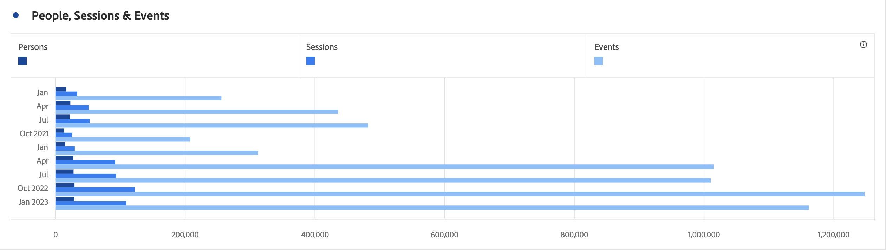

# Horizontalbalken (gestapelt)

>[!BEGINSHADEBOX]

_In diesem Artikel werden die Visualisierungen „Horizontalbalken“ und „Horizontalbalken gestapelt“ in_ _**Adobe Analytics**._ _Siehe [Horizontalbalken und Horizontalbalken gestapelt](https://experienceleague.adobe.com/en/docs/analytics-platform/using/cja-workspace/visualizations/horizontal-bar) für die_ _**Customer Journey Analytics**-Version dieses Artikels._

>[!ENDSHADEBOX]

Die horizontale Balkenvisualisierung hat eine standardmäßige und eine gestapelte Option.

## Horizontalbalken {#horizontal-bar}

<!-- markdownlint-disable MD034 -->

>[!CONTEXTUALHELP]
>id="workspace_horizontalbar_button"
>title="Horizontalbalken"
>abstract="Erstellen Sie eine Horizontalbalkenvisualisierung, um verschiedene Werte aus einer oder mehreren Metriken darzustellen."

<!-- markdownlint-enable MD034 -->

Diese Horizontalbalken **[!UICONTROL -Visualisierung]** horizontale Balken, die verschiedene Werte aus einer oder mehreren Metriken darstellen.

## Horizontalbalken gestapelt {#horizontal-bar-stacked}

<!-- markdownlint-disable MD034 -->

>[!CONTEXTUALHELP]
>id="workspace_horizontalbarstacked_button"
>title="Horizontalbalken gestapelt"
>abstract="Erstellen Sie eine Horizontalbalkenvisualisierung, um verschiedene Werte aus einer oder mehreren gestapelten Metriken darzustellen."

<!-- markdownlint-enable MD034 -->

Die **[!UICONTROL Horizontalbalken gestapelt]**-Visualisierung entspricht der [!UICONTROL Horizontalbalken], die Serienbalken erscheinen jedoch gestapelt.

Verwenden Sie die Option **[!UICONTROL 100 % gestapelt]** in  **[!UICONTROL Einstellungen]**, um das Diagramm in eine 100 % gestapelte Visualisierung umzuwandeln.

>[!MORELIKETHIS]
>
>[Hinzufügen einer Visualisierung zu einem Bedienfeld](/help/analyze/analysis-workspace/visualizations/freeform-analysis-visualizations.md#add-visualizations-to-a-panel)
>[Visualisierungseinstellungen](/help/analyze/analysis-workspace/visualizations/freeform-analysis-visualizations.md#settings)
>[Kontextmenü der Visualisierung](/help/analyze/analysis-workspace/visualizations/freeform-analysis-visualizations.md#context-menu)
>

