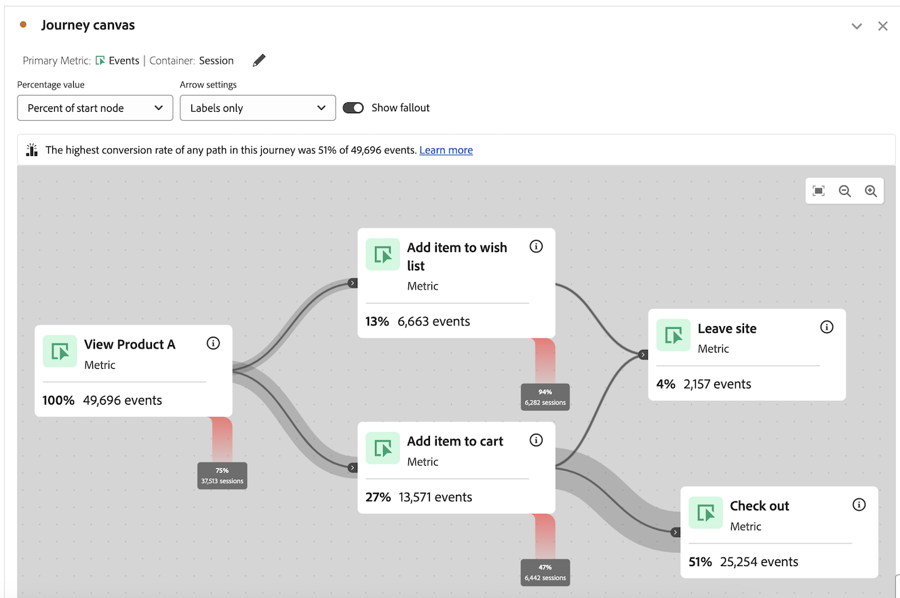

# Konfigurieren einer Journey-Arbeitsflächenvisualisierung {#configure-journey-canvas}

>[!BEGINSHADEBOX]

_In diesem Artikel wird die Journey-Arbeitsflächen-Visualisierung in_ _**Adobe Analytics**.  _ Siehe [Konfigurieren einer Journey-Arbeitsflächen-Visualisierung](https://experienceleague.adobe.com/de/docs/analytics-platform/using/cja-workspace/visualizations/journey-canvas/configure-journey-canvas) für die _**Customer Journey Analytics**Version dieses Artikels._

>[!ENDSHADEBOX]

Die Journey-Arbeitsflächenvisualisierung hilft Ihnen, die Journey zu analysieren und tiefgreifende Erkenntnisse zu gewinnen, die Sie Ihren Benutzenden sowie Kundinnen und Kunden bereitstellen können.

## Journey-Arbeitsfläche – Überblick

Weitere Informationen zur Journey-Arbeitsfläche finden Sie unter [Journey-Arbeitsfläche – Überblick](/help/analyze/analysis-workspace/visualizations/journey-canvas/journey-canvas.md), darunter:

* Wichtigste Funktionen

* Potenzielle Erkenntnisse

* Unterschiede zwischen Journey-Arbeitsfläche und Fallout

* Und vieles mehr

## Beginnen der Erstellung einer Journey-Arbeitsflächenvisualisierung

1. Fügen Sie Ihrem Projekt ein leeres Panel hinzu, wählen Sie in der linken Leiste das Symbol [!UICONTROL **Visualisierungen**] aus und ziehen Sie dann die Visualisierung  [!UICONTROL **Journey-Arbeitsfläche**] in das Panel.

   Oder

   Fügen Sie eine Visualisierung mit einer der Methoden hinzu, die im Abschnitt [Hinzufügen von Visualisierungen zu einem Panel](/help/analyze/analysis-workspace/visualizations/freeform-analysis-visualizations.md#add-visualizations-to-a-panel) in [Visualisierungen – Überblick](/help/analyze/analysis-workspace/visualizations/freeform-analysis-visualizations.md) beschrieben sind.

   

1. Um die Journey-Arbeitsfläche zu konfigurieren, geben Sie die folgenden grundlegenden Informationen an:

   | Feld | Funktion |
   |---------|----------|
   | [!UICONTROL **Primäre Metrik**] | Bestimmt die Metrik, die bei der Berechnung der Prozentwerte und Zahlenwerte für jeden Knoten in der Journey verwendet wird.
**Hinweis:** Der Umfang der in den einzelnen Prozentsätzen und Zahlenwerten enthaltenen Daten wird durch die Metrik bestimmt, die Sie im Feld **[!UICONTROL Journey-Arbeitsflächen-Container]** auswählen. Wenn beispielsweise **[!UICONTROL Person]** als Container festgelegt ist, umfassen die in der Journey angezeigten Statistiken mehrere Sitzungen für eine bestimmte Person. Wenn **[!UICONTROL Sitzung]** als Container festgelegt ist, sind die in der Journey angezeigten Statistiken auf eine einzige definierte Sitzung für eine bestimmte Person beschränkt.

Im Folgenden finden Sie Beispiele dafür, wie sich die primäre Metrik auf den Prozentsatz und die Zahlenwerte der einzelnen Knoten auswirkt:
<ul><li>Wenn _Personen_ die primäre Metrik ist und _Person_ der Container ist, bewegen sich nur die Personen durch die Journey, deren Ereignis den Kriterien jedes nachfolgenden Knotens in der Journey entspricht. Fallout tritt auf einem Knoten auf, wenn eine Person nie an einem der unmittelbar nächsten Knoten in der Journey ankommt. Sie haben möglicherweise andere Aktionen auf der Site durchgeführt, erfüllten jedoch nicht die Kriterien, die von einem der unmittelbar folgenden Knoten definiert wurden.</li><li>Wenn _Personen_ die primäre Metrik ist und _Sitzung_ der Container ist, bewegen sich nur die Personen durch die Journey, deren Ereignis den Kriterien der einzelnen Knoten in der Journey innerhalb einer einzigen Sitzung entspricht. Fallout tritt auf einem Knoten auf, wenn eine Person innerhalb einer einzigen Sitzung nie zu einem der unmittelbar nächsten Knoten in der Journey gelangt ist. Sie haben möglicherweise andere Aktionen auf der Site innerhalb der Sitzung durchgeführt, aber sie erfüllten nicht die Kriterien, die von einem der unmittelbar folgenden Knoten definiert wurden.</li></ul> 
Die primäre Metrik wirkt sich auf die folgenden Aspekte der Journey-Arbeitsflächenvisualisierung aus:
<ul><li>Die Gesamtzahl, die auf jedem Knoten angezeigt wird.  
Wenn beispielsweise „Ereignisse“ die primäre Metrik ist, zeigt jeder Knoten die Anzahl der Personen an, die ein Ereignis hatten, das den Kriterien dieses Knotens entspricht (und jeden vorherigen Knoten, der in der Journey dazu führte).
</li><li>Der auf jedem Knoten angezeigte Prozentsatz. (Nachdem die Visualisierung erstellt wurde, können Sie das Dropdown-Menü **[!UICONTROL Prozentwert]** verwenden, um entweder den Prozentsatz der Summe, den Prozentsatz des vorherigen Knotens oder den Prozentsatz des Startknotens anzuzeigen.)
Wenn beispielsweise „Ereignisse“ die primäre Metrik ist, zeigt jeder Knoten den Prozentsatz der Personen an, die ein Ereignis hatten, das den Kriterien dieses Knotens entspricht (und jeden vorherigen Knoten, der in der Journey dazu führte).
</li><li>Wenn eine Dimension zur Visualisierung hinzugefügt wird, werden die drei wichtigsten Knoten der Visualisierung hinzugefügt, basierend auf der primären Metrik.</li></ul> |
   | [!UICONTROL **Sekundäre Metrik**] | Bestimmt die sekundäre Metrik, die bei der Berechnung der Prozentwerte und Zahlenwerte für jeden Knoten in der Journey verwendet wird. Die sekundäre Metrik ist optional. 
**Hinweis:** Der Umfang der in den einzelnen Prozentsätzen und Zahlenwerten enthaltenen Daten wird durch die Metrik bestimmt, die Sie im Feld **[!UICONTROL Journey-Arbeitsflächen-Container]** auswählen. Wenn beispielsweise **[!UICONTROL Person]** als Container festgelegt ist, umfassen die in der Journey angezeigten Statistiken mehrere Sitzungen für eine bestimmte Person. Wenn **[!UICONTROL Sitzung]** als Container festgelegt ist, sind die in der Journey angezeigten Statistiken auf eine einzige definierte Sitzung für eine bestimmte Person beschränkt.

Wenn eine sekundäre Metrik konfiguriert wird, wirkt sich dies auf die folgenden Aspekte der Journey-Arbeitsflächenvisualisierung aus:
<ul><li>Die Gesamtzahl, die auf jedem Knoten unter der primären Metrik angezeigt wird. 
Wenn beispielsweise „Konten“ die sekundäre Metrik ist, wird die Anzahl der Konten auf dem Knoten für alle Personen angezeigt, die diesen Knoten in der Journey erreicht haben.
</li><li>Der Prozentsatz, der für jeden Knoten unter der primären Metrik angezeigt wird. (Nachdem die Visualisierung erstellt wurde, können Sie entweder den Prozentsatz der Gesamtzahl oder des Startknotens anzeigen.)</li>
Wenn beispielsweise „Sitzungen“ die sekundäre Metrik ist, zeigt jeder Knoten den Prozentsatz der Sitzungen an, die diesen Knoten in der Journey erreicht haben (entweder den Prozentsatz der Gesamtzahl oder des Startknotens).
</li></ul> |

1. (Optional) Wählen Sie [!UICONTROL **Erweiterte Einstellungen einblenden**] und geben Sie dann die folgenden Informationen an:

   | Feld | Funktion |
   |---------|----------|
   | [!UICONTROL **Journey-Arbeitsflächen-Container**] | Wählen Sie den Container aus, auf den Sie sich während der gesamten Journey konzentrieren möchten. Der ausgewählte Container bestimmt den Umfang der in der Journey erfassten Daten. Dies wirkt sich auf die Statistiken aus, die in der Visualisierung angezeigt werden. (Wenn sich Ihre Container-Namen von den unten gezeigten Standardnamen unterscheiden, wurden sie in Ihrer Report Suite angepasst.)<ul><li>**Sitzung:** Beschränkt die Statistiken der Visualisierung so, dass sie in eine einzige definierte Sitzung für eine bestimmte Person fallen. Das bedeutet, dass die Zahlen und Prozentsätze, die auf jedem Knoten angezeigt werden (und auf der Basis der primären und sekundären Metrik basieren), in einer einzelnen Sitzung für jede Person auftreten müssen. Mit anderen Worten kann eine Person mehrmals in einer Journey abgebildet werden.
Dieser Container verwendet die Metrik „Sitzungen“.
</li><li>**Person:** (Standard) Ermöglicht es, dass die Statistiken der Visualisierung mehrere Sitzungen für eine bestimmte Person umfassen können. Das bedeutet, dass die Zahlen und Prozentsätze, die auf jedem Knoten angezeigt werden (und auf der Basis der primären und sekundären Metrik basieren), in einer beliebigen Anzahl von Sitzungen auftreten können, solange die Sitzungen zur selben Person gehören. Mit anderen Worten kann eine Person nur einmal in einer Journey abgebildet werden.
Dieser Container verwendet die Metrik „Personen“.
</li></ul> |

1. Wählen Sie [!UICONTROL **Erstellen**] aus.

1. Konfigurieren Sie die Journey wie unter [Konfigurieren von Visualisierungseinstellungen](#configure-visualization-settings) beschrieben.

## Konfigurieren von Visualisierungseinstellungen {#configure-visualization-settings}

<!-- markdownlint-disable MD034 -->

>[!CONTEXTUALHELP]
>id="aa_journeycanvas_percentage_value"
>title="Berechnung der Prozentsätze wählen"
>abstract="Die Prozentwerte, die für die einzelnen Knoten angezeigt werden, basieren auf der primären und der sekundären Metrik, die Sie konfigurieren. Sie können festlegen, ob sich die Prozentwerte auf den Startknoten, den vorherigen Knoten oder auf alle Daten in der Report Suite beziehen sollen."

<!-- markdownlint-enable MD034 -->

In der Kopfzeile der Journey-Arbeitsfläche stehen verschiedene Konfigurationsoptionen zur Verfügung.

So konfigurieren Sie Einstellungen für die Journey-Arbeitsflächenvisualisierung:

1. Öffnen Sie in Analysis Workspace eine vorhandene Journey-Arbeitsflächenvisualisierung oder [beginnen Sie mit dem Erstellen einer neuen](#begin-building-a-journey-canvas-visualization).

   Optionen zum Konfigurieren der Journey-Arbeitsflächenvisualisierung sind in der Kopfzeile verfügbar:

   

1. Konfigurieren Sie eine der folgenden Einstellungen, die oben in der Visualisierung angezeigt werden:

   | Einstellung | Funktion |
   |---------|----------|
   | [!UICONTROL **Prozentwert**] | Der auf jedem Knoten in der Journey angezeigte Prozentwert.

 
Beachten Sie beim Konfigurieren der auf den Knoten in der Journey angezeigten Prozentwerte Folgendes:
<ul><li>Für die primäre Metrik wird auf jedem Knoten ein Prozentsatz angezeigt. Ein Prozentsatz wird auch für die sekundäre Metrik angezeigt, wenn eine solche konfiguriert ist. (Weitere Informationen zu den Einstellungen der primären und sekundären Metrik finden Sie unter [Beginnen der Erstellung einer Journey-Arbeitsflächenvisualisierung](#begin-building-a-journey-canvas-visualization).)</li><li>Der Prozentsatz umfasst alle Personen oder Sitzungen, die in der Report Suite innerhalb des Datumsbereichs des Bedienfelds enthalten sind. Ob _Personen_ oder _Sitzungen_ verwendet wird, hängt von der Container-Einstellung ab. (Weitere Informationen zur Container-Einstellung finden Sie unter [Beginnen der Erstellung einer Journey-Arbeitsflächenvisualisierung](#begin-building-a-journey-canvas-visualization).)</li></ul> 
Wählen Sie aus den folgenden Optionen:
 <ul><li>[!UICONTROL **Prozentsatz des Startknotens:**] Berechnet die Prozentsätze, die für jeden Knoten im Verhältnis zum Startknoten angezeigt werden. Prozentsätze basieren auf der ausgewählten primären und sekundären Metrik. 
Ein _Startknoten_ ist ein Knoten ohne verbundene vorherige Knoten.

Eine Journey kann mehrere Startknoten enthalten. Jedoch wird [!UICONTROL **Gesamtprozentsatz**] verwendet, wenn die Journey zwei oder mehr Startknoten enthält, die zu einem gemeinsamen Knoten führen. Wenn Sie [!UICONTROL **Prozentsatz des Startknotens**] verwenden möchten, aktualisieren Sie die Journey, damit jeder Knoten in der Journey auf einen einzelnen Startknoten zurückverfolgt werden kann.
</li><li>[!UICONTROL **Prozentsatz des vorherigen Knotens:**] Berechnet die Prozentsätze, die auf jedem Knoten im Verhältnis zum vorherigen Knoten angezeigt werden. Prozentsätze basieren auf der ausgewählten primären und sekundären Metrik.</li><li>[!UICONTROL **Prozent der Gesamtheit**]: Berechnet die Prozentsätze, die auf jedem Knoten in Bezug auf alle Daten in der Report Suite angezeigt werden. Prozentsätze basieren auf der ausgewählten primären und sekundären Metrik.</li></ul> |
   | [!UICONTROL **Pfeil-Einstellungen**] | Die Pfeile, die zwischen den Knoten auf der Journey-Arbeitsfläche angezeigt werden, können so konfiguriert werden, dass benutzerdefinierte Labels und Werte angezeigt werden. 

_Beschriftungen_ sind benutzerdefinierte Namen, die Sie auf der Journey-Arbeitsfläche hinzufügen können, wie unter [Hinzufügen oder Aktualisieren einer Beschriftung auf einem Pfeil](#add-or-update-a-label-on-an-arrow) beschrieben.</li></ol>
_Werte_ sind die Zahlen und Prozentsätze, die auf den Pfeilen angezeigt werden. Sie geben die Personen oder Sitzungen an, die in der Journey von einem Knoten zum nächsten verschoben wurden. (Mit anderen Worten, diejenigen, die nicht aus der Journey herausgefallen sind.) 

Die folgenden Optionen sind verfügbar:
<ul><li>[!UICONTROL **Keine Beschriftungen**]: Auf den Pfeilen auf der Journey werden keine Beschriftungen angezeigt.   Diese Option ist nur verfügbar, wenn die Journey geändert wurde in </li><li>[!UICONTROL **Nur Labels:**] Auf den Pfeilen in der Journey werden Labels angezeigt.</li></ul> |
   | [!UICONTROL **Fallout anzeigen**] | Fallout-Daten zeigen einen Prozentsatz und eine Anzahl an, die aus jedem Knoten der Journey herausfallen. Fallout-Daten basieren auf der Metrik, die den Container-Einstellungen der Journey zugeordnet ist; sie basieren nicht auf der primären oder sekundären Metrik. 

Standardmäßig ist der Container _Person_, sodass die für Fallout-Daten verwendete Metrik _Personen_ lautet. Wenn der Container in _Sitzung_ geändert wird, wird für Fallout-Daten die Metrik _Sitzungen_ verwendet, usw.

Wenn beispielsweise _Person_ als Container-Einstellung festgelegt ist, zeigt der Fallout den Prozentsatz und die Anzahl der Personen auf jedem Knoten der Journey an, die nie auf einem der unmittelbar nächsten Knoten angekommen sind. Sie haben möglicherweise andere Aktionen auf der Site durchgeführt, erfüllten jedoch nicht die Kriterien, die von einem der unmittelbar folgenden Knoten definiert wurden.
 
Weitere Informationen zur Einstellung des Journey-Arbeitsflächen-Containers finden Sie unter [Beginnen der Erstellung einer Journey-Arbeitsflächen-Visualisierung](#begin-building-a-journey-canvas-visualization). |
   | **Zoom-Steuerungen** | Rechts oben in der Arbeitsfläche sind die folgenden Zoom-Steuerelemente Ecke verfügbar:<ul><li>**Einzoomen** : Vergrößert bestimmte Bereiche der Visualisierung.
Sie können auch Maussteuerelemente verwenden, z. B. Aufziehen auf einem Trackpad.</li><li>**Auszoomen** : Verkleinert die Visualisierung, um mehr Platz auf der Arbeitsfläche zu schaffen.
Sie können auch Maussteuerelemente verwenden, z. B. Aufziehen auf einem Trackpad.
</li><li>**Einpassen** : Passt die aktuellen Zoom- und Schwenkeinstellungen an, um den Bildschirm mit der vollständigen Visualisierung zu füllen.</li></ul>
Um nach dem Vergrößern oder Verkleinern ein- und auszuschwenken, klicken Sie mit der Maus und ziehen Sie die Maus an die gewünschte Position.
 |

1. Setzen Sie den Vorgang mit dem [Hinzufügen von Knoten](#add-nodes) fort.

## Hinzufügen von Knoten

In einer Journey-Arbeitsflächenvisualisierung stellen Knoten die Ereignisse oder Aktionen einer Benutzer-Journey dar.

Sie können Knoten wie folgt erstellen: indem Sie Workspace-Komponenten von der linken Leiste auf die Arbeitsfläche ziehen, indem Sie zulassen, dass die Journey-Arbeitsfläche die nächsten oder vorherigen Top-Knoten basierend auf vorhandenen Knoten auswählt, oder indem Sie vorhandene Knoten duplizieren.

### Ziehen von Komponenten aus der linken Leiste

1. Öffnen Sie in Analysis Workspace eine vorhandene Journey-Arbeitsflächenvisualisierung oder [beginnen Sie mit dem Erstellen einer neuen](#begin-building-a-journey-canvas-visualization).

1. Ziehen Sie Metriken, Dimensionen, Dimensionselemente, Segmente oder Datumsbereiche aus der linken Leiste auf die Arbeitsfläche. Berechnete Metriken werden jedoch nicht unterstützt.

   Sie können in der linken Leiste mehrere Komponenten auswählen, indem Sie die Umschalttaste gedrückt halten oder die Befehlstaste (Mac) bzw. die Strg-Taste (Windows) gedrückt halten.

   Die Visualisierung wird anhand der primären Metrik wie folgt aktualisiert (abhängig vom Komponententyp und dem Bereich der Arbeitsfläche, in dem Sie sie platzieren):

   | Typ der Komponente | Platzierung der Komponente | Aktualisierungen der Visualisierung nach dem Hinzufügen eines Knotens |
   |---------|----------|----------|
   | Metrik | Leerer Bereich der Arbeitsfläche | Der Knoten zeigt an, wo die Komponente abgelegt wurde, ohne Verbindung zu vorhandenen Knoten. |
   | Metrik | Ein vorhandener Knoten | Die Komponente wird automatisch mit dem vorhandenen Knoten kombiniert. (Weitere Informationen finden Sie unter [Kombinieren von Knoten](#combine-nodes).) |
   | Metrik | Ein Pfeil zwischen zwei vorhandenen Knoten | Der Knoten wird zwischen den beiden vorhandenen Knoten angezeigt, auf denen die Komponente abgelegt wurde, und ist mit beiden vorhandenen Knoten verbunden. (Weitere Informationen finden Sie unter [Verbinden von Knoten](#connect-nodes).) |
   | Dimension | Leerer Bereich der Arbeitsfläche | 3 Knoten werden für die drei wichtigsten Dimensionselemente erstellt, in denen die Komponente abgelegt wurde, ohne Verbindung zu vorhandenen Knoten. (**Hinweis:** Wenn nur ein oder zwei Knoten angezeigt werden, bedeutet dies, dass nur für einen oder zwei der Dimensionselemente Daten verfügbar sind. Wenn keine Knoten angezeigt werden, bedeutet dies, dass für keines der Dimensionselemente Daten verfügbar sind. Versuchen Sie in diesem Fall, ihn zu einem anderen Punkt der Journey hinzuzufügen, den Datumsbereich der Visualisierung anzupassen oder eine andere Dimension auszuwählen.)
Halten Sie die Umschalttaste gedrückt, wenn Sie die Dimension auf der Arbeitsfläche ablegen, um sie als einen einzelnen Knoten mit drei Dimensionselementen hinzuzufügen.
 |
   | Dimension | Ein vorhandener Knoten | Eine Aufschlüsselung wird automatisch auf den Knoten angewendet, wobei die fünf wichtigsten Dimensionselemente angezeigt werden.<!--what happens if you hold Shift?-->
Um die Aufschlüsselung in einer neuen Freiformtabellenvisualisierung anzuzeigen, klicken Sie auf den Link [!UICONTROL **In Freiformtabelle öffnen**] auf dem Knoten.
 |
   | Dimension | Ein Pfeil, der zwei vorhandene Knoten verbindet | Drei Knoten werden für die drei wichtigsten Dimensionselemente erstellt, die dem ersten Ereignis nach dem ersten Knoten folgen (von Personen/Sitzungen, die schließlich den zweiten Knoten erreichen). Die Knoten werden zwischen den beiden vorhandenen Knoten angezeigt, auf denen die Komponente abgelegt wurde, und jeder Knoten ist mit beiden vorhandenen Knoten verbunden. (**Hinweis:** Wenn nur ein oder zwei Knoten angezeigt werden, bedeutet dies, dass nur für einen oder zwei der Dimensionselemente Daten verfügbar sind. Wenn keine Knoten angezeigt werden, bedeutet dies, dass für keines der Dimensionselemente Daten verfügbar sind. Versuchen Sie in diesem Fall, ihn zu einem anderen Punkt der Journey hinzuzufügen, den Datumsbereich der Visualisierung anzupassen oder eine andere Dimension auszuwählen.)
Halten Sie die Umschalttaste gedrückt, wenn Sie die Dimension auf der Arbeitsfläche ablegen, um sie als einen einzelnen Knoten mit drei Dimensionselementen hinzuzufügen. (Weitere Informationen finden Sie unter [Verbinden von Knoten](#connect-nodes).)
 |
   | Dimensionselement | Leerer Bereich der Arbeitsfläche | Der Knoten zeigt an, wo die Komponente abgelegt wurde, ohne Verbindung zu vorhandenen Knoten. |
   | Dimensionselement | Ein vorhandener Knoten | Die Komponente wird automatisch mit dem vorhandenen Knoten kombiniert. |
   | Dimensionselement | Ein Pfeil, der zwei vorhandene Knoten verbindet | Der Knoten wird zwischen den beiden vorhandenen Knoten angezeigt, auf denen die Komponente abgelegt wurde, und ist mit beiden vorhandenen Knoten verbunden. (Weitere Informationen finden Sie unter [Verbinden von Knoten](#connect-nodes).) |
   | Segment | Leerer Bereich der Arbeitsfläche | Der Knoten zeigt an, wo die Komponente abgelegt wurde, ohne Verbindung zu anderen Knoten.
Zu den Zahlen und Prozentsätzen, die auf dem Knoten angezeigt werden, gehört die Gesamtsumme der primären Metrik, segmentiert nach dem ausgewählten Segment.
 
Wenn zum Beispiel „Personen“ als primäre Metrik für die Journey ausgewählt ist, werden durch Hinzufügen eines Segments „Heute“ zu einem leeren Bereich der Arbeitsfläche alle Personen angezeigt, die heute ein Ereignis hatten.
 |
   | Segment | Ein vorhandener Knoten | Wendet das Segment auf den vorhandenen Knoten an. |
   | Segment | Ein Pfeil, der zwei Knoten verbindet | Der Knoten wird zwischen den beiden vorhandenen Knoten angezeigt, auf denen die Komponente abgelegt wurde, und ist mit beiden vorhandenen Knoten verbunden. (Weitere Informationen finden Sie unter [Verbinden von Knoten](#connect-nodes).)
Wendet das Segment auf den Punkt auf dem Pfad an, auf dem die Komponente abgelegt wurde.
 |
   | Datumsbereich | Leerer Bereich der Arbeitsfläche | Der Knoten zeigt an, wo die Komponente abgelegt wurde, ohne Verbindung zu anderen Knoten.
Zu den auf dem Knoten angezeigten Zahlen und Prozentsätzen gehört die Gesamtanzahl der primären Metrik, segmentiert nach dem ausgewählten Datumsbereich.
 
Wenn beispielsweise „Personen“ als primäre Metrik für die Journey ausgewählt ist, werden durch Hinzufügen eines Datumsbereichs „Dieser Monat“ zu einem leeren Bereich der Arbeitsfläche alle Personen angezeigt, die im aktuellen Monat ein Ereignis hatten.
 |
   | Datumsbereich | Ein vorhandener Knoten | Wendet den Datumsbereich auf den vorhandenen Knoten an. |
   | Datumsbereich | Ein Pfeil, der zwei Knoten verbindet | Der Knoten wird zwischen den beiden vorhandenen Knoten angezeigt, auf denen die Komponente abgelegt wurde, und ist mit beiden vorhandenen Knoten verbunden. (Weitere Informationen finden Sie unter [Verbinden von Knoten](#connect-nodes).)
Wendet den Datumsbereich auf den Punkt des Pfads an, an dem die Komponente abgelegt wurde.
 |
   | Mehrere Komponenten | Ein leerer Bereich der Arbeitsfläche | **Wenn keine der Komponenten Dimensionen sind:**
Jede Komponente wird als separater Knoten angezeigt, auf dem die Komponenten abgelegt wurden, ohne Verbindung zu vorhandenen Knoten.

Halten Sie die Umschalttaste gedrückt, wenn Sie die Komponenten auf der Arbeitsfläche ablegen, um sie als einen kombinierten Knoten hinzuzufügen. 

**Wenn beliebige der Komponenten, die Sie hinzufügen, Dimensionen sind:**

Jede Komponente wird als separater Knoten angezeigt, auf dem die Komponenten abgelegt wurden, ohne Verbindung zu vorhandenen Knoten.

Es kann immer nur eine Dimension gleichzeitig hinzugefügt werden. Wenn die Dimension hinzugefügt wird, werden drei Knoten für die drei Dimensionselemente erstellt, wo die Komponente am häufigsten abgelegt wurde.

Halten Sie die Umschalttaste gedrückt, wenn Sie die Komponenten auf der Arbeitsfläche ablegen, um sie als einen kombinierten Knoten hinzuzufügen. Die drei wichtigsten Dimensionselemente werden mit jedem Knoten kombiniert. (Weitere Informationen finden Sie unter [Kombinieren von Knoten](#combine-nodes).)
 |
   | Mehrere Komponenten | Ein vorhandener Knoten | Alle Komponenten werden mit dem vorhandenen Knoten kombiniert.
Wenn es sich bei einer der Komponenten, die Sie hinzufügen, um Dimensionen handelt, werden die drei wichtigsten Dimensionselemente mit dem Knoten kombiniert.
 
Es kann immer nur eine Dimension gleichzeitig hinzugefügt werden.
 |
   | Mehrere Komponenten | Ein Pfeil, der zwei vorhandene Knoten verbindet | **Wenn keine der Komponenten Dimensionen sind:**
Jede Komponente wird als separater Knoten angezeigt, auf dem die Komponenten abgelegt wurden, und jeder Knoten ist mit beiden vorhandenen Knoten verbunden. (Weitere Informationen finden Sie unter [Verbinden von Knoten](#connect-nodes).)
Halten Sie die Umschalttaste gedrückt, wenn Sie die Komponenten auf der Arbeitsfläche ablegen, um sie als einen kombinierten Knoten hinzuzufügen. (Komponenten müssen vom gleichen Typ sein, damit sie in einem einzelnen Knoten kombiniert werden können.) (Weitere Informationen finden Sie unter [Kombinieren von Knoten](#combine-nodes).)

**Wenn beliebige der Komponenten, die Sie hinzufügen, Dimensionen sind:**

Jede Komponente wird als separater Knoten angezeigt, auf dem die Komponenten abgelegt wurden, und jeder Knoten ist mit beiden vorhandenen Knoten verbunden.

Es kann immer nur eine Dimension gleichzeitig hinzugefügt werden. Wenn die Dimension hinzugefügt wird, werden drei Knoten für die drei Top-Elemente der Dimension erstellt, die dem ersten Ereignis nach dem ersten Knoten folgen (Personen oder Sitzungen, die schließlich den zweiten Knoten erreichen). Jeder Knoten ist mit beiden vorhandenen Knoten verbunden. (Weitere Informationen finden Sie unter [Verbinden von Knoten](#connect-nodes).)

Halten Sie die Umschalttaste gedrückt, wenn Sie die Komponenten auf der Arbeitsfläche ablegen, um sie als einen kombinierten Knoten hinzuzufügen. Die drei Top-Dimensionselemente werden mit jedem Knoten kombiniert, und jeder Knoten ist mit beiden vorhandenen Knoten verbunden. (Weitere Informationen finden Sie unter [Kombinieren von Knoten](#combine-nodes).)
 |

   Knoten werden als rechteckiges Feld mit den folgenden Informationen angezeigt:

   * Name der Komponente

   * Typ der Komponente (z. B. Metrik oder Dimension)

   * Statistiken der primären Metrik (Gesamtwert und Prozentsatz)

   * Statistiken der sekundären Metrik (Gesamtwert und Prozentsatz)

   Ein pulsierender oder leuchtender Knoten zeigt an, dass Daten für diesen Knoten geladen werden.

1. Wiederholen Sie diesen Vorgang, um weitere Knoten hinzuzufügen und Ihre Journey aufzubauen.

1. Passen Sie die Journey wie in den folgenden Abschnitten beschrieben an. Sie können Knoten verbinden, Knoten umbenennen, Aufschlüsselungen anwenden, Zeitbeschränkungen hinzufügen und vieles mehr.

### Anzeigen der Top-Knoten basierend auf vorhandenen Knoten

Sie können die unmittelbaren Top-Knoten automatisch basierend auf den Knoten anzeigen, die sich bereits auf der Arbeitsfläche befinden. Sie können die Top-Knoten zur Journey-Arbeitsfläche hinzufügen oder sie in einer Freiformtabelle anzeigen.

Die Journey-Arbeitsfläche verwendet die primäre Metrik bei der Bestimmung der anzuzeigenden Knoten.

Diese Option ist für die folgenden Objekte auf der Arbeitsfläche verfügbar:

* Einzelne Knoten

* Der Pfeil zwischen den Knoten

#### Anzeigen der Top-Knoten nach einem vorhandenen Knoten

Sie können einen Knoten auswählen und die Top-Dimensionselemente anzeigen, die in der Journey unmittelbar darauf folgen. Sie können die drei Top-Dimensionselemente als separate Knoten zur Journey-Arbeitsfläche hinzufügen oder Sie können alle Top-Dimensionselemente in einer Freiformtabelle anzeigen.

1. Klicken Sie mit der rechten Maustaste auf den Knoten, in dem die Dimensionselemente angezeigt werden sollen, die in der Journey am häufigsten darauf folgen.

   Von diesem Knoten dürfen keine vorhandenen Knoten in der Journey ausgehen.

1. Wählen Sie [!UICONTROL **Top-Knoten unmittelbar nach diesem Knoten anzeigen**] aus.

1. Wählen Sie aus, wo die Dimensionselemente angezeigt werden sollen:

   * [!UICONTROL **In Journey-Arbeitsfläche:**] Fügt der Arbeitsfläche die drei Top-Knoten hinzu, die in der Journey auf diesen Knoten folgen. Jeder Knoten ist mit dem Knoten verbunden, den Sie als separate Verzweigung in der Arbeitsfläche ausgewählt haben.

   * [!UICONTROL **In einer Freiformtabelle:**] Erstellt eine Freiformtabellen-Visualisierung, die alle Top-Dimensionselemente anzeigt, die in der Journey auf diesen Knoten folgen.

1. Wählen Sie die gewünschte Dimension aus der Liste der Dimensionen aus.

   Je nachdem, was Sie im vorherigen Schritt ausgewählt haben, werden die drei Top-Dimensionselemente als drei separate Knoten zur Arbeitsfläche hinzugefügt oder alle Top-Dimensionselemente werden in einer Freiformtabelle angezeigt.

#### Anzeigen der Top-Knoten vor einem vorhandenen Knoten

Sie können einen Knoten auswählen und die Top-Dimensionselemente anzeigen, die ihm in der Journey unmittelbar vorausgehen. Sie können die drei Top-Dimensionselemente als separate Knoten zur Journey-Arbeitsfläche hinzufügen oder Sie können alle Top-Dimensionselemente in einer Freiformtabelle anzeigen.

1. Klicken Sie mit der rechten Maustaste auf den Knoten, in dem die Dimensionselemente angezeigt werden sollen, die ihm in der Journey vorausgehen.

   In diesen Knoten dürfen keine vorhandenen Knoten in der Journey eingehen.

1. Wählen Sie [!UICONTROL **Top-Knoten unmittelbar vor diesem Knoten anzeigen**] aus.

1. Wählen Sie aus, wo die Dimensionselemente angezeigt werden sollen:

   * [!UICONTROL **In Journey-Arbeitsfläche:**] Fügt der Arbeitsfläche die drei Top-Knoten hinzu, die vor diesem Knoten in der Journey auftreten. Jeder Knoten ist mit dem Knoten verbunden, den Sie als separate Verzweigung in der Arbeitsfläche ausgewählt haben.

   * [!UICONTROL **In einer Freiformtabelle:**] Erstellt eine Freiformtabellenvisualisierung, die alle Top-Dimensionselemente anzeigt, die vor diesem Knoten in der Journey auftreten.

1. Wählen Sie die gewünschte Dimension aus der Liste der Dimensionen aus.

   Je nachdem, was Sie im vorherigen Schritt ausgewählt haben, werden die drei Top-Dimensionselemente als drei separate Knoten zur Arbeitsfläche hinzugefügt oder alle Top-Dimensionselemente werden in einer Freiformtabelle angezeigt.

#### Anzeigen von Top-Knoten zwischen vorhandenen Knoten

Sie können einen Pfeil auswählen und die Top-Dimensionselemente anzeigen, die zwischen zwei vorhandenen Knoten in der Journey auftreten. Sie können die drei Top-Dimensionselemente als separate Knoten zur Journey-Arbeitsfläche hinzufügen oder Sie können alle Top-Dimensionselemente in einer Freiformtabelle anzeigen.

1. Klicken Sie mit der rechten Maustaste auf den Pfeil zwischen den beiden Knoten, zwischen denen die Top-Dimensionselemente angezeigt werden sollen.

1. Wählen Sie [!UICONTROL **Top-Knoten zwischen diesen Knoten anzeigen**] aus.

1. Wählen Sie aus, wo die Dimensionselemente angezeigt werden sollen:

   * [!UICONTROL **In Journey-Arbeitsfläche:**] Fügt der Arbeitsfläche die drei Top-Knoten hinzu, die zwischen den beiden vorhandenen Knoten auftreten. Jeder Knoten ist mit den umliegenden Knoten als separate Verzweigung auf der Arbeitsfläche verbunden.

   * [!UICONTROL **In einer Freiformtabelle:**] Erstellt eine Freiformtabellenvisualisierung, die alle Top-Dimensionselemente anzeigt, die zwischen den beiden vorhandenen Knoten auftreten.

1. Wählen Sie die gewünschte Dimension aus der Liste der Dimensionen aus.

   Je nachdem, was Sie im vorherigen Schritt ausgewählt haben, werden die drei Top-Dimensionselemente als drei separate Knoten zur Arbeitsfläche hinzugefügt oder alle Top-Dimensionselemente werden in einer Freiformtabelle angezeigt.

### Duplizieren von Knoten

Die Option zum Duplizieren ist für die folgenden Objekte auf der Arbeitsfläche verfügbar:

* Einzelne Knoten

* Mehrere Knoten

So duplizieren Sie Knoten:

1. Wählen Sie einen oder mehrere Knoten aus, die dupliziert werden sollen.

   Um mehrere Knoten auszuwählen, halten Sie die Befehlstaste (Mac) oder die Strg-Taste (Windows) gedrückt.

1. Klicken Sie mit der rechten Maustaste auf einen der ausgewählten Knoten und wählen Sie dann [!UICONTROL **Duplizieren**].

## Entwerfen der Journey

Die Reihenfolge der Knoten und die Verbindungen zwischen ihnen wirken sich auf die Daten der Journey-Arbeitsfläche aus. Journeys sollten visuell und präzise die Ereignisabfolge widerspiegeln, für die Sie einen Bericht erstellen möchten.

Nachdem Knoten zur Arbeitsfläche hinzugefügt wurden, können Sie sie neu anordnen, kombinieren, verbinden und Zeitbeschränkungen zwischen ihnen hinzufügen.

### Neuanordnen von Knoten

Journeys werden in der Journey-Arbeitsfläche als ein flexibles Diagramm mit Knoten und Pfeilen angezeigt, das eine beliebige Kombination von Ereignissen, Dimensionselementen und Segmenten darstellt.

Sie können Knoten auf die Arbeitsfläche ziehen, um die Ereignisse und Bedingungen der Journey neu anzuordnen.

Wenn Sie die Knotenreihenfolge in der Journey neu anordnen, werden die Daten entsprechend aktualisiert.

### Kombinieren von Knoten

Ein kombinierter Knoten in der Journey-Arbeitsfläche ist ein zentraler Punkt in der Benutzer-Journey (Knoten), der zwei oder mehr Komponenten enthält, die durch Logik miteinander verbunden sind.

#### Erstellen kombinierter Knoten

Sie können einen der folgenden Schritte ausführen, um Knoten auf der Journey-Arbeitsfläche zu kombinieren:

* Ziehen Sie aus der linken Leiste eine einzelne Komponente auf einen Knoten in der Arbeitsfläche.

* Ziehen Sie aus der linken Leiste mehrere Komponenten gleichzeitig auf einen Knoten in der Arbeitsfläche.

* Ziehen Sie bei gedrückter Umschalttaste aus der linken Leiste mehrere Komponenten gleichzeitig auf einen leeren Bereich der Arbeitsfläche.

<!-- * On the canvas, select the nodes that you want to combine, right-click one of the selected nodes, then select **Combine**. Is there a limit on how many you can combine? -->

#### Logik beim Kombinieren von Knoten

Die Logik, die auf Knoten angewendet wird, wenn sie kombiniert werden, unterscheidet sich je nachdem, welche Komponententypen Sie kombinieren, wie folgt:

>[!TIP]
>
>Sie können die Logik eines kombinierten Knotens anzeigen, indem Sie mit der rechten Maustaste auf den Knoten klicken und dann [!UICONTROL **Segment aus Knoten erstellen**] auswählen. Die Logik wird im Abschnitt [!UICONTROL **Definition**] angezeigt.

| Zu kombinierende Komponententypen | Verwendete Logik (Operator) |
|---------|----------|
| Metrik + Metrik | Verbunden mit OR |
| Dimensionselement + Dimensionselement (aus derselben übergeordneten Dimension) | Verbunden mit OR |
| Dimensionselement + Dimensionselement (aus verschiedenen übergeordneten Dimensionen) | Verbunden mit AND |
| Segment + Segment | Verbunden mit AND |
| Dimension + Metrik, Datumsbereich oder Segment | Verbunden mit AND |
| Datumsbereich + Metrik, Segment oder Dimension | Verbunden mit AND |
| Segment + Metrik, Datumsbereich oder Dimension | Verbunden mit AND |

### Verbinden von Knoten

Sie können Knoten verbinden, die sich bereits in der Arbeitsfläche befinden, oder Sie können einen Knoten verbinden, wenn Sie ihn zur Arbeitsfläche hinzufügen.

Sie verbinden Knoten, um die Ereignisabfolge der Journey zu definieren.

#### Pfeile zwischen Knoten

Knoten werden durch einen Pfeil verbunden. Sowohl die Pfeilrichtung als auch die Breite sind von Bedeutung:

* **Richtung:** Gibt die Ereignisabfolge der Journey an

* **Breite:** Gibt das prozentuale Volumen von einem Knoten zum anderen an

  

#### Logik beim Verbinden von Knoten

Wenn Sie Knoten in der Journey-Arbeitsfläche verbinden, werden sie mithilfe des THEN-Operators verbunden. Dies wird auch als [sequenzielle Segmentierung](/help/components/segmentation/segmentation-workflow/seg-sequential-build.md) bezeichnet.

Knoten sind als „endgültiger Pfad“ verbunden, d. h. Besuchende werden gezählt, sofern sie von einem Knoten zum anderen gelangen, unabhängig von etwaigen Ereignissen, die zwischen den beiden Knoten auftreten. Die Zeit, die Benutzenden für das Fortbewegen auf dem Pfad zugeteilt wird, wird durch die Container-Einstellung bestimmt. <!-- It can also be controlled by [adding a time constraint](#add-a-time-constraint-between-nodes). -->

Sie können die Logik von verbundenen Knoten anzeigen, indem Sie mit der rechten Maustaste auf den Knoten klicken und dann [!UICONTROL **Segment aus Knoten erstellen**] auswählen. Die Logik wird im Abschnitt [!UICONTROL **Definition**] angezeigt.

#### Verbinden vorhandener Knoten

Journeys können nicht kreisförmig sein und zu zuvor verbundenen Knoten zurückkehren.

So verbinden Sie Knoten in der Journey-Arbeitsfläche:

1. Bewegen Sie den Mauszeiger in einer Journey-Arbeitsflächenvisualisierung über den Knoten, der als Erstes in der Journey-Sequenz auftritt, zu der Sie eine Verbindung mit einem anderen Knoten herstellen möchten.

   Auf jeder Seite des ausgewählten Knotens werden 4 blaue Punkte angezeigt.

1. Ziehen Sie einen der vier blauen Punkte auf eine der vier Seiten des Knotens, mit dem Sie eine Verbindung herstellen möchten.

   Ein Pfeil wird angezeigt, der die beiden Knoten verbindet. Weitere Informationen finden unter [Pfeile zwischen Knoten](#arrows-between-nodes).

#### Verbinden von Knoten beim Hinzufügen eines Knotens

Beim Hinzufügen eines Knotens zur Arbeitsfläche können Sie ihn zwischen zwei verbundenen Knoten platzieren. Der Knoten wird dem Journey-Fluss zwischen den zwei vorhandenen Knoten hinzugefügt.

Weitere Informationen finden Sie unter [Hinzufügen von Knoten](#add-nodes).

<!--

### Add a time constraint between nodes

>[!AVAILABILITY]
>
>This feature is not yet available.

You can set a time constraint between nodes. When a time constraint is in place, people are considered to have fallen out of the journey if they follow the defined journey but take longer than the allotted time period to move between the nodes.

The option to add a time constraint is available for the following objects on the canvas:

* The arrow between nodes

To add a time constraint:

1. In a Journey canvas visualization, right-click the arrow between 2 nodes, then select [!UICONTROL **Add time constraint**].

from Travis: You can set time to be within X amount of time or after X amount of time (those are the only two options I think, but we can check with Brandon). 
1. Choose from the following options: 

-->

## Verwalten von Knoten oder Pfeilen

<!--

### Change the color of a node or arrow

>[!AVAILABILITY]
>
>This feature is not yet available.

You can visually customize a journey by changing the color of any node or arrow on the canvas. For example, you could adjust colors to indicate a desirable or undesirable event.

The option to change the color is available for the following objects on the canvas:

* Individual nodes

* The arrow between nodes

To change the color of a node or arrow:

1. In a Journey canvas visualization, right-click the node or arrow whose color you want to change.

1. Select [!UICONTROL **Change color**]. 

1. Select the desired color. 

   The following colors are available: 

-->

### Umbenennen von Knoten

Wenn Sie eine Komponente auf eine Journey-Arbeitsflächenvisualisierung ziehen, wird ein Knoten mit demselben Namen wie der Komponentenname erstellt. Sie können den Knoten umbenennen, damit er besser zum Schritt des Journey passt, den der Knoten darstellt.

Die Option zum Umbenennen ist für die folgenden Objekte in der Arbeitsfläche verfügbar:

* Einzelne Knoten

So benennen Sie einen Knoten um:

1. Klicken Sie in einer Journey-Arbeitsflächenvisualisierung mit der rechten Maustaste auf den Knoten, den Sie umbenennen möchten.

1. Wählen Sie [!UICONTROL **Umbenennen**] aus.

1. Geben Sie einen neuen Namen ein und drücken Sie dann die Eingabetaste.<!--is that right?-->

### Hinzufügen oder Aktualisieren eines Labels auf einem Pfeil

Die Pfeile, die zwischen den Knoten auf der Journey-Arbeitsfläche angezeigt werden, können so konfiguriert werden, dass benutzerdefinierte Labels und Werte angezeigt werden.

Labels sind benutzerdefinierte Namen, die auf Pfeilen angezeigt werden. Auf jedem Pfeil wird nur ein einziges Label angezeigt.

Weitere Informationen zu den Labels und Werten, die auf den Pfeilen angezeigt werden, finden Sie unter „Pfeileinstellungen“ in [Konfigurieren von Visualisierungseinstellungen](#configure-visualization-settings).

Die Option zum Hinzufügen oder Aktualisieren eines Labels ist für die folgenden Objekte in der Arbeitsfläche verfügbar:

* Der Pfeil zwischen den Knoten

So fügen Sie einem Pfeil ein Label hinzu:

1. Klicken Sie in einer Journey-Arbeitsflächenvisualisierung mit der rechten Maustaste auf den Pfeil, dem Sie ein Label hinzufügen möchten.

1. Wählen Sie **[!UICONTROL Label hinzufügen]** aus.

1. Geben Sie einen Namen für das Label ein und drücken Sie dann die Eingabetaste.

   Wenn die Pfeileinstellungen so konfiguriert sind, dass Labels ausgeblendet werden, wird eine Meldung angezeigt, in der Sie aufgefordert werden, Labels anzuzeigen.

So aktualisieren Sie ein vorhandenes Label auf einem Pfeil:

1. Klicken Sie in einer Journey-Arbeitsflächenvisualisierung mit der rechten Maustaste auf den Pfeil, dem Sie ein Label hinzufügen möchten.

1. Wählen Sie **[!UICONTROL Label aktualisieren]** aus.

1. Geben Sie einen Namen für das Label ein und drücken Sie dann die Eingabetaste.

   Wenn die Pfeileinstellungen so konfiguriert sind, dass Labels ausgeblendet werden, wird eine Meldung angezeigt, in der Sie aufgefordert werden, Labels anzuzeigen.

### Anwenden einer Aufschlüsselung

Die Option zum Anwenden einer Aufschlüsselung auf Ihre Daten ist für die folgenden Objekte in der Arbeitsfläche verfügbar:

* Einzelne Knoten

* Mehrere Knoten

* Der Pfeil zwischen den Knoten

* Mehrere Pfeile zwischen Knoten

* Fallout-Daten (wenn Fallout auf einem Knoten angezeigt wird)

Beachten Sie beim Anwenden einer Aufschlüsselung Folgendes:

* Aufschlüsselungen werden auf die primäre Metrik angewendet. Die sekundäre Metrik ist nicht betroffen.

* Die Anwendung einer Aufschlüsselung ändert nicht die Journey. Stattdessen wird einfach eine Aufschlüsselung der Daten für den Knoten angezeigt, auf den sie angewendet werden.

* Wenn ein Knoten bereits eine Aufschlüsselung aufweist, wird durch Anwenden einer neuen Aufschlüsselung die vorhandene ersetzt.

* Aufschlüsselungsdaten werden aktualisiert, wenn Änderungen an einem früheren Punkt der Journey vorgenommen werden.

#### Anwenden einer Aufschlüsselung auf Knoten, Pfeile oder Fallout-Daten

1. Führen Sie in einer Journey-Arbeitsflächen-Visualisierung einen der folgenden Schritte aus:

   * Klicken Sie mit der rechten Maustaste auf den Fallout, der von einem Knoten stammt (wenn Fallout angezeigt wird), für den Sie eine Aufschlüsselung anwenden möchten.

   * Wählen Sie einen oder mehrere Knoten aus, auf die Sie eine Aufschlüsselung anwenden möchten, und klicken Sie dann mit der rechten Maustaste auf einen der ausgewählten Knoten.

   * Wählen Sie einen oder mehrere Pfeile zwischen zwei Knoten aus, auf die Sie eine Aufschlüsselung anwenden möchten, und klicken Sie dann mit der rechten Maustaste auf einen der ausgewählten Pfeile.

     Um mehrere Knoten oder Pfeile auszuwählen, halten Sie die Befehlstaste (Mac) oder die Strg-Taste (Windows) gedrückt.

1. Wählen Sie [!UICONTROL **Aufschlüsselung**] aus.

1. Wählen Sie aus, wo die Aufschlüsselung angezeigt werden soll:

   * [!UICONTROL **In Journey-Arbeitsfläche**]

   * [!UICONTROL **In einer Freiformtabelle**]

1. Wählen Sie die Dimension aus, die Sie für die Aufschlüsselung verwenden möchten.

   Wenn Sie die Aufschlüsselung in der Journey-Arbeitsfläche anzeigen möchten, werden die fünf Top-Dimensionselemente auf dem Knoten angezeigt. Auf dem Knoten ist eine Option verfügbar, um die Aufschlüsselung in einer Freiformtabelle zu öffnen.

   Wenn Sie die Aufschlüsselung in einer Freiformtabelle anzeigen möchten, werden die Top-Dimensionselemente in einer neuen Freiformtabelle unmittelbar über der Journey-Arbeitsflächenvisualisierung angezeigt.

#### Anwenden einer Aufschlüsselung auf einen einzelnen Knoten

Sie können eine Dimension aus der linken Leiste auf den Knoten in der Arbeitsfläche ziehen, auf den Sie die Aufschlüsselung anwenden möchten.

Weitere Informationen finden Sie unter [Hinzufügen von Knoten](#add-nodes).

#### Entfernen einer Aufschlüsselung

So entfernen Sie eine angewendete Aufschlüsselung:

1. Klicken Sie mit der rechten Maustaste auf den Knoten, auf den die Aufschlüsselung angewendet wurde.

1. Wählen Sie **[!UICONTROL Aufschlüsselung entfernen]** aus.

### Anzeigen von Trend-Daten

Sie können die Trend-Daten in einem Liniendiagramm für Objekte in der Journey-Arbeitsfläche anzeigen. <!--, with some prebuilt anomaly detection data (this is the definition in Fallout) -->

Die Option für Trends ist für die folgenden Objekte in der Arbeitsfläche verfügbar:

* Einzelne Knoten

* Mehrere Knoten

* Die Pfeile zwischen den Knoten

* Mehrere Pfeile zwischen Knoten

* Fallout-Daten (wenn Fallout auf einem Knoten angezeigt wird)

So zeigen Sie Trend-Daten an:

1. Führen Sie in einer Journey-Arbeitsflächen-Visualisierung einen der folgenden Schritte aus:

   * Klicken Sie mit der rechten Maustaste auf den Fallout, der von einem Knoten stammt (wenn der Fallout angezeigt wird), für den Sie Trenddaten anzeigen möchten.

   * Wählen Sie einen oder mehrere Knoten aus, für die Sie Trenddaten anzeigen möchten, und klicken Sie dann mit der rechten Maustaste auf einen der ausgewählten Knoten.

   * Wählen Sie einen oder mehrere Pfeile zwischen zwei Knoten aus, für die Sie Trenddaten anzeigen möchten, und klicken Sie dann mit der rechten Maustaste auf einen der ausgewählten Pfeile.

     Um mehrere Knoten oder Pfeile auszuwählen, halten Sie die Befehlstaste (Mac) oder die Strg-Taste (Windows) gedrückt.

1. Wählen Sie [!UICONTROL **Trend**] aus.

### Erstellen eines Segments basierend auf einem Knoten, Pfeil oder Fallout

Die Option zum Erstellen eines Segments ist für die folgenden Objekte auf der Arbeitsfläche verfügbar:

* Einzelne Knoten

* Die Pfeile zwischen den Knoten

* Fallout-Daten (wenn Fallout auf einem Knoten angezeigt wird)

Nachdem das Segment erstellt wurde, können Sie es an einer beliebigen Stelle in Analysis Workspace verwenden.

Segmente, die auf der Journey-Arbeitsfläche erstellt wurden, verwenden [sequenzielle Segmentierung](/help/components/segmentation/segmentation-workflow/seg-sequential-build.md). Das bedeutet, dass das Segment den THEN-Operator verwendet, um die Ereignisabfolge (die Journey) zu verknüpfen, die Personen durchlaufen haben, um zum ausgewählten Knoten oder Pfeil zu gelangen. Alle Ereignisse, die mit dem ausgewählten Knoten oder Pfeil übereinstimmen, sind im Segment enthalten.

Wenn Sie ein Segment basierend auf einem Knoten erstellen, in den mehrere Pfade fließen, sind alle Pfade im Segment enthalten. Separate Pfade werden mit dem OR-Operator verbunden.

So erstellen Sie ein Segment:

1. Klicken Sie in einer Journey-Arbeitsflächen-Visualisierung mit der rechten Maustaste auf den Knoten, den Pfeil oder die Fallout-Daten, die Sie zum Erstellen des Segments verwenden möchten.

1. Wählen Sie [!UICONTROL **Segment aus Knoten erstellen**], [!UICONTROL **Segment aus Pfeil erstellen**] oder [!UICONTROL **Segment aus Fallout erstellen**].

   Der Segment Builder wird angezeigt. Im Abschnitt [!UICONTROL **Definition**] wird die Segmentdefinition basierend auf dem ausgewählten Knoten oder Pfeil und seinem Kontext innerhalb der Journey erstellt.

1. Geben Sie einen Titel für das Segment an und nehmen Sie bei Bedarf weitere Änderungen vor. Weitere Informationen zum Erstellen eines Segments finden Sie unter [Segment Builder](/help/components/segmentation/segmentation-workflow/seg-build.md).

1. Wählen Sie [!UICONTROL **Speichern**] aus, um das Segment zu speichern.

### Löschen von Knoten

Sie können innerhalb einer Journey einen Knoten oder mehrere Knoten auf einmal löschen. Wenn Sie einen Knoten löschen, der zwischen zwei Knoten in der Journey verbunden ist, werden die zwei verbleibenden Knoten direkt verbunden.

So löschen Sie Knoten in der Journey-Arbeitsfläche:

1. Wählen Sie in einer Journey-Arbeitsflächenvisualisierung mindestens einen Knoten aus, den Sie löschen möchten, und klicken Sie dann mit der rechten Maustaste auf einen der ausgewählten Knoten.

1. Wählen Sie [!UICONTROL **Löschen**] aus.

### Ausschließen von Knoten

Wenn Sie einen Knoten von einem Journey ausschließen, werden die Journey-Daten aktualisiert, um Journey auszuschließen, die diesen Knoten durchlaufen haben. Die Segmentdefinition für den Journey wird ebenfalls aktualisiert, um Journey auszuschließen, die diesen Knoten durchlaufen haben.

So schließen Sie einen Knoten von einer Journey aus:

1. Klicken Sie in einer Journey-Arbeitsflächen-Visualisierung mit der rechten Maustaste auf den Knoten, den Sie ausschließen möchten.

1. Wählen Sie [!UICONTROL **Aus Journey ausschließen**].

So schließen Sie einen ausgeschlossenen Knoten erneut in die Journey ein:

1. Klicken Sie in einer Journey-Arbeitsflächen-Visualisierung mit der rechten Maustaste auf den ausgeschlossenen Knoten.

1. Wählen Sie [!UICONTROL **Journey-Ausschluss entfernen**].

### Löschen von Pfeilen zwischen Knoten

Sie können innerhalb einer Journey einen Pfeil oder mehrere Pfeile gleichzeitig löschen. Wenn Sie einen Pfeil zwischen zwei Knoten löschen, sind die Knoten nicht mehr verbunden. Wenn der Pfeil Teil eines längeren Pfads war, wird die Pfadverbindung aufgelöst.

So löschen Sie Pfeile zwischen Knoten in der Journey-Arbeitsfläche:

1. Wählen Sie in einer Journey-Arbeitsflächenvisualisierung einen oder mehrere zu löschende Pfeile zwischen zwei Knoten aus, und klicken Sie dann mit der rechten Maustaste auf einen der ausgewählten Pfeile.
1. Wählen Sie [!UICONTROL **Löschen**] aus.
