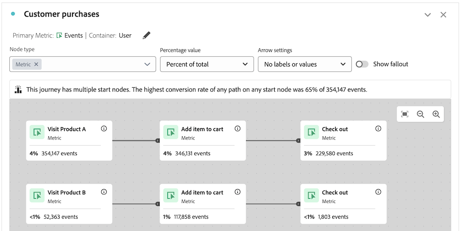

# Journey-Arbeitsfläche – Überblick {#journey-canvas-overview}

<!-- markdownlint-disable MD034 -->

>[!CONTEXTUALHELP]
>id="cja_journeycanvas_button"
>title="Journey-Arbeitsfläche"
>abstract="Zeigt, wie Personen eine Reihe von Touchpoints durchlaufen oder aus ihr aussteigen. Verwenden Sie für Journey mit mehreren Einstiegspunkten und Pfaden."

<!-- markdownlint-enable MD034 -->

<!-- markdownlint-disable MD034 -->

>[!CONTEXTUALHELP]
>id="cja_journeycanvas_panel"
>title="Journey-Arbeitsfläche"
>abstract="Analysieren Sie, wie Personen eine definierte Journey durchlaufen oder aus ihr aussteigen. Erstellen Sie Analysen von Benutzer-Journeys, indem Sie ein flexibles Diagramm mit Knoten und Pfeilen erstellen, das eine beliebige Kombination von Ereignissen, Dimensionselementen und Segmenten darstellt. Ziehen Sie Knoten auf die Arbeitsfläche, um die Ereignisse und Bedingungen der Journey neu anzuordnen. Die Daten werden dabei entsprechend aktualisiert."

<!-- markdownlint-enable MD034 -->

<!-- markdownlint-disable MD034 -->

>[!CONTEXTUALHELP]
>id="journeycanvas_button2"
>title="Journey-Arbeitsfläche"
>abstract="Zeigt, wie Personen eine Reihe von Touchpoints durchlaufen oder aus ihr aussteigen. Verwenden Sie für Journey mit mehreren Einstiegspunkten und Pfaden."

<!-- markdownlint-enable MD034 -->

<!-- markdownlint-disable MD034 -->

>[!CONTEXTUALHELP]
>id="journeycanvas_panel2"
>title="Journey-Arbeitsfläche"
>abstract="Analysieren Sie, wie Personen eine definierte Journey durchlaufen oder aus ihr aussteigen. Erstellen Sie Analysen von Benutzer-Journeys, indem Sie ein flexibles Diagramm mit Knoten und Pfeilen erstellen, das eine beliebige Kombination von Ereignissen, Dimensionselementen und Segmenten darstellt. Ziehen Sie Knoten auf die Arbeitsfläche, um die Ereignisse und Bedingungen der Journey neu anzuordnen. Die Daten werden dabei entsprechend aktualisiert."

<!-- markdownlint-enable MD034 -->

>[!BEGINSHADEBOX]

_In diesem Artikel wird die Journey-Arbeitsflächen-Visualisierung in_ _**Adobe Analytics**.  _ Siehe [Übersicht über das Journey-Arbeitsflächen](https://experienceleague.adobe.com/de/docs/analytics-platform/using/cja-workspace/visualizations/journey-canvas/journey-canvas) für die __**Customer Journey Analytics**-Version dieses Artikels._

>[!ENDSHADEBOX]

{{release-limited-testing}}

Die Journey-Arbeitsflächenvisualisierung hilft Ihnen, die Journey zu analysieren und tiefgreifende Erkenntnisse zu gewinnen, die Sie Ihren Benutzenden sowie Kundinnen und Kunden bereitstellen können. Damit können Sie eine Journey definieren und dann sehen, wie Personen die Journey verlassen (ausgefallen) oder durch sie weitergerissen (gefallen) haben.

Sie können [Analysen von Benutzer-Journeys erstellen](/help/analyze/analysis-workspace/visualizations/journey-canvas/configure-journey-canvas.md), indem Sie eine beliebige Kombination aus Ereignissen, Dimensionselementen, Filtern und Datumsbereichen verwenden, um Journey-Knoten zu erstellen. Verbinden Sie die Knoten, um den Journey-Fluss zu erstellen, und schließen Sie mehrere Pfade und Entscheidungspunkte ein. Ziehen Sie Knoten auf die Arbeitsfläche, um die Ereignisse und Bedingungen der Journey neu anzuordnen. Daten werden bei Änderungen in Echtzeit aktualisiert.

[Knoten sind ](/help/analyze/analysis-workspace/visualizations/journey-canvas/configure-journey-canvas.md#logic-when-connecting-nodes) „Eventueller Pfad“ verbunden, d. h. Besucher werden gezählt, solange sie letztendlich von einem Knoten zum anderen wechseln, unabhängig von Ereignissen, die zwischen den beiden Knoten auftreten. Die Zeit, die Benutzenden für das Fortbewegen auf dem Pfad zugeteilt wird, wird durch die Container-Einstellung bestimmt.

## Wichtigste Funktionen

Zu den wichtigsten Funktionen der Visualisierung „Journey-Arbeitsfläche“ gehören:

* Detaillierte Fallout- und Fallthrough-Analyse, die auch die komplexesten Journey-Benutzerinnen und -Benutzer berücksichtigt.

* Eine Arbeitsfläche zum Zuordnen und Visualisieren der verschiedenen Einstiegspunkte, Knoten und Pfade einer Benutzer-Journey.

* Drag-and-Drop-Interaktionen zum Hinzufügen von Komponenten zur Arbeitsfläche und zum Neupositionieren vorhandener Knoten.

## Potenzielle Erkenntnisse

Die Journey-Arbeitsfläche bietet umsetzbare Erkenntnisse für die komplexesten Journeys.

### Pfad mit der höchsten Konversionsrate {#conversion-rate-caption}

Die auffälligste Erkenntnis auf der Journey-Arbeitsfläche wird oben auf der Arbeitsfläche selbst als Beschriftung angezeigt.

Diese Beschriftung fasst die Pfade der Journey mit der höchsten Konversionsrate zusammen.

Wenn die Journey mehrere Startknoten enthält, sieht die Beschriftung wie folgt aus:

Wenn die Journey einen einzelnen Startknoten enthält, sieht die Beschriftung wie folgt aus:

Beachten Sie bei der Interpretation dieser Beschriftung Folgendes:

* Ein _Pfad_ wird als ein Startknoten definiert, der über Pfeile mit einem Endknoten verbunden ist, wobei eine beliebige Anzahl von Knoten zwischen ihnen verbunden ist.

* Die Berechnung der Konversionsrate hängt vom Typ der Journey ab (die Anzahl der Start- und Endknoten in der Journey und ob sich die Pfade zwischen ihnen schneiden).

  Die folgende Tabelle beschreibt, wie die Konversionsraten anhand des Journey-Typs berechnet werden:

  | Journey-Typ | Berechnung der Konversionsrate | Beispiel |
  |---------|----------|---------|
  | **Ein einzelner Startknoten und ein einzelner Endknoten** | Die Konversionsrate wird berechnet, indem die Zahl des Endknotens durch die Zahl des Startknotens dividiert wird. |  |
  | **Ein einzelner Startknoten und mehrere Endknoten** | Die Konversionsrate wird berechnet, indem der Endknoten mit der höchsten Zahl gefunden und durch die Zahl des Startknotens dividiert wird. |  |
  | **Mehrere eigenständige Pfade, wobei jeder Pfad einen einzelnen Start- und einen einzelnen Endknoten enthält** | Die Konversionsrate wird berechnet, indem die Zahl des Endknotens durch die Zahl des Startknotens dividiert wird. Der Pfad mit der höchsten Konversionsrate wird in der Beschriftung beschrieben. |  |
  | **Mehrere Startknoten, an einem beliebigen Punkt in der Journey zu einem gemeinsamen Knoten zusammenlaufen** | Die Konversionsrate wird berechnet, indem der Endknoten mit der höchsten Zahl gefunden und durch die Zahl des Startknotens mit der niedrigsten Zahl dividiert wird. |  |

### Fallthrough, Fallout und mehr

Im Folgenden finden Sie einige Beispiele für weitere Erkenntnisse, die Sie auf der Journey-Arbeitsfläche finden können. Sie können auswählen, ob diese Einblicke auf allen Personen in der Report Suite, allen Personen, die den Journey gestartet haben, oder auf allen Personen aus dem vorherigen Knoten des Journey basieren.

#### Fall-through (Verbleib)

* Die Anzahl und der Prozentsatz der Personen, die die Journey abgeschlossen haben (am Endknoten angekommen)

* Die Anzahl und der Prozentsatz der Personen, die an einem bestimmten Knoten der Journey angekommen sind

* Der häufigste Schritt, der nach oder vor einem bestimmten Knoten des Journey erfolgte

#### Fallout

* Die Knoten der Journey, an denen die Personen am häufigsten aus der Journey ausgestiegen sind (kamen nie an einem der unmittelbar nächsten Knoten an)

#### Zusätzliche Daten für jeden Knoten

* Fügen Sie für jeden Knoten der Journey eine Aufschlüsselungsdimension hinzu, um zusätzliche Daten für diesen bestimmten Knoten anzuzeigen

## Auswählen zwischen den Visualisierungen „Journey-Arbeitsfläche“, „Fallout“ oder „Flussvisualisierung“

Die Visualisierung „Journey-Arbeitsflächen“ weist Ähnlichkeiten mit der Visualisierung [Fallout](/help/analyze/analysis-workspace/visualizations/fallout/fallout-flow.md) und der Visualisierung [Fluss](/help/analyze/analysis-workspace/visualizations/c-flow/flow.md) auf, jedoch mit wichtigen Unterschieden.

### Informationen zu den Unterschieden

<!-- Information in this snippet is shared between Journey canvas, Fallout, and Flow visualization docs -->

{{journey-visualization-comparisons}}

### Verwendung der Journey-Arbeitsfläche

Die Journey-Arbeitsfläche ist wichtig für Folgendes:

* Fallout-Analyse von Journeys mit mehreren Einstiegspunkten und Pfaden.

* Nichtlineare Journeys mit mehreren Einstiegspunkten und Pfaden und mit einer vordefinierten Seitensequenz.

* Explorative Ad-hoc-Analyse, die auf einer vordefinierten Journey basiert.

* Analyse, für die eine andere primäre Metrik als „Sitzung“, „Person“ oder „Vorfälle“ erforderlich ist.

Verwenden Sie [die Tabelle oben](#understand-the-differences), um die Unterschiede zwischen der Visualisierung Journey-Arbeitsfläche, Fallout und Fluss zu verstehen.

## Erstellen von Analysen auf der Journey-Arbeitsfläche

Sie können Analysen auf der Journey-Arbeitsfläche erstellen, die auf beliebigen in Analysis Workspace verfügbaren Dimensionen oder Metriken basieren. Weitere Informationen finden Sie unter [Konfigurieren einer Visualisierung „Journey-Arbeitsfläche“](/help/analyze/analysis-workspace/visualizations/journey-canvas/configure-journey-canvas.md).

>[!MORELIKETHIS]
>
> * [Anleitung zur Visualisierung „Journey-Arbeitsfläche“ in Adobe Customer Journey Analytics](https://experienceleaguecommunities.adobe.com/t5/adobe-analytics-blogs/a-guide-to-journey-canvas-visualization-in-adobe-customer/ba-p/737857?profile.language=de)

