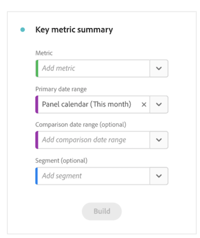

# Zusammenfassung einer Schlüsselmetrik {#key-metric-summary}

<!-- markdownlint-disable MD034 -->

>[!CONTEXTUALHELP]
>id="workspace_keymetricsummary_button"
>title="Zusammenfassung einer Schlüsselmetrik"
>abstract="Erstellen Sie eine Visualisierung, die eine Kombination aus Linien-, Zusammenfassungsänderungs- und Zusammenfassungszahldiagramm darstellt. Verwenden Sie diese Visualisierung, um zu vergleichen, wie wichtige Metriken zwischen zwei Zeiträumen im Trend verlaufen."

<!-- markdownlint-enable MD034 -->

>[!BEGINSHADEBOX]

_In diesem Artikel wird die Visualisierung der Zusammenfassung der Schlüsselmetriken in_ _**Adobe Analytics**._ _Siehe [Zusammenfassung der Schlüsselmetriken](https://experienceleague.adobe.com/en/docs/analytics-platform/using/cja-workspace/visualizations/key-metric) für die_ _**Customer Journey Analytics**-Version dieses Artikels._

>[!ENDSHADEBOX]

Mit der [!UICONTROL Zusammenfassung der Schlüsselmetrik] können Sie sehen, wie eine wichtige Metrik innerhalb eines einzigen Zeitrahmens trendet. Außerdem können Sie damit die Leistung von Metriken über zwei Zeitrahmen hinweg vergleichen. Sie bietet die Vorteile mehrerer Visualisierungen, die in einer Visualisierung kombiniert werden:

* **[!UICONTROL Linie]** Visualisierungen, die zeigen, wie die Metrik für die primären und Vergleichsdatumsbereiche trendet

* **[!UICONTROL Zusammenfassende prozentuale Änderung]**, die die Zunahme oder Abnahme der Metrik zwischen dem primären und dem Vergleichsdatumsbereich anzeigt

* Aktueller Gesamtwert ([!UICONTROL **Summenzahl**]) für die Metrik

## Anwendungsbeispiele

Diese Visualisierung behandelt verschiedene gängige Anwendungsfälle, darunter:

* Ein Analyst, der versucht zu verstehen, wie die Entwicklung der Chancen in diesem Monat im Vergleich zum gleichen Zeitraum des letzten Jahres aussah.

* Ein Vermarkter, der untersucht, wie sich die Lead-Generierung für einen bestimmten Lead-Typ von diesem Monat zum letzten Monat verändert hat.

* Eine Führungskraft, die wissen möchte, wie sich die Buchungen in diesem Quartal im Vergleich zum letzten Quartal verändert haben.

## Konfigurieren der Zusammenfassung einer Schlüsselmetrik

1. Ziehen Sie die Visualisierung **[!UICONTROL Zusammenfassung einer Schlüsselmetrik]** aus dem Menü **[!UICONTROL Visualisierungen]** in der linken Leiste in ein Bedienfeld.

   

1. Konfigurieren Sie die Visualisierung mit den folgenden Optionen:

   | Konfigurationseinstellungen | Definition |
   | --- | --- |
   | **[!UICONTROL Metrik]** | Wählen Sie die Metrik aus, die Sie überprüfen möchten. Alle Metriken werden unterstützt. |
   | **[!UICONTROL Primärer Datumsbereich]** | Der aktuelle Datumsbereich für die Freiformtabelle.
Wählen Sie aus allen verfügbaren Datumsbereichen in Ihrer Report Suite.
 
Wählen Sie [!UICONTROL **Datumsbereich des Bedienfelds**] aus, wenn Sie denselben Datumsbereich verwenden möchten, der in dem Bedienfeld verwendet wird, in dem sich die Visualisierung befindet.
 |
   | **[!UICONTROL Vergleichsdatumsbereich]** | Der Datumsbereich, den Sie mit dem primären Datumsbereich vergleichen möchten. |
   | **[!UICONTROL Segment (optional)]** | Jedes Segment, an dem Sie für diese Zusammenfassung interessiert sind. |

   {style="table-layout:auto"}

   >[!NOTE]
   >
   >Wenn das Feld [!UICONTROL **Primärer Datumsbereich**] auf [!UICONTROL **Datumsbereich des Bedienfelds**] festgelegt ist, kann der **[!UICONTROL Vergleichsdatumsbereich]** automatisch aktualisiert werden, je nachdem, ob die gewählte Option **[!UICONTROL Vergleichsdatumsbereich]** relativ zum primären Datumsbereich oder fest ist.
   >
   >* **Relativ:** Wenn das Feld **[!UICONTROL Vergleichsdatumsbereich]** auf eine Option gesetzt ist, die relativ zum primären Datumsbereich ist ([!UICONTROL **Vortag**], [!UICONTROL **Vorletzter Wochentag**], [!UICONTROL **Selber Tag vor 4 Wochen**] usw.), bewirkt jede Aktualisierung des Felds [!UICONTROL **Primärer Datumsbereich**], dass der **[!UICONTROL Vergleichsdatumsbereich]** automatisch auf den Zeitraum aktualisiert wird, der unmittelbar auf den Datumsbereich des Bedienfelds folgt.
   >* **Behoben:** Wenn das Feld [!UICONTROL **Vergleichsdatumsbereich**] auf einen festen Datumsbereich eingestellt ist (z. B. **3. Februar 2023**), haben Änderungen am Feld [!UICONTROL **Primärer Datumsbereich**] oder am Datumsbereich des Bedienfelds keine Auswirkungen auf den [!UICONTROL **Vergleichsdatumsbereich**]. Alle Aktualisierungen des Datumsbereichs des Bedienfelds führen jedoch dazu, dass der [!UICONTROL **Primäre**] automatisch aktualisiert wird.

1. Wählen Sie **[!UICONTROL Erstellen]** aus.

## Ausgabe anzeigen

Die Ausgabe sollte in etwa so aussehen:

Beachten Sie beim Anzeigen der Ausgabe Folgendes:

* Das **[!UICONTROL Vorheriger Zeitraum]** Liniendiagramm (immer grau dargestellt) entspricht dem **[!UICONTROL Vergleichsdatumsbereich]** im Konfigurationsschritt.

* Wenn während der Konfiguration kein Vergleichsdatumsbereich angegeben ist, oder in den Visualisierungseinstellungen ausgeblendet wird, wird nur das Liniendiagramm für den primären Datumsbereich angezeigt. Die Zusammenfassungsänderung ist ausgeblendet.

* Von hier aus können Sie mit dem Mauszeiger über die Liniendiagramme fahren, um die Statistiken für einzelne Tage zu sehen:

## Visualisierungseinstellungen

Die Zusammenfassung der Schlüsselmetriken bietet mehrere flexible Einstellungen, um eine bessere Berichterstellung und Kommunikation wichtiger Metriken zu ermöglichen. Die Einstellungen können über das Zahnradsymbol in der oberen rechten Ecke der Visualisierung aufgerufen werden.

| Einstellung | Beschreibung |
| --- | --- |
| **[!UICONTROL Prozentuale Veränderung betonen]** | Anzeige der Zusammenfassungsänderung in hervorgehobener fetter Schrift in der Mitte der Visualisierung |
| **[!UICONTROL Zahlenwert hervorheben]** | Anzeige der Zusammenfassungsanzahl in hervorgehobener fetter Schrift in der Mitte der Visualisierung |
| **[!UICONTROL Legende eingeblendet]** | Ein- oder Ausblenden der Legende am unteren Rand der Visualisierung |
| **[!UICONTROL Anmerkungen anzeigen]** | Von einem Administrator hinzugefügte Anmerkungen anzeigen oder ausblenden |
| **[!UICONTROL Sparklines anzeigen]** | Liniendiagramme am unteren Rand des Diagramms anzeigen oder ausblenden. Wenn sie ausgeblendet ist, ändert sich die Legende so, dass sie keinen visuellen Bezug mehr zu den Linien hat |
| **[!UICONTROL Min. und Max. für Wortgrafiken anzeigen]** | Ein- und Ausblenden von Minimal- und Maximalwerten in Primär- und Vergleichsliniendiagrammen |
| **[!UICONTROL Vergleich anzeigen]** | Vergleichsdaten ein- oder ausblenden. Wenn diese Option ausgeblendet ist, werden sowohl das Vergleichszeilendiagramm als auch die Zusammenfassungsänderungsobjekte ausgeblendet. |
| **[!UICONTROL Gesamtanzahl anzeigen]** | Zusammenfassungsnummer anzeigen oder ausblenden |
| **[!UICONTROL Rohdifferenz anzeigen]** | Rohdifferenz zwischen dem Gesamtwert der Metrik im primären Datumsbereich und im sekundären Datumsbereich anzeigen oder ausblenden |
| **[!UICONTROL Wert kürzen]** | Abkürzen von Zahlenwerten zur Vereinfachung der kommunizierten Einblicke (z. B. 20.000 -> 20K) |

## Visualisierung bearbeiten

Nach dem Erstellen der Visualisierung können Sie die ursprüngliche Konfiguration noch bearbeiten.

1. Klicken Sie auf das Stiftsymbol in der oberen rechten Ecke der Visualisierung (neben dem Zahnradsymbol für Einstellungen).

   

   Sie gelangen nun zurück zur ursprünglichen Konfigurationsansicht.

1. Ändern Sie die Metrik, den primären Datumsbereich, den Vergleichsdatumsbereich oder das Segment nach Belieben.
