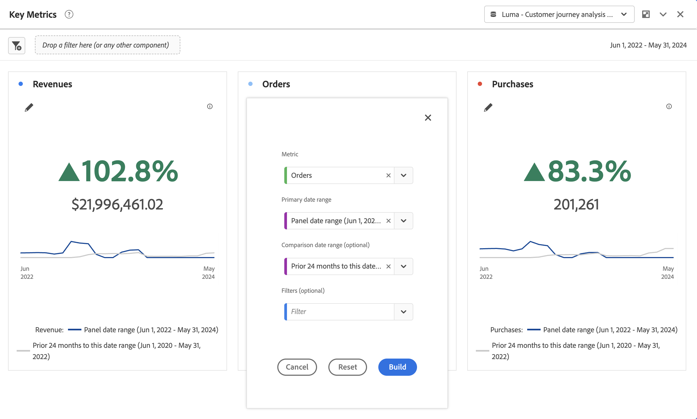
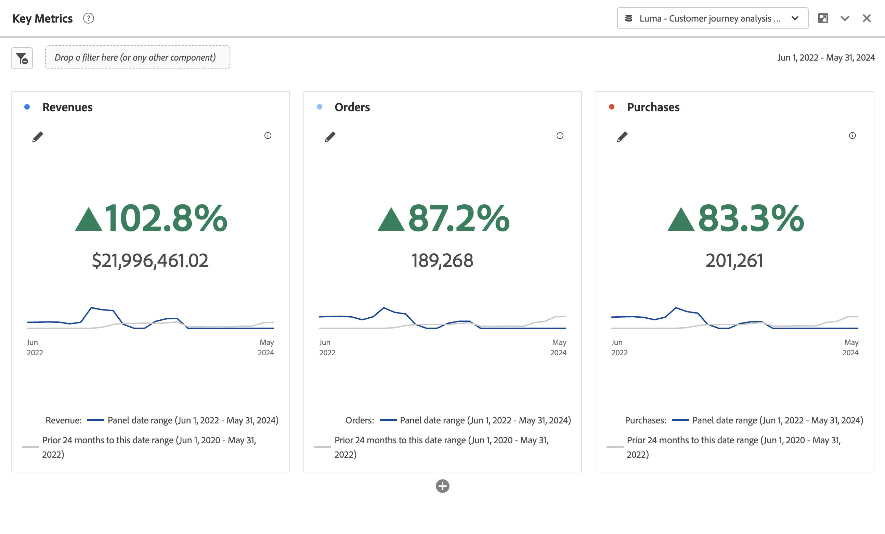

# Zusammenfassung einer Schlüsselmetrik {#key-metric-summary}

>[!CONTEXTUALHELP]
>id="workspace_keymetricsummary_button"
>title="Zusammenfassung einer Schlüsselmetrik"
>abstract="Erstellen Sie eine Visualisierung, die eine Kombination aus Linien-, Zusammenfassungsänderungs- und Zusammenfassungszahldiagramm darstellt. Verwenden Sie diese Visualisierung, um zu vergleichen, wie wichtige Metriken zwischen zwei Zeiträumen im Trend verlaufen."

>[!BEGINSHADEBOX]

_In diesem Artikel wird die Visualisierung der Zusammenfassung der Schlüsselmetriken in_ _&#x200B;**Adobe Analytics**._ _Siehe [Zusammenfassung der Schlüsselmetriken](https://experienceleague.adobe.com/de/docs/analytics-platform/using/cja-workspace/visualizations/key-metric) für die  _&#x200B;**Customer Journey Analytics** dieses Artikels._

>[!ENDSHADEBOX]

Mit der  **[!UICONTROL Zusammenfassung der Schlüsselmetriken]** können Sie sehen, wie sich eine wichtige Metrik innerhalb eines einzigen Zeitrahmens entwickelt. Außerdem können Sie damit die Leistung von Metriken über zwei Zeitrahmen hinweg vergleichen. Sie bietet die Vorteile mehrerer Visualisierungen, die in einer Visualisierung kombiniert werden:

* Die Visualisierung **[!UICONTROL Linie]** zeigt, wie sich die Metrik für den primären und den Vergleichs-Datumsbereich entwickelt

* **[!UICONTROL Zusammenfassende prozentuale Änderung]** zeigt die Zunahme oder Abnahme der Metrik zwischen dem primären und dem Vergleichs-Datumsbereich

* Aktueller Gesamtwert ([!UICONTROL **Summenzahl**]) für die Metrik

## Anwendungsfälle

Diese Visualisierung eignet sich für eine Vielzahl gängiger Anwendungsfälle, darunter:

* Ein Analyst, der versucht zu verstehen, wie die Entwicklung der Chancen in diesem Monat im Vergleich zum gleichen Zeitraum des letzten Jahres aussah.

* Ein Vermarkter, der untersucht, wie sich die Lead-Generierung für einen bestimmten Lead-Typ von diesem Monat zum letzten Monat verändert hat.

* Eine Führungskraft, die wissen möchte, wie sich die Buchungen in diesem Quartal im Vergleich zum letzten Quartal verändert haben.

## Verwenden

1. Fügen Sie eine Visualisierung  **[!UICONTROL Zusammenfassung der Schlüsselmetriken]** hinzu. Siehe [Hinzufügen einer Visualisierung zu einem Panel](freeform-analysis-visualizations.md#add-visualizations-to-a-panel).

1. Konfigurieren Sie die Visualisierung, indem Sie eine **[!UICONTROL Metrik]**, einen **[!UICONTROL primären Datumsbereich]**, einen **[!UICONTROL Vergleichs-Datumsbereich]** (optional) und einen **[!UICONTROL Filter]** (optional) auswählen:

   

   | Option | Beschreibung |
   | --- | --- |
   | **[!UICONTROL Metrik]** | Wählen Sie die Metrik aus, die Sie überprüfen möchten. Alle Metriken werden unterstützt. |
   | **[!UICONTROL Primärer Datumsbereich]** | Der aktuelle Datumsbereich für die Freiformtabelle.
Wählen Sie aus allen verfügbaren Datumsbereichen in Ihrer Report Suite.
 
Wählen Sie [!UICONTROL **Datumsbereich der Panels**] aus, wenn Sie denselben Datumsbereich verwenden möchten, der in dem Panel verwendet wird, in dem sich die Visualisierung befindet.
 |
   | **[!UICONTROL Vergleichsdatumsbereich]** | Der Datumsbereich, den Sie mit dem primären Datumsbereich vergleichen möchten. |
   | **[!UICONTROL Segment (optional)]** | Jedes Segment, an dem Sie für diese Zusammenfassung interessiert sind. |

   {style="table-layout:auto"}

   >[!NOTE]
   >
   >Wenn das Feld [!UICONTROL **Primärer Datumsbereich**] auf [!UICONTROL **Datumsbereich der Panels**] festgelegt ist, kann der **[!UICONTROL Vergleichs-Datumsbereich]** automatisch aktualisiert werden, je nachdem, ob die gewählte Option **[!UICONTROL Vergleichs-Datumsbereich]** relativ zum primären Datumsbereich oder fest ist.
   >
   >* **Relativ:** Wenn das Feld **[!UICONTROL Vergleichs-Datumsbereich]** auf eine Option gesetzt ist, die relativ zum primären Datumsbereich ist ([!UICONTROL **Vortag**], [!UICONTROL **Selber Tag in der letzten Woche**], [!UICONTROL **Selber Tag vor 4 Wochen**] usw.), bewirkt jede Aktualisierung des Felds [!UICONTROL **Primärer Datumsbereich**], dass der **[!UICONTROL Vergleichs-Datumsbereich]** automatisch auf den Zeitraum aktualisiert wird, der unmittelbar auf den Datumsbereich des Panels folgt.
   >* **Fest:** Wenn das Feld [!UICONTROL **Vergleichs-Datumsbereich**] auf einen festen Datumsbereich eingestellt ist (z. B. **3. Februar 2023**), haben Änderungen am Feld [!UICONTROL **Primärer Datumsbereich**] oder am Datumsbereich des Panels keine Auswirkungen auf den [!UICONTROL **Vergleichs-Datumsbereich**]. Allerdings führt jede Aktualisierung des Datumsbereichs des Panels dazu, dass der [!UICONTROL **primäre Datumsbereich**] automatisch aktualisiert wird.

1. Wählen Sie **[!UICONTROL Erstellen]** aus.

Die Ausgabe der Zusammenfassung der Schlüsselmetriken sieht wie folgt aus:

Beachten Sie Folgendes beim Anzeigen dieser Ausgabe:

* Das Liniendiagramm **[!UICONTROL Vorheriger Zeitraum]** (immer grau dargestellt) entspricht dem **[!UICONTROL Vergleichs-Datumsbereich]** im Konfigurationsschritt.

* Wenn während der Konfiguration kein Vergleichsdatumsbereich angegeben ist, oder in den Visualisierungseinstellungen ausgeblendet wird, wird nur das Liniendiagramm für den primären Datumsbereich angezeigt. Die Zusammenfassungsänderung ist ausgeblendet.

* Von hier aus können Sie mit dem Mauszeiger über die Liniendiagramme fahren, um die Statistiken für einzelne Tage zu sehen:

## Konfigurieren

Nach dem Erstellen der Visualisierung können Sie die ursprüngliche Konfiguration bearbeiten.

1. Wählen Sie oben auf der Visualisierung  **[!UICONTROL Visualisierung konfigurieren]** aus.

   Sie gelangen zurück zum ursprünglichen Dialog für die Konfiguration.

1. Ändern Sie die Einstellungen wie gewünscht. Wählen Sie **[!UICONTROL Zurücksetzen]** aus, um die aktuellen Einstellungen zurückzusetzen. Wählen Sie **[!UICONTROL Erstellen]** aus, um die Visualisierung neu zu erstellen.

## Einstellungen

Im Rahmen der Visualisierungseinstellungen sind spezifische Einstellungen für die Zusammenfassung der Schlüsselmetriken verfügbar.

| Einstellung | Beschreibung |
| --- | --- |
| **[!UICONTROL Prozentuale Veränderung betonen]** | Anzeige der Zusammenfassungsänderung in hervorgehobener fetter Schrift in der Mitte der Visualisierung |
| **[!UICONTROL Zahlenwert hervorheben]** | Anzeige der Zusammenfassungsanzahl in hervorgehobener fetter Schrift in der Mitte der Visualisierung |
| **[!UICONTROL Legende eingeblendet]** | Ein- oder Ausblenden der Legende am unteren Rand der Visualisierung |
| **[!UICONTROL Anmerkungen anzeigen]** | Von einem Administrator hinzugefügte Anmerkungen anzeigen oder ausblenden |
| **[!UICONTROL Titel ausblenden]** | Blendet den Titel der Visualisierung aus. |
| **[!UICONTROL Prozentsätze]** | Zeigt die Visualisierung in Prozent anstelle einer Zahl an. |
| **[!UICONTROL Trend-Linien anzeigen]** | Zeigt Trend-Linien in der Visualisierung an. |
| **[!UICONTROL Max. und Min. auf Trend-Linien anzeigen]** | Ein- und Ausblenden von Minimal- und Maximalwerten in Primär- und Vergleichsliniendiagrammen |
| **[!UICONTROL Vergleichsprozentsatz und Trendlinie anzeigen]** | Vergleichsdaten ein- oder ausblenden. Wenn diese Option ausgeblendet ist, werden sowohl das Vergleichs-Liniendiagramm als auch die Zusammenfassungsänderung der Objekte ausgeblendet. |
| **[!UICONTROL Gesamtanzahl anzeigen]** | Zusammenfassungsnummer anzeigen oder ausblenden |
| **[!UICONTROL Rohdifferenz anzeigen]** | Rohdifferenz zwischen dem Gesamtwert der Metrik im primären Datumsbereich und im sekundären Datumsbereich anzeigen oder ausblenden |
| **[!UICONTROL Wert kürzen]** | Wählen Sie **[!UICONTROL Wert abkürzen]**, um den Zahlenwert intelligent zu kürzen. Wenn diese Option ausgewählt ist, geben Sie eine Zahl ein, um den Umfang der Abkürzung zu definieren. Beispiel: <table><tr><td>**Originalwert**</td><td>**Abkürzung**</td><td>**Ergebnis**</td></tr><tr><td>$12,011,141.25</td><td>Nicht ausgewählt</td><td align="right">$12,011,141.25</td></tr><tr><td>$12,011,141.25</td><td>Ausgewählt, auf 1 gesetzt</td><td align="right">12 Mio. USD</td></tr><tr><td>$12,011,141.25</td><td>Ausgewählt, auf 2 gesetzt</td><td align="right">12,0 Mio. USD</td></tr><tr><td>$12,011,141.25</td><td>Ausgewählt, auf 2 gesetzt</td><td align="right">12,01 Mio. USD</td></tr><tr><td>$12,011,141.25</td><td>Ausgewählt, auf 3 gesetzt</td><td align="right">12,01 Mio. USD</td></tr></table> |

## Visualisierung bearbeiten

Nachdem Sie die Visualisierung erstellt haben, können Sie die ursprüngliche Konfiguration bearbeiten.

1. Wählen  der Visualisierung „Bearbeiten“ aus.

   Sie gelangen nun zurück zur ursprünglichen [Konfigurationsansicht](#configure).

1. Ändern Sie die Metrik, den primären Datumsbereich, den Vergleichsdatumsbereich oder das Segment nach Belieben.

>[!MORELIKETHIS]
>
>[Hinzufügen einer Visualisierung zu einem Bedienfeld](/help/analyze/analysis-workspace/visualizations/freeform-analysis-visualizations.md#add-visualizations-to-a-panel)
>[Einstellungen der Visualisierung](/help/analyze/analysis-workspace/visualizations/freeform-analysis-visualizations.md#settings)
>[Kontextmenü der Visualisierung](/help/analyze/analysis-workspace/visualizations/freeform-analysis-visualizations.md#context-menu)

