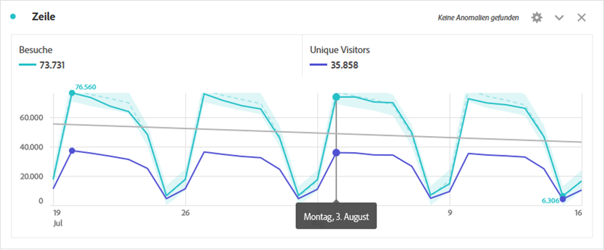
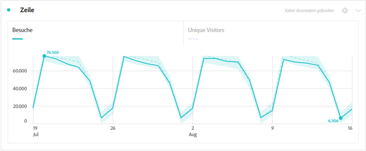

# Linie {#line}

<!-- markdownlint-disable MD034 -->

>[!CONTEXTUALHELP]
>id="workspace_line_button"
>title="Linie"
>abstract="Erstellen Sie eine Linienvisualisierung, die anzeigt, wie sich Werte über einen bestimmten Zeitraum ändern. Eine Linienvisualisierung kann nur verwendet werden, wenn die Zeit als Dimension verwendet wird."

<!-- markdownlint-enable MD034 -->

>[!BEGINSHADEBOX]

_In diesem Artikel wird die Linienvisualisierung in_  _&#x200B;**Adobe Analytics** beschrieben._ _Unter [Linie](https://experienceleague.adobe.com/de/docs/analytics-platform/using/cja-workspace/visualizations/line) finden Sie die Version dieses Artikels für_  _&#x200B;**Customer Journey Analytics**._

>[!ENDSHADEBOX]

Die  **[!UICONTROL Linienvisualisierung]** stellt Metriken anhand einer Linie dar, die den Wertverlauf über einen bestimmten Zeitraum hinweg zeigt. Eine Visualisierung „Linie“ kann nur verwendet werden, wenn die Zeit als Dimension verwendet wird.

## Einstellungen

Im Rahmen der [Visualisierungseinstellungen](freeform-analysis-visualizations.md#settings) sind bestimmte Einstellungen für die Visualisierung „Linie“ verfügbar.

| Einstellung | Beschreibung |
|---|---|
| **[!UICONTROL Granularität]** | Wählen Sie aus der Dropdown-Liste „Granularität“ eine Trend-Visualisierung von täglich über wöchentlich bis monatlich usw. aus. Die Granularität wird auch in der Datenquellentabelle aktualisiert. |
| **[!UICONTROL Min. zeigen]**  **[!UICONTROL Max. zeigen &#x200B;]** | Sie können eine Beschriftung für Minimal- und Maximalwerte überlagern, um die Mindest- und Maximalwerte in einer Metrik hervorzuheben. Die Minimal bzw. Maximalwerte werden aus den sichtbaren Datenpunkten in der Visualisierung abgeleitet, nicht aus dem vollständigen Satz von Werten innerhalb einer Dimension.  |
| **[!UICONTROL Trendlinie anzeigen]** | Sie können eine Trend-Linie für eine Regression oder einen gleitenden Mittelwert zu Ihrer Linienserie hinzufügen. Trend-Linien helfen, ein Muster in den Daten besser darzustellen. Wählen Sie anschließend ein Modell aus der Liste aus. Unter [Modelle](#models) finden Sie einen Überblick und eine Beschreibung der verfügbaren Modelle. .
**TIPP** Es wird empfohlen, Trendlinien auf Daten anzuwenden, die weder das aktuelle Datum (partielle Daten) noch zukünftige Daten enthalten. Das aktuelle Datum oder zukünftige Daten verzerren die Trend-Linie. Wenn Sie jedoch zukünftige Datumsangaben einbeziehen müssen, entfernen Sie Nullen aus den Daten, um eine Verfälschung für diese Tage zu vermeiden. Gehen Sie zur Datenquellentabelle der Visualisierung, wählen Sie Ihre Metrikspalte aus und aktivieren Sie dann **[!UICONTROL Spalteneinstellungen]** > **[!UICONTROL Null als kein Wert auswerten]**.
 |

### Modelle

Alle Trendlinien des Regressionsmodells werden über die reguläre Kleinstquadrat-Methode angepasst:

| Modell | Beschreibung |
| --- | --- |
| **[!UICONTROL Linear]** | Erstellt eine am besten passende gerade Linie für einfache lineare Datensätze und ist nützlich, wenn die Daten stetig zunehmen oder abnehmen. Gleichung: `y = a + b * x` |
| **[!UICONTROL Logarithmisch]** | Erstellt eine am besten passende gekrümmte Linie und ist nützlich, wenn die Änderungsrate der Daten schnell zunimmt oder abnimmt und dann abflacht. Eine logarithmische Trendlinie kann negative und positive Werte verwenden. Gleichung: `y = a + b * log(x)` |
| **[!UICONTROL Exponentiell]** | Erstellt eine gekrümmte Linie und ist nützlich, wenn Daten mit immer stärker steigenden Raten steigen oder fallen. Diese Option sollte nicht verwendet werden, wenn Ihre Daten Null oder negative Werte enthalten. Gleichung: `y = a + e^(b * x)` |
| **[!UICONTROL Potenzfunktion]** | Erstellt eine gekrümmte Linie und ist nützlich für Datensätze, die Messungen vergleichen, welche mit einer bestimmten Rate ansteigen. Diese Option sollte nicht verwendet werden, wenn Ihre Daten Null oder negative Werte enthalten. Gleichung: `y = a * x^b` |
| **[!UICONTROL Quadratisch]** | Findet die beste Anpassung für einen Datensatz in Form einer Parabel (konkav nach oben oder unten). Gleichung: `y = a + b * x + c * x^2` |
| **[!UICONTROL Gleitender Mittelwert]** | Erstellt eine glatte Trend-Linie basierend auf einer Reihe von Durchschnittswerten. Ein gleitender Mittelwert, der auch als rollierender Durchschnitt bezeichnet wird, nutzt eine bestimmte Anzahl von Datenpunkten (bestimmt durch Ihre Auswahl der [!UICONTROL Granularität]), errechnet einen Durchschnittswert und verwendet den Durchschnittswert als Punkt auf der Linie. Beispiele sind der gleitende Mittelwert für 7 Tage oder der gleitende Mittelwert für 4 Wochen. |

>[!MORELIKETHIS]
>
>[Hinzufügen einer Visualisierung zu einem Panel](/help/analyze/analysis-workspace/visualizations/freeform-analysis-visualizations.md#add-visualizations-to-a-panel)
>[Visualisierungseinstellungen](/help/analyze/analysis-workspace/visualizations/freeform-analysis-visualizations.md#settings)
>[Kontextmenü der Visualisierung](/help/analyze/analysis-workspace/visualizations/freeform-analysis-visualizations.md#context-menu)
>

