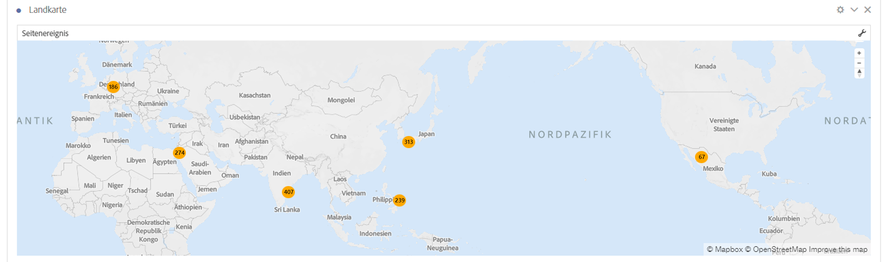

# Zuordnung {#map}

<!-- markdownlint-disable MD034 -->

<!-- markdownlint-disable MD034 -->

>[!CONTEXTUALHELP]
>id="workspace_map_button"
>title="Zuordnung"
>abstract="Diese Visualisierung stellt Metriken dar, indem sie sie auf einer Karte überlagert. Diese Visualisierung ist nützlich, um Daten über verschiedene geografische Regionen hinweg zu identifizieren."

<!-- markdownlint-enable MD034 -->

<!-- markdownlint-disable MD034 -->

>[!CONTEXTUALHELP]
>id="workspace_map_bubbles"
>title="Blasen"
>abstract="Plotten Sie Ereignisse mithilfe von Blasen."

<!-- markdownlint-enable MD034 -->

<!-- markdownlint-disable MD034 -->

>[!CONTEXTUALHELP]
>id="workspace_map_heatmap"
>title="Heatmap"
>abstract="Plotten Sie Ereignisse mithilfe einer Heatmap."

<!-- markdownlint-enable MD034 -->

>[!BEGINSHADEBOX]

_In diesem Artikel wird die Zuordnungsvisualisierung in_  _**Adobe Analytics** beschrieben._ _Siehe [Map](https://experienceleague.adobe.com/en/docs/analytics-platform/using/cja-workspace/visualizations/map) für die_ _**Customer Journey Analytics**-Version dieses Artikels._

>[!ENDSHADEBOX]

Die  **[!UICONTROL Zuordnungsvisualisierung]** in Analysis Workspace

* ermöglicht die Erstellung einer visuellen Zuordnung einer beliebigen Metrik (einschließlich berechneter Metriken),
* ist hilfreich bei der Erfassung und dem Vergleich von Metrikdaten über verschiedene geographische Regionen hinweg,
* kann zwei Datenquellen verwenden: den Breitengrad/Längengrad aus der Verwendung von Mobilgeräten oder die geographische Dimension aus der Internet-Nutzung,
* unterstützt PDF-Exporte und
* nutzt WebGL für die Grafikdarstellung. Wenn Ihre Grafiktreiber die WebGL-Ausgabe nicht unterstützen, müssen Sie sie unter Umständen aktualisieren.

>[!BEGINSHADEBOX]

Unter  [Zuordnungsvisualisierung in Analysis Workspace](https://video.tv.adobe.com/v/23559/?quality=12){target="_blank"} finden Sie ein Demovideo.

>[!ENDSHADEBOX]

## Verwenden

1. Fügen Sie eine  [!UICONTROL Zuordnungsvisualisierung] hinzu. Weitere Informationen finden Sie unter [Hinzufügen einer Visualisierung in einem Bedienfeld](freeform-analysis-visualizations.md#add-visualizations-to-a-panel). Sie können eine Zuordnungsvisualisierung nur auf eine Freiformtabelle ziehen.

   {width="50%"}

1. Wählen Sie eine Metrik aus den Dropdown-Listen aus. Oder ziehen Sie eine Metrik aus der Liste der Metriken (gilt auch für berechnete Metriken) per Drag-and-Drop dazu. 
1. Legen Sie die Datenquelle fest, aus der Sie schöpfen möchten. Dieses Dialogfeld wird nur angezeigt, wenn die Standortverfolgung für die Daten Ihrer mobilen App aktiviert ist.

   | Quelle | Beschreibung |
   | --- | --- |
   | **[!UICONTROL Mobiler Breitengrad/Längengrad]** | Diese Option stellt die Daten der Mobile App dar. Diese Option wird Ihnen nur angezeigt, wenn Sie sie für Ihre Report Suite unter [!UICONTROL Analytics] > [!UICONTROL Admin] > [!UICONTROL Report Suites] > (gewünschte Report Suite) > [!UICONTROL Einstellungen bearbeiten] >  [!UICONTROL Mobile Management] > [!UICONTROL Standortverfolgung aktivieren] aktiviert haben. Diese Einstellung ist die Standardeinstellung (wenn die Standortverfolgung aktiviert ist). |
   | **[!UICONTROL Geographische Dimension]** | Diese Option stellt anhand der IP-Adresse eines Besuchers gewonnene Geosegmentierungsdaten über seinen Standort dar. Diese Daten werden in [!UICONTROL Land], [!UICONTROL Region] und [!UICONTROL Stadt] umgewandelt. Beachten Sie, dass dies nicht bis zu den Ebenen „DMA“ oder „Postleitzahl“ reicht. Diese Dimension ist für beinahe alle Report Suites aktiviert. Wenn das bei Ihrer Report Suite nicht der Fall ist, bitten Sie die Adobe-Kundenunterstützung um Hilfe bei der Aktivierung geographischer Berichte. |

1. Wählen Sie **[!UICONTROL Erstellen]** aus.

   Es wird eine Weltkartenvisualisierung mit Blasen generiert.

   

1. Sie können jetzt:

   * die Landkarte **heranzoomen**, um bestimmte Bereiche zu vergrößern. Klicken Sie dazu doppelt auf die Landkarte oder nutzen Sie das Scrollrad. Die Landkarte wird an der Stelle herangezoomt, an der Sie den Cursor platziert haben. Durch die Zoom-Interaktion wird die erforderliche Dimension (Land > Bundesland > Stadt) basierend auf dem Zoomfaktor aktualisiert.
   * zwei oder mehr Map Visualizations im selben Projekt **vergleichen**. Platzieren Sie sie dazu nebeneinander.
   * **Zeitraumsvergleiche anzeigen (beispielsweise Jahresvergleiche)**:

      * Negative Zahlen anzeigen: Wenn Sie beispielsweise eine Metrik zum Jahresvergleich plotten, kann auf der Karte für New York -33 % angezeigt werden.
      * Mit Metriken des Typs *Prozent* werden die Prozentanzeigen mit Durchschnitten gebündelt.
      * Grünes/rotes Farbschema: Positiv/negativ

   * die Landkarte in 2D oder 3D **drehen**. Halten Sie dazu die Taste [!UICONTROL Strg] gedrückt und verschieben Sie die Landkarte.

   * **Umschalten** auf eine andere Ansicht wie die Heatmap. Nehmen Sie dazu die unten beschriebenen [Einstellungen](/help/analyze/analysis-workspace/visualizations/map-visualization.md#section_5F89C620A6AA42BC8E0955478B3A427E) vor. Beachten Sie, dass die Blasendiagramm-Ansicht die Standardeinstellung ist.

1. **Speichern** Sie das Projekt, um alle Einstellungen an der Landkarte zu speichern (Koordinaten, Zoom, Drehung).
1. Die Freiformtabelle unterhalb der Visualisierung kann befüllt werden, indem Standortdimensionen und Metriken aus der linken Leiste hineingezogen werden:

## Konfigurieren

Um die Zuordnungsvisualisierung erneut zu konfigurieren, wählen Sie  aus.

## Einstellungen

Um Einstellungen für die Visualisierung zu definieren, wählen Sie  aus.

| Einstellung | Beschreibung |
|--- |--- |
| **[!UICONTROL Zuordnungstyp]** | |
| **[!UICONTROL Blasen] | Plottet Ereignisse mithilfe von Blasen. Ein Blasendiagramm ist ein multivariables Diagramm, das eine Kreuzung aus Streudiagramm und proportionalem Flächendiagramm darstellt. Diese Ansicht ist die Standardansicht. |
| [!UICONTROL Heatmap] | Plottet Ereignisse mithilfe einer Heatmap. Eine Heatmap ist eine graphische Darstellung von Daten, bei der die individuellen Werte in einer Matrix als Farben dargestellt werden. |
| **[!UICONTROL Stile]** | |
| [!UICONTROL Farbschema] | Zeigt das Farbschema für die Heatmap und die Blasen. Sie können zwischen Korallenrot, Rot, Grün oder Blau auswählen. Der Standardwert ist „Koralle“.  |
| [!UICONTROL Zuordnungsstil] | Sie können zwischen „Allgemein“, „Straßen“, „Leuchtend“ „Hell“, „Dunkel“ und „Satellit“ auswählen. |
| **[!UICONTROL Clusterradius]** | Gruppiert Datenpunkte zusammen, die sich innerhalb der festgelegten Pixel-Anzahl befinden. Die Standardeinstellung ist „50“. |
| **[!UICONTROL Benutzerdefinierter Maximalwert]** | Ermöglicht es Ihnen, die Schwelle für den Maximalwert für die Zuordnung zu verändern. Wird dieser Wert angepasst, ändert sich auch die Skala für die Werte der Blasen/Heatmap (Farbe und Größe) relativ zum festgelegten Maximalwert. |

<!--
## Build a time-parting heatmap

Here is a video on the topic:

>[!VIDEO](https://video.tv.adobe.com/v/26991/?quality=12)

-->

