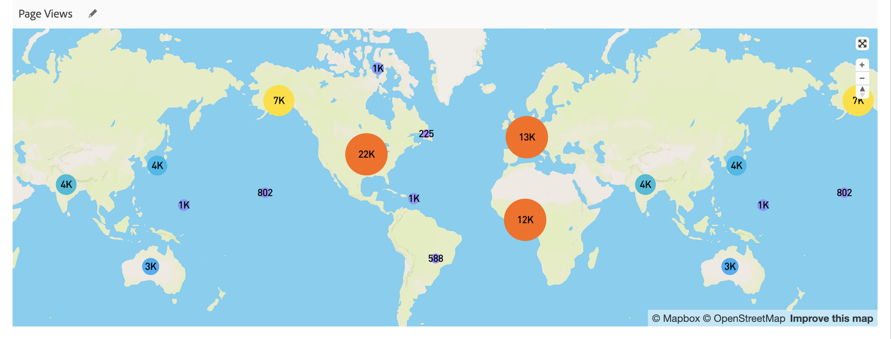

# Zuordnung {#map}

<!-- markdownlint-disable MD034 -->

<!-- markdownlint-disable MD034 -->

>[!CONTEXTUALHELP]
>id="workspace_map_button"
>title="Zuordnung"
>abstract="Diese Visualisierung stellt Metriken dar, indem sie sie auf einer Karte überlagert. Diese Visualisierung ist nützlich, um Daten über verschiedene geografische Regionen hinweg zu identifizieren."

<!-- markdownlint-enable MD034 -->

<!-- markdownlint-disable MD034 -->

>[!CONTEXTUALHELP]
>id="workspace_map_bubbles"
>title="Blasen"
>abstract="Plotten Sie Ereignisse mithilfe von Blasen."

<!-- markdownlint-enable MD034 -->

<!-- markdownlint-disable MD034 -->

>[!CONTEXTUALHELP]
>id="workspace_map_heatmap"
>title="Heatmap"
>abstract="Plotten Sie Ereignisse mithilfe einer Heatmap."

<!-- markdownlint-enable MD034 -->

>[!BEGINSHADEBOX]

_In diesem Artikel wird die Zuordnungsvisualisierung in_  _**Adobe Analytics** beschrieben._ _Siehe [Map](https://experienceleague.adobe.com/en/docs/analytics-platform/using/cja-workspace/visualizations/map) für die_ _**Customer Journey Analytics**-Version dieses Artikels._

>[!ENDSHADEBOX]

Die  **[!UICONTROL Zuordnungsvisualisierung]** in Analysis Workspace

* ermöglicht die Erstellung einer visuellen Zuordnung einer beliebigen Metrik (einschließlich berechneter Metriken),
* ist hilfreich bei der Erfassung und dem Vergleich von Metrikdaten über verschiedene geographische Regionen hinweg,
* kann zwei Datenquellen verwenden: den Breitengrad/Längengrad aus der Verwendung von Mobilgeräten oder die geographische Dimension aus der Internet-Nutzung,
* unterstützt PDF-Exporte und
* nutzt WebGL für die Grafikdarstellung. Wenn Ihre Grafiktreiber die WebGL-Ausgabe nicht unterstützen, müssen Sie sie unter Umständen aktualisieren.

>[!BEGINSHADEBOX]

Unter  [Zuordnungsvisualisierung in Analysis Workspace](https://experienceleague.adobe.com/en/docs/analytics-learn/tutorials/analysis-workspace/visualizations/map-visualization){target="_blank"} finden Sie ein Demovideo.

>[!ENDSHADEBOX]

## Verwenden

1. Fügen Sie eine  [!UICONTROL Zuordnungsvisualisierung] hinzu. Weitere Informationen finden Sie unter [Hinzufügen einer Visualisierung in einem Bedienfeld](freeform-analysis-visualizations.md#add-visualizations-to-a-panel). Sie können eine Zuordnungsvisualisierung nur auf eine Freiformtabelle ziehen.

   {width="50%"}

1. Wählen Sie eine Metrik aus den Dropdown-Listen aus. Oder ziehen Sie eine Metrik aus der Liste der Metriken (gilt auch für berechnete Metriken) per Drag-and-Drop dazu. 
1. Legen Sie die Datenquelle fest, aus der Sie schöpfen möchten. Dieses Dialogfeld wird nur angezeigt, wenn die Standortverfolgung für die Daten Ihrer mobilen App aktiviert ist.

   | Quelle | Beschreibung |
   | --- | --- |
   | **[!UICONTROL Mobiler Breitengrad/Längengrad]** | Diese Option stellt die Daten der Mobile App dar. Diese Option wird Ihnen nur angezeigt, wenn Sie sie für Ihre Report Suite unter [!UICONTROL Analytics] > [!UICONTROL Admin] > [!UICONTROL Report Suites] > (gewünschte Report Suite) > [!UICONTROL Einstellungen bearbeiten] >  [!UICONTROL Mobile Management] > [!UICONTROL Standortverfolgung aktivieren] aktiviert haben. Diese Einstellung ist die Standardeinstellung (wenn die Standortverfolgung aktiviert ist). |
   | **[!UICONTROL Geographische Dimension]** | Diese Option stellt anhand der IP-Adresse eines Besuchers gewonnene Geosegmentierungsdaten über seinen Standort dar. Diese Daten werden in [!UICONTROL Land], [!UICONTROL Region] und [!UICONTROL Stadt] umgewandelt. Beachten Sie, dass dies nicht bis zu den Ebenen „DMA“ oder „Postleitzahl“ reicht. Für fast alle Report Suites ist diese Dimension aktiviert. Wenden Sie sich andernfalls an die Adobe-Kundenunterstützung, um geografische Berichte aktivieren zu lassen. |

1. Wählen Sie **[!UICONTROL Erstellen]** aus.

   Es wird eine Weltkartenvisualisierung mit Blasen generiert.

   

1. Sie können jetzt:

   * **Zoom** in diese Karte, um bestimmte Bereiche durch Doppelklicken auf die Karte oder durch Verwenden des Scrollrads zu vergrößern. Die Karte zoomt entsprechend der Position des Cursors. Durch die Zoom-Interaktion wird die erforderliche Dimension (Land > Bundesland > Stadt) basierend auf der Zoom-Ebene automatisch aktualisiert.
   * **Vergleichen** Sie zwei oder mehr Kartenvisualisierungen im selben Projekt, indem Sie sie nebeneinander platzieren.
   * **Vergleiche von Zeiträumen (z. B. Jahr-über-Jahr) anzeigen**:

      * Negative Zahlen anzeigen: Wenn Sie beispielsweise eine Metrik im Jahresvergleich darstellen, kann die Karte -33 % über New York anzeigen.
      * Mit Metriken des Typs *Prozent* werden die Prozentanzeigen mit Durchschnitten gebündelt.
      * Ein grün/rot Farbschema: positiv/negativ

   * **Drehen** Sie die Karte in 2D oder 3D, indem Sie die [!UICONTROL Strg]-Taste gedrückt halten und die Karte verschieben.

   * **Umschalten** auf eine andere Ansicht wie die Heatmap. Nehmen Sie dazu die unten beschriebenen [Einstellungen](/help/analyze/analysis-workspace/visualizations/map-visualization.md#section_5F89C620A6AA42BC8E0955478B3A427E) vor. Beachten Sie, dass die Bubble-Ansicht die Standardeinstellung ist.

1. **Speichern** das Projekt, um alle Karteneinstellungen (Koordinaten, Zoom, Drehung) zu speichern.
1. Die Freiformtabelle unterhalb der Visualisierung kann befüllt werden, indem Standortdimensionen und Metriken aus der linken Leiste hineingezogen werden:

## Konfigurieren

Um die Zuordnungsvisualisierung erneut zu konfigurieren, wählen Sie  aus.

## Einstellungen

Um Einstellungen für die Visualisierung zu definieren, wählen Sie  aus.

| Einstellung | Beschreibung |
|--- |--- |
| **[!UICONTROL Zuordnungstyp]** | |
| **[!UICONTROL Blasen] | Zeichnet Ereignisse mithilfe von Blasen. Ein Blasendiagramm ist ein multivariables Diagramm, das eine Kreuzung zwischen einem Streudiagramm und einem proportionalen Flächendiagramm darstellt. Diese Ansicht ist die Standardansicht. |
| [!UICONTROL Heatmap] | Zeichnet Ereignisse mithilfe einer Heatmap. Eine Heatmap ist eine grafische Darstellung von Daten, bei der die einzelnen in einer Matrix enthaltenen Werte als Farben dargestellt werden. |
| **[!UICONTROL Stile]** | |
| [!UICONTROL Farbschema] | Zeigt das Farbschema für die Heatmap und die Blasen an. Sie können zwischen Korallen, Rot, Grün oder Blau wählen. Der Standardwert ist „Koralle“.  |
| [!UICONTROL Zuordnungsstil] | Sie können zwischen „Allgemein“, „Straßen“, „Leuchtend“ „Hell“, „Dunkel“ und „Satellit“ auswählen. |
| **[!UICONTROL Clusterradius]** | Gruppiert Datenpunkte zusammen, die sich innerhalb der festgelegten Pixel-Anzahl befinden. Die Standardeinstellung ist „50“. |
| **[!UICONTROL Benutzerdefinierter Maximalwert]** | Ermöglicht es Ihnen, die Schwelle für den Maximalwert für die Zuordnung zu verändern. Wird dieser Wert angepasst, ändert sich auch die Skala für die Werte der Blasen/Heatmap (Farbe und Größe) relativ zum festgelegten Maximalwert. |

<!--
## Build a time-parting heatmap

Here is a video on the topic:

>[!VIDEO](https://experienceleague.adobe.com/en/docs/analytics-learn/tutorials/analysis-workspace/visualizations/build-a-time-parting-heatmap)

-->

