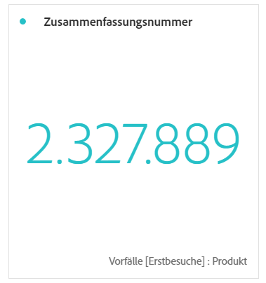
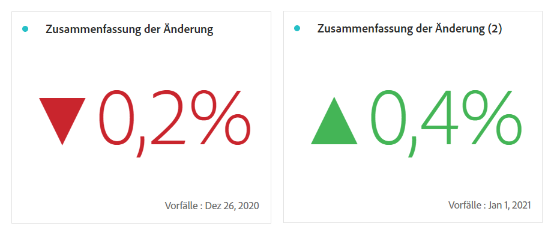

# Zusammenfassungszahl und -änderung

>[!BEGINSHADEBOX]

_In diesem Artikel werden die Visualisierungen von Zusammenfassungszahlen und Zusammenfassungsänderungen in_  _&#x200B;**Customer Journey Analytics** beschrieben._ _Unter [Zusammenfassungszahl und Zusammenfassungsänderung](https://experienceleague.adobe.com/de/docs/analytics/analyze/analysis-workspace/visualizations/summary-number-change) finden Sie die Version dieses Artikels für_  _&#x200B;**Adobe Analytics**._

>[!ENDSHADEBOX]

>[!BEGINSHADEBOX]

Unter  [Visualisierungen von Zusammenfassungszahlen und Zusammenfassungsänderungen](https://video.tv.adobe.com/v/335564/?quality=12&learn=on){target="_blank"} finden Sie ein Demovideo.

>[!ENDSHADEBOX]

## Zusammenfassungszahl {#summary-number}

<!-- markdownlint-disable MD034 -->

>[!CONTEXTUALHELP]
>id="workspace_summarynumber_button"
>title="Zusammenfassungszahl"
>abstract="Erstellen Sie eine Visualisierung, die die Summen und Zwischensummen anzeigt."

<!-- markdownlint-enable MD034 -->

Verwenden Sie die Visualisierung  **[!UICONTROL Zusammenfassungszahl]**, um eine große Zahl hervorzuheben, die in einem Projekt wichtig ist. Diese Visualisierung verhält sich mithilfe der zugehörigen Datenquelle wie folgt:

* Wenn keine Zelle ausgewählt ist, wird die gesamte Spalte ausgewählt.
* Wenn eine einzelne Zelle ausgewählt ist, wird die Zusammenfassung für diese Zelle angezeigt.
* Wenn mehr als eine Zelle ausgewählt ist, wird die zuerst ausgewählte Zelle angezeigt.
* Wenn die Spalte ausgewählt ist, wird der erste Zellenwert in der Spalte verwendet.

Im Rahmen der Visualisierungseinstellungen sind bestimmte Optionen für die Zusammenfassungszahl verfügbar.

| Option | Definition |
|--- |--- |
| **[!UICONTROL Wert kürzen]** | Wählen Sie **[!UICONTROL Wert abkürzen]**, um den Zahlenwert intelligent zu kürzen. Wenn diese Option ausgewählt ist, geben Sie eine Zahl ein, um den Umfang der Abkürzung zu definieren. Beispiel: <table><tr><td>**Originalwert**</td><td>**Abgekürzter Wert**</td><td>**Ergebnis**</td></tr><tr><td>12.011.141,25 USD</td><td>Nicht ausgewählt</td><td  align="right">12.011.141,25 USD</td></tr><tr><td>12.011.141,25 USD</td><td>Ausgewählt, auf `0` gesetzt</td><td align="right">12 Mio. USD</td></tr><tr><td>12.011.141,25 USD</td><td> Ausgewählt, auf `1` gesetzt</td><td  align="right">12,0 Mio. USD</td></tr><tr><td>12.011.141,25 USD</td><td>Ausgewählt, auf `2` gesetzt</td><td align="right">12,01 Mio. USD</td></tr><tr><td>12.011.141,25 USD</td><td>Ausgewählt, auf `3` gesetzt</td><td align="right">12,01 Mio. USD</td></tr></table> |
| **[!UICONTROL Wert zusammenfassen nach]** | Wählen Sie diese Option, um für ausgewählte Daten das Maximum, das Minimum, den Mittelwert, den Median oder die Summe anzuzeigen. |

## Zusammenfassungsänderung {#summary-change}

<!-- markdownlint-disable MD034 -->

>[!CONTEXTUALHELP]
>id="workspace_summarychange_button"
>title="Zusammenfassungsänderung"
>abstract="Erstellen Sie eine Visualisierung, die das Delta (die Änderung) zwischen zwei Zahlen anzeigt"

<!-- markdownlint-enable MD034 -->

Verwenden Sie die Visualisierung  **[!UICONTROL Zusammenfassungsänderung]**, um das Delta (die Änderung) zwischen zwei Zahlen anzuzeigen. <!-- This is applicable for AA, not CJA: The green and red color of the Summary Change can be controlled through [custom event polarity](https://experienceleague.adobe.com/docs/analytics/admin/admin-tools/success-events/success-event.html?lang=de) or a calculated metric's [Show Upward Trend As](https://experienceleague.adobe.com/docs/analytics/components/calculated-metrics/calcmetric-workflow/cm-build-metrics.html?lang=de) option.-->

<!--
The green and red color of the Summary Change can be controlled through [custom event polarity](https://experienceleague.adobe.com/docs/analytics/admin/admin/c-manage-report-suites/c-edit-report-suites/conversion-var-admin/c-success-events/success-event.md) or a calculated metric's [Show Upward Trend As](https://experienceleague.adobe.com/docs/analytics/components/calculated-metrics/calcmetric-workflow/cm-build-metrics.html?lang=de) option.
-->

Diese Visualisierung verhält sich folgendermaßen:

* Wenn keine Zelle ausgewählt ist, werden die ersten beiden Zellenwerte in der Spalte verglichen.
* Wenn eine Zelle ausgewählt ist, wird 0 angezeigt, weil der Zellenwert mit sich selbst verglichen wird.
* Wenn zwei Zellen ausgewählt sind, wird die erste ausgewählte Zelle als Numerator und die zweite als Denominator verwendet.
* Wenn mehr als zwei Zellen ausgewählt sind, werden nur die ersten beiden Zellen für den Vergleich berücksichtigt.
* Wenn ein Zellbereich ausgewählt ist, wird die erste Zelle mit den letzten im Bereich ausgewählten Zellen verglichen.
* Wenn die Spalte ausgewählt ist, wird der erste Wert mit sich selbst verglichen, sodass eine Änderung von 0 angezeigt wird.

Im Rahmen der Visualisierungseinstellungen sind bestimmte **[!UICONTROL Optionen für die Zusammenfassungsänderung]** verfügbar.

| Option | Definition |
|--- |--- |
| **[!UICONTROL Prozentänderung zeigen]** | Zeigen Sie die prozentuale Änderung zwischen den beiden Zahlen an. |
| **[!UICONTROL Rohdifferenz anzeigen]** | Zeigen Sie die Rohdifferenz zwischen den beiden Zahlen an. Mit dieser Option können Sie auch Werte kürzen und bis zu 3 Dezimalstellen anzeigen. |
| **[!UICONTROL Wert kürzen]** | Wählen Sie **[!UICONTROL Wert abkürzen]**, um den geänderten Wert intelligent zu kürzen. Wenn diese Option ausgewählt ist, geben Sie eine Zahl ein, um den Umfang der Abkürzung zu definieren. Beispiel: <table><tr><td>**Originalwert**</td><td>**Abgekürzter Wert**</td><td>**Ergebnis**</td></tr><tr><td>12.011.141,25 USD</td><td>Nicht ausgewählt</td><td  align="right">12.011.141,25 USD</td></tr><tr><td>12.011.141,25 USD</td><td>Ausgewählt, auf `0` gesetzt</td><td align="right">12 Mio. USD</td></tr><tr><td>12.011.141,25 USD</td><td> Ausgewählt, auf `1` gesetzt</td><td  align="right">12,0 Mio. USD</td></tr><tr><td>12.011.141,25 USD</td><td>Ausgewählt, auf `2` gesetzt</td><td align="right">12,01 Mio. USD</td></tr><tr><td>12.011.141,25 USD</td><td>Ausgewählt, auf `3` gesetzt</td><td align="right">12,01 Mio. USD</td></tr></table> |

>[!MORELIKETHIS]
>
>[Hinzufügen einer Visualisierung zu einem Panel](/help/analyze/analysis-workspace/visualizations/freeform-analysis-visualizations.md#add-visualizations-to-a-panel)
>&#x200B;>[Visualisierungseinstellungen](/help/analyze/analysis-workspace/visualizations/freeform-analysis-visualizations.md#settings)
>&#x200B;>[Kontextmenü der Visualisierung](/help/analyze/analysis-workspace/visualizations/freeform-analysis-visualizations.md#context-menu)
>
