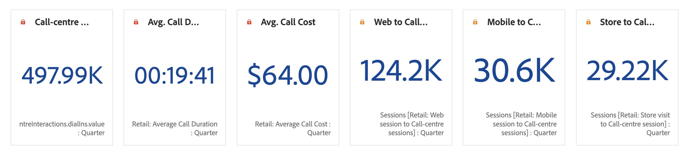

# Zusammenfassungszahl und -änderung

>[!BEGINSHADEBOX]

_In diesem Artikel werden die Visualisierungen von Zusammenfassungsnummern und Zusammenfassungsänderungen in {_} _&#x200B;**Adobe Analytics**._ _Siehe [Zusammenfassungsnummer und Zusammenfassungsänderung](https://experienceleague.adobe.com/de/docs/analytics-platform/using/cja-workspace/visualizations/summary-number-change)_ für die  _&#x200B;**Customer Journey Analytics**-Version dieses Artikels._

>[!ENDSHADEBOX]

>[!BEGINSHADEBOX]

Unter  [Visualisierungen von Zusammenfassungszahlen und Zusammenfassungsänderungen](https://experienceleague.adobe.com/de/docs/analytics-learn/tutorials/analysis-workspace/visualizations/summary-number-and-summary-change-visualizations-2021){target="_blank"} finden Sie ein Demovideo.

>[!ENDSHADEBOX]

## Zusammenfassungszahl {#summary-number}

<!-- markdownlint-disable MD034 -->

>[!CONTEXTUALHELP]
>id="workspace_summarynumber_button"
>title="Zusammenfassungszahl"
>abstract="Erstellen Sie eine Visualisierung, die die Summen und Zwischensummen anzeigt."

<!-- markdownlint-enable MD034 -->

Verwenden Sie die Visualisierung  **[!UICONTROL Zusammenfassungszahl]**, um eine große Zahl hervorzuheben, die in einem Projekt wichtig ist. Diese Visualisierung verhält sich mithilfe der zugehörigen Datenquelle wie folgt:

* Wählt die Gesamtsumme der Spalte aus, wenn keine Zelle ausgewählt ist.
* Bei Auswahl einer einzelnen Zelle wird die Zusammenfassung für diese Zelle angezeigt.
* Wenn mehr als eine Zelle ausgewählt ist, wird die erste ausgewählte Zelle angezeigt.
* Wenn die Spalte ausgewählt ist, wird der erste Zellenwert in der Spalte ausgewählt.

Im Rahmen der Visualisierungseinstellungen sind bestimmte Optionen für die Zusammenfassungszahl verfügbar.

| Option | Definition |
|--- |--- |
| **[!UICONTROL Wert kürzen]** | Wählen Sie **[!UICONTROL Wert abkürzen]**, um den Zahlenwert intelligent zu kürzen. Wenn diese Option ausgewählt ist, geben Sie eine Zahl ein, um den Umfang der Abkürzung zu definieren. Beispiel: <table><tr><td>**Originalwert**</td><td>**Abgekürzter Wert**</td><td>**Ergebnis**</td></tr><tr><td>12.011.141,25 USD</td><td>Nicht ausgewählt</td><td  align="right">12.011.141,25 USD</td></tr><tr><td>12.011.141,25 USD</td><td>Ausgewählt, auf `0` gesetzt</td><td align="right">12 Mio. USD</td></tr><tr><td>12.011.141,25 USD</td><td> Ausgewählt, auf `1` gesetzt</td><td  align="right">12,0 Mio. USD</td></tr><tr><td>12.011.141,25 USD</td><td>Ausgewählt, auf `2` gesetzt</td><td align="right">12,01 Mio. USD</td></tr><tr><td>12.011.141,25 USD</td><td>Ausgewählt, auf `3` gesetzt</td><td align="right">12,01 Mio. USD</td></tr></table> |
| **[!UICONTROL Wert zusammenfassen nach]** | Wählen Sie diese Option, um für ausgewählte Daten das Maximum, das Minimum, den Mittelwert, den Median oder die Summe anzuzeigen. |

## Zusammenfassungsänderung {#summary-change}

<!-- markdownlint-disable MD034 -->

>[!CONTEXTUALHELP]
>id="workspace_summarychange_button"
>title="Zusammenfassungsänderung"
>abstract="Erstellen Sie eine Visualisierung, die das Delta (die Änderung) zwischen zwei Zahlen anzeigt"

<!-- markdownlint-enable MD034 -->

Verwenden Sie die Visualisierung  **[!UICONTROL Zusammenfassungsänderung]**, um das Delta (die Änderung) zwischen zwei Zahlen anzuzeigen. <!-- This is applicable for AA, not CJA: The green and red color of the Summary Change can be controlled through [custom event polarity](/help/admin/tools/success-events/success-event.md) or a calculated metric's [Show Upward Trend As](/help/components/calculated-metrics/workflow/cm-build-metrics.md) option.-->

<!--
The green and red color of the Summary Change can be controlled through [custom event polarity](/help/admin/tools/manage-rs/edit-settings/conversion-var-admin/c-success-events/success-event.md.md) or a calculated metric's [Show Upward Trend As](/help/components/calculated-metrics/calcmetric-workflow/cm-build-metrics.md) option.
-->

Diese Visualisierung verhält sich folgendermaßen:

* Wenn keine Zelle ausgewählt ist, werden die ersten beiden Zellwerte in der Spalte verglichen.
* Bei ausgewählter Zelle wird 0 angezeigt, da der Zellwert mit sich selbst verglichen wird.
* Wenn zwei Zellen ausgewählt sind, wird die erste ausgewählte Zelle als Zähler und die zweite als Nenner genommen.
* Wenn mehr als zwei Zellen ausgewählt sind, werden nur die ersten beiden zum Vergleich berücksichtigt.
* Wenn ein Zellenbereich ausgewählt ist, wird die erste mit der letzten im Bereich ausgewählten Zelle verglichen.
* Wenn die Spalte ausgewählt ist, wird der erste Wert mit sich selbst verglichen, was eine Änderung von 0 anzeigt.

Im Rahmen der Visualisierungseinstellungen sind bestimmte **[!UICONTROL Optionen für die Zusammenfassungsänderung]** verfügbar.

| Option | Definition |
|--- |--- |
| **[!UICONTROL Prozentänderung zeigen]** | Zeigen Sie die prozentuale Änderung zwischen den beiden Zahlen an. |
| **[!UICONTROL Rohdifferenz anzeigen]** | Zeigen Sie die Rohdifferenz zwischen den beiden Zahlen an. Mit dieser Option können Sie auch Werte kürzen und bis zu 3 Dezimalstellen anzeigen. |
| **[!UICONTROL Wert kürzen]** | Wählen Sie **[!UICONTROL Wert abkürzen]**, um den geänderten Wert intelligent zu kürzen. Wenn diese Option ausgewählt ist, geben Sie eine Zahl ein, um den Umfang der Abkürzung zu definieren. Beispiel: <table><tr><td>**Originalwert**</td><td>**Abgekürzter Wert**</td><td>**Ergebnis**</td></tr><tr><td>12.011.141,25 USD</td><td>Nicht ausgewählt</td><td  align="right">12.011.141,25 USD</td></tr><tr><td>12.011.141,25 USD</td><td>Ausgewählt, auf `0` gesetzt</td><td align="right">12 Mio. USD</td></tr><tr><td>12.011.141,25 USD</td><td> Ausgewählt, auf `1` gesetzt</td><td  align="right">12,0 Mio. USD</td></tr><tr><td>12.011.141,25 USD</td><td>Ausgewählt, auf `2` gesetzt</td><td align="right">12,01 Mio. USD</td></tr><tr><td>12.011.141,25 USD</td><td>Ausgewählt, auf `3` gesetzt</td><td align="right">12,01 Mio. USD</td></tr></table> |

>[!MORELIKETHIS]
>
>[Hinzufügen einer Visualisierung zu einem Panel](/help/analyze/analysis-workspace/visualizations/freeform-analysis-visualizations.md#add-visualizations-to-a-panel)
>[Visualisierungseinstellungen](/help/analyze/analysis-workspace/visualizations/freeform-analysis-visualizations.md#settings)
>[Kontextmenü der Visualisierung](/help/analyze/analysis-workspace/visualizations/freeform-analysis-visualizations.md#context-menu)
>
