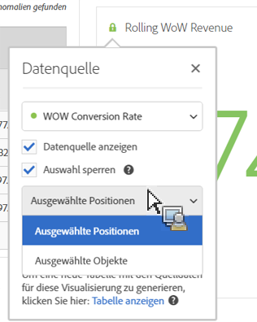

# Verwalten von Datenquellen {#manage-data-sources}

>[!CONTEXTUALHELP]
>id="workspace_freeformtable_lockselection"
>title="Auswahl sperren"
>abstract="Aktivieren Sie diese Einstellung, um die Visualisierung an den ausgewählten Positionen oder den ausgewählten Elementen in der Datenquelle zu sperren."

>[!CONTEXTUALHELP]
>id="workspace_freeformtable_lockselection_showtable"
>title="Tabelle anzeigen"
>abstract="Wenn Sie **[!UICONTROL Tabelle anzeigen]** auswählen, wird eine neue Datenquelle für Ihre aktuelle Visualisierung generiert, die von der ursprünglichen Datenquelle getrennt ist."

>[!CONTEXTUALHELP]
>id="workspace_freeformtable_showtable"
>title="Tabelle anzeigen"
>abstract="Wählen Sie **[!UICONTROL Tabelle anzeigen]** aus, um eine neue Datenquelle für Ihre aktuelle Visualisierung zu generieren, die von der ursprünglichen Datenquelle getrennt ist."

Durch das Synchronisieren von Visualisierungen können Sie steuern, welche Freiformtabelle oder Datenquelle einer Visualisierung entspricht.

>[!TIP]
>
>Die Farbe von  neben dem Titel der Visualisierungen gibt an, welche Visualisierungen zusammenhängen. Übereinstimmende Farben besagen, dass Visualisierungen auf derselben Datenquelle basieren.
>

Sie können die Datenquelle ein- oder ausblenden. Sie können die Auswahl auch an ausgewählten Positionen oder ausgewählten Elementen sperren. Diese Einstellungen legen fest, ob sich die Visualisierung ändert (oder nicht ändert), sobald neue Daten eingehen.

<!--
**Tip:** You can tell which visualizations are related by the color of the dot next to the title. Matching colors mean that visualizations are based on the same data source.

Managing a data source lets you show the data source or lock the selection. These settings determine how the visualization changes (or doesn't change) when new data comes in.

1. [Create a project](/help/analyze/analysis-workspace/home.md) with a data table and a [visualization](/help/analyze/analysis-workspace/visualizations/freeform-analysis-visualizations.md).
1. In the data table, select the cells (data source) you want to associate with the visualization.
1. In the visualization, click the dot next to the title to bring up the **[!UICONTROL Data Source]** dialog. Select **[!UICONTROL Show Data Source]** or **[!UICONTROL Lock Selection]**.

   

   Synchronizing a visualization to a table cell creates a new (hidden) table and color-codes the synchronized visualization with that table.

>[!BEGINSHADEBOX]

See  [Data source settings](https://video.tv.adobe.com/v/328028?quality=12&learn=on&captions=ger){target="_blank"} for a demo video.

>[!ENDSHADEBOX]

-->

| Option | Beschreibung |
|--- |--- |
| **[!UICONTROL Datenquelle]** | Wählen Sie aus dem Dropdown-Menü die Datenquelle aus, auf der die Visualisierung basiert. |
| **[!UICONTROL Verknüpfte Visualisierungen]** | Listet alle verknüpften Visualisierungen auf. Gilt für die Datenquelle (Freiformtabelle). |
| **[!UICONTROL Datenquelle anzeigen]** | Ermöglicht das Ein- oder Ausblenden der Datenquelle (Freiformtabelle), die der Visualisierung entspricht. |
| **[!UICONTROL Auswahl sperren]** | Wählen Sie diese Option aus, damit die Visualisierung  mit den aktuell in der entsprechenden Datentabelle ausgewählten Daten verknüpft bleibt. Wenn Sie die Option aktiviert haben, können Sie Folgendes auswählen:  <ul><li>**Ausgewählte Positionen**: Die Visualisierung ist für die **Positionen** gesperrt, die in der entsprechenden Datentabelle ausgewählt sind. Diese Positionen werden weiterhin visualisiert, auch wenn sich die spezifischen Elemente auf diesen Positionen ändern (z. B. durch Sortier- oder Filtervorgänge). Wählen Sie diese Option beispielsweise aus, wenn die fünf häufigsten Kampagnennamen, die in der Datenquelle in dieser Visualisierung aufgeführt sind, jederzeit angezeigt werden sollen. Egal, welche Kampagnennamen angezeigt werden.</li> <li>**Ausgewählte Elemente**: Die Visualisierung ist für die spezifischen **Elemente** gesperrt, die derzeit in der entsprechenden Datentabelle ausgewählt sind. Diese Elemente werden weiterhin visualisiert, selbst wenn sich ihr Rang in der Tabelle ändert. Wählen Sie diese Option beispielsweise aus, wenn dieselben fünf spezifischen Kampagnennamen, die in der Datenquelle in dieser Visualisierung aufgeführt sind, jederzeit angezeigt werden sollen. Unabhängig vom Rang dieser Kampagnennamen.</li></ul>Wenn die Visualisierung für Daten gesperrt ist, die nicht mehr in der verknüpften Datentabelle sichtbar sind, können Sie eine neue Tabelle generieren. Wählen Sie **[!UICONTROL Tabelle anzeigen]** aus, um eine neue Datenquelle für Ihre aktuelle Visualisierung zu generieren, die von der ursprünglichen Datenquelle getrennt ist. |
