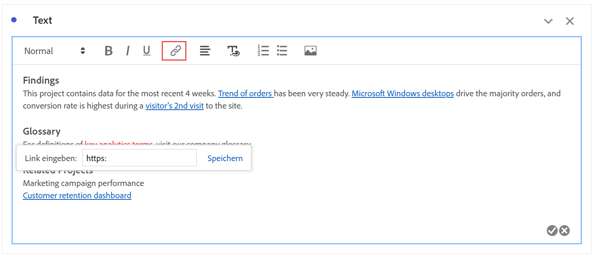

# Text {#text-visualization}

>[!CONTEXTUALHELP]
>id="workspace_text_button"
>title="Text"
>abstract="Fügen Sie Ihrem Projekt eine benutzerdefinierte Rich-Text-Visualisierung hinzu."

<!-- markdownlint-enable MD034 -->

>[!BEGINSHADEBOX]

_In diesem Artikel wird die Textvisualisierung in_  _&#x200B;**Adobe Analytics** beschrieben._ _Unter [Text](https://experienceleague.adobe.com/de/docs/analytics-platform/using/cja-workspace/visualizations/text) finden Sie die Version dieses Artikels für_  _&#x200B;**Customer Journey Analytics**._

>[!ENDSHADEBOX]

Sie haben folgende Möglichkeiten:
Um Ihrem Workspace-Projekt benutzerdefinierten Rich-Text hinzuzufügen, können Sie eine  **[!UICONTROL Textvisualisierung]** oder Beschreibungen für eine Visualisierung und ein Bedienfeld verwenden.

## Verwenden

Sie können die Visualisierung „Text“ wie folgt verwenden:

1. Fügen Sie eine  Visualisierung **[!UICONTROL Text]** hinzu. Weitere Informationen finden Sie unter [Hinzufügen einer Visualisierung in einem Panel.](freeform-analysis-visualizations.md#add-visualizations-to-a-panel)

1. Wählen Sie in einem Panel oder einer Visualisierung im Kontextmenü die Option **[!UICONTROL Beschreibung bearbeiten]** aus.

   Wählen Sie  aus, wenn Sie die Bearbeitung der Beschreibung abgeschlossen haben. Wählen Sie  aus, um den Vorgang abzubrechen.

Sie können die Formatierung Ihres Textes ändern sowie Hyperlinks und Bilder hinzufügen.

## Formatierung anpassen {#format}

Beim Bearbeiten des Textfelds oder der Beschreibung können Sie Schriftgrad (Überschriftenebenen), Farbe, Formatierung (fett, kursiv, unterstrichen) und Ausrichtung des ausgewählten Textes anpassen. Sie können auch Aufzählungs- und nummerierte Listen hinzufügen.

## Hyperlinks hinzufügen {#hyperlinks}

Um einen Hyperlink hinzuzufügen, markieren Sie den Text und wählen Sie im Menü  aus. Sie können Hyperlinks verwenden, um den Empfängerinnen und Empfängern Ihres Projekts weitere Unterstützung zu bieten. Hyperlinks können Links zu externen Websites, Dokumentationsseiten, [Workspace-Projekten, Panels oder Visualisierungen](/help/analyze/analysis-workspace/curate-share/shareable-links.md) und mehr enthalten.

## Bilder hinzufügen {#images}

Um Ihrem Projekt ein Bild hinzuzufügen, wählen Sie  im Menü aus, geben Sie eine Bild-URL in **[!UICONTROL Bild-URL]** an (z. B. `https://www.adobe.com/uploads/2018/06/Adobe.png`) und klicken Sie auf **[!UICONTROL Speichern]**.

Die Bild-URL muss öffentlich zugänglich sein, mit `https` beginnen und das Format `.png`, `.jpeg`, `.jpg` oder `.gif` haben. Statische und animierte Bilder werden unterstützt.

Beachten Sie, dass das Einfügen eines Bildes per Drag-and-Drop nicht unterstützt wird.

