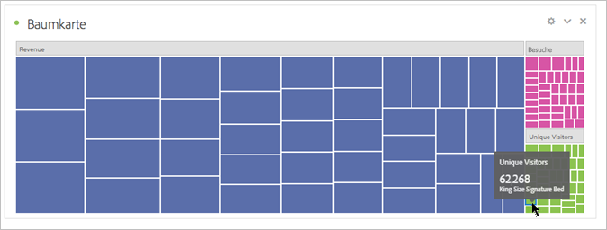

# [!UICONTROL Baumkarte] {#treemap}

<!-- markdownlint-disable MD034 -->

>[!CONTEXTUALHELP]
>id="workspace_treemap_button"
>title="Baumkarte"
>abstract="Erstellen Sie eine Treemap-Visualisierung, um hierarchische Daten (mit Baumstruktur) mit verschachtelten Rechtecken anzuzeigen."

<!-- markdownlint-enable MD034 -->

>[!BEGINSHADEBOX]

_In diesem Artikel wird die Baumkartenvisualisierung in_  _**Adobe Analytics** beschrieben._ _Unter [Baumkarte](https://experienceleague.adobe.com/de/docs/analytics-platform/using/cja-workspace/visualizations/treemap) finden Sie die Version dieses Artikels für_  _**Customer Journey Analytics**._

>[!ENDSHADEBOX]

Verwenden Sie eine **[!UICONTROL Baumkartenvisualisierung]**, um hierarchische (baumstrukturierte) Daten als Satz verschachtelter Rechtecke anzuzeigen.

Jeder Zweig des Baums erhält ein Rechteck, das kleinere Rechtecke enthält, die für untergeordnete Zweige stehen.

Mit einer Baumkarte können Sie Muster sehen, die auf andere Weise schwer zu erkennen wären. Mithilfe der Farbe und Größe der Dimensionen können Sie entdecken, wie Dimensionen miteinander korrelieren und ob eine bestimmte Dimension besonders relevant ist. Ein weiterer Vorteil von Baumkarten besteht darin, dass sie beim Aufbau den vorhandenen Platz effizient nutzen.

>[!BEGINSHADEBOX]

Unter  [Visualisierung „Baumkarte“](https://video.tv.adobe.com/v/334458/?quality=12){target="_blank"} finden Sie ein Demovideo.

>[!ENDSHADEBOX]

>[!MORELIKETHIS]
>
>[Hinzufügen einer Visualisierung zu einem Panel](/help/analyze/analysis-workspace/visualizations/freeform-analysis-visualizations.md#add-visualizations-to-a-panel)
>>[Visualisierungseinstellungen](/help/analyze/analysis-workspace/visualizations/freeform-analysis-visualizations.md#settings)
>>[Kontextmenü der Visualisierung](/help/analyze/analysis-workspace/visualizations/freeform-analysis-visualizations.md#context-menu)
>
