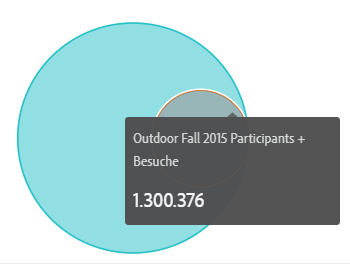

# Venn {#venn}

<!-- markdownlint-disable MD034 -->

>[!CONTEXTUALHELP]
>id="workspace_venn_button"
>title="Venn"
>abstract="Erstellen Sie eine Visualisierung eines Venn-Diagramms, um schnell zwei Elemente und die Größe ihrer Überschneidung visuell zu vergleichen."

<!-- markdownlint-enable MD034 -->

>[!BEGINSHADEBOX]

_In diesem Artikel wird die Venn-Visualisierung in_ _**Adobe Analytics**._ _Siehe [Venn](https://experienceleague.adobe.com/en/docs/analytics-platform/using/cja-workspace/visualizations/venn) für die_ _**Customer Journey Analytics**-Version dieses Artikels._

>[!ENDSHADEBOX]

Bei der [!UICONTROL Venn]-Visualisierung können Sie bis zu drei Segmente (aus den [!UICONTROL Komponenten]) und eine Metrik einfügen, um ein [!UICONTROL Venn]-Diagramm zu erstellen.

Sie können dann den Mauszeiger über die Segmente bewegen, um mehr Details z. B. zu den Prozentzahlen anzuzeigen.

## Umwandeln eines [!UICONTROL Venn]-Diagramms in eine [!UICONTROL Freiformtabelle]

Um das Venn-Diagramm in eine Freiformtabelle umzuwandeln, klicken Sie auf den farbigen Punkt neben der Überschrift **[!UICONTROL Venn]** und wählen Sie **[!UICONTROL Datenquellen verwalten]** > **[!UICONTROL Verfügbare Datenquellen]** > **[!UICONTROL Freiformtabelle]** aus.

## Normalisieren eines [!UICONTROL Venn]-Diagramms

Um das [!UICONTROL Venn]-Diagramm zu normalisieren (d. h. die Größeninformationen zu entfernen), klicken Sie auf das Symbol für seine Visualisierungseinstellungen und wählen Sie **[!UICONTROL Normalisierung]** aus.

## Video

Im Folgenden finden Sie ein Video zum [!UICONTROL Venn]-Diagramm:

>[!VIDEO](https://video.tv.adobe.com/v/335798/?quality=12)
