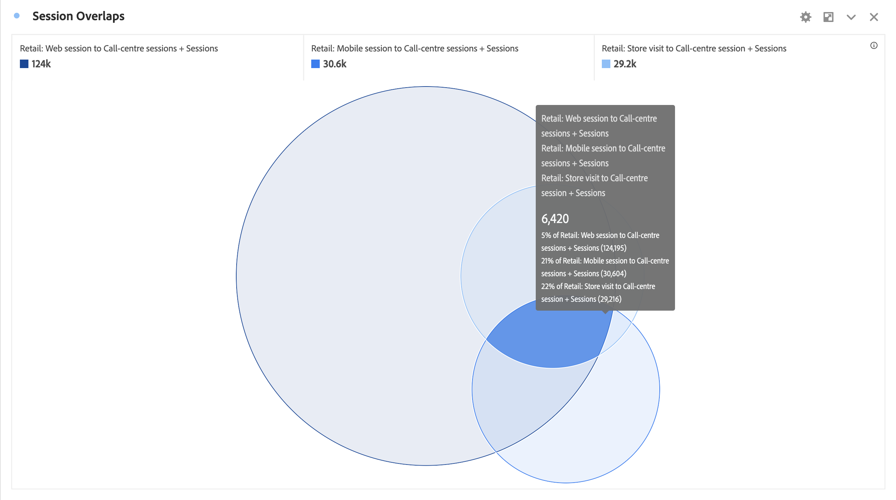

# Venn {#venn}

<!-- markdownlint-disable MD034 -->

>[!CONTEXTUALHELP]
>id="workspace_venn_button"
>title="Venn"
>abstract="Erstellen Sie eine Visualisierung eines Venn-Diagramms, um schnell zwei Elemente und die Größe ihrer Überschneidung visuell zu vergleichen."

<!-- markdownlint-enable MD034 -->

>[!BEGINSHADEBOX]

_In diesem Artikel wird die Venn-Visualisierung in_  _**Adobe Analytics** beschrieben._ _Unter [Venn](https://experienceleague.adobe.com/de/docs/analytics-platform/using/cja-workspace/visualizations/venn)  finden Sie die Version dieses Artikels für_  _**Customer Journey Analytics**._

>[!ENDSHADEBOX]

Bei der  **[!UICONTROL Venn]**-Visualisierung können Sie bis zu drei Filter und eine Metrik (aus dem Bedienfeld „Komponenten“) einfügen, um ein Venn-Diagramm zu erstellen.

Sie können den Mauszeiger über die Filter bewegen, um mehr Details zu Prozentzahlen und vieles mehr anzuzeigen.

Um eine [!UICONTROL Freiformtabelle] aus der Visualisierung [!UICONTROL Venn] zu generieren, wählen Sie das farbige Symbol  neben dem Header **[!UICONTROL Venn]** und dann die Option **[!UICONTROL Datenquelle zeigen]** aus. Es wird eine Freiformtabelle **[!UICONTROL Venn-Daten]** mit den Daten angezeigt, die zum Erstellen der Visualisierung [!UICONTROL Venn] verwendet wurden.

<!--
To normalize the Venn diagram (take the size out of it), go select  and select **[!UICONTROL Normalization]**.

-->

>[!BEGINSHADEBOX]

Unter  [Venn](https://video.tv.adobe.com/v/335798/?quality=12){target=&#34;_blank&#34;}-Visualisierung finden Sie ein Demovideo.

>[!ENDSHADEBOX]

>[!MORELIKETHIS]
>
>[Hinzufügen einer Visualisierung zu einem Panel](/help/analyze/analysis-workspace/visualizations/freeform-analysis-visualizations.md#add-visualizations-to-a-panel)
>>[Visualisierungseinstellungen](/help/analyze/analysis-workspace/visualizations/freeform-analysis-visualizations.md#settings)
>>[Kontextmenü der Visualisierung](/help/analyze/analysis-workspace/visualizations/freeform-analysis-visualizations.md#context-menu)
>

