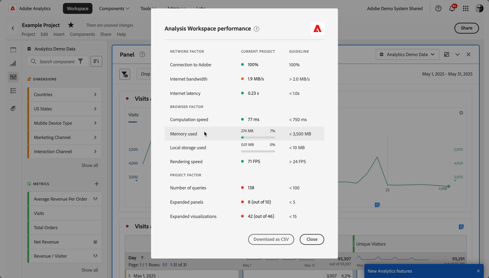

# Optimieren der Analysis Workspace-Leistung

Verschiedene Faktoren beeinflussen die Leistung eines Projekts in Analysis Workspace.  Um diese Faktoren zu verstehen, helfen Sie Ihnen, Projekte auf die optimalste Weise zu planen und zu erstellen.

Um insight in die Leistung von Analysis Workspace zu integrieren:

1. Wählen Sie **[!UICONTROL Hilfe] > [!UICONTROL Leistung]** aus.
Es wird ein modales Dialogfeld angezeigt, in dem Faktoren angezeigt werden, die sich auf die Leistung Ihres Projekts auswirken, einschließlich Netzwerk-, Browser- und Projektfaktoren. Die genauesten Ergebnisse erzielen Sie, wenn das Projekt vor dem Laden geladen wird

   * Die Spalte **[!UICONTROL Aktuelles Projekt]** zeigt die Ergebnisse für Ihr aktuelles Projekt und Ihre aktuelle Benutzerumgebung an.
   * Die **[!UICONTROL Richtlinie]** zeigt für jeden Faktor den von Adobe empfohlenen Schwellenwert an.

1. Wählen Sie **[!UICONTROL Als CSV herunterladen]** aus, um den Leistungsbericht herunterzuladen, damit Sie den Bericht innerhalb Ihrer internen Organisation oder mit dem Adobe-Support teilen können.

>[!NOTE]
>
>Die Informationen auf der Seite „Leistung“ variieren bei jedem Öffnen des Modells, da sich Faktoren ändern können. Darüber hinaus verfeinert Adobe die bereitgestellten Richtlinien weiter, sobald mehr Daten verfügbar werden.

## Netzwerkfaktoren

Zu den Netzwerkfaktoren gehören:

| Faktor | Definition | Beeinflusst durch | Optimierung |
| --- | --- | --- | --- |
| Verbindung mit Adobe | Adobe sendet 10 Testaufrufe, wenn die Leistungsseite geöffnet wird. Diese Aufrufe stellen den Prozentsatz der erfolgreichen Aufrufe an Adobe dar. | Probleme mit dem lokalen Netzwerk oder mit Adobe wirken sich auf diesen Faktor aus. | Überprüfen Sie status.adobe.com, ob bekannte Service-Probleme vorliegen. Überprüfen Sie dann Ihre lokale Netzwerkverbindung. |
| Internetbandbreite | Nur für Google Chrome verfügbar. Geschätzte Bandbreite Ihres Browsers an Ihrem Standort. Die Richtlinie ist 2,0 MB/s. | Ihre lokale Netzwerkverbindung wirkt sich auf diesen Faktor aus. | Überprüfen Sie die lokale Netzwerkverbindung. |
| Internetlatenz | Adobe sendet 10 Testaufrufe, wenn die Leistungsseite geöffnet wird. Diese Aufrufe stellen die Zeitdauer dar, während der jede Anfrage Adobe erreichen und zurückgeben muss. Und sind ein Maß dafür, wie schnell das Internet zwischen Ihrem Standort und Adobe ist. Die Richtlinie beträgt weniger als 1 Sekunde. | Lokale Netzwerkprobleme, viele offene Browser-Registerkarten oder Adobe-Probleme wirken sich auf diesen Faktor aus. | Überprüfen Sie status.adobe.com, ob bekannte Service-Probleme vorliegen. Überprüfen Sie dann Ihre lokale Netzwerkverbindung und schließen Sie nicht verwendete Browser-Registerkarten. |

## Browser-Faktoren

Zu den Browser-Faktoren gehören:

| Faktor | Definition | Beeinflusst durch | Optimierung |
| --- | --- | --- | --- |
| Berechnungsgeschwindigkeit | Wie schnell Ihr Computer einen Verarbeitungstest durchführt. Die Richtlinie beträgt weniger als 750 Millisekunden. | Ihre Hardware sowie gleichzeitige Programme wirken sich auf diesen Faktor aus. | Öffnen Sie den Task-Manager (PC) bzw. die Aktiviätsanzeige (Mac) Ihres Computers, um zu ermitteln, ob Programme geschlossen werden können. Schließen Sie dann nicht verwendete Browser-Registerkarten oder andere Programme.   Wenn diese Aktionen nicht hilfreich sind, besprechen Sie Hardware-Details mit Ihrem IT-Team. |
| Speicher verwendet | Nur für Google Chrome verfügbar. Jede Workspace-Registerkarte in einem Google Chrome-Browser verwendet insgesamt 4 GB Arbeitsspeicher. Dieser Wert stellt den Prozentsatz der Speicherzugabe dar, die vom aktuellen Projekt verbraucht wird. Die Richtlinie beträgt 3500 MB. Dies ist der Punkt, an dem Workspace beginnt, Speicherfehler zu erkennen. | Das Arbeiten in mehreren Registerkarten oder das Herunterladen 50000 Datenzeilen trägt zu einer erhöhten Speichernutzung bei. | Wenn Sie einen Speicherfehler erhalten, schließen Sie andere Workspace-Registerkarten und/oder führen Sie 50.000 Zeilen-Downloads einzeln durch. |
| Lokaler Speicher verwendet | Die Daten werden lokal auf Ihrem Computer gespeichert, um sie im Browser zu verwenden. Jeder Ursprung (z. B. experience.adobe.com) hat einen Toleranzwert von 10 MB. | Analysis Workspace verwendet lokale Datenspeicherung für verschiedene Funktionen, unter anderem zum Speichern automatisch gespeicherter (vorhandener) Projekte, Benutzereinstellungen und Feature Flags. | Um sicherzustellen, dass Analysis Workspace-Funktionen nicht unterbrochen werden, löschen Sie den lokalen Speicher für die Domain experience.adobe.com. |
| Rendering-Geschwindigkeit | FPS steht für Frames pro Sekunde (Frames pro Sekunde), d. h. wie oft pro Sekunde der Browser die Seite auf Ihrem Bildschirm zeichnet. Normalerweise kann das menschliche Auge 24 FPS beobachten. Wenn FPS niedriger ist als dieser, treten Rendering-Probleme in Workspace auf. | Der FPS-Wert wird durch das gleichzeitige Bearbeiten vieler Workspace-Projekte auf einmal und die Größe des angezeigten Projekts beeinflusst. Andere auf Ihrem Computer ausgeführte Programme können Auswirkungen haben, wie Streaming, Hintergrund-Scanner usw. Darüber hinaus wirkt sich Ihre Hardware auf diesen Faktor aus. | Öffnen Sie den Task-Manager (PC) bzw. die Aktiviätsanzeige (Mac) Ihres Computers, um zu ermitteln, ob Programme geschlossen werden können. Schließen Sie dann nicht verwendete Browser-Registerkarten oder andere Programme.   Wenn diese Aktionen nicht hilfreich sind, besprechen Sie Hardware-Details mit Ihrem IT-Team. |

## Projektfaktoren

Zu den Projektfaktoren gehören:

| Faktor | Definition | Optimierung |
| --- | --- | --- |
| Anzahl der Anfragen | Die Gesamtzahl der Anfragen an Adobe zum Abrufen der im Projekt angezeigten Daten. Zu den Abfragen gehören Ranganfragen für Tabellen, Anomalieerkennung, Wortgrafiken, Komponenten in der linken Leiste und mehr. Dieser Wert schließt reduzierte Bedienfelder und Visualisierungen aus. Die Richtlinie ist 100. | Vereinfachen Sie Ihr Projekt nach Möglichkeit, indem Sie Daten in verschiedene Projekte aufteilen, die einem bestimmten Zweck oder Interessenten dienen. Verwenden Sie Tags, um Projekte in Themen zu organisieren, und verwenden Sie [direkte Verknüpfungen](https://experienceleague.adobe.com/de/docs/analytics/analyze/analysis-workspace/curate-share/shareable-links), um ein internes Inhaltsverzeichnis zu erstellen, damit die Interessierte leichter finden können, wonach sie suchen. |
| Erweiterte Bedienfelder (von der Gesamtzahl der Bedienfelder) | Die Anzahl der erweiterten Bedienfelder von der Gesamtzahl der Bedienfelder im Projekt. Die Richtlinie ist 5. | Nachdem Sie Schritte zur Vereinfachung Ihres Projekts unternommen haben, reduzieren Sie Bereiche in Ihrem Projekt, die Sie beim Laden nicht anzeigen müssen. Wenn das Projekt geöffnet wird, werden nur erweiterte Bedienfelder verarbeitet. Reduzierte Bedienfelder werden erst verarbeitet, wenn sie vom Benutzer erweitert werden. |
| Erweiterte Visualisierungen (aus der Gesamtzahl der Visualisierungen) | Die Anzahl der erweiterten Tabellen und Visualisierungen aus der Gesamtsumme im Projekt, einschließlich der ausgeblendeten Datenquellen. Die Richtlinie ist 15. | Nachdem Sie Schritte zur Vereinfachung des Projekts unternommen haben, reduzieren Sie die Visualisierungen in Ihrem Projekt, die beim Laden nicht angezeigt werden müssen. Priorisieren Sie die Visuals, die für den Verbraucher des Berichts am wichtigsten sind, und teilen Sie die unterstützenden Visuals bei Bedarf in ein separates, detaillierteres Bedienfeld oder Projekt auf. |
| Anzahl der Freiformzellen | Die Gesamtzahl der Freiform-Tabellenzellen im Projekt, berechnet durch Zeilen * Spalten in allen Tabellen. Dieser Wert schließt ausgeblendete Datenquellen aus. Die Richtlinie ist 4000. | Reduzieren Sie die Anzahl der Spalten in Ihrer Tabelle auf die relevantesten Datenpunkte. Reduzieren Sie die Anzahl der Zeilen in Ihrer Tabelle, indem Sie die Anzahl der angezeigten Zeilen anpassen, einen Tabellenfilter oder ein Segment anwenden. |
| Verfügbare Komponenten | Die Gesamtzahl der in der linken Leiste des Projekts abgerufenen Komponenten für alle Report Suites im Projekt. Dieser Wert beeinflusst die Geschwindigkeit, mit der die linke Leiste geladen wird und wie schnell Suchergebnisse zurückgegeben werden. Die Richtlinie ist 2.000. | Sprechen Sie mit Ihrem Produktadministrator über das Erstellen einer kuratierten Virtual Report Suite, die über einen stärker auf Ihre Bedürfnisse zugeschnittenen Satz an Komponenten verfügt. |
| Verwendete Komponenten | Die Gesamtzahl der im Projekt verwendeten Komponenten. Die Richtlinie ist 100. | Die Anzahl der verwendeten Komponenten hat keinen direkten Einfluss auf die Leistung. Die Komplexität dieser Komponenten trägt jedoch zur Leistung des Projekts bei. Optimierungen finden Sie weiter unten [ Abschnitt „Zusätzliche ](#additional-factors)&quot;. |
| Längster Datumsbereich | Dieser Faktor zeigt den längsten im Projekt verwendeten Datumsbereich an. Die Richtlinie ist ein Jahr. | Rufen Sie möglichst nicht mehr Daten ab, als Sie benötigen. Schränken Sie den Panel-Kalender auf die relevanten Daten für Ihre Analyse ein. Oder verwenden Sie Datumsbereichskomponenten in Ihren Freiformtabellen. In einer Tabelle verwendete Datumsbereiche überschreiben den Datumsbereich des Bedienfelds. Beispielsweise können Sie den Tabellenspalten „Letzter Monat“, „Letzte Woche“ und „Gestern“ hinzufügen, um diese spezifischen Datenbereiche anzufordern. Weitere Informationen zu Datumsbereichen in Analysis Workspace erhalten Sie in [diesem Video](https://experienceleague.adobe.com/de/docs/analytics-learn/tutorials/analysis-workspace/calendar-and-date-ranges/using-date-ranges-and-comparisons-in-analysis-workspace).   Minimieren Sie außerdem die Anzahl der im Projekt verwendeten Jahresvergleiche. Wenn ein Jahresvergleich berechnet wird, betrachten die Berechnungen die vollständigen 13 Monate der Daten zwischen den Interessenmonaten. Dieser Vergleich hat die gleichen Auswirkungen wie die Änderung des Datumsbereichs des Bedienfelds auf die letzten 13 Monate. |

## Anforderungsfaktoren

Anforderungsfaktoren

Verwenden Sie das folgende Diagramm und die folgenden Begriffe, um zu erfahren, wie Anfragen verarbeitet werden und welche Faktoren die Verarbeitungszeiten beeinflussen:

>[!NOTE]
>
>Die empfohlenen Richtlinien für diese Faktoren basieren auf einem Komplexitätswert von „Mittel“ für Berichtsanfragen.

### Diagramm zur Anforderungsverarbeitung

### Bedingungen für die Anforderungsverarbeitung

| Faktor | Definition | Optimierung |
| --- | --- | --- |
| [!UICONTROL **Durchschnittliche Anfragezeit**] | Die Zeit, die von der Initiierung der Anfrage bis zum Abschluss der Anfrage benötigt wird. Die Richtlinie lautet 15 Sekunden. 
Im obigen Diagramm [Anfrageverarbeitung](#request-processing-diagram) stellt die Anfragezeit den vollständigen Prozess dar, von **Analysis Workspace-Anfrage initiiert** bis **Analysis Workspace-Anfrage abgeschlossen**.
 |  |
| [!UICONTROL **Längste Anfragezeit**] | Die Zeit, die von der Initiierung der Anfrage bis zum Abschluss der Anfrage benötigt wird. 
Im obigen Diagramm [Anfrageverarbeitung](#request-processing-diagram) stellt die Anfragezeit den vollständigen Prozess dar, von **Analysis Workspace-Anfrage initiiert** bis **Analysis Workspace-Anfrage abgeschlossen**.
 |  |
| [!UICONTROL **Durchschnittliche Suchzeit**] | Da Analysis Workspace nur den Hash für alle Zeichenfolgen speichert, die in beliebigen Segmenten verwendet werden, werden bei jeder Verarbeitung eines Projekts **Suchen** durchgeführt, um die Hashes mit den entsprechenden Werten abzugleichen. Die Richtlinie beträgt weniger als 2 Sekunden.
Diese Suchen können einen ressourcenintensiven Prozess darstellen, je nach der Anzahl der Werte, die möglicherweise mit dem Hash übereinstimmen. 

Im obigen Diagramm [Anforderungsverarbeitung](#request-processing-diagram) wird die Suchzeit in der Phase **Suchen** dargestellt (zum Zeitpunkt der Phase **Verarbeitung der**).
 | Wenn Anfragen hier langsamer werden, liegt das wahrscheinlich daran, dass Ihr Projekt zu viele Zeichenfolgensegmente enthält, oder daran, dass Zeichenfolgen mit übermäßig generischen Werten zu viele potenzielle Übereinstimmungen aufweisen. |
| [!UICONTROL **Durchschnittliche Warteschlangenzeit**] | Die gesamte Wartezeit in der Warteschlange, bevor Anforderungen verarbeitet werden. Die Richtlinie ist 5 Sekunden.
Im obigen Diagramm [Anforderungsverarbeitung](#request-processing-diagram) wird die Warteschlangenzeit in der Phase **Anforderungs-Engine-Warteschlange** und der Phase **Server-Warteschlange** dargestellt.
 | Wenn Anfragen hier langsamer werden, kann dies an zu vielen Anfragen liegen, die gleichzeitig in Ihrer Organisation ausgeführt werden. Versuchen Sie, die Anfrage außerhalb der Spitzenzeiten auszuführen. |
| [!UICONTROL **Durchschnittliche Server-Verarbeitungszeit**] | Die durchschnittliche Zeit, die für die Verarbeitung der Anfrage benötigt wird.
Im obigen Diagramm [Anforderungsverarbeitung](#request-processing-diagram) wird die durchschnittliche Serververarbeitungszeit in der Phase **Serverwarteschlange** und der Phase **Serververarbeitung** dargestellt. Die Richtlinie lautet 10 Sekunden | Wenn Anfragen hier langsamer werden, hat das Projekt wahrscheinlich zu lange Datumsbereiche oder komplexe Visualisierungen. Verkürzen Sie den Datumsbereich Ihres Projekts, um die Verarbeitungszeiten zu verkürzen. |
| [!UICONTROL **Komplexität**] | Nicht alle Anträge benötigen gleich viel Zeit zur Bearbeitung. Die Anfragekomplexität kann dabei helfen, einen allgemeinen Eindruck von der für die Verarbeitung der Anfrage benötigten Zeit zu gewinnen. Die Richtlinie lautet Medium oder niedriger. 
Mögliche Werte sind:
 <ul><li>[!UICONTROL **Niedrig**]</li><li>[!UICONTROL **Mittel**]</li><li>[!UICONTROL **Hoch**]</li></ul>Dieser Wert wird durch die Werte in den folgenden Spalten beeinflusst:<ul><li>[!UICONTROL **Monatsgrenzen**]</li><li>[!UICONTROL **Spalten**]</li><li>[!UICONTROL **Segmente**]</li></ul> |  |
| [!UICONTROL **Monatsgrenzen**] | Die Anzahl der Monate, die in einer Anfrage eingeschlossen sind. Weitere Monatsgrenzen erhöhen die Komplexität der Anfrage. Die Richtlinie ist 6 oder weniger. | Wenn Anfragen hier langsamer werden, kann dies daran liegen, dass die Monatsgrenzen in Ihrem Projekt zu groß sind. Reduzieren Sie die Anzahl der Monate. |
| [!UICONTROL **Spalten**] | Die Anzahl der Metriken und Aufschlüsselungen in der Anfrage. Weitere Spalten erhöhen die Komplexität der Anfrage. Die Richtlinie ist 10 oder weniger. | Wenn Anfragen hier langsamer werden, liegt das möglicherweise daran, dass das Projekt zu viele Spalten enthält. Reduzieren Sie die Anzahl der Spalten. |
| [!UICONTROL **Segmente**] | Die Anzahl der auf die Anfrage angewendeten Segmente. Weitere Segmente erhöhen die Komplexität der Anfrage. Die Richtlinie ist 5 oder weniger. | Wenn Anfragen hier langsamer werden, liegt das möglicherweise daran, dass in Ihrem Projekt zu viele Segmente vorhanden sind. Verringern Sie die Anzahl der Segmente. |

## Zusätzliche Faktoren

Zu den weiteren Faktoren, die nicht unter Hilfe > Leistung aufgeführt sind, gehören:

| Faktor | Definition | Beeinflusst durch | Optimierung |
| --- | --- | --- | --- |
| Segmentkomplexität | Komplizierte Segmente können einen erheblichen Einfluss auf die Projektleistung haben. | Zu den Faktoren, die einem Segment Komplexität verleihen (in grober Reihenfolge der Auswirkungen), gehören: <ul><li>Operatoren von **[!UICONTROL enthält]**, **[!UICONTROL enthält beliebige von]**, **[!UICONTROL Übereinstimmungen]**, **[!UICONTROL beginnt mit]** oder **[!UICONTROL endet mit]**/ </li><li>Sequentielle Segmentierung, insbesondere wenn Dimensionseinschränkungen (innerhalb/nachher) verwendet werden </li><li>Die Anzahl der eindeutigen Dimensionselemente innerhalb von Dimensionen, die im Segment verwendet werden (z. B. Seite = &#39;A&#39;, wenn Seite 10 eindeutige Elemente hat, ist schneller als Seite = &#39;A&#39;, wenn Seite 100000 eindeutige Elemente hat).</li><li>Die Anzahl der verschiedenen verwendeten Dimensionen (z. B. Page = &#39;Home&#39; und Page = &#39;Search results&#39; sind schneller als eVar 1 = &#39;red&#39; und eVar 2 = &#39;blue&#39;)</li><li>Viele OR-Operatoren (anstelle von AND)</li><li>Verschachtelte Container, deren Umfang variiert (z. B. Treffer innerhalb von Besuch innerhalb von Besucher)</li></ul> | Während einige der Komplexitätsfaktoren nicht verhindert werden können, sollten Sie nach Möglichkeiten suchen, die Komplexität Ihrer Segmente zu verringern. Generell gilt: Je genauer Sie mit Ihren Segmentkriterien umgehen können, desto besser. Beispiel:<ul><li>Bei Containern ist die Verwendung eines einzelnen Containers am oberen Rand des Segments schneller als die Verwendung einer Reihe verschachtelter Container.</li><li>Bei Operatoren sind **[!UICONTROL Gleich]** schneller als **[!UICONTROL Enthält]** und **[!UICONTROL Gleich beliebige von]** schneller als **[!UICONTROL Enthält beliebige von]**.</li><li>Bei vielen Kriterien sind AND-Operatoren schneller als eine Reihe von OR-Operatoren.</li></ul> Suchen Sie nach Möglichkeiten, viele OR-Aussagen in eine einzige **[!UICONTROL gleich einer von]** zu reduzieren.  [Classifications](/help/components/classifications/classifications-overview.md) können auch dazu beitragen, viele Werte in präzisen Gruppen zu bündeln, aus denen Sie dann Segmente erstellen. Die Segmentierung in Klassifizierungsgruppen bietet Leistungsvorteile gegenüber Segmenten, die viele OR-Aussagen oder **[!UICONTROL Enthält]**-Kriterien enthalten. |
| Komplexität der Visualisierung (Segmente, Metriken, Filter) | Die Art der Visualisierung (z. B. Fallout vs. Freiformtabelle), die einem Projekt hinzugefügt wird, hat an sich keinen großen Einfluss auf die Projektleistung. Die Komplexität der Visualisierung erhöht die Verarbeitungszeit. | U. a. machen folgende Faktoren eine Visualisierung komplexer:<ul><li>Angeforderter Datenbereich</li><li>Anzahl der angewandten Segmente, z. B. als Zeilen verwendete Segmente in einer Freiformtabelle</li><li>Verwendung von komplexen Segmenten</li><li>[Statische Element](https://experienceleague.adobe.com/de/docs/analytics/analyze/analysis-workspace/visualizations/freeform-table/column-row-settings/manual-vs-dynamic-rows) zeilen oder Spalten in Freiformtabellen</li><li>Auf Zeilen angewandte Filter in Freiformtabellen</li><li>Anzahl verwendeter Metriken, insbesondere berechneter Metriken, die Segmente verwenden</li></ul> | Wenn Sie bemerken, dass Ihre Projekte langsamer als gewünscht geladen werden, sollten Sie nach Möglichkeit einige Segmente durch eVars und Filter ersetzen.  Wenn Sie ständig Segmente und berechnete Metriken für Datenpunkte verwenden, die für Ihr Unternehmen wichtig sind, sollten Sie versuchen, Ihre Implementierung zu verbessern, um diese Datenpunkte direkter zu erfassen. Durch die Verwendung von Tags in Adobe Experience Platform und die Verarbeitungsregeln von Adobe können Änderungen an der Implementierung schnell und einfach umgesetzt werden. |
| Größe der Report Suite | Die Menge der in Ihrer Report Suite erfassten Daten. | – | Wenden Sie sich an Ihr Implementierungsteam oder einen Adobe-Experten, um festzustellen, ob Implementierungsverbesserungen vorgenommen werden können, um das Gesamterlebnis in Adobe Analytics zu verbessern. |
| Gleichzeitige Abfragen | Die Anzahl der gleichzeitig von Ihrer Organisation angeforderten Abfragen. Jede Organisation hat Anspruch auf mindestens 5 gleichzeitige Abfragen. | Wenn ein Bericht viel Zeit beansprucht, kann sich der Bericht in einer Warteschlange mit anderen Berichten befinden. Ihre Organisation versucht, viele gleichzeitige Anfragen für eine bestimmte Report Suite auszuführen. Abfragen können von API-Anfragen, Reporting-Benutzeroberflächen (Analysis Workspace, Report Builder), terminierten Projekten, terminierten Berichten, terminierten Warnhinweisen und gleichzeitigen Benutzenden stammen, die Berichtsanfragen stellen. | Verteilen Sie Ihre Anfragen und Zeitpläne für die Report Suite gleichmäßig über den Tag. Verlagern Sie außerdem Ihre Anforderungen nach Möglichkeit auf Nebenzeiten. Montagmorgen, Dienstagmorgen und der erste Tag eines Monats sind Spitzenzeiten für das Reporting. |

## Tipps zur Produktivitätssteigerung in Analysis Workspace

>[!BEGINSHADEBOX]

Unter  [Tipps zur Produktivitätssteigerung](https://video.tv.adobe.com/v/31157?quality=12&learn=on){target="_blank"} finden Sie ein Demovideo.

>[!ENDSHADEBOX]

