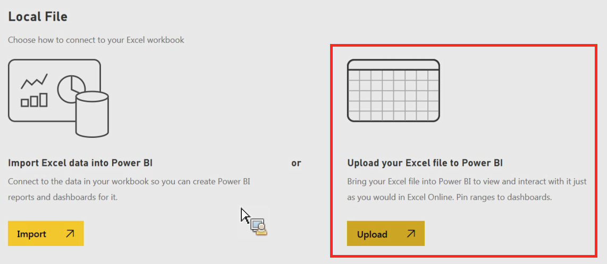

# Daten manuell in Power BI importieren

{{legacy-arb}}

Wenn Sie Analytics-Daten manuell über Power BI importieren möchten, befolgen Sie diese Anweisungen.

1. Klicken Sie in Power BI **[!UICONTROL Daten abrufen]** im Bildschirm unten links.
1. Klicken **[!UICONTROL unter „Importieren oder Mit Daten verbinden]** > **[!UICONTROL Dateien]** auf **[!UICONTROL GET]**.

   

1. Klicken Sie auf „Lokale Datei“.

   

1. Wählen Sie die hochzuladende Datei aus und klicken Sie auf **[!UICONTROL Öffnen]**.
1. Klicken Sie **[!UICONTROL Hochladen]** unter **[!UICONTROL Excel-Datei in Power BI hochladen]**.

   

1. Eine Meldung sollte angezeigt werden, die bestätigt, dass Ihre Datei hochgeladen wurde.
